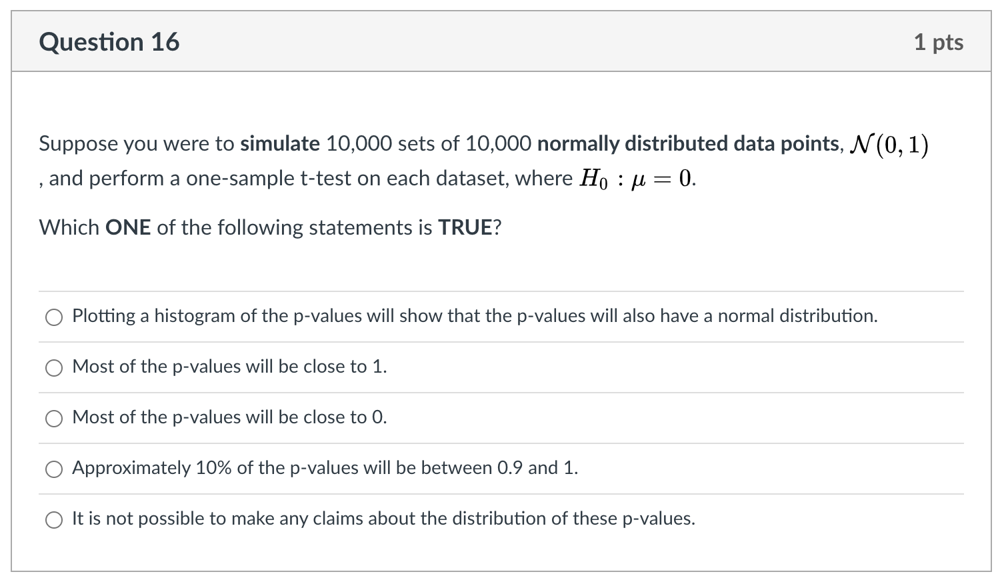

# Portfolio

```{r, include=FALSE}
library(knitr)
#source("links.R", local = knit_global())
sys.source("links.R", envir = knit_global())
```

+-------------------------------------+------------------------------------------------------------------------------------------------------------------------------------------------------------------------+
| **Information**                     | **Note**                                                                                                                                                               |
+=====================================+========================================================================================================================================================================+
| Name                                | Portfolio                                                                                                                                                         |
+-------------------------------------+------------------------------------------------------------------------------------------------------------------------------------------------------------------------+
| Type (Main, Mini or Basket)         | Main                                                                                                                                                                   |
+-------------------------------------+------------------------------------------------------------------------------------------------------------------------------------------------------------------------+
| Value                               | 20% (Path A)                                                                                                                                                            |
|                                     |                                                                                                                                                                        |
|                                     | 25% (Path B)                                                                                                                                                            |
+-------------------------------------+------------------------------------------------------------------------------------------------------------------------------------------------------------------------+
| Due                                 | `r portfolio`                                                                                                                                                             |
+-------------------------------------+------------------------------------------------------------------------------------------------------------------------------------------------------------------------+
| Submission instruction              | Submission: Via [Markus](`r markus`)                                                |
+-------------------------------------+------------------------------------------------------------------------------------------------------------------------------------------------------------------------+
| Accommodations and extension policy | In the case of a personal illness/emergency, a [declaration can be made](`r extension`), but must be submitted no more than 3 days after the due date. Extensions may be requested through the same form up to 48 hours before the due date. |
+-------------------------------------+------------------------------------------------------------------------------------------------------------------------------------------------------------------------+

_Portfolio assessments aim to help you demonstrate your technical coding, statistical thinking, communication and reflection skills. This portfolio also aims to recap and refresh knowledge from your previous statistics courses as well as building your ability to create quality data visualizations._

## General instructions

-   Be very careful to follow instructions on variable naming. If you do not, your code won't pass auto-grading and you will not receive the grades. This will not be eligible for regrading requests.

-   Comment your code! In an R code chunk comments start with a \# (pound sign or hashtag symbol). Don't confuse this with the use of \# to denote different levels of headings in the text parts (governed by Markdown syntax) of an R Markdown document.

-  __All figures and tables should have appropriate (and appropriately positioned) captions.__

-   You should neatly format your code. No strict style is required, but make sure it is easy to read your work. (Optional) You may find [Google's R Style Guide](https://google.github.io/styleguide/Rguide.html#:~:text=R%20is%20a%20high%2Dlevel,Guide%20by%20Hadley%20Wickham%20license.) or the [Tidyverse Style Guide](https://style.tidyverse.org/) interesting.

-   Include your code in the body of the PDF itself (don't set echo=FALSE, don't hide/suppress etc.). Note that this is different to what you will be asked to do in the final project or in professional reporting. This is a demonstration of your skills.

- If asked to write and answer in words, write in full sentences.

-   KNIT EARLY AND OFTEN! Don't leave things till the last minute, your Rmd not knitting is not an emergency for which an extension will be granted.

### Template

You can access the template for this assessment [here](https://jupyter.utoronto.ca/hub/user-redirect/git-pull?repo=https%3A%2F%2Fgithub.com%2Fsta303-bolton%2Fsta303-w22-portfolio&urlpath=rstudio%2F&branch=master).

There is currently a lot of 'filler text' and 'filler code' in the template that you will want to **delete.** Fun fact: All filler text sourced from [Hipster Ipsum](https://hipsum.co/), which Katy Wang in the UG Stats office introduced me to.

## Submission instructions

-   Submit both your Rmd (must be called: sta303-w22-portfolio.Rmd) and PDF (must be called: sta303-w22-portfolio.pdf) on MarkUs.
-   You do not need to submit any data or tex files.
- The PDF must be knit directly from the Rmd (not Word or HTML first).

## Cover page

You don't have to use the provided template, but you DO need to write your portfolio in RMarkdown and include a standalone cover page. The cover page must have:

-   A title and subtitle (you can use my examples in the template or update them as you see fit, no points for changing, but it might make it a better part of your own website or GitHub portfolio, in the future)

-   Your name

-   Date (assessment submission date is fine)

It should not have your table of contents or any analyses on it.

In the template, you can change the colour of this cover to any colour you would like by replacing 6C3082 in the YAML (line 13) to another hex code. You could use this tool to help you: <https://htmlcolorcodes.com/color-picker/>

## Introduction

*Write this section last or second to last (before the refection).*

In the introduction section, write a brief summary of the skills you have demonstrated in this portfolio, __across the statistical skills sample, writing sample and reflection sections__. Think of it like a **cover letter** for this document. It should be appropriate for a fairly general audience---imagine a future employer reading this. You may want to briefly explain the course context, as you understand it. What is STA303/1002 about? (Consider the [learning objectives in the syllabus](https://sta303-bolton.github.io/sta303-w22-courseguide/syllabus.html#learning-objectives))

Your introduction should be **no longer than 300 words** and must **fit on one page**. If you did the mini-portfolio, you may _reuse_ your own phrasing from that introduction (e.g., in introducing the course context), but this is also an opportunity to _improve_ upon it.

## Statistical skills sample

### A note on time management. 

Tasks 3 and 5 are essentially revision tasks for previous courses as I saw that there were still quite a few misunderstandings about these core concepts. If you find yourself unable to completely finish this portfolio, focusing your attention on the new material in Task 2 is a good strategy. 

I have tried to make the revision a useful practice opportunity for other skills. You'll see that Task 3 asks you to build a function. You may not have seen this in other classes before, but use the templates provided to help you. I expect your focus to be on modifying these templates to display appropriate text, I don't expect you to be an expert on error handling in R functions.

### Task 1: Setting up libraries and seed value

- Set up a chunk called `setup_portfolio` where you load the `tidyverse` library. 

- Set your chunk options to `message=FALSE` so all the package loading information isn't included in your our output. You will need to make sure you run this chunk each time you start a new session so you can use many of the functions required.

- Create an object called `last3digplus` that takes the value 100 + the last three digits of your student ID number.

- Delete any placeholder library chunks in the template (if using).

```{r setup_portfolio, include=FALSE, message = FALSE}
# Library needed
library(tidyverse)

# Set up your seed values
last3digplus <- 100 + 111
```


### Task 2a: Return to Statdew Valley: exploring sources of variance in a balanced experimental design (teaching and learning world)

In a class interactive, we explored some tomato and honey data in a statistical farming simulator.

Suppose you also have some data about strawberry yields (in kgs) across 18 different strawberry patches on your farm. There had been a problem with birds eating more than their fair share of your grandmother's strawberries (there wouldn't be enough for her famous jam!) so she had tried out three 'treatment' types: a scarecrow, covering the strawberries with netting and doing nothing (as a control).

Each patch was harvested 6 times, twice under each treatment. Your grandmother says weather and soil conditions were remarkably consistent across the entire time.

#### Growing your (grandmother's) strawberry patch

```{r}
# Don't edit this file
# Sourcing it makes a function available
# You CAN edit these comments
# Load grow_my_strawberries() function
source("grow_my_strawberries.R")
```

- Run the function `grow_my_strawberries()` (the chunk to source the function must be run first for this to work) with  `seed = last3digplus` as the input, saving the output as the object `my_patch`.
- Alter the `my_patch` data so that `treatment` is a factor variable with the levels ordered as follows:  "No netting", "Netting", "Scarecrow". 

```{r, echo=FALSE}
my_patch <- grow_my_strawberries(seed = last3digplus) %>% 
   mutate(treatment = fct_relevel(treatment, "No netting", after = 0))
```

#### Plotting the strawberry patch

Create a plot, using `ggplot2`, where the x-xis has each plot (alphabetical) and the y-axis represents yield.

- Just for fun, make each point an upside-down triangle (strawberry-shaped).  
  - Within `geom_point()`, set `pch = 25`.  
- Colour the points with the following colours:
  - No netting (#78BC61), Netting (#E03400), Scarecrow (#520048).  
  - You will need to point both `fill` and `color` to the appropriate variable in your aesthetic mapping and use `scale_fill_manual` and `scale_color_manual` to set the colours.
- Apply `theme_minimal()` to the plot
- Add a caption "Created by YOUR NAME in STA303/1002, Winter 2022", with your name included
- Add an appropriate figure caption

```{r, stawberrypatch, fig.cap = "Target figure for task 2a (your patch data will be different, though!)", echo=FALSE}
my_patch %>% 
  ggplot(aes(x = patch, y = yield, fill = treatment, color = treatment)) +
  scale_fill_manual(values = c("#78BC61", "#E03400", "#520048")) + # Set colours
  scale_color_manual(values = c("#78BC61", "#E03400", "#520048")) +
  geom_point(pch = 25) +
  labs(caption = "Created by YOUR NAME in STA303/1002, Winter 2022") +
  theme_minimal()
```

#### Demonstrating calculation of sources of variance in a least-squares modelling context

##### Model formula

Write out the model formulation for the model that fits a fixed effect for treatment, a random effect for patch, and a random effect for the interaction of treatment and patch.  

  - Make sure you also EXPLAIN each term. All random effects should have a statement of their distribution.
  - While there are multiple ways to write out this model, I strongly suggest you mimic the structure written out for the honey model in the Stardew Valley interactive.
  
- Create a table with the following columns: `Source of variation`, the name for this source of variation `Variance`, the values you've calculated (`var_patch`, `var_int`, `var_ab`), `Proportion`, which is the proportion of variance in yield (not explained by treatment) explained by this source (round to 2 decimal places). Use kable to display the table nicely and add an a

##### Objects to create (proof-read carefully for autograding)

###### Tibbles

- `my_patch`, your 'patch' of strawberries, grown based on a `set.seed` that is the last THREE digits of your numeric student ID.

- `agg_patch`, starting with `my_patch`, group by `patch` and then summarize to create a new variable, `yield_avg_patch`.

- `agg_int`, starting with `my_patch`, group by both `patch` and `treatment` and then summarize to create a new variable, `yield_avg_int` that is the average strawberry yield for each `patch` and `treatment` combination.


###### Models
- `int_mod`, an interaction model including main effects. `yield` is the response and `patch` and `treatment` should be the predictors.

- `patch_mod`, a intercept only model using data aggregated to find the average yield per patch.

- `agg_mod`, 

###### Numeric values

Note: These should not be hardcoded (i.e., not `var_patch = 3`), the should make use of your models

- `var_patch`, variance in average yield patch-to-patch

- `var_int`, residual variance after fitting the version of this linear model with this most parameters

- `var_ab`, variance in yield explained by the interaction between patch and treatment, after accounting 


```{r, eval=FALSE, include = FALSE}
# Fit a model with yield as the response and the main effects 
# and interaction of treatment and patch as the explanatory variables
int_mod <- lm(yield ~ patch*treatment, data = my_patch)

# This code aggregates the data to find the average yield for each patch
agg_patch <- my_patch %>% 
  group_by(patch) %>% 
  summarize(yield_avg_patch = mean(yield), .groups = "drop")

# Fit a INTERCEPT ONLY linear model using the strawberry_agg2 data
# that has yield_avg as the response.
patch_mod <- lm(yield_avg_patch ~ 1, data = agg_patch)
summary(patch_mod)


# This is the code from the previous questions that aggregates 
# the data to get the average yield by treatment and patch.
agg_int <- my_patch %>% 
  group_by(patch, treatment) %>% 
  summarize(yield_avg_int = mean(yield), .groups = "drop",
            n())


# Fit a linear model model using the my_patch_agg data that has 
# yield_avg as the response and treatment and patch as main effects. 
# No interaction.
agg_mod <- lm(yield_avg_int ~ patch + treatment, data = agg_int)


# One you have added the models above, you will need to figure out 
# what each of these terms are.

# A
var_ab <- summary(agg_mod)$sigma^2 - (summary(int_mod)$sigma^2)/2
var_ab

# B
var_b <- summary(patch_mod)$sigma^2 - (summary(agg_mod)$sigma^2)/3
var_b

# C
var_int <- summary(int_mod)$sigma^2
var_int
```

```{r}
# Example tibble
tibble(`Source of variation` = c("Source 1", 
                                 "Source 2", 
                                 "Source 4"),
       Variance = c("var_b", "var_ab", "var_int"),
       Proportion = c(round(0.3333333, 2),
                      round(0.3333333, 2),
                      round(0.3333333,2) )) %>% 
  # It is okay if that caption goes off the page when knitting
  knitr::kable(caption = "An example table, where you can replace the appropriate values, including removing the quote marks around the variance values and calculating the proportions values")

```

```{r, eval=FALSE, include = FALSE}
tibble(`Source of variation` = c("Patch-to-patch variance", 
                                 "Interaction of patch and treatment", 
                                 "Residual"),
       Variance = c(var_b, var_ab, var_int),
       Proportion = c(round(var_b/sum(var_b, var_ab, var_int), 2),
                      round(var_ab/sum(var_b, var_ab, var_int), 2),
                      round(var_int/sum(var_b, var_ab, var_int),2) )) %>% 
  knitr::kable(captio = "Sources of variation in stawberry patch yield mixed model with patch and patch:treatment random effects.")

```

### Task 2b: Applying linear mixed models for the strawberry data (practical world)

- Fit 3 models (yield will be the response in all of them)
  - `mod0`, a linear model with only `treatment`,
  - `mod1`, a linear mixed model with `treatment` and `patch` (appropriate choices about what is a fixed vs random effect should be made)
  - `mod2`, a linear mixed model with `treatment`, `patch` and the interaction of `treatment` and `patch` (appropriate choices about what is a fixed vs random effect should be made)

- Set up appropriate comparisons between these models, using a likelihood ratio test (`lmtest::lrtest`) 
  - __Writing__: make explicit comment on whether/where you are using REML / ML and WHY)

#### Justification and interpreation
- Chose which model, out of `mod0`, `mod1` and `mod2` is the most appropriate final model (make it clear which one you are choosing and justify why).
  - Interpret the fixed effect coefficients.
  - Discuss the proportion of variance, not explained by the fixed effects, that is explained by each source of variance in the model. 
  - Hint: If you have done both Task 2a correctly, it will match your variances from one of these model.

This should be at MAX 1-2 paragraphs.

```{r, echo=FALSE, eval=FALSE}
# We will continue to discuss fixed and random effects and linear models next week. 
# Here is a sneak peek of the way we would fit this kind of model professionally. 
# It may or may not give you some hints for this question if you can 
# figure out the output and match it with the above.
mod0 <- lm(yield ~ treatment, data = my_patch)
summary(mod0)

mod1 <- lme4::lmer(yield ~ treatment + (1|patch),  data = my_patch)
summary(mod1)

mod2 <- lme4::lmer(yield ~ treatment + (1|patch) + (1|patch:treatment), 
                   data = my_patch)
summary(mod2)


lmtest::lrtest(mod0, mod1)

lmtest::lrtest(mod1, mod2)

lmtest::lrtest(mod2, mod1)

```

### Task 3a: Building a confidence interval interpreter

Write a function that helps you interpret a frequentist confidence interval with the appropriate language. Remember that we need to be careful about what our confidence level means and what value the interval is for.

Note: For this and the next task, you are largely replacing and reworking what I have set up. I am definitely not claiming these are excellently specified functions, there are lots of other improvement we might try to make if we were really adding a useful function to a package. For now, I just want you to get a bit of a sense of where the errors and warnings you see when using other functions come from. __The main focus should be on practising a sensible template for how to interpret these values.__ Honestly, this is not a place where you need to be _creative_ in your writing. It will speed up your writing and communication if you have a mental script for each time you have to interpret a _p_ value or confidence interval.

#### Specifications:

  - The function should be called `interpret_ci`.  
  - It should take 4 arguments:  
    - `lower`, the lower bound of the confidence interval (numeric)
    - `upper`, the upper bound of the confidence interval (numeric)
    - `ci_level`, the confidence level this interval was calculated at, e.g. `99` or `95` (numeric)
    - `stat` a description of the statistic of interest  
  - The output must be a full sentence that uses all 4 of the inputs to the function. It must be CLEAR what the confidence interval is making a claim about and the interpretation must be statistically appropriate.  
  - Warnings must be produced in the following cases:
    - If `lower` or `upper` is not numeric.
    - If `ci_level` is not an numeric value between 0 and 100.
    - If `stat` isn't a character string.
  - You must run (and include) the following code after setting up your function:  
    - `interpret_ci(10, 20, 99, "mean number of shoes owned by students")`
    - `interpret_ci(10, 20, -1, "mean number of shoes owned by students")`
    - `interpret_ci(10, 20, -1, tibble(stat = 3))`
    - The results of the above must be printed out in the main text of the PDf (see examples  in template)


```{r ci_template, warning=FALSE}

interpret_ci <- function(lower, upper, ci_level, stat){
  if(!is.character(stat)) {
    # produce a warning if the statement of the parameter isn't a character string
    # the spacing is a little weird looking so that it prints nicely in your pdf
    warning("
    Warning:
    stat should be a character string that describes the statistics of 
    interest. The first part of this would be appropriate error text for this 
    issue. You can reuse it as in in your code (not plagairisim concern), 
    just make sure you delete this part.")
  } else if(!is.numeric(lower)) {
    # produce a warning if lower isn't numeric
    warning("
            Warning: NOPE! This error message should be improved.")
  } else if(!is.numeric(upper)) {
    # produce a warning if upper isn't numeric
    warning("
            Warning: NOPE! This error message should be improved.")
  } else if(!is.numeric(ci_level) | ci_level < 0 | ci_level > 100) {
    # produce a warning if ci_level isn't appropriate
    warning("
    Warning: Your ci_level is wrooooong. 
    This error message should be improved.")
  } else{
    # print interpretation
    # this is the main skill I want to see, writing a good CI interpretation.
  str_c("This is the confidence level: ", ci_level, 
        "%. And the text fed to stat is ", stat, 
        ". There is also the lower and upper bounds: ", lower, " and ", upper, 
        ". This part needs to be fixed!" )
  }
}

# Test 1
ci_test1 <- interpret_ci(10, 20, 99, "mean number of shoes owned by students")

# Test 2
ci_test2 <- interpret_ci(10, 20, -1, "mean number of shoes owned by students")

# Test 3
ci_test3 <- interpret_ci(10, 20, 95, 99)
```

__CI function test 1:__ `r ci_test1`

__CI function test 2:__ `r ci_test2`

__CI function test 3:__ `r ci_test3`

```{r, include=FALSE}
interpret_ci <- function(lower, upper, ci_level, stat){
  if(!is.character(stat)) {
    # produce a warning if the statement of the parameter isn't a character string
    warning("
    Warning: 
    stat should be a character string that describes the statistics of interest.")
  } else if(!is.numeric(lower)) {
    # produce a warning if lower isn't numeric
    warning("Warning: The lower bound of the CI must be a numeric value.")
  } else if(!is.numeric(upper)) {
    # produce a warning if upper isn't numeric
    warning("Warning: The upper bound of the CI must be a numeric value.")
  } else if(!is.numeric(ci_level) | ci_level < 0 | ci_level > 100) {
    # produce a warning if ci_level isn't appropriate
    warning("Warning: This isn't an appropriate confidence level")
  } else{
    # print interpretation
  print(str_c("With ", ci_level, 
              "% confidence, we can claim that the true value of the ", stat, 
              " is between ", lower, " and ", upper, "." ))
  }
}

interpret_ci(10, 20, 99, "mean number of shoes owned by students")
interpret_ci(10, 20, -1, "mean number of shoes owned by students")
interpret_ci(10, 20, 95, 99)

```

### Task 3b: Building a p value interpreter

Write a function that will interpret _p_ values based on strength of evidence. Use [this table](#p-values-recap) to help you. You can decide how to set up the 'greater than' vs 'strictly greater than's, etc. just be consistent (and make sure you understand why I'm a little fuzzy about the borders anyways.)

#### Here is an EXAMPLE. This is not the answer. I DO NOT want to see this submitted as an answer.

This would be an example of a _p_ values interpreter that uses a 0.05 threshold to reject or fail to reject the null hypothesis.

```{r, warning=FALSE}
# This is just an example! MODIFY THIS CODE
interpret_pval <- function(pval, nullhyp){
  if(!is.character(nullhyp)) {
    warning("
            Warning: Excuse me, why isn't nullyhyp a character string? 
            This is not an appropriate error message, FYI. 
            Make yours more professional.")
  } else if(!is.numeric(pval)) {
    warning("You p value should be a number.")
  }  else if(pval > 1) {
    warning("
            Warning: What do you mean, a p value greater than 1?!?! 
            No way. 
            This is also not an appropriately professional error message.")
  } else if(pval < 0){
    warning("
            Warning: Negative? I don't think so! 
            This is also not an appropriately professional error message.")
  } else if(pval > 0.05){
    str_c("The p value is ", round(pval, 5), 
                ", we fail to reject the hyothesis that ", nullhyp)
  } else if(pval <= 0.05){
    str_c("The p value is ", round(pval, 5), 
                ", we reject the hypothesis that ", nullhyp, ".")
  }
}

pval_test1 <- interpret_pval(0.0000000003, 
                             "the mean grade for statistics students is the same as for non-stats students")

pval_test2 <- interpret_pval(0.0499999, 
                             "the mean grade for statistics students is the same as for non-stats students")

pval_test3 <- interpret_pval(0.050001, 
                             "the mean grade for statistics students is the same as for non-stats students")

pval_test4 <- interpret_pval("0.05", 7)

```

__p value function test 1:__ `r pval_test1`

__p value function test 2:__`r pval_test2`

__p value function test 3:__ `r pval_test3`

__p value function test 4:__ `r pval_test4`


- Specifications for your function:  
  - Your function must be called `interpret_pval`.
  - It must take two arguments: `pval` and `nullhyp`.
  - There must be an warning produced, with an _appropriately informative_ (and __professional__!) error message, for values that _p_ values cannot take AND non-character string null hypotheses. Use the template above and improve the text as well as adding new `else if`s to the chain.
  - The interpretation messages must be statistically appropriate and should _not_ talk about rejecting or failing to reject the null. Instead the strength of evidence should be discussed appropriately. 
  - The output should be:
    - a full sentence,
    - that included the _p_ value, rounded to 3 decimal places or replaced with "<.001" if less than 0.001 (based on APA guidelines for reporting statistics), and
    - incorporate the text of the null hypothesis.

```{r, echo=FALSE, message=FALSE, include=FALSE}
interpret_pval <- function(pval, nullhyp){
  if(!is.character(nullhyp)) {
    warning("nullhyp should be a character string")
  } else if(pval > 1) {
    warning("P values cannot be greater than 1")
  } else if(pval < 0){
    warning("P values cannot be less than 0")
  } else if(pval > 0.1){
    print(str_c("The p value is ", round(pval, 3), ", there is no evidence against the hypothesis that ", nullhyp, "."))
  } else if(pval > 0.05){
        print(str_c("The p value is ", round(pval, 3), ", there is weak evidence against the hypothesis that ", nullhyp, "."))
  } else if(pval > 0.01){
        print(str_c("The p value is ", round(pval, 3), ", there is moderate evidence against the hypothesis that ", nullhyp, "."))
  } else if(pval > 0.001){
        print(str_c("The p value is ", round(pval, 3), ", there is strong evidence against the hypothesis that ", nullhyp, ".")) 
  } else if(pval <= 0.001){
        print(str_c("The p value is less than <.001", ", there is very strong evidence against the hypothesis that ", nullhyp, ".")) 
  }
}

pval_test1 <- interpret_pval(0.0000000003, "the mean grade for statistics students is the same as for non-stats students")

pval_test2 <- interpret_pval(0.0499999, "the mean grade for statistics students is the same as for non-stats students")

pval_test3 <- interpret_pval(0.050001, "the mean grade for statistics students is the same as for non-stats students")

pval_test4 <- interpret_pval("0.05", 7)

```

### Task 3c: User instructions and disclaimer

Neither of these sections should be very long (1 to 3 paragraphs maximum). Please write in full sentences.

#### Instructions

Write __brief__ instructions for how to use your two interpreters to someone who is new to statistics, but has been told they need to apply some basic statistical methods in their summer research project.  

This should touch on what a __null hypothesis__ is and what a __population parameter__ is, and should give some examples and tips on wording a null hypothesis appropriately. It should also mention some common pitfalls in interpreting frequentist confidence intervals.

#### Disclaimer

Write a __disclaimer/warning__ for your _p_ value interpreter, specifically. What should people know and be cautious of before using it? Note: This should not be "be careful, I might have messed up my code", this should be based on what guidance someone should be aware of if they were going to use this interpreter to interpret the results of a independent samples t-test, for example.


\newpage
### Task 4: Creating a reproducible example (reprex)

In Module 1, we discussed creating [reproducible examples in R](https://sta303-bolton.github.io/sta303-w22-courseguide/m1.html#reproducible-examples-reprex). 

Suppose you had written the below code. You want to summarize the dataset `my_data` into a new dataset called `my_summary` and find the mean value for each group, and just have one row per group, but for some reason it is not working. 

Note: DO NOT _FIX_ THIS CODE. That is not the _point_ of this activity.  

__Goal: Create a reproducible example that would allow someone ELSE to understand the code and situation.__

In your submission there should be two things:

1. A brief __description__ IN YOUR OWN WORDS of what a reprex is and what you needed to consider to produce the reprex.
2. The reprex __output__ that would allow someone to completely reproduce your problem exactly. Think carefully about what you would need to provide. I.e., what you might post on a help-board as part of a request for help. You do NOT need to write up the rest of the description.

Hint: The workflow will be something like (1) create the code chunk for the reprex, (2) copy the code chunk to clipboard (Ctrl+C or Cmd+C), (3) run `reprex::reprex()` in the console, (4) paste output into your template (it _won't_ be a runable code chunk, you should be able to just paste as is and not edit it at all). Delete the original chunk (i.e., there should be now code run in this section of your report when you knit it.)

```{r}
my_data <- tibble(group = rep(1:10, each=10), 
                  value = c(16, 18, 19, 15, 15, 23, 16, 8, 18, 18, 16, 17, 17, 
                            16, 37, 23, 22, 13, 8, 35, 20, 19, 21, 18, 18, 18, 
                            17, 14, 18, 22, 15, 27, 20, 15, 12, 18, 15, 24, 18, 
                            21, 28, 22, 15, 18, 21, 18, 24, 21, 12, 20, 15, 21, 
                            33, 15, 15, 22, 23, 27, 20, 23, 14, 20, 21, 19, 20, 
                            18, 16, 8, 7, 23, 24, 30, 19, 21, 25, 15, 22, 12, 
                            18, 18, 24, 23, 32, 22, 11, 24, 11, 23, 22, 26, 5, 
                            16, 23, 26, 20, 25, 34, 27, 22, 28))

my_summary <- my_data %>% 
  summarize(group_by = group, mean_val = mean(value))

glimpse(my_summary)
```

```{r, eval=FALSE, include=FALSE}
library(tidyverse)
my_data <- tibble(group = rep(1:10, each=10), 
                  value = c(16, 18, 19, 15, 15, 23, 16, 8, 18, 18, 16, 17, 17, 
                            16, 37, 23, 22, 13, 8, 35, 20, 19, 21, 18, 18, 18, 
                            17, 14, 18, 22, 15, 27, 20, 15, 12, 18, 15, 24, 18, 
                            21, 28, 22, 15, 18, 21, 18, 24, 21, 12, 20, 15, 21, 
                            33, 15, 15, 22, 23, 27, 20, 23, 14, 20, 21, 19, 20, 
                            18, 16, 8, 7, 23, 24, 30, 19, 21, 25, 15, 22, 12, 
                            18, 18, 24, 23, 32, 22, 11, 24, 11, 23, 22, 26, 5, 
                            16, 23, 26, 20, 25, 34, 27, 22, 28))

my_summary <- my_data %>% 
  summarize(group_by = group, mean_val = mean(value))

glimpse(my_summary)
```

\newpage
### Task 5: Simulating p values

#### Setting up simulated data

This revision task is meant to connect to Question 16 of your pre-knowledge quiz and help you visualize the behaviour of_p_ values.

- Set your seed to `last3digplus` (that you set up in Task 1)
- Create 3 simulated data sets (`sim1` to `sim3`) of length 100000 and with two columns: `group` and `val`.
  - Use `tibble` to create each dataset.
  - For each dataset, set `group = rep(1:1000, each = 100)`
  - For `sim1` set val to be 100000 values drawn from $N(0, 1)$ (see function `rnorm`()`).
  - For `sim2` set val to be 100000 values drawn from $N(0.2, 1)$.  
  - For `sim3` set val to be 100000 values drawn from $N(1, 1)$.  
- Stack all 4 datasets into one new dataset called `all_sim`, with an new column at the beginning called `sim` that takes the value 1 if the observation is from `sim1`, 2 from `sim2`, and so on.
  - This is most of the code you will need `bind_rows(sim1, sim2, sim3, .id = "sim")`
- Make any alterations necessary to `all_sim` so that you can join on the dataset `sim_description` to provided better labels for each simulation (but without including any irrelevant labels).
  - You will need to include the code below to create this dataset.
- Plot histograms for the __first three groups__ for each simulated dataset in one plot. Your final plot should use `ggplot` and `facet_wrap`. There should be three rows and three columns. The facets should be labelled with `desc` (the more informative description than just 1, 2, 3).
  - Provide an appropriate figure caption, set with your chunk options.
  - Add a within-image caption: "Created by YOUR NAME in STA303/1002, Winter 2022", with your name included
  - Apply `theme_minimal()`.

  
```
# Create sim_description
# Dataset to merge with improved simulation names
sim_description <- tibble(sim = 1:4, 
                          desc = c("N(0, 1)",
                                   "N(0.2, 1)",
                                   "N(1, 1)",
                                   "Pois(5)"))
```

```{r, echo=FALSE}
set.seed(last3digplus)

# Simulate 1000 data sets with 100 observations each
# N(5, 1)
sim1 <- tibble(group = rep(1:1000, each = 100),
                 val = rnorm(100000, 0, 1)) 

# Simulate 1000 data sets with 100 observations each
# N(5.1, 1)
sim2 <- tibble(group = rep(1:1000, each = 100),
                 val = rnorm(100000, 0.2, 1))

# Simulate 1000 data sets with 100 observations each
# N(`, 1)
sim3 <- tibble(group = rep(1:1000, each = 100),
                 val = rnorm(100000, 1, 1))


# Dataset to merge with improved simulation names
sim_description <- tibble(sim = 1:4, 
                          desc = c("N(0, 1)",
                                   "N(0.2, 1)",
                                   "N(1, 1)",
                                   "Pois(5)"))

# Stack the 3 simulated datasets, 
# create an ID column for which sim that obs is from
all_sim <- bind_rows(sim1, sim2, sim3, .id = "sim") %>% 
    mutate(sim = parse_number(sim)) %>%  # need to convert to be able to  merge
    left_join(sim_description, by = "sim")
```


```{r, echo-FALSE, fig.cap = "Target first visualisation for task 5", fig.height = 4}
all_sim %>% 
  filter(group <= 3) %>%
  ggplot(aes(x = val)) +
  geom_histogram(bins = 40) +
  facet_wrap(desc~group, nrow = 3) +
  theme_minimal() +
  labs(caption = "Created by YOUR NAME in STA303/1002, Winter 2022")

```

#### Calculating _p_ values

 - Create a new dataset called `pvals` that starts with `all_sim`, groups by both `desc` AND `group`, and then summarizes to find the _p_ value for each group, based on a __one sample, 2-sided t.test, where the null hypothesis is the the population mean is 0.__
  - `t.test(val, mu = 0)$p.value` will pull out the _p_ value as a value for you (when included within the appropriate code).  
  - `.groups = "drop"` may be useful to add to your summarize statement if you are getting a message about groups.
  
- Plot histograms of the _p_ values, faceted by `desc`. I would recommend adding `scales = "free_y"` to your `facet_wrap()` call as well (not assessed: can you figure out what it does?)
  - Use these statements appropriately in in your code to make the figure: 
    - `geom_histogram(boundary = 0, binwidth = 0.05, fill = "grey", color = "black")`
    - `xlim(0,1)`
  - Provide an appropriate figure caption, set with your chunk options.
  - Add a within-image caption: "Created by YOUR NAME in STA303/1002, Winter 2022", with your name included
 - Apply `theme_minimal()`.
 

```{r, echo=FALSE, fig.height=3, fig.cap = "Target second visualisation for task 5"}
# Calculate p values for one-group t.tests 
pvals <- all_sim %>% 
  group_by(desc, group) %>% 
  summarize(pval = t.test(val, mu = 0)$p.value, .groups = "drop")

# Plot p values
pvals %>% 
  ggplot(aes(x = pval)) +
    geom_histogram(boundary = 0, binwidth = 0.05, 
                   fill = "grey", color = "black") +
    xlim(0,1) +
    theme_minimal() +
    labs(caption = "Created by YOUR NAME in STA303/1002, Winter 2022") +
    facet_wrap(~desc, scales = "free_y") # set scales = "free_y"

```

#### Q-Q plots

- Create one final plot that creates a 2x2 figure with Q-Q plots for each simulation. You must determine what the distribution of a _p_ value should be, WHEN THE NULL HYPOTHESIS IS TRUE, and compare it it to the distributions of _p_ values we have generated.

I have provided a template for the code, you just need to decide which quantile function to put where the XXXXXXX is now. (e.g., `qpois` is the quantile function for the Poisson distribution). Also adjust the caption with your authorship and add an appropriate figure caption.

```r
pvals %>% 
  ggplot(aes(sample = pval)) +
  geom_qq(distribution = XXXXXXX) +
  geom_abline(intercept = 0, slope = 1) +
  facet_wrap(~desc) +
  theme_minimal() +
  labs(caption = "Created by YOUR NAME in STA303/1002, Winter 2022")
  
```

```{r, echo=FALSE, fig.cap = "Target final visualisation for task 5", fig.height=3}
# Use the geom_qq geometry, need to set sample = pval in the sample
pvals %>% 
  ggplot(aes(sample = pval)) +
  geom_qq(distribution = qunif) +
  geom_abline(intercept = 0, slope = 1) +
  facet_wrap(~desc) +
  theme_minimal() +
  labs(caption = "Created by YOUR NAME in STA303/1002, Winter 2022")

```

#### Conclusion and summary

Remark briefly on:  

- how what you have done in this task connects to the __definition__ of a _p_ value, and  
- specifically how it connects to answering the below question from the pre-knowledge check. 

(Note: so that you didn't have to wait to long for your PDF to knit, I made the number of simulations and simulation size a little smaller, but the idea is the same.)


```{r, echo=FALSE, out.width="100%"}

```


## Writing sample

### Prompt

Read Motulsky (2014), [https://www.ncbi.nlm.nih.gov/pmc/articles/PMC4203998/pdf/210_2014_Article_1037.pdf](https://www.ncbi.nlm.nih.gov/pmc/articles/PMC4203998/pdf/210_2014_Article_1037.pdf), and **paraphrase** it with the goal of giving advice to your future self. I.e., YOU in the future is your audience, but keep the tone professional enough that you could share it as a LinkedIn post, or provide a copy to an acquaintance as advice. This *shouldn't* be a summary of the full article. Instead, focus on what surprised you, what you didn't know before, what you don't want to forget. You can also disagree with the claims in the article if you see fit.

As your task is to explicitly comment on this article, you must **reference** the article! The in-text APA style reference for this article is: (Motulsky, 2014) with the below the full reference to include at the end:

> Motulsky, H. J. (2014). Common misconceptions about data analysis and statistics. *Naunyn-Schmiedeberg's Archives of Pharmacology*, *387*(11), 1017--1023. <https://doi.org/10.1007/s00210-014-1037-6>

You might also incorporate it as *"Motulsky (2014) states that..."*. You don't need the reference at the end of every sentence, but **it should be clear to a reader what ideas have come from the article and what has come from you, throughout the piece.**

You can use another referencing style if you wish, or you can just copy this (that is not an academic offence!).

**Please be very mindful of proper paraphrasing!** The main point of this activity is to put things in YOUR OWN WORDS. Read the [provided advice](#paraphrasing) in Module 2. 

There should not be too many direct __quotes__ from the article, and better if there are none at all. __IMPORTANT NOTE: A zero grade on paraphrasing will result in a zero on the ENTIRE writing component of your portfolio.__

Make sure your writing sample has an __introduction__ and comes to a __conclusion.__

__Word count: 300–500 words (not including reference at the end). Please add a statement of your word count at the end of the passage.__

## Reflection

Briefly, 100 to 200 words each, answer the following questions:

-   What is something specific I'm proud of in this portfolio?

-   How might I apply what I've learned and demonstrated in this portfolio in future work and study, after STA303/1002?

-   What is something I'd do differently next time?


## Rubric

There is a breakdown of the overall contribution of each component to your grade below, followed by a more detailed rubric.


```{r, eval=TRUE, echo=FALSE, message=FALSE}
require(tidyverse)

components <- readxl::read_xlsx("rubrics/mini-portfolio-rubric.xlsx") %>% 
  filter(!is.na(Component) & !is.na(`Percentage for component` )) %>% 
  mutate(`Percentage for component` = str_c(`Percentage for component`*100, "%")) %>% 
  select(Component, `Percentage for component`)

if (knitr:::is_latex_output()) {
  components %>% 
  kableExtra::kable(booktabs = T, align = c("l", "r")) %>%
  kableExtra::kable_styling(latex_options = c("striped", "HOLD_position"), font_size = 12) 
  
  
} else {
 components %>% 
  kableExtra::kable() %>%
  kableExtra::kable_styling() %>% 
  kableExtra::scroll_box(width = "100%")
}
```

Detailed rubric TBA.

```{=tex}
\newpage
\blandscape
```

```{r, eval=FALSE, echo=FALSE, message=FALSE}
rubric <- readxl::read_xlsx("rubrics/mini-portfolio-rubric.xlsx") %>% 
  filter(!is.na(Component)) %>% 
  select(-`Percentage for component`)

if (knitr:::is_latex_output()) {
  rubric %>% 
  kableExtra::kable(booktabs = T, longtable = T) %>%
  kableExtra::kable_styling(latex_options = c("striped", "repeat_header"), font_size = 8) %>% 
        kableExtra::column_spec(1:2, width = "5em") %>% 
        kableExtra::column_spec(3, width = "10em") %>% 
        kableExtra::column_spec(4:6, width = "16em")

} else {
 rubric %>% 
  kableExtra::kable() %>%
  kableExtra::kable_styling() %>% 
  kableExtra::scroll_box(width = "100%")
  }

```

```{=tex}
\elandscape
```

