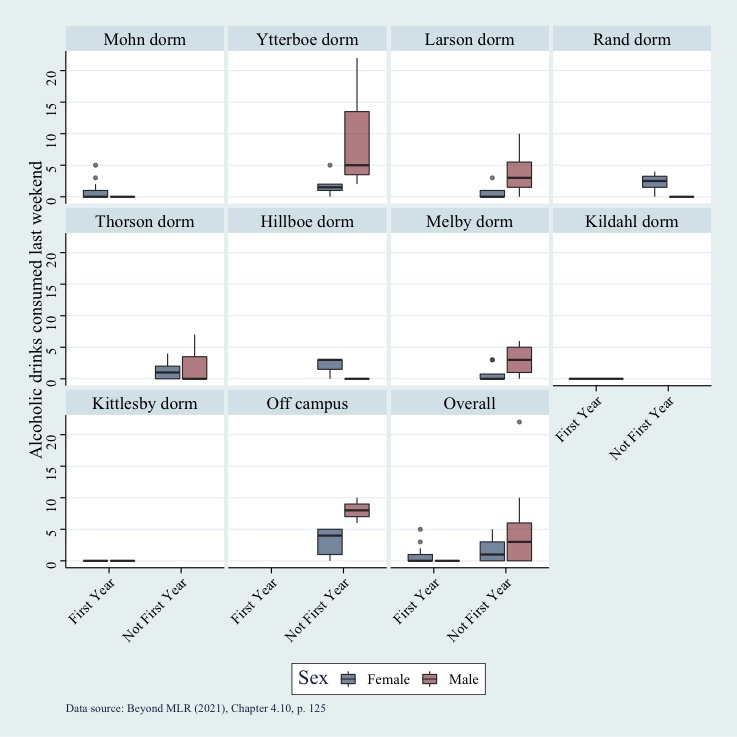

---
output:
  pdf_document: default
  html_document: default
---
```{r, echo=FALSE, message=F}
source("links.R", local=.GlobalEnv)
attach(.GlobalEnv)
```

# Knowledge basket: Writing and peer feedback

## General instructions {#writinggeneral}
The module writing and peer feedback activities have three stages.

-   **Create** phase due the first Friday of the module at 3:03 p.m. ET

-   **Assess** phase due the second Tuesday of the module at 3:03 p.m. ET

-   __Reflect__ phase due the second Friday of the module at 3:03 p.m. ET

### Create phase

The **Create** phase is due the first Friday of the module at 3:03 p.m. ET

-   Spend \~30 minutes writing a response to the prompt.

-   Write about 200--500 words. The word count isn't strict, but the submission requirements listed below ARE.

    -   The prompt should be clearly and comprehensively addressed.

    -   Your writing should be in full sentences and be broken into paragraphs as appropriate.

    -   Any grammatical or word choice errors should be minimal and not obstruct the meaning.

    -   There is a clear central idea that is well summarized in a concluding sentence(s).

    #### Submission requirements

    Your submission should be:

    -   typed (not handwritten)

    -   no more than one page

    -   single-spaced

    -   size 12 font

    -   margins should be no larger than 1 inch

    -   saved as a PDF

### Assess phase

The **Assess** phase is due the second Tuesday of the module at 3:03 p.m. ET

You will need to assess TWO of your peers in this phase. You will be asked:

-   if they have met the submission requirements,

-   to rate them on the rubric,

-   to make a short comment about a strength of this piece of writing,

-   to make a short comment about a way this piece of writing could be improved.

### Reflect phase

The **Reflect** phase is due second Friday of the module at 3:03 p.m. ET

-   Read the feedback received from your peers.

-   Rate the usefulness on a 3-point scale.

### General instructions

These assessments can be used to make up your knowledge basket. They are also useful in helping you prepare for your portfolio writing samples and final project writing.

Warning: MAKE SURE YOU CLICK SUBMIT! Check that each phase is showing as submitted. Students  have occasionally struggled with this in peerScholar's interface and no regrades/adjustments will be possible after the fact.

Your mark for this assessment will be based on participation. There will be separate marks for each phase, i.e., you can get part marks overall. 45% for completing create, 45% for completing assess, 10% for completing reflect. Please note that participation not in the spirit of the assessment (e.g. just putting the Lorem Ipsum text, or giving feedback like "write better" and nothing else) will not get you marks. 


## Module 1 writing task

+--------------------------------------------------------+----------------------------------------------------+
| **Information**                                        | **Note**                                           |
+:=======================================================+:===================================================+
| Name                                                   | Module 1 writing task                      |
+--------------------------------------------------------+----------------------------------------------------+
| Type (Main, Mini or Basket)                              | Basket                                             |
+--------------------------------------------------------+----------------------------------------------------+
| Value                                                  | 0.5% (0.245%, 0.245%, 0.01%) <br> Completion                                           |
+--------------------------------------------------------+----------------------------------------------------+
| Due                                                    | __Create phase__: `r m1_c`;  <br> __Assess phase__: `r m1_a`; <br> __Reflect phase__: `r m1_r`;                                |
+--------------------------------------------------------+----------------------------------------------------+
| Submission instructions                                | Submission: [Via peerScholar](`r m1_link`)                |
|                                                        |                                                    |
|                                                        | Marked for completion              |
+--------------------------------------------------------+----------------------------------------------------+
| Late submissions, accommodations, and extension policy | No late submissions, accommodations, or extensions. |
+--------------------------------------------------------+----------------------------------------------------+

### M1 Instructions

Make sure you are familiar with the [general instructions](#writinggeneral) for these types of tasks.

#### M1 Prompt

Discuss what you consider the most important dos and don'ts when giving peer feedback. What will make your peers' feedback most valuable to you?


#### M1 Rubric

<br>

<br>

```{r, echo=FALSE, message=FALSE}
require(tidyverse)
pd_prop_rubric <- read_csv("rubrics/m1-writing.csv") 

if (knitr:::is_latex_output()) {
  pd_prop_rubric %>% 
  kableExtra::kable(booktabs = T) %>%
  kableExtra::kable_styling(latex_options = c("striped"), font_size = 8) %>% 
        kableExtra::column_spec(2:5, width = "12em") 
  
  
} else {
 pd_prop_rubric %>% 
  kableExtra::kable() %>%
  kableExtra::kable_styling() %>% 
  kableExtra::scroll_box(width = "100%")
}

```

## Module 2 writing task

+--------------------------------------------------------+----------------------------------------------------+
| **Information**                                        | **Note**                                           |
+:=======================================================+:===================================================+
| Name                                                   | Module 2 writing task                      |
+--------------------------------------------------------+----------------------------------------------------+
| Type (Main, Mini or Basket)                              | Basket                                             |
+--------------------------------------------------------+----------------------------------------------------+
| Value                                                  | 0.5% (0.245%, 0.245%, 0.01%) <br> Completion                                           |
+--------------------------------------------------------+----------------------------------------------------+
| Due                                                    | __Create phase__: `r m2_c`;  <br> __Assess phase__: `r m2_a`; <br> __Reflect phase__: `r m2_r`;                                |
+--------------------------------------------------------+----------------------------------------------------+
| Submission instructions                                | Submission: [Via peerScholar](`r m2_link`)                |
|                                                        |                                                    |
|                                                        | Marked for completion              |
+--------------------------------------------------------+----------------------------------------------------+
| Late submissions, accommodations, and extension policy | No late submissions, accommodations, or extensions. |
+--------------------------------------------------------+----------------------------------------------------+

### M2 Instructions

Make sure you are familiar with the [general instructions](#writinggeneral) for these types of tasks.

#### M2 Prompt

Read [*Science isn't broken* (Aschwanden, 2015)](https://fivethirtyeight.com/features/science-isnt-broken/) using the *previewing* and *skimming* strategy outlined below. Discuss what you learn from the article, with a focus on what you **notice about your own thinking** when playing with the *"Hack Your Way To Scientific Glory*" interactive. Make sure you paraphrase appropriately (see [Module 2 paraphrasing section](#paraphrasing)) and add the reference for the article. (It is okay to put the reference by itself on a second page, if required.) 

Instead of reading from beginning to end try ***previewing*** and then ***skimming*** to be faster:

1.  Read the **title**. Pay attention to the "Filed Under" and date of publication.

   🤔*Why do you think we have assigned this reading to you?*

2.  Skip the text until the **interactive figure** called "*Hack Your Way To Scientific Glory*".

When you change political party in section 1, or other items in section 2, how does the p-value change in section 4 of the interactive figure?

   🤔*What do you understand from this figure? What do you notice about your own thinking as you play with it?*

**Tip:** Reading one paragraph before and after a figure helps clarify the figure.

3.  Skip the text until the **figure** of the football field.

   🤔 *What do you understand from this figure?*

4.  Skip the text until the **figure** called "*Same Data, Different Conclusions*".

   🤔 *What do you understand from this figure?*

6.  Read the two **bolded quotes**: "*Science is great, but*..." and "*Human fallibilities*...".

7.  Read the **last paragraph** (often the concluding paragraph).

8.  Now write your **200--500-word reflection** on what you have learned.

    -   **Paraphrase!** That is, use your own words, don't copy/paste. Use the [paraphrasing how-to from the week 2 module](https://q.utoronto.ca/courses/204826/pages/w2-paraphrasing "W2 Paraphrasing") to help you.

    -   Discuss what you noticed about your thinking while playing with the *Hack Your Way To Scientific Glory*" interactive.

    -   Include a **conclusion** at the end.

    -   Use in-text **citation** as follows (Aschwanden, 2015) and put the reference at the end.

9. Go back and read the entire text to see if your understanding was correct.

##### M2 Reference

Aschwanden, C. (2015). *Science Isn't Broken: It's just a hell of a lot harder than we give it credit for*. Retrieved from [https://fivethirtyeight.com/features/science-isnt-broken](https://fivethirtyeight.com/features/science-isnt-broken)

#### M2 Rubric

```{r, echo=FALSE, message=FALSE}
require(tidyverse)
rubric <- read_csv("rubrics/m2-writing.csv") %>% 
  filter(!is.na(Component))

if (knitr:::is_latex_output()) {
  rubric %>% 
  kableExtra::kable(booktabs = T) %>%
  kableExtra::kable_styling(latex_options = c("striped"), font_size = 8) %>% 
        kableExtra::column_spec(2:5, width = "12em") 
  
  
} else {
 rubric %>% 
  kableExtra::kable() %>%
  kableExtra::kable_styling() %>% 
  kableExtra::scroll_box(width = "100%")
  }

```

## Module 3 writing task

+--------------------------------------------------------+----------------------------------------------------+
| **Information**                                        | **Note**                                           |
+:=======================================================+:===================================================+
| Name                                                   | Module 2 writing task                      |
+--------------------------------------------------------+----------------------------------------------------+
| Type (Main, Mini or Basket)                              | Basket                                             |
+--------------------------------------------------------+----------------------------------------------------+
| Value                                                  | 0.5% (0.245%, 0.245%, 0.01%) <br> Completion                                           |
+--------------------------------------------------------+----------------------------------------------------+
| Due                                                    | __Create phase__: `r m3_c`;  <br> __Assess phase__: `r m3_a`; <br> __Reflect phase__: `r m3_r`;                                |
+--------------------------------------------------------+----------------------------------------------------+
| Submission instructions                                | Submission: [Via peerScholar](`r m3_link`)                |
|                                                        |                                                    |
|                                                        | Marked for completion              |
+--------------------------------------------------------+----------------------------------------------------+
| Late submissions, accommodations, and extension policy | No late submissions, accommodations, or extensions. |
+--------------------------------------------------------+----------------------------------------------------+

### M3 instructions

Make sure you are familiar with the [general instructions](#writinggeneral) for these types of tasks.

#### M3 prompt

Write the methods section of parts of the case study from [Chapter 8 Case Study: Music Performance Anxiety (Roback & Legler, 2021)](https://bookdown.org/roback/bookdown-BeyondMLR/ch-multilevelintro.html#cs:music).

I strongly suggest that you use **RMarkdown** for your writing in preparation for your final project. Knit and submit as a **PDF**. (You won't lose marks for doing it in Word, but if you're not comfortable in RMarkdown yet, I'd really recommend working on that! [Guide to writing LaTex equations in Word](https://support.microsoft.com/en-us/office/linear-format-equations-using-unicodemath-and-latex-in-word-2e00618d-b1fd-49d8-8cb4-8d17f25754f8).)

Write a short methods section that covers the final model from section 8.10.

-   Add a reference to the version of R this analysis was conducted with AND a reference to the package used.

    -   Recommend including a statement like the following: "*We fit a linear mixed model in R version 4.0.5 (R Core Team, 2021) using the **lme4** package (Bates, Maechker, Bolker, & Walker, 2015).* " (For this writing, it is okay to copy this exactly or modify is slightly.

        -   You can find the version of R you are using by running `version` into your console.

        -   You can get the appropriate R citation running `citation()` and `citation("lme4")` in your browser as well.

-   Include the the **model,** written out in LaTeX.

    -   In the current reading it is written as a series of equations. You should rewrite it to be a single **composite** equation, like the way we have been writing them in class.

    -   **Explain each model term below the model**; paraphrase (do not just copy/paste) from the book.

-   DO NOT plagiarize Roback and Legler (2021) or the original article (Sadler & Christopehr, 2010). Use your own words. You will be writing something shorter, anyway.

-   Write it as if *you were* one of the authors of the study (you can use 'we').

-   Include all of the methods components you can from the list below ('Methods components'). Section 8.2 will be especially helpful with this.

    -   You also can access the original research article through the U of T library, if you wish.

        -   Need help navigating library resources? Reach out to the Head Librarian at the Mathematical Sciences Library, Bruce Garrod. You can find his contact details in the Library Resources tab of the Course Navigation menu.

-   Place these **references** at the end (can be on a ***second*** page IF required):

    -   Roback, P., & Legler, J. (2021). 8 Introduction to Multilevel Models. In Beyond Multiple Linear Regression: Applied Generalized Linear Models and Multilevel Models in R. Retreived from <https://bookdown.org/roback/bookdown-BeyondMLR/ch-multilevelintro.html>. Boca Raton: CRC Press.

    -   Sadler, Michael E., and Christopher J. Miller. 2010. "Performance Anxiety: A Longitudinal Study of the Roles of Personality and Experience in Musicians." *Social Psychological and Personality Science* 1 (3): 280--87. <http://dx.doi.org/10.1177/1948550610370492>.

    -   Get the citation for R with `citation()` and include it.

    -   Get the citation for **lme4** with `citation("lme4")` and include it.

-   You may wish to use phrases from the [Methods section of the Manchester Academic Phrase bank](https://www.phrasebank.manchester.ac.uk/describing-methods/) to help you describe your methods.

The methods section is usually written in **past tense** and often in the **passive voice** (Swales & Feak, 2012), though there is LOTS of discussion in academia about the use of passive vs active voice. We are not going to require you to write one way or the other for this---consistency is the key thing to aim for.

+-----------------------------------------------------------------------------------------------------------------------------------------------------------------------+
| Methods components                                                                                                                                           |
+=======================================================================================================================================================================+
| Study design                                                                                                                                                          |
+-----------------------------------------------------------------------------------------------------------------------------------------------------------------------+
| Setting                                                                                                                                                               |
+-----------------------------------------------------------------------------------------------------------------------------------------------------------------------+
| Participants                                                                                                                                                          |
+-----------------------------------------------------------------------------------------------------------------------------------------------------------------------+
| Data sources/ measurement                                                                                                                                             |
+-----------------------------------------------------------------------------------------------------------------------------------------------------------------------+
| Statistical methods                                                                                                                                                   |
+-----------------------------------------------------------------------------------------------------------------------------------------------------------------------+
| (b) Write the formula of the model                                                                                                                                    |
+-----------------------------------------------------------------------------------------------------------------------------------------------------------------------+
| (c) Clearly define all outcomes, exposures, predictors, potential confounders, and effect modifiers. Explain how quantitative variables were handled in the analyses. |
+-----------------------------------------------------------------------------------------------------------------------------------------------------------------------+
| *Adapted from STROBE checklist* (von Elm et al., 2007): <https://www.strobe-statement.org/index.php?id=available-checklists>                                          |
+-----------------------------------------------------------------------------------------------------------------------------------------------------------------------+

##### Example from a *different* article: Modified from (Berlowitz et al., 2017):

(1) We conducted a study to compare the effect of two strategies to control blood pressure on physical health: an experimental intensive treatment and the standard treatment currently in use. After recruitment, participants were randomly allocated (randomization) to either the intensive treatment or the standard treatment. (2) The study involved recruitment from 102 clinical sites from November 2010 to March 2013. (3) A total of 9,361 participants 50 years of age or older who had evidence of hypertension were included, but those with diabetes or prior stroke were excluded. (4) The source of the data is the SPRINT study. Physical health was measured using a questionnaire with scores ranging from 0 to 100, with greater scores meaning better physical health. Data were collected at baseline and follow up. 

(5a) To compare longitudinal change for physical health between the treatment groups, "we estimated a linear mixed model assuming linear mean change over time within each treatment group." (5b) "The model for 𝑌~𝑖𝑗~ (*j^th^*physical health measurement for *i^th^* participant measured at time *t~ij~* (in years)) is as follows:     

𝑌~𝑖𝑗~= 𝛽0 +𝛽~1~𝐼𝑛𝑡𝑒𝑛𝑠𝑖𝑣𝑒~𝑖~ + 𝛽~2~𝑡~𝑖𝑗~ + 𝛽~3~𝐼𝑛𝑡𝑒𝑛𝑠𝑖𝑣𝑒~𝑖~𝑡~𝑖𝑗~+ 𝑏~1𝑖~ + 𝑏~2𝑐𝑖~ + 𝜀~𝑖𝑗~                                                                                                                                                                                  (5c) Where 𝐼𝑛𝑡𝑒𝑛𝑠𝑖𝑣𝑒~𝑖~ is the randomization assignment for the *i^th^* participant (1=Intensive-treatment; 0=Standard-treatment), 𝑐~𝑖~ denotes the clinic site for the *i^th^* participant (participants were randomized at 102 clinic sites), 𝑏~1𝑖~ is a subject-specific random effect, 𝑏~2,𝑐𝑖~ is a clinic-specific random effect, and 𝜀~𝑖𝑗~ denotes the residual error component."                                                                                             

"The models included participant-specific and clinic-specific random effects to address within-participant correlations as a result of repeated assessments and correlations among participants at the same [study] site. Fixed effects in the model included treatment group, follow-up time, and the interaction between the treatment group and follow-up time."                                           

##### Reference:                                                                                                                                                                                               Berlowitz, D. R., Foy, C. G., Kazis, L. E., Bolin, L. P., Conroy, M. B., Fitzpatrick, P., . . . Group, S. R. (2017). Effect of Intensive Blood-Pressure Treatment on Patient-Reported Outcomes. *N Engl J Med, 377*(8), 733-744. doi:10.1056/NEJMoa1611179                                                             

#### References for this prompt

Berlowitz, D. R., Foy, C. G., Kazis, L. E., Bolin, L. P., Conroy, M. B., Fitzpatrick, P., . . . Group, S. R. (2017). Effect of Intensive Blood-Pressure Treatment on Patient-Reported Outcomes. *N Engl J Med, 377*(8), 733-744. doi:10.1056/NEJMoa1611179

Roback, P., & Legler, J. (2021). 8 Introduction to Multilevel Models. In Beyond Multiple Linear Regression: Applied Generalized Linear Models and Multilevel Models in R. Retreived from <https://bookdown.org/roback/bookdown-BeyondMLR/ch-multilevelintro.html>. Boca Raton: CRC Press.

Sadler, Michael E., and Christopher J. Miller. 2010. "Performance Anxiety: A Longitudinal Study of the Roles of Personality and Experience in Musicians." *Social Psychological and Personality Science* 1 (3): 280--87. <http://dx.doi.org/10.1177/1948550610370492>.

Swales, J., & Feak, C. B. (2012). *Academic writing for graduate students: essential tasks and skills* (3rd ed.). Ann Arbor: University of Michigan Press.

von Elm, E., Altman, D. G., Egger, M., Pocock, S. J., Gotzsche, P. C., Vandenbroucke, J. P., & Initiative, S. (2007). The Strengthening the Reporting of Observational Studies in Epidemiology (STROBE) statement: guidelines for reporting observational studies. *Lancet, 370*(9596), 1453-1457. doi:10.1016/S0140-6736(07)61602-X

#### M3 Rubric 

+-------------------------+---------------------------------------------------------------------------------------------------------------------------------------------------------------------------------+---------------------------------------------------------------------------------------------------------------------------------------+------------------------------------------------------------------------------------------------------------------------------+------------------------------------------------------------------------------------------------------------------------------------------+
|                         | **Poor or Missing**                                                                                                                                                             | **Adequate**                                                                                                                          | **Good**                                                                                                                     | **Excellent**                                                                                                                            |
+=========================+=================================================================================================================================================================================+=======================================================================================================================================+==============================================================================================================================+==========================================================================================================================================+
| **Study information**   | 0-1 items of study design, setting, participants, data sources and measures defined.                                                                                            | Only 2 items of study design, setting, participants, data sources and measures defined.                                               | Only 3 items of study design, setting, participants, data sources and measures defined.                                      | All 4 items of study design, setting, participants, data sources and measures defined.                                                   |
+-------------------------+---------------------------------------------------------------------------------------------------------------------------------------------------------------------------------+---------------------------------------------------------------------------------------------------------------------------------------+------------------------------------------------------------------------------------------------------------------------------+------------------------------------------------------------------------------------------------------------------------------------------+
| **Statistical methods** | Neither statistical methods used named nor reason for their use given. Not all variables used in each statistical method described.                                             | Not all statistical methods used named but reason for use given for those named. Variables used in each statistical method described. | All statistical methods used named but no reason for use given. Not all variables used in each statistical method described. | All statistical methods used named and reason for use given. Variables used in each statistical method described.                        |
+-------------------------+---------------------------------------------------------------------------------------------------------------------------------------------------------------------------------+---------------------------------------------------------------------------------------------------------------------------------------+------------------------------------------------------------------------------------------------------------------------------+------------------------------------------------------------------------------------------------------------------------------------------+
| **Model formula**       | No model formula included. Model terms not explained.                                                                                                                           | Model formula written but may not be correct. Model terms not explained clearly.                                                      | Model formula written but may not be correct. Each model term explained clearly.                                             | Model formula written correctly. Each model term explained clearly.                                                                      |
+-------------------------+---------------------------------------------------------------------------------------------------------------------------------------------------------------------------------+---------------------------------------------------------------------------------------------------------------------------------------+------------------------------------------------------------------------------------------------------------------------------+------------------------------------------------------------------------------------------------------------------------------------------+
| **Writing mechanics**   | No response OR considerable writing and grammatical issues that completely obscure the meaning OR lots of slang and inappropriate word choice.                                  | Multiple sections are difficult to read but is otherwise understandable.                                                              | Slight difficulty in understanding one or two sections.                                                                      | Can read and follow along with minimal effort. Some grammatical or word choice errors are allowable, but they must not obstruct meaning. |
+-------------------------+---------------------------------------------------------------------------------------------------------------------------------------------------------------------------------+---------------------------------------------------------------------------------------------------------------------------------------+------------------------------------------------------------------------------------------------------------------------------+------------------------------------------------------------------------------------------------------------------------------------------+
| **Paraphrasing**        | Methods and model terms described is too similar to the source material, with only minimal changes made and/or quotes overused and/or sections copied verbatim without quotes.  |                                                                                                                                       |                                                                                                                              | Methods and model terms described in the writer's own word and are sufficiently different from the source material provided.             |
|                         |                                                                                                                                                                                 |                                                                                                                                       |                                                                                                                              |                                                                                                                                          |
|                         | In-text citation may or may not be used. References NOT provided at the end.                                                                                                    |                                                                                                                                       |                                                                                                                              | In-text citation may or may not be used. References provided at the end.                                                                 |
+-------------------------+---------------------------------------------------------------------------------------------------------------------------------------------------------------------------------+---------------------------------------------------------------------------------------------------------------------------------------+------------------------------------------------------------------------------------------------------------------------------+------------------------------------------------------------------------------------------------------------------------------------------+   

## Module 4 writing task

+--------------------------------------------------------+----------------------------------------------------+
| **Information**                                        | **Note**                                           |
+:=======================================================+:===================================================+
| Name                                                   | Module 4 writing task                      |
+--------------------------------------------------------+----------------------------------------------------+
| Type (Main, Mini or Basket)                              | Basket                                             |
+--------------------------------------------------------+----------------------------------------------------+
| Value                                                  | 0.5% (0.245%, 0.245%, 0.01%) <br> Completion                                           |
+--------------------------------------------------------+----------------------------------------------------+
| Due                                                    | __Create phase__: `r m4_c`;  <br> __Assess phase__: `r m4_a`; <br> __Reflect phase__: `r m4_r`;                                |
+--------------------------------------------------------+----------------------------------------------------+
| Submission instructions                                | Submission: [Via peerScholar](`r m4_link`)                |
|                                                        |                                                    |
|                                                        | Marked for completion              |
+--------------------------------------------------------+----------------------------------------------------+
| Late submissions, accommodations, and extension policy | No late submissions, accommodations, or extensions. |
+--------------------------------------------------------+----------------------------------------------------+

### M4 instructions

Make sure you are familiar with the [general instructions](#writinggeneral) for these types of tasks.

#### M4 prompt

*The rubric for this assessment (below) has some specific elements for this prompt, so make sure you take a look at it.*

Write an **executive summary** for the case study in your reading this week on Poisson regression, section 4.10 of (Roback & Legler, 2021): [https://bookdown.org/roback/bookdown-BeyondMLR/ch-poissonreg.html\#cs:drinking](https://bookdown.org/roback/bookdown-BeyondMLR/ch-poissonreg.html#cs:drinking).

An executive summary is a summary of a larger text mostly used in a business setting prepared for executives, managers and policymakers.

You will need to write one for your project.

+-----------------------------+----------------------------------------+---------------------------------------+
|                             | **Executive Summary**                  | **Abstract**                          |
+=============================+========================================+=======================================+
| Summary of a larger text    | Yes                                    | Yes                                   |
+-----------------------------+----------------------------------------+---------------------------------------+
| Audience                    | Not technical: executives, managers,   | Technical: researchers, experts, ...  |
|                             |                                        |                                       |
|                             | policymakers                           |                                       |
+-----------------------------+----------------------------------------+---------------------------------------+
| Background & Aim            | Yes                                    | Yes                                   |
+-----------------------------+----------------------------------------+---------------------------------------+
| Methods                     | No or brief: non-technical             | Yes: mostly technical                 |
+-----------------------------+----------------------------------------+---------------------------------------+
| Key findings / Limitations  | Yes, as bullet points                  | Yes                                   |
+-----------------------------+----------------------------------------+---------------------------------------+
| Tables or figures           | Sometimes                              | Almost never                          |
+-----------------------------+----------------------------------------+---------------------------------------+
| Length                      | 1-2 pages                              | 150--300 words                        |
+-----------------------------+----------------------------------------+---------------------------------------+

#### *Example* executive summary

Here is an executive summary from a consulting company whose report was presented to the Canadian Government on the economic impact of international education in Canada: <https://www.international.gc.ca/education/report-rapport/impact-2017/index.aspx?lang=eng>.

Notice the brief background and aims, in this case, without any headings and all in one paragraph. This is followed by bullet point findings and a final concluding statement which can be easily remembered by anyone: *"A 10% increase or decrease in spending by international students results in an approximately 10-11% change in economic impacts."*

**Assignment format:** This module writing has TWO pages, see the instructions below. (Still a similar amount of writing.)

**Audience:** University health and well-being team (managers, non-statisticians, non-technical).

#### Page 1: Text

Write the executive summary text. Use the following headings and structure:

+-------------------+-----------------------------------+------------------------------------+----------------+
| **Heading**       | **Implied question**              | **Writing style**                  | **How many?**  |
+===================+===================================+====================================+================+
| Background & Aim  | What do we know about the topic?  | Paragraphs                         | 1-2            |
|                   |                                   |                                    |                |
|                   | What is this study about?         |                                    |                |
+-------------------+-----------------------------------+------------------------------------+----------------+
| Key findings      | What was discovered?              | Bullet points, one per finding     | 6              |
+-------------------+-----------------------------------+------------------------------------+----------------+
| Limitations       | What are the limitations?         | Bullet points, one per limitation  | 1-3            |
+-------------------+-----------------------------------+------------------------------------+----------------+

-   Describe **6 'Key findings'** and **1-3 'Limitations'** as bullet points.

-   Refer to both Table 1 and Figure 1 in the bullet points at least once.

-   Do NOT use *p* values, name of statistical tests, 95% CI, or other technical details.

-   Median and interquartile range are okay but need explaining when first used.

#### Page 2: Table and Figure

-   Copy/paste Table 1 (after modification, see "**Include Table 1"** bullet below) and Figure 1 to page 2 of your executive summary.

-   **Do not include Table 2**.

-   Refer to Table 1 and Figure 1 at least once in the main text, i.e., on page 1.

| **Heading**  | **Implied question**  | **Writing style**            | **How many?**  |
|--------------|-----------------------|------------------------------|----------------|
| Table        | -                     | Table with a caption on top  | 1              |
| Figure       | -                     | Figure with a caption below  | 1              |

-   **Include Table 1** on page 2 of the executive summary. **Remove technical details from Table1** (p-value column and second footnote of names of statistical tests highlighted) before copy/pasting to page 2. Notice that the table caption is on top, as discussed in Module 2 and the writing workshop.

**Table 1.** Characteristics of students overall and based on whether they are a first-year or not.

+-------------------------+-----------+--------------------+--------------------------+---------------+
| **Characteristic**      | Overall   | First-year student | Not a first-year student | *p* value^b  |
+=========================+===========+====================+==========================+===============+
| Counts                  | *N* = 77  | *n* = 18           | *n* = 59                 |               |
+-------------------------+-----------+--------------------+--------------------------+---------------+
| **Residence**           |           |                    |                          | 0.2           |
+-------------------------+-----------+--------------------+--------------------------+---------------+
|    Dorm                 | 70 (91%)  | 18 (100%)^a        | 52 (88%)^a               |               |
+-------------------------+-----------+--------------------+--------------------------+---------------+
|    Off campus           | 7 (9.1%)  | 0 (0%)             | 7 (12%)                  |               |
+-------------------------+-----------+--------------------+--------------------------+---------------+
| **Sex**                 |           |                    |                          | 0.13          |
+-------------------------+-----------+--------------------+--------------------------+---------------+
|    Female               | 56 (73%)  | 16 (89%)           | 40 (68%)                 |               |
+-------------------------+-----------+--------------------+--------------------------+---------------+
|    Male                 | 21 (27%)  | 2 (11%)            | 19 (32%)                 |               |
+-------------------------+-----------+--------------------+--------------------------+---------------+
| **Drinks last weekend** | 1 (0, 3)  | 0 (0, 1)           | 1 (0, 4)                 | 0.023         |
+-------------------------+-----------+--------------------+--------------------------+---------------+

^a n (%); Median (IQR)  

*Median* separates the highest 50% of values from lowest 50% of values when values are arranged from lowest to highest (i.e. at least half of first year students had no alcoholic drinks the prior weekend).

*IQR* is interquartile range, representing the range of values from the bottom 25% to top 75% of values (i.e. 25% of first year students had at least 1 alcoholic drink the prior weekend).

^b^ Fisher's exact test; Wilcoxon rank sum test.


-   **DO NOT include Table 2** on page 2 of your executive summary. State findings in simple words in 'Key findings' (no p-values, 95% CI). If you decide to describe log(IRR), do so with simple words.

**Table 2.** Poisson model to predict the number of alcoholic drinks consumed during the prior weekend.

+--------------------+---------------+---------------+-------------------+
| **Characteristic** | **log(IRR)^a**| **95% CI^a ** | ***p*** **value** |
+====================+===============+===============+===================+
| **Residence**      |               |               |                   |
+--------------------+---------------+---------------+-------------------+
|    Dorm            | ---           | ---           |                   |
+--------------------+---------------+---------------+-------------------+
|    Off campus      | 0.90          | 0.49, 1.3     | <.001             |
+--------------------+---------------+---------------+-------------------+
| **Sex**            |               |               |                   |
+--------------------+---------------+---------------+-------------------+
|    Female          | ---           | ---           |                   |
+--------------------+---------------+---------------+-------------------+
|    Male            | 1.1           | 0.80, 1.4     | <.001             |
+--------------------+---------------+---------------+-------------------+

^a IRR = Incidence Rate Ratio, CI = Confidence Interval  \
Model: Number of alcoholic drinks \~ Off-campus status + Sex


-   **Zero-inflated Poisson model:** State the estimated chance that a first-year student is a non-drinker in 'Key findings' as a bullet point (no p-values, no statistical test names in 'Key findings').

-   **Include Figure 1** on page 2 of the executive summary. Include figure title/legend below figure.



**Figure 1.** Distribution of drinking habits across 9 dorms, off campus residences, and overall, by sex and first year status of student. The horizontal *median line* in the middle of the boxes represents the point separating the highest 50% number of alcoholic drinks from the lowest 50% (the middle value). The top of the box represents 75% and the bottom of the box 25% of number of alcoholic drinks. The lines and dots extending beyond the box give the full range of values, with more extreme values further away from the box.

**Note 1:** The code/data is available in the Weekend Drinking case study but you can just copy objects from this prompt directly. Amin has used the `ggthemes` package to apply the 'Stata' theme to this particular plot.

**Note 2:** In your project executive summary you might want to place images and tables more strategically throughout the text, but for this short writing activity we didn't want you to spend time on formatting.

**Note 3:** It is unlikely that you will need to cite anything, as you are writing as if ***you*** are the one who conducted this study. If you were ever to post this writing outside of class, then you should carefully explain the assessment context AND reference the textbook from which the case study comes BUT for in-class submission purposes, don't worry about it.

**Aim to spend about 30 minutes on this task**. Write about 200--400 words responding to the prompt. The word count isn't strict, but the submission requirements listed below ARE.

-   The prompt should be clearly and comprehensively addressed.

-   Your writing should be in full sentences and be broken into paragraphs or bullets as appropriate.

-   Any grammatical or word choice errors should be minimal and not obstruct the meaning.

-   There is a clear central idea that is well introduced in the introduction and well summarized in a conclusion.

-   There should be 2 pages, structured as instructed.

### M4 Rubric

You will be asked to assess the writing of 2 peers on the following rubric. Peers will also assess you on this rubric, so it is important to keep in mind when you are writing.

+------------------------+-----------------------------------------------------------------------------------------------------------------------+---------------------------------------------------------------------------------------------------------------------------------------------------------+------------------------------------------------------------------------------------------------------------------------------------------------------------+-------------------------------------------------------------------------------------------------------------------------------------------------+
|                        | **Poor or Missing**                                                                                                   | **Adequate**                                                                                                                                            | **Good**                                                                                                                                                   | **Excellent**                                                                                                                                   |
+========================+=======================================================================================================================+=========================================================================================================================================================+============================================================================================================================================================+=================================================================================================================================================+
| **Addresses prompt**   | Does not address the prompt for this week.                                                                            | Only one item of the prompt is addressed or much of the response is not relevant/off-topic.                                                             | Prompt is addressed, though may go somewhat off-topic at points, or does not mention at least one of main points.                                          | Prompt is answered with regard to all three main points: association of sex, residence and first-year status on alcoholic drinking.             |
|                        |                                                                                                                       |                                                                                                                                                         |                                                                                                                                                            |                                                                                                                                                 |
|                        |                                                                                                                       |                                                                                                                                                         |                                                                                                                                                            |                                                                                                                                                 |
|                        |                                                                                                                       |                                                                                                                                                         |                                                                                                                                                            |                                                                                                                                                 |
|                        |                                                                                                                       | Inappropriate for the audience. More than 1 mention of p-value or statistical test.                                                                     | Either Table 1 or Figure 1 is not used.                                                                                                                    | Table 1 and Figure 1 are used.                                                                                                                  |
|                        |                                                                                                                       |                                                                                                                                                         |                                                                                                                                                            |                                                                                                                                                 |
|                        |                                                                                                                       |                                                                                                                                                         |                                                                                                                                                            |                                                                                                                                                 |
|                        |                                                                                                                       |                                                                                                                                                         |                                                                                                                                                            |                                                                                                                                                 |
|                        |                                                                                                                       |                                                                                                                                                         | Mostly appropriate for the audience. One mention of a p-value or a statistical test.                                                                       | Appropriate for the audience. No p-values or names of statistical tests.                                                                        |
|                        |                                                                                                                       |                                                                                                                                                         |                                                                                                                                                            |                                                                                                                                                 |
|                        |                                                                                                                       |                                                                                                                                                         |                                                                                                                                                            |                                                                                                                                                 |
+------------------------+-----------------------------------------------------------------------------------------------------------------------+---------------------------------------------------------------------------------------------------------------------------------------------------------+------------------------------------------------------------------------------------------------------------------------------------------------------------+-------------------------------------------------------------------------------------------------------------------------------------------------+
| **Structure**          | There is no structure, very difficult to follow. No paragraphs, single block of text.                                 | 1--2 headings used.                                                                                                                                     | 3--4 headings used.                                                                                                                                        | Five headings used.                                                                                                                             |
|                        |                                                                                                                       |                                                                                                                                                         |                                                                                                                                                            |                                                                                                                                                 |
|                        |                                                                                                                       |                                                                                                                                                         |                                                                                                                                                            |                                                                                                                                                 |
|                        |                                                                                                                       |                                                                                                                                                         |                                                                                                                                                            |                                                                                                                                                 |
|                        |                                                                                                                       | Neither 'Key findings' or 'Limitations' are in bullet points.                                                                                           | Either 'Key findings' or 'Limitations' are not in bullet points.                                                                                           | 'Key findings' and 'Limitations' are in bullet points.                                                                                          |
|                        |                                                                                                                       |                                                                                                                                                         |                                                                                                                                                            |                                                                                                                                                 |
|                        |                                                                                                                       |                                                                                                                                                         |                                                                                                                                                            |                                                                                                                                                 |
|                        |                                                                                                                       |                                                                                                                                                         |                                                                                                                                                            |                                                                                                                                                 |
|                        |                                                                                                                       | More than 1 paragraph/bullet point contains unrelated ideas, or more than 1 paragraph does not introduce the topic of the paragraph at the beginning.   | At least 1 paragraph/bullet point contains an unrelated idea and/or at least 1 paragraph does not introduce the topic of the paragraph at the beginning.   | Each paragraph/bullet point contains a clear main point and related ideas. Paragraphs introduce the topic of the paragraph at the beginning.    |
|                        |                                                                                                                       |                                                                                                                                                         |                                                                                                                                                            |                                                                                                                                                 |
|                        |                                                                                                                       |                                                                                                                                                         |                                                                                                                                                            |                                                                                                                                                 |
|                        |                                                                                                                       |                                                                                                                                                         |                                                                                                                                                            |                                                                                                                                                 |
|                        |                                                                                                                       | Some structure but difficult to follow.                                                                                                                 | Well organized, follows a logical structure.                                                                                                               | Well organized, follows a logical structure.                                                                                                    |
|                        |                                                                                                                       |                                                                                                                                                         |                                                                                                                                                            |                                                                                                                                                 |
|                        |                                                                                                                       |                                                                                                                                                         |                                                                                                                                                            |                                                                                                                                                 |
+------------------------+-----------------------------------------------------------------------------------------------------------------------+---------------------------------------------------------------------------------------------------------------------------------------------------------+------------------------------------------------------------------------------------------------------------------------------------------------------------+-------------------------------------------------------------------------------------------------------------------------------------------------+
| **Writing mechanics**  | Considerable writing and grammatical issues that obscure the meaning OR lots of slang and inappropriate word choice.  | Multiple sentences/phrases are difficult to read, have slang or inappropriate word choice, or grammar problems obstructing meaning.                     | Slight difficulty in understanding one or two sentences/phrases but otherwise understandable.                                                              | Can read and follow along with minimal effort. Some grammatical or word choice errors are allowable, but they must not obstruct meaning.        |
+------------------------+-----------------------------------------------------------------------------------------------------------------------+---------------------------------------------------------------------------------------------------------------------------------------------------------+------------------------------------------------------------------------------------------------------------------------------------------------------------+-------------------------------------------------------------------------------------------------------------------------------------------------+


### M4 Reference

Roback, P., & Legler, J. (2021). 4.10 Case Study: Weekend Drinking. In *Beyond Multiple Linear Regression: Applied Generalized Linear Models and Multilevel Models in R* (1. ed., pp. 436). Boca Raton: CRC Press.


## Module 5 writing task

+--------------------------------------------------------+----------------------------------------------------+
| **Information**                                        | **Note**                                           |
+:=======================================================+:===================================================+
| Name                                                   | Module 5 writing task                      |
+--------------------------------------------------------+----------------------------------------------------+
| Type (Main, Mini or Basket)                              | Basket                                             |
+--------------------------------------------------------+----------------------------------------------------+
| Value                                                  | 0.5% (0.245%, 0.245%, 0.01%) <br> Completion                                           |
+--------------------------------------------------------+----------------------------------------------------+
| Due                                                    | __Create phase__: `r m5_c`;  <br> __Assess phase__: `r m5_a`; <br> __Reflect phase__: `r m5_r`;                                |
+--------------------------------------------------------+----------------------------------------------------+
| Submission instructions                                | Submission: [Via peerScholar](`r m5_link`)                |
|                                                        |                                                    |
|                                                        | Marked for completion              |
+--------------------------------------------------------+----------------------------------------------------+
| Late submissions, accommodations, and extension policy | No late submissions, accommodations, or extensions. |
+--------------------------------------------------------+----------------------------------------------------+

### M5 instructions

Make sure you are familiar with the [general instructions](#writinggeneral) for these types of tasks.

#### M5 prompt

Summarize and paraphrase section [**6.7.5 Model Discussion and Summary**](https://bookdown.org/roback/bookdown-BeyondMLR/ch-logreg.html#model-discussion-and-summary) of (Roback & Legler, 2021a). The first paragraph is key results, and the next 3 paragraphs are limitations. Paraphrase and summarize key results and limitations into two paragraphs, and then write your own conclusion in a few sentences.

#### Address the prompt using the following material: 

| **Section** | **Activity**           | **Location**     | **Source**                                                                                                                                                       |
|-------------|------------------------|------------------|------------------------------------------------------------------------------------------------------------------------------------------------------------------|
| Study aim   | Paraphrase             | Paragraph 4      | [6.7 Case Study: Trying to Lose Weight](https://bookdown.org/roback/bookdown-BeyondMLR/ch-logreg.html#case-study-trying-to-lose-weight): We are interested in... |
| Key results | Paraphrase             | Paragraph 1      | [6.7.5 Model Discussion and Summary](https://bookdown.org/roback/bookdown-BeyondMLR/ch-logreg.html#model-discussion-and-summary): We found that...               |
| Limitations | Summarise & Paraphrase | Paragraphs 2,3,4 | [6.7.5 Model Discussion and Summary](https://bookdown.org/roback/bookdown-BeyondMLR/ch-logreg.html#model-discussion-and-summary): A limitation of ...            |
| Conclusion  | Write                  |                  | Your own thoughts                                                                                                                                                |

#### Structure of writing

**Discussion**

+----------------------------+-------------------------------------------------------------------------------------------------------------------------------------------------------------------------------------------------------------------------+---------------+
| Part                       | To do                                                                                                                                                                                                                   | Length        |
+============================+=========================================================================================================================================================================================================================+===============+
| Study aim(s) & Key results | (a) Restate study aim(s) from introduction in condense format                                                                                                                                                           | 1 paragraph   |
|                            |                                                                                                                                                                                                                         |               |
|                            | (b) Summarize key results                                                                                                                                                                                               |               |
+----------------------------+-------------------------------------------------------------------------------------------------------------------------------------------------------------------------------------------------------------------------+---------------+
| Limitations                | Discuss limitations of the study, taking into account sources of potential bias or imprecision, such as:                                                                                                                | 1 paragraph   |
|                            |                                                                                                                                                                                                                         |               |
|                            | (a) data missingness                                                                                                                                                                                                    |               |
|                            |                                                                                                                                                                                                                         |               |
|                            | (b) definitions and selection or survivorship bias                                                                                                                                                                      |               |
|                            |                                                                                                                                                                                                                         |               |
|                            | (c) data collection (survey) methods                                                                                                                                                                                    |               |
|                            |                                                                                                                                                                                                                         |               |
|                            | (d) confounders, if any                                                                                                                                                                                                 |               |
+----------------------------+-------------------------------------------------------------------------------------------------------------------------------------------------------------------------------------------------------------------------+---------------+
| Conclusion                 | Give a cautious overall interpretation of results considering aim(s), key results, and limitations                                                                                                                      | 1-3 sentences |
+----------------------------+-------------------------------------------------------------------------------------------------------------------------------------------------------------------------------------------------------------------------+---------------+
| Reference                  | Place reference at the end of your writing. In-text citation is not required, aim to write as if you were part of the study.                                                                                            | 1 reference   |
|                            |                                                                                                                                                                                                                         |               |
|                            | Roback, P., & Legler, J. (2021). 6.7.5 Model Discussion and Summary. In *Beyond Multiple Linear Regression: Applied Generalized Linear Models and Multilevel Models in R* (1. ed., pp. 180-181). Boca Raton: CRC Press. |               |
+----------------------------+-------------------------------------------------------------------------------------------------------------------------------------------------------------------------------------------------------------------------+---------------+

Adapted from [STROBE checklist](https://www.strobe-statement.org/index.php?id=available-checklists) (von Elm et al., 2007).

#### Useful phrases to consider

Examples and resources to use with or without modification. You can also write your own.

+-------------------------+------------------------------------------------------------------------+
| Part                    | Example phrases                                                        |
+=========================+========================================================================+
| Study aim & Key results | This study set out to ...                                              |
|                         |                                                                        |
|                         | The aim of the present research was to examine ...                     |
|                         |                                                                        |
|                         | The current study found that ...                                       |
|                         |                                                                        |
|                         | This experiment did not detect any evidence for ...                    |
|                         |                                                                        |
|                         | Surprisingly, no differences were found in ....                        |
+-------------------------+------------------------------------------------------------------------+
| Limitations             | There are three limitations to this study. The first limitation is ... |
|                         |                                                                        |
|                         | These findings may be somewhat limited by ...                          |
|                         |                                                                        |
|                         | These data must be interpreted with caution because ...                |
+-------------------------+------------------------------------------------------------------------+
| Conclusion              | In conclusion ...                                                      |
|                         |                                                                        |
|                         | The results of this study indicate that ...                            |
|                         |                                                                        |
|                         | These findings may help us to understand ...                           |
|                         |                                                                        |
|                         | Notwithstanding these limitations, the study suggests that ...         |
+-------------------------+------------------------------------------------------------------------+

Adapted from Manchester Academic Phrase Bank sections: [Discussing Findings](https://www.phrasebank.manchester.ac.uk/discussing-findings/) and [Writing Conclusions](https://www.phrasebank.manchester.ac.uk/writing-conclusions/).

#### How to restate study aims in the discussion

There are four aims in the *introduction* of the current study (paragraph 4 of [6.7 Case Study: Trying to Lose Weight](https://bookdown.org/roback/bookdown-BeyondMLR/ch-logreg.html#case-study-trying-to-lose-weight): We are interested in...), but when restating the aims in the *discussion* we can summarize and paraphrase them by condensing them to a sentence or two instead of repeating all the questions or aims. One good example is sentence 3 of paragraph 1 of [6.7 Case Study: Trying to Lose Weight](https://bookdown.org/roback/bookdown-BeyondMLR/ch-logreg.html#case-study-trying-to-lose-weight): "Here we examine characteristics of young people who are trying to lose weight." We want a little more specificity for our discussion, try to condense the four aims into a sentence (or two) of your own.

##### Example 1 (Roback & Legler 11.2 Case Study: College Basketball Referees)

Aims in the introduction: "Data have been gathered from the 2009--2010 college basketball season for three major conferences to investigate the following questions (Noecker & Roback, 2012):

-   Does evidence that college basketball referees tend to "even out" calls still exist in 2010 as it did in 2005?

-   How do results change if our analysis accounts for the correlation in calls from the same game and the same teams?

-   Is the tendency to even out calls stronger for fouls over which the referee generally has greater control? Fouls are divided into offensive, personal, and shooting fouls, and one could argue that referees have the most control over offensive fouls (for example, where the player with the ball knocks over a stationary defender) and the least control over shooting fouls (where an offensive player is fouled in the act of shooting).

-   Are the actions of referees associated with the score of the game?" (Roback & Legler, 2021b)

***Condensed*** aims for discussion: This study set out to investigates the existence of "even out" calls in basketball games, and their correlation with four items: player teams, game being played, foul type and score of game. The current study found that ...

##### Example 2 

**Aims in the introduction:** "An important question related to pandemic preparedness remains unanswered: what killed people during the 1918--1919 pandemic and subsequent influenza pandemics? In the present study, we have examined recut tissue specimens obtained during autopsy from 58 influenza victims in 1918--1919, and have reviewed epidemiologic, pathologic, and microbiologic data from published reports for 8,398 post-mortem examinations bearing on this question. We have also reviewed relevant information, accumulated over 9 decades, related to the circulation of descendants of the 1918 virus." (Morens, Taubenberger, & Fauci, 2008)

***Condensed*** aims for discussion: We examined epidemiologic, pathologic, and microbiologic evidence from the 1918--1919 pandemic continuing to subsequent pandemics from similar viruses to determine the likely cause of death during such pandemics. The results of this investigation show that ...


### M5 Rubric

You will be asked to assess the writing of 2 peers on the following rubric. Peers will also assess you on this rubric, so it is important to keep in mind when you are writing.

+------------------------+-----------------------------------------------------------------------------------------------------------------------+---------------------------------------------------------------------------------------------------------------------------------------------------------+------------------------------------------------------------------------------------------------------------------------------------------------------------+-------------------------------------------------------------------------------------------------------------------------------------------------+
|                        | **Poor or Missing**                                                                                                   | **Adequate**                                                                                                                                            | **Good**                                                                                                                                                   | **Excellent**                                                                                                                                   |
+========================+=======================================================================================================================+=========================================================================================================================================================+============================================================================================================================================================+=================================================================================================================================================+
| **Addresses prompt**   | Does not address the prompt for this week.                                                                            | Only one item of the prompt is addressed or much of the response is not relevant/off-topic.                                                             | Prompt is addressed, though may go somewhat off-topic at points, or does not mention at least one of main points.                                          | Prompt is answered with regard to all three main points: association of sex, residence and first-year status on alcoholic drinking.             |
|                        |                                                                                                                       |                                                                                                                                                         |                                                                                                                                                            |                                                                                                                                                 |
|                        |                                                                                                                       |                                                                                                                                                         |                                                                                                                                                            |                                                                                                                                                 |
|                        |                                                                                                                       |                                                                                                                                                         |                                                                                                                                                            |                                                                                                                                                 |
|                        |                                                                                                                       | Inappropriate for the audience. More than 1 mention of p-value or statistical test.                                                                     | Either Table 1 or Figure 1 is not used.                                                                                                                    | Table 1 and Figure 1 are used.                                                                                                                  |
|                        |                                                                                                                       |                                                                                                                                                         |                                                                                                                                                            |                                                                                                                                                 |
|                        |                                                                                                                       |                                                                                                                                                         |                                                                                                                                                            |                                                                                                                                                 |
|                        |                                                                                                                       |                                                                                                                                                         |                                                                                                                                                            |                                                                                                                                                 |
|                        |                                                                                                                       |                                                                                                                                                         | Mostly appropriate for the audience. One mention of a p-value or a statistical test.                                                                       | Appropriate for the audience. No p-values or names of statistical tests.                                                                        |
|                        |                                                                                                                       |                                                                                                                                                         |                                                                                                                                                            |                                                                                                                                                 |
|                        |                                                                                                                       |                                                                                                                                                         |                                                                                                                                                            |                                                                                                                                                 |
+------------------------+-----------------------------------------------------------------------------------------------------------------------+---------------------------------------------------------------------------------------------------------------------------------------------------------+------------------------------------------------------------------------------------------------------------------------------------------------------------+-------------------------------------------------------------------------------------------------------------------------------------------------+
| **Structure**          | There is no structure, very difficult to follow. No paragraphs, single block of text.                                 | 1--2 headings used.                                                                                                                                     | 3--4 headings used.                                                                                                                                        | Five headings used.                                                                                                                             |
|                        |                                                                                                                       |                                                                                                                                                         |                                                                                                                                                            |                                                                                                                                                 |
|                        |                                                                                                                       |                                                                                                                                                         |                                                                                                                                                            |                                                                                                                                                 |
|                        |                                                                                                                       |                                                                                                                                                         |                                                                                                                                                            |                                                                                                                                                 |
|                        |                                                                                                                       | Neither 'Key findings' or 'Limitations' are in bullet points.                                                                                           | Either 'Key findings' or 'Limitations' are not in bullet points.                                                                                           | 'Key findings' and 'Limitations' are in bullet points.                                                                                          |
|                        |                                                                                                                       |                                                                                                                                                         |                                                                                                                                                            |                                                                                                                                                 |
|                        |                                                                                                                       |                                                                                                                                                         |                                                                                                                                                            |                                                                                                                                                 |
|                        |                                                                                                                       |                                                                                                                                                         |                                                                                                                                                            |                                                                                                                                                 |
|                        |                                                                                                                       | More than 1 paragraph/bullet point contains unrelated ideas, or more than 1 paragraph does not introduce the topic of the paragraph at the beginning.   | At least 1 paragraph/bullet point contains an unrelated idea and/or at least 1 paragraph does not introduce the topic of the paragraph at the beginning.   | Each paragraph/bullet point contains a clear main point and related ideas. Paragraphs introduce the topic of the paragraph at the beginning.    |
|                        |                                                                                                                       |                                                                                                                                                         |                                                                                                                                                            |                                                                                                                                                 |
|                        |                                                                                                                       |                                                                                                                                                         |                                                                                                                                                            |                                                                                                                                                 |
|                        |                                                                                                                       |                                                                                                                                                         |                                                                                                                                                            |                                                                                                                                                 |
|                        |                                                                                                                       | Some structure but difficult to follow.                                                                                                                 | Well organized, follows a logical structure.                                                                                                               | Well organized, follows a logical structure.                                                                                                    |
|                        |                                                                                                                       |                                                                                                                                                         |                                                                                                                                                            |                                                                                                                                                 |
|                        |                                                                                                                       |                                                                                                                                                         |                                                                                                                                                            |                                                                                                                                                 |
+------------------------+-----------------------------------------------------------------------------------------------------------------------+---------------------------------------------------------------------------------------------------------------------------------------------------------+------------------------------------------------------------------------------------------------------------------------------------------------------------+-------------------------------------------------------------------------------------------------------------------------------------------------+
| **Writing mechanics**  | Considerable writing and grammatical issues that obscure the meaning OR lots of slang and inappropriate word choice.  | Multiple sentences/phrases are difficult to read, have slang or inappropriate word choice, or grammar problems obstructing meaning.                     | Slight difficulty in understanding one or two sentences/phrases but otherwise understandable.                                                              | Can read and follow along with minimal effort. Some grammatical or word choice errors are allowable, but they must not obstruct meaning.        |
+------------------------+-----------------------------------------------------------------------------------------------------------------------+---------------------------------------------------------------------------------------------------------------------------------------------------------+------------------------------------------------------------------------------------------------------------------------------------------------------------+-------------------------------------------------------------------------------------------------------------------------------------------------+

### M5 References

Morens, D. M., Taubenberger, J. K., & Fauci, A. S. (2008). Predominant Role of Bacterial Pneumonia as a Cause of Death in Pandemic Influenza: Implications for Pandemic Influenza Preparedness. *The Journal of Infectious Diseases, 198*(7), 962-970. doi:10.1086/591708

Noecker, C. A., & Roback, P. (2012). New Insights on the Tendency of NCAA Basketball Officials to Even Out Foul Calls. *Journal of Quantitative Analysis in Sports, 8*(3). doi:doi:10.1515/1559-0410.1402

Roback, P., & Legler, J. (2021a). 6.7.5 Model Discussion and Summary. In *Beyond Multiple Linear Regression: Applied Generalized Linear Models and Multilevel Models in R* (1. ed., pp. 180-181). Boca Raton: CRC Press.

Roback, P., & Legler, J. (2021b). 11.2 Case Study: College Basketball Referees. In *Beyond Multiple Linear Regression: Applied Generalized Linear Models and Multilevel Models in R* (1. ed., pp. 374-400). Boca Raton: CRC Press.

von Elm, E., Altman, D. G., Egger, M., Pocock, S. J., Gotzsche, P. C., Vandenbroucke, J. P., & Initiative, S. (2007). The Strengthening the Reporting of Observational Studies in Epidemiology (STROBE) statement: guidelines for reporting observational studies. *Lancet, 370*(9596), 1453-1457. doi:10.1016/S0140-6736(07)61602-X
