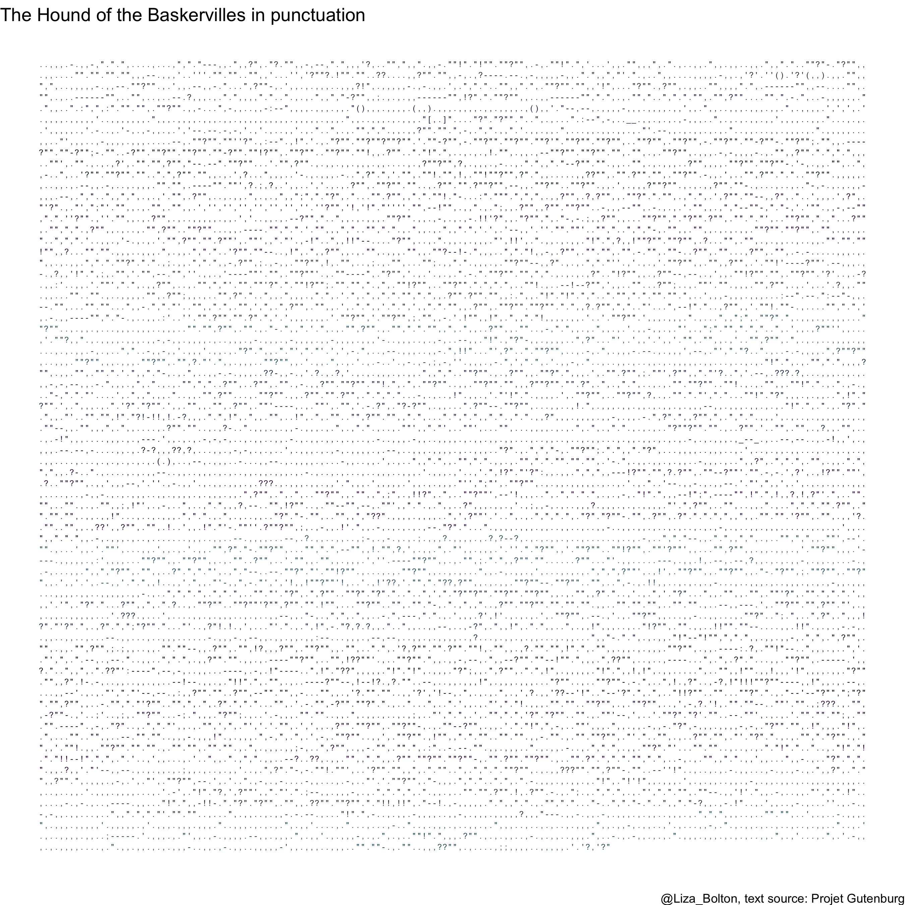

```{r, echo=FALSE}
source("links.R",  local = knitr::knit_global())
```

# Knowledge basket: Other

## 'Getting to know you' survey

+--------------------------------------------------------+----------------------------------------------------+
| **Information**                                        | **Note**                                           |
+:=======================================================+:===================================================+
| Name                                                   | 'Getting to know you' survey                       |
+--------------------------------------------------------+----------------------------------------------------+
| Type (Main, Mini or Basket)                              | Basket                                             |
+--------------------------------------------------------+----------------------------------------------------+
| Value                                                  | 0.1%                                               |
+--------------------------------------------------------+----------------------------------------------------+
| Due                                                    | `r know_survey`                                    |
+--------------------------------------------------------+----------------------------------------------------+
| Submission instructions                                | Submission: [Via Quercus survey](`r know_survey_link`)                |
|                                                        |                                                    |
|                                                        | Untimed survey, marked for completion              |
+--------------------------------------------------------+----------------------------------------------------+
| Late submissions, accommodations, and extension policy | No late submissions, accommodations, or extensions. |
+--------------------------------------------------------+----------------------------------------------------+

### Instructions

Answer the following questions to help me get to know the class. Some of the questions might seem a little random, but I'm hoping to use them for some future class activities.

(Some questions are from factfulnessquiz.com, you are not being marked on correctness, so please answer to the best of your ability without looking anything up.)

## Pre-knowledge check

+--------------------------------------------------------+----------------------------------------------------+
| **Information**                                        | **Note**                                           |
+:=======================================================+:===================================================+
| Name                                                   | Pre-knowledge check                                                                                          |
+--------------------------------------------------------+-----------------------------------------------------------------------------------------------------------------------+
| Type (Main, Mini or Basket)                              | Basket                                                                                                                |
+--------------------------------------------------------+-----------------------------------------------------------------------------------------------------------------------+
| Value                                                  | 0.5% for completion + 0.5% for a score of 80%+ OR active attendance at the prerequisite knowledge workshop 2022-02-02 |
+--------------------------------------------------------+-----------------------------------------------------------------------------------------------------------------------+
| Due                                                    | `r prereq_quiz` <br> (Workshop: `r prereq_workshop`)                                                                                             |
+--------------------------------------------------------+-----------------------------------------------------------------------------------------------------------------------+
| Submission instructions                                | Submission: [Via Quercus survey](`r prereq_quiz_link`)                                                                                           |
|                                                        |                                                                                                                       |
|                                                        | 60 minutes, 1 attempt, no pausing                                                                                                 |
+--------------------------------------------------------+-----------------------------------------------------------------------------------------------------------------------+
| Late submissions, accommodations, and extension policy | No late submissions, accommodations, or extensions.                                                                    |
+--------------------------------------------------------+-----------------------------------------------------------------------------------------------------------------------+

### Instructions

Answer the pre-knowledge check quiz questions to the best of your ability. In Quercus, you will see two assignment entries, one for the quiz and for storing your final score that takes into account completion of the quiz and the 80%+ score or workshop engagement/attendance.

__You are welcome to use any calculator you wish and/or R.__

There are 15 points across 16 questions, so you have about 4 minutes per point. The structure is outlined below. You may find having read the syllabus first helpful for question 1.

+-------------+--------------------------------+-------------------------------+--------+
| Question \# | Type                           | General topic area            | Points |
+=============+================================+===============================+========+
| 1           | Tick all that apply            | Academic integrity            | 1      |
+-------------+--------------------------------+-------------------------------+--------+
| 2           | Single choice (MCQ)            | Paraphrasing                  | 1      |
+-------------+--------------------------------+-------------------------------+--------+
| 3           | Fill in the blanks (3 numeric) | Rounding                      | 1      |
+-------------+--------------------------------+-------------------------------+--------+
| 4           | MCQ                            | Linear regression assumptions | 1      |
+-------------+--------------------------------+-------------------------------+--------+
| 5           | MCQ                            | Linearity                     | 1      |
+-------------+--------------------------------+-------------------------------+--------+
| 6           | Numeric                        | Distributions                 | 1      |
+-------------+--------------------------------+-------------------------------+--------+
| 7           | Numeric                        | Distributions                 | 1      |
+-------------+--------------------------------+-------------------------------+--------+
| 8           | MCQ                            | Distributions                 | 1      |
+-------------+--------------------------------+-------------------------------+--------+
| 9           | MCQ                            | Confidence intervals          | 1      |
+-------------+--------------------------------+-------------------------------+--------+
| 10          | MCQ                            | Algebra                       | 1      |
+-------------+--------------------------------+-------------------------------+--------+
| 11          | MCQ                            | Likelihood                    | 1      |
+-------------+--------------------------------+-------------------------------+--------+
| 12          | Numeric                        | Proportions                   | 0.5    |
+-------------+--------------------------------+-------------------------------+--------+
| 13          | Numeric                        | Proportions                   | 0.5    |
+-------------+--------------------------------+-------------------------------+--------+
| 14          | MCQ                            | Multiple linear regression    | 1      |
+-------------+--------------------------------+-------------------------------+--------+
| 15          | MCQ                            | Multiple linear regression    | 1      |
+-------------+--------------------------------+-------------------------------+--------+
| 16          | MCQ                            | P-values                      | 1      |
+-------------+--------------------------------+-------------------------------+--------+


#### Grade structure

- Completion of the quiz (all questions attempted) will earn you 0.5%.

- If you score 80% or more on the quiz, you earn an additional 0.5%.

- If you _do not_ score 80% or more, you can still earn this additional 0.5% by attending and actively engaging with the workshop on `r prereq_workshop`. 

- The maximum points to earn here is 1% (i.e., you cannot get BOTH the 80%+ and workshop attendance bonuses)

### Workshop attendance

If you didn't earn a full 1% from the pre-knowledge quiz (either didn't score over 80% or didn't complete it), you **can still earn 0.5 points towards your 🧺knowledge basket** by participating in this workshop.

-   For your attendance to count you must attend **at least 75% of a single 50-minute workshop** AND [**complete the post-event survey**](https://q.utoronto.ca/courses/253305/quizzes/242957 "Module 2 pre-knowledge post-workshop survey").

-   Please arrive on time! 

-   You can come to both if you want (they will be the same content though!) but cannot double up on points.

-   A recording of the session will be posted later, for your reference, but watching that will NOT be eligible for points.

-   You can do a **practice version** of the [pre-knowledge check](https://q.utoronto.ca/courses/253305/quizzes/242031 "Pre-knowledge check (practice version)") as many times as you like. There is also commentary on some of the question after you submit.


## Module check-ins

+--------------------------------------------------------+----------------------------------------------------+
| **Information**                                        | **Note**                                           |
+:=======================================================+:===================================================+
| Name                                                   | Module check-in 1--5                                                                                         |
+--------------------------------------------------------+-----------------------------------------------------------------------------------------------------------------------+
| Type (Main, Mini or Basket)                              | Basket                                                                                                                |
+--------------------------------------------------------+-----------------------------------------------------------------------------------------------------------------------+
| Value                                                  | 0.1% for completion |
+--------------------------------------------------------+-----------------------------------------------------------------------------------------------------------------------+
| Due                                                    | Second Fridays of Modules at 3:03 p.m.                                                                                            |
+--------------------------------------------------------+-----------------------------------------------------------------------------------------------------------------------+
| Submission instructions                                | Submission: [Via Quercus surveys](`r assignments_link`)                                                                                    |
|                                                        |                                                                                                                       |
|                                                        | Untimed, unlimited attempts                                                                                                 |
+--------------------------------------------------------+-----------------------------------------------------------------------------------------------------------------------+
| Late submissions, accommodations, and extension policy | No late submissions, accommodations, or extensions.                                                                    |
+--------------------------------------------------------+-----------------------------------------------------------------------------------------------------------------------+

### Instructions

Module check-ins are a short questionnaire to help me 'take the pulse' of the class. Each survey will like take only 5--10 minutes and will be available about 6:00 p.m. on the second Wednesday of each module, until 3:03 p.m. ET on the second Friday.


## Team Up! activities

+--------------------------------------------------------+---------------------------------------------------------------------------------------------------------------------+
| **Information**                                        | **Note**                                                                                                            |
+:=======================================================+:====================================================================================================================+
| Name                                                   | Team Up! activities (aiming for one per module)                                                                     |
+--------------------------------------------------------+---------------------------------------------------------------------------------------------------------------------+
| Type (Main, Mini or Basket)                            | Basket                                                                                                              |
+--------------------------------------------------------+---------------------------------------------------------------------------------------------------------------------+
| Value                                                  | 0.5% (graded on quality)                                                                                            |
+--------------------------------------------------------+---------------------------------------------------------------------------------------------------------------------+
| Due                                                    | End of tutorial time (first Thursdays)                                                                              |
+--------------------------------------------------------+---------------------------------------------------------------------------------------------------------------------+
| Submission instructions                                | Submission: Via Team Up! (links through Quercus)                                                                    |
|                                                        |                                                                                                                     |
|                                                        | Usually \~50 minutes, one attempt (as a group), but with options to retry incorrect questions (for partial points). |
+--------------------------------------------------------+---------------------------------------------------------------------------------------------------------------------+
| Late submissions, accommodations, and extension policy | No late submissions, accommodations, or extensions.                                                                 |
+--------------------------------------------------------+---------------------------------------------------------------------------------------------------------------------+

See the [course overview page on Quercus](https://q.utoronto.ca/courses/253305/pages/course-overview) for the links to the versions with answers.


## Graduate school info session

| **Information**                                        | **Note**                                            |
|:-------------------------------------------------------|:----------------------------------------------------|
| Name                                                   | Module 1 graduate school info session and panel     |
| Type (Main, Mini or Basket)                            | Basket                                              |
| Value                                                  | 0.1%                                                |
| Due                                                    | `r m1_friday`                                       |
| Submission instructions                                | Submission: [Via Quercus](`r m1_gradschool`)        |
| Late submissions, accommodations, and extension policy | No late submissions, accommodations, or extensions. |


There will be two versions of this session, each in class time on January 19, 2022, 10:10 to 11:00 a.m. and 3:10 to 4:00 p.m.

These sessions will have a short presentation from the administrators/program managers of some potentially relevant U of T graduate programs as well as a panel discussion with some of the course TAs. They will talk about their experiences, things they wish they'd know, and reference letters.

**10:00 a.m. class:** [Master of Financial Insurance (MFI)](https://mfi.utoronto.ca/) and [Master of Science in Applied Commuting (MScAC)](https://mscac.utoronto.ca/) administrators + TA panel

**3:00 p.m. class:** [Master of Science in Statistics and PhD in Statistics](https://www.statistics.utoronto.ca/future-students/our-graduate-programs) administrator (note: Alison will also share some general advice for if you're looking at program elsewhere as well) + TA panel


To earn the 0.1 points up for attending a grad school information session and panel you must attend for at least 75% of one of the sessions (i.e., you cannot just log in and then log out again) AND complete the short questionnaire. There are three questions, you must answer Q1 and 2, but Q3 is optional.

__Notes__: 

- You _cannot_ earn double points for attending both sessions.  
- Attendance is not required, there are plenty of other ways to earn 🧺knowledge basket points.  
- You can attend either session (or both, if you really wanted). There are no section restrictions for STA303.
- The session is _not_ being recorded.
- PollEverywhere has nothing to do with your attendance/knowledge basket points. You don't have to engage with it if you do not want to.


## Punctuation art

| **Information**                                        | **Note**                                            |
|:-------------------------------------------------------|:----------------------------------------------------|
| Name                                                   | Punctuation art                                     |
| Type (Main, Mini or Basket)                            | Basket                                              |
| Value                                                  | 1%                                                  |
| Due                                                    | `r oneperc`                                         |
| Submission instructions                                | Submission: [Via Quercus ](`r punctart_link`)                            |
| Late submissions, accommodations, and extension policy | No late submissions, accommodations, or extensions. |


### Instructions

This is a self-contained mini-code and communication activity. It can be submitted anytime before the due date.

Note: If you like this idea and want to build it out further into your professional development task, or an aspect of it, you _can_, but this task/prompt can only be used once. I.e., if you do a punctiation art based component for your professional development, you cannot also submit this assessment.

#### Prompt

Use R to create a representation of the entire text of a book, using only the punctuation.

#### Examples

  - https://www.theguardian.com/books/gallery/2016/feb/23/say-what-books-with-the-words-removed-punctuation-maps-in-pictures
  - https://www.mentalfloss.com/article/75602/what-famous-novels-look-stripped-everything-punctuation
  
  
```{r, echo=FALSE, out.width="100%", fig.align='center'}

```

#### Skills

- regular expressions  
- ggplot (could use base if you prefer)

#### Tips

- Works in the public domain are probably going to be the easiest to access. [Project Gutenburg](https://www.gutenberg.org/) has .txt versions of many classics.

```{r, eval=FALSE}
# Read in the text of hounds of the Baskervilles and remove the front matter and end matter
text <- readLines("https://www.gutenberg.org/cache/epub/3070/pg3070.txt")[0:7298+61]
```

#### Submission instructions

Submit the following:

- Commented code that produces your punctuation art (Rmd file)
- Your final art output (PNG recommended)
- A PDF one-page description that: 
    - introduces what your output shows,
    - how you got the text data (make sure you credit the source),
    - notable steps in preparing the data to create your art, and
    - a brief summary of the skills you learned or demonstrated in this task.
- If you would be willing to have your art shared with future students, please include at the end of your write-up "I give my permission for my punctuation art to be shared [anonymously | and credited to me, <name>]". Update the statement appropriately, e.g., _I give my permission for my punctuation art to be shared and credited to me, Liza Bolton._. If you have posted it on social media or a personal website, you're welcome to also provide that link.

#### Rubric

+---------------------+---------------------------------------------------------+----------------------------------------------------------------------------+---------------------------------------------+
|                     | **Missing or insufficient** 0%                          | P**artial** 0.5%                                                           | **Complete** 1%                             |
+=====================+=========================================================+============================================================================+=============================================+
| **Task completion** | No submission OR instructions insufficiently satisfied. | Some appropriate work shown, but may be somewhat incomplete or irrelevant. | Prompt/instructions sufficiently satisfied. |
+---------------------+---------------------------------------------------------+----------------------------------------------------------------------------+---------------------------------------------+

