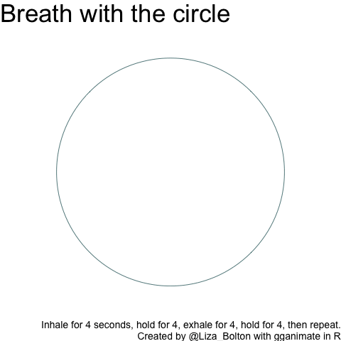

```{r, echo=FALSE}
source("links.R",  local = knitr::knit_global())
```

# Knowledge basket: Other

## 'Getting to know you' survey

+--------------------------------------------------------+----------------------------------------------------+
| **Information**                                        | **Note**                                           |
+:=======================================================+:===================================================+
| Name                                                   | 'Getting to know you' survey                       |
+--------------------------------------------------------+----------------------------------------------------+
| Type (Main, Mini or Basket)                              | Basket                                             |
+--------------------------------------------------------+----------------------------------------------------+
| Value                                                  | 0.1%                                               |
+--------------------------------------------------------+----------------------------------------------------+
| Due                                                    | `r know_survey`                                    |
+--------------------------------------------------------+----------------------------------------------------+
| Submission instructions                                | Submission: [Via Quercus survey](`r know_survey_link`)                |
|                                                        |                                                    |
|                                                        | Untimed survey, marked for completion              |
+--------------------------------------------------------+----------------------------------------------------+
| Late submissions, accommodations, and extension policy | No late submissions, accommodations, or extensions. |
+--------------------------------------------------------+----------------------------------------------------+

### Instructions

Answer the following questions to help me get to know the class. Some of the questions might seem a little random, but I'm hoping to use them for some future class activities.

(Some questions are from factfulnessquiz.com, you are not being marked on correctness, so please answer to the best of your ability without looking anything up.)

## Pre-knowledge check

+--------------------------------------------------------+----------------------------------------------------+
| **Information**                                        | **Note**                                           |
+:=======================================================+:===================================================+
| Name                                                   | Pre-knowledge check                                                                                          |
+--------------------------------------------------------+-----------------------------------------------------------------------------------------------------------------------+
| Type (Main, Mini or Basket)                              | Basket                                                                                                                |
+--------------------------------------------------------+-----------------------------------------------------------------------------------------------------------------------+
| Value                                                  | 0.5% for completion + 0.5% for a score of 80%+ OR active attendance at the prerequisite knowledge workshop 2022-02-02 |
+--------------------------------------------------------+-----------------------------------------------------------------------------------------------------------------------+
| Due                                                    | `r prereq_quiz` <br> (Workshop: `r prereq_workshop`)                                                                                             |
+--------------------------------------------------------+-----------------------------------------------------------------------------------------------------------------------+
| Submission instructions                                | Submission: [Via Quercus survey](`r prereq_quiz_link`)                                                                                           |
|                                                        |                                                                                                                       |
|                                                        | 60 minutes, 1 attempt, no pausing                                                                                                 |
+--------------------------------------------------------+-----------------------------------------------------------------------------------------------------------------------+
| Late submissions, accommodations, and extension policy | No late submissions, accommodations, or extensions.                                                                    |
+--------------------------------------------------------+-----------------------------------------------------------------------------------------------------------------------+

### Instructions

Answer the pre-knowledge check quiz questions to the best of your ability. In Quercus, you will see two assignment entries, one for the quiz and for storing your final score that takes into account completion of the quiz and the 80%+ score or workshop engagement/attendance.

__You are welcome to use any calculator you wish and/or R.__

There are 15 points across 16 questions, so you have about 4 minutes per point. The structure is outlined below. You may find having read the syllabus first helpful for question 1.

+-------------+--------------------------------+-------------------------------+--------+
| Question \# | Type                           | General topic area            | Points |
+=============+================================+===============================+========+
| 1           | Tick all that apply            | Academic integrity            | 1      |
+-------------+--------------------------------+-------------------------------+--------+
| 2           | Single choice (MCQ)            | Paraphrasing                  | 1      |
+-------------+--------------------------------+-------------------------------+--------+
| 3           | Fill in the blanks (3 numeric) | Rounding                      | 1      |
+-------------+--------------------------------+-------------------------------+--------+
| 4           | MCQ                            | Linear regression assumptions | 1      |
+-------------+--------------------------------+-------------------------------+--------+
| 5           | MCQ                            | Linearity                     | 1      |
+-------------+--------------------------------+-------------------------------+--------+
| 6           | Numeric                        | Distributions                 | 1      |
+-------------+--------------------------------+-------------------------------+--------+
| 7           | Numeric                        | Distributions                 | 1      |
+-------------+--------------------------------+-------------------------------+--------+
| 8           | MCQ                            | Distributions                 | 1      |
+-------------+--------------------------------+-------------------------------+--------+
| 9           | MCQ                            | Confidence intervals          | 1      |
+-------------+--------------------------------+-------------------------------+--------+
| 10          | MCQ                            | Algebra                       | 1      |
+-------------+--------------------------------+-------------------------------+--------+
| 11          | MCQ                            | Likelihood                    | 1      |
+-------------+--------------------------------+-------------------------------+--------+
| 12          | Numeric                        | Proportions                   | 0.5    |
+-------------+--------------------------------+-------------------------------+--------+
| 13          | Numeric                        | Proportions                   | 0.5    |
+-------------+--------------------------------+-------------------------------+--------+
| 14          | MCQ                            | Multiple linear regression    | 1      |
+-------------+--------------------------------+-------------------------------+--------+
| 15          | MCQ                            | Multiple linear regression    | 1      |
+-------------+--------------------------------+-------------------------------+--------+
| 16          | MCQ                            | P-values                      | 1      |
+-------------+--------------------------------+-------------------------------+--------+


#### Grade structure

- Completion of the quiz (all questions attempted) will earn you 0.5%.

- If you score 80% or more on the quiz, you earn an additional 0.5%.

- If you _do not_ score 80% or more, you can still earn this additional 0.5% by attending and actively engaging with the workshop on `r prereq_workshop`. 

- The maximum points to earn here is 1% (i.e., you cannot get BOTH the 80%+ and workshop attendance bonuses)

### Workshop attendance

If you didn't earn a full 1% from the pre-knowledge quiz (either didn't score over 80% or didn't complete it), you **can still earn 0.5 points towards your 🧺knowledge basket** by participating in this workshop.

-   For your attendance to count you must attend **at least 75% of a single 50-minute workshop** AND [**complete the post-event survey**](https://q.utoronto.ca/courses/253305/quizzes/242957 "Module 2 pre-knowledge post-workshop survey").

-   Please arrive on time! 

-   You can come to both if you want (they will be the same content though!) but cannot double up on points.

-   A recording of the session will be posted later, for your reference, but watching that will NOT be eligible for points.

-   You can do a **practice version** of the [pre-knowledge check](https://q.utoronto.ca/courses/253305/quizzes/242031 "Pre-knowledge check (practice version)") as many times as you like. There is also commentary on some of the question after you submit.


## Writing workshop

+--------------------------------------------------------+----------------------------------------------------------------------------------------+
| **Information**                                        | **Note**                                                                               |
+:=======================================================+:=======================================================================================+
| Name                                                   | Writing workshop attendance and participation                                          |
+--------------------------------------------------------+----------------------------------------------------------------------------------------+
| Type (Main, Mini or Basket)                            | Basket                                                                                 |
+--------------------------------------------------------+----------------------------------------------------------------------------------------+
| Value                                                  | 0.25% for attendance AND survey                                                        |
+--------------------------------------------------------+----------------------------------------------------------------------------------------+
| Due                                                    | Attendance on February 16 and submission of survey by 3:03 p.m. on Friday, February 18 |
+--------------------------------------------------------+----------------------------------------------------------------------------------------+
| Submission instructions                                | Submission: [Via Quercus surveys](https://q.utoronto.ca/courses/253305/quizzes/245911) |
|                                                        |                                                                                        |
|                                                        | Untimed, unlimited attempts                                                            |
+--------------------------------------------------------+----------------------------------------------------------------------------------------+
| Late submissions, accommodations, and extension policy | No late submissions, accommodations, or extensions.                                    |
+--------------------------------------------------------+----------------------------------------------------------------------------------------+


### Workshop attendance

-   To 'participate fully' you must attend **at least 75% of a single 50-minute workshop** AND **complete the [post-event survey](https://q.utoronto.ca/courses/253305/quizzes/245911)**.

-   Please arrive **on time**! 

-   You can come to both if you want (they will be the *same content* though!) but *cannot* double up on points or 'share' attendance across the two.

-   A **recording** of the session will be posted later, for your reference, but watching that will NOT be eligible for points.

## 5 Ways to Well-being workshop attendance and reflection

---
title: "R Notebook"
output: html_notebook
---

+--------------------------------------------------------+------------------------------------------------------------------------------------------------------------+
| **Information**                                        | **Note**                                                                                                   |
+:=======================================================+:===========================================================================================================+
| Name                                                   | 5 Ways to Well-being workshop attendance and reflection                                                    |
+--------------------------------------------------------+------------------------------------------------------------------------------------------------------------+
| Type (Main, Mini or Basket)                            | Basket                                                                                                     |
+--------------------------------------------------------+------------------------------------------------------------------------------------------------------------+
| Value                                                  | 0.5% for attendance AND reflection                                                                         |
+--------------------------------------------------------+------------------------------------------------------------------------------------------------------------+
| Due                                                    | Attendance on Wednesday March 30 at 10:10 a.m. ET and submission of survey by 3:03 p.m. on Friday, April 1 |
+--------------------------------------------------------+------------------------------------------------------------------------------------------------------------+
| Submission instructions                                | Submission: Via [Quercus surveys](https://q.utoronto.ca/courses/253305/quizzes/252639)                     |
|                                                        |                                                                                                            |
|                                                        | Untimed, unlimited attempts                                                                                |
+--------------------------------------------------------+------------------------------------------------------------------------------------------------------------+
| Late submissions, accommodations, and extension policy | No late submissions, accommodations, or extensions.                                                        |
+--------------------------------------------------------+------------------------------------------------------------------------------------------------------------+


### 5WtW information

5 Ways To Wellbeing: Investing in practices that are protective of our mental health have never been more important.  Drawing on evidence from the study of wellbeing, this participatory webinar will provide an opportunity to explore and practice a cluster of activities that promote resiliency and support us in feeling and functioning better.  
  
To get the most out of this workshop please: 

- Be prepared to use your webcam.  That said, don’t feel you need to make yourself or your space look pretty.  We'll be striving for a learning environment that’s free of judgment (of others and ourselves).  
- Have your cell phone handy. 
- Give yourself permission to be present. Don't feel the need to be multi-tasking. 
- Bring along your snack, tea, coffee, or other refreshments that you enjoy (this is a self-care workshop after all). 

### Workshop attendance

-   To 'participate fully' you must attend **at least 75% of a single 90-minute workshop** AND **complete the post-event reflection**.

-   Please arrive **on time**! There is a Zoom cap of 300, at which point we won't be able to let any more students in.

-   There is no recording.

-   You CAN earn points for attending BOTH this and the other *different* workshop on the same day.

## Academic resilience workshop attendance and reflection

+--------------------------------------------------------+-----------------------------------------------------------------------------------------------------------+
| **Information**                                        | **Note**                                                                                                  |
+:=======================================================+:==========================================================================================================+
| Name                                                   | Academic resilience workshop attendance and reflection                                                    |
+--------------------------------------------------------+-----------------------------------------------------------------------------------------------------------+
| Type (Main, Mini or Basket)                            | Basket                                                                                                    |
+--------------------------------------------------------+-----------------------------------------------------------------------------------------------------------+
| Value                                                  | 0.5% for attendance AND reflection                                                                        |
+--------------------------------------------------------+-----------------------------------------------------------------------------------------------------------+
| Due                                                    | Attendance on Wednesday March 30 at 3:10 p.m. ET and submission of survey by 3:03 p.m. on Friday, April 1 |
+--------------------------------------------------------+-----------------------------------------------------------------------------------------------------------+
| Submission instructions                                | Submission: Via [Quercus surveys](https://q.utoronto.ca/courses/253305/quizzes/252645)                    |
|                                                        |                                                                                                           |
|                                                        | Untimed, unlimited attempts                                                                               |
+--------------------------------------------------------+-----------------------------------------------------------------------------------------------------------+
| Late submissions, accommodations, and extension policy | No late submissions, accommodations, or extensions.                                                       |
+--------------------------------------------------------+-----------------------------------------------------------------------------------------------------------+

### Workshop attendance

-   To 'participate fully' you must attend **at least 75% of a single 90-minute workshop** AND **complete the post-event reflection**.

-   Please arrive **on time**! There is a Zoom cap of 300, at which point we won't be able to let any more students in.

-   There is no recording.

-   You CAN earn points for attending BOTH this and the other *different* workshop on the same day.


## Module check-ins

+--------------------------------------------------------+----------------------------------------------------+
| **Information**                                        | **Note**                                           |
+:=======================================================+:===================================================+
| Name                                                   | Module check-in 1--5                                                                                         |
+--------------------------------------------------------+-----------------------------------------------------------------------------------------------------------------------+
| Type (Main, Mini or Basket)                              | Basket                                                                                                                |
+--------------------------------------------------------+-----------------------------------------------------------------------------------------------------------------------+
| Value                                                  | 0.1% for completion |
+--------------------------------------------------------+-----------------------------------------------------------------------------------------------------------------------+
| Due                                                    | Second Fridays of Modules at 3:03 p.m.                                                                                            |
+--------------------------------------------------------+-----------------------------------------------------------------------------------------------------------------------+
| Submission instructions                                | Submission: [Via Quercus surveys](`r assignments_link`)                                                                                    |
|                                                        |                                                                                                                       |
|                                                        | Untimed, unlimited attempts                                                                                                 |
+--------------------------------------------------------+-----------------------------------------------------------------------------------------------------------------------+
| Late submissions, accommodations, and extension policy | No late submissions, accommodations, or extensions.                                                                    |
+--------------------------------------------------------+-----------------------------------------------------------------------------------------------------------------------+

### Instructions

Module check-ins are a short questionnaire to help me 'take the pulse' of the class. Each survey will like take only 5--10 minutes and will be available about 6:00 p.m. on the second Wednesday of each module, until 3:03 p.m. ET on the second Friday.


## Team Up! activities

+--------------------------------------------------------+---------------------------------------------------------------------------------------------------------------------+
| **Information**                                        | **Note**                                                                                                            |
+:=======================================================+:====================================================================================================================+
| Name                                                   | Team Up! activities (aiming for one per module)                                                                     |
+--------------------------------------------------------+---------------------------------------------------------------------------------------------------------------------+
| Type (Main, Mini or Basket)                            | Basket                                                                                                              |
+--------------------------------------------------------+---------------------------------------------------------------------------------------------------------------------+
| Value                                                  | 0.5% (graded on quality)                                                                                            |
+--------------------------------------------------------+---------------------------------------------------------------------------------------------------------------------+
| Due                                                    | End of tutorial time (first Thursdays)                                                                              |
+--------------------------------------------------------+---------------------------------------------------------------------------------------------------------------------+
| Submission instructions                                | Submission: Via Team Up! (links through Quercus)                                                                    |
|                                                        |                                                                                                                     |
|                                                        | Usually \~50 minutes, one attempt (as a group), but with options to retry incorrect questions (for partial points). |
+--------------------------------------------------------+---------------------------------------------------------------------------------------------------------------------+
| Late submissions, accommodations, and extension policy | No late submissions, accommodations, or extensions.                                                                 |
+--------------------------------------------------------+---------------------------------------------------------------------------------------------------------------------+

See the [course overview page on Quercus](https://q.utoronto.ca/courses/253305/pages/course-overview) for the links to the versions with answers.


## Graduate school info session

| **Information**                                        | **Note**                                            |
|:-------------------------------------------------------|:----------------------------------------------------|
| Name                                                   | Module 1 graduate school info session and panel     |
| Type (Main, Mini or Basket)                            | Basket                                              |
| Value                                                  | 0.1%                                                |
| Due                                                    | `r m1_friday`                                       |
| Submission instructions                                | Submission: [Via Quercus](`r m1_gradschool`)        |
| Late submissions, accommodations, and extension policy | No late submissions, accommodations, or extensions. |


There will be two versions of this session, each in class time on January 19, 2022, 10:10 to 11:00 a.m. and 3:10 to 4:00 p.m.

These sessions will have a short presentation from the administrators/program managers of some potentially relevant U of T graduate programs as well as a panel discussion with some of the course TAs. They will talk about their experiences, things they wish they'd know, and reference letters.

**10:00 a.m. class:** [Master of Financial Insurance (MFI)](https://mfi.utoronto.ca/) and [Master of Science in Applied Commuting (MScAC)](https://mscac.utoronto.ca/) administrators + TA panel

**3:00 p.m. class:** [Master of Science in Statistics and PhD in Statistics](https://www.statistics.utoronto.ca/future-students/our-graduate-programs) administrator (note: Alison will also share some general advice for if you're looking at program elsewhere as well) + TA panel


To earn the 0.1 points up for attending a grad school information session and panel you must attend for at least 75% of one of the sessions (i.e., you cannot just log in and then log out again) AND complete the short questionnaire. There are three questions, you must answer Q1 and 2, but Q3 is optional.

__Notes__: 

- You _cannot_ earn double points for attending both sessions.  
- Attendance is not required, there are plenty of other ways to earn 🧺knowledge basket points.  
- You can attend either session (or both, if you really wanted). There are no section restrictions for STA303.
- The session is _not_ being recorded.
- PollEverywhere has nothing to do with your attendance/knowledge basket points. You don't have to engage with it if you do not want to.


## Punctuation art

| **Information**                                        | **Note**                                            |
|:-------------------------------------------------------|:----------------------------------------------------|
| Name                                                   | Punctuation art                                     |
| Type (Main, Mini or Basket)                            | Basket                                              |
| Value                                                  | 1%                                                  |
| Due                                                    | `r oneperc`                                         |
| Submission instructions                                | Submission: [Via Quercus ](`r punctart_link`)                            |
| Late submissions, accommodations, and extension policy | No late submissions, accommodations, or extensions. |


### Instructions

This is a self-contained mini-code and communication activity. It can be submitted anytime before the due date.

Note: If you like this idea and want to build it out further into your professional development task, or an aspect of it, you _can_, but this task/prompt can only be used once. I.e., if you do a punctuation art based component for your professional development, you cannot also submit this assessment.

#### Prompt

Use R to create a representation of the entire text of a book, using only the punctuation.

#### Examples

  - https://www.theguardian.com/books/gallery/2016/feb/23/say-what-books-with-the-words-removed-punctuation-maps-in-pictures
  - https://www.mentalfloss.com/article/75602/what-famous-novels-look-stripped-everything-punctuation
  
  
```{r, echo=FALSE, out.width="100%", fig.align='center'}
knitr::include_graphics("images/assessments/hound_of_the_baskervilles.png")
```

#### Skills

- regular expressions  
- ggplot (could use base if you prefer)

#### Tips

- Works in the public domain are probably going to be the easiest to access. [Project Gutenburg](https://www.gutenberg.org/) has .txt versions of many classics.

```{r, eval=FALSE}
# Read in the text of hounds of the Baskervilles and remove the front matter and end matter
text <- readLines("https://www.gutenberg.org/cache/epub/3070/pg3070.txt")[0:7298+61]
```

#### Submission instructions

Submit the following:

- Commented code that produces your punctuation art (Rmd file)
- Your final art output (PNG recommended)
- A PDF one-page description that: 
    - introduces what your output shows,
    - how you got the text data (make sure you credit the source),
    - notable steps in preparing the data to create your art, and
    - a brief summary of the skills you learned or demonstrated in this task.
- If you would be willing to have your art shared with future students, please include at the end of your write-up "I give my permission for my punctuation art to be shared [anonymously | and credited to me, <name>]". Update the statement appropriately, e.g., _I give my permission for my punctuation art to be shared and credited to me, Liza Bolton._. If you have posted it on social media or a personal website, you're welcome to also provide that link.

#### Rubric

+---------------------+---------------------------------------------------------+----------------------------------------------------------------------------+---------------------------------------------+
|                     | **Missing or insufficient** 0%                          | P**artial** 0.5%                                                           | **Complete** 1%                             |
+=====================+=========================================================+============================================================================+=============================================+
| **Task completion** | No submission OR instructions insufficiently satisfied. | Some appropriate work shown, but may be somewhat incomplete or irrelevant. | Prompt/instructions sufficiently satisfied. |
+---------------------+---------------------------------------------------------+----------------------------------------------------------------------------+---------------------------------------------+

## Breathing exercise

| **Information**                                        | **Note**                                            |
|:-------------------------------------------------------|:----------------------------------------------------|
| Name                                                   | Breathing exercise                                  |
| Type (Main, Mini or Basket)                            | Basket                                              |
| Value                                                  | 1%                                                  |
| Due                                                    | `r oneperc`                                         |
| Submission instructions                                | Submission: Via Quercus                             |
| Late submissions, accommodations, and extension policy | No late submissions, accommodations, or extensions. |

### Instructions

This is a self-contained mini-code and communication activity. It can be submitted anytime before the due date.

Note: If you like this idea and want to build it out further into your professional development task, or an aspect of it, you *can*, but this task/prompt can only be used once. I.e., if you do a `gganimate` breathing based component for your professional development, you cannot also submit this assessment.

#### Prompt

Use R to create a box breathing exercise GIF. Box breathing involves inhaling for 4 seconds, holding that breath for 4 seconds, exhaling for 4 seconds, holding for 4 seconds and then repeating as many times as desired.

##### Background

Breath like a Navy SEAL? [Checkout this interesting article about stress and breathing.](https://www.forbes.com/sites/nomanazish/2019/05/30/how-to-de-stress-in-5-minutes-or-less-according-to-a-navy-seal/?sh=7b2aad83046d)

##### A note

If focusing on breathing ends up making you feel anxious, or just isn't the appropriate choice for you and your body right now, remember that you can create this without necessarily having to use it AND that there are lots of other ways to earn your knowledge basket points.

#### Examples

Not created in R:

```{r, echo=FALSE, fig.align='center', out.width="50%", fig.cap="Source: https://smho-smso.ca/emhc/stress-management-and-coping/deep-breathing/deep-belly-breathing/"}

if (knitr:::is_latex_output()) {
  knitr::asis_output("There is a GIF in the web version. It is viewable at: https://smho-smso.ca/wp-content/uploads/2020/06/Four-square-breathing-EN.gif")
} else {
 knitr::include_graphics("https://smho-smso.ca/wp-content/uploads/2020/06/Four-square-breathing-EN.gif")
}
```

```{r, echo=FALSE, fig.align='center', out.width="50%", fig.cap="Source: https://quietkit.com/box-breathing/"}

if (knitr:::is_latex_output()) {
  knitr::asis_output("There is a GIF in the web version. It is viewable at: https://quietkit.com/img/box-breathing-4x-v03.gif")
} else {
 knitr::include_graphics("https://quietkit.com/img/box-breathing-4x-v03.gif")
}
```

A few I whipped up on a Saturday evening:

```{r, echo=FALSE, fig.align='center', out.width="50%", fig.cap="Expanding circle box breathing exercise, created by Prof. B with gganimate"}

if (knitr:::is_latex_output()) {
  knitr::asis_output("There is a GIF in the web version.")
} else {
 
}

```

```{r, echo=FALSE, fig.align='center', out.width="50%", fig.cap="Flying dots box brathing exercise, created by Prof. B with gganimate"}

if (knitr:::is_latex_output()) {
  knitr::asis_output("There is a GIF in the web version.")
} else {
 
}

```

#### Skills

-   data simulation
-   dynamic data visualization with `ggplot2` and `gganimate`

#### Tips/links

-   [gganimate website and tutorials](https://gganimate.com/articles/gganimate.html)

    -   [Cheat sheet](https://ugoproto.github.io/ugo_r_doc/pdf/gganimate.pdf)

    -   `transision_states` was the `gganimate` function I found particularly helpful.

-   `theme_void()` removes all the background and axes labels, which is really helpful for creating an image like these.

-   You can use `anim_save` to save the outputs as a GIF file.

-   If you want to play with colour palettes, I like playing with <https://coolors.co/>

    -   I used `scale_color_gradient()` for the circle (sets two colours, 'high' and 'low') and `scale_colour_gradientn()` in the GIF with the flying dots (4 colours transitioned between). [Here is the documentation for these functions.](https://ggplot2.tidyverse.org/reference/scale_gradient.html)

#### Submission instructions

Submit the following:

-   **Commented** code that produces your breathing exercise (Rmd file)

-   Your final activity output, as a GIF

-   A PDF one-page description that:

    -   introduces what your breathing exercise is and provides some background, and
    -   provide a brief summary of the skills you learned or demonstrated in this task.

-   If you would be willing to have your exercise shared with current/future students, please include at the end of your write-up "I give my permission for my breathing exercise to be shared [anonymously \| and credited to me, <name>]". Update the statement appropriately, e.g., *I give my permission for my* breathing exercise *to be shared and credited to me, Liza Bolton.*. If you have posted it on social media or a personal website, you're welcome to also provide that link.

#### Rubric

|                     | **Missing or insufficient** 0%                          | P**artial** 0.5%                                                           | **Complete** 1%                             |
|---------------------|---------------------------------------------------------|----------------------------------------------------------------------------|---------------------------------------------|
| **Task completion** | No submission OR instructions insufficiently satisfied. | Some appropriate work shown, but may be somewhat incomplete or irrelevant. | Prompt/instructions sufficiently satisfied. |

## Linear Mixed Models study guide

| **Information**                                        | **Note**                                                                                                    |
|:-------------------------------------------------------|:------------------------------------------------------------------------------------------------------------|
| Name                                                   | Linear Mixed Models study guide                                                                             |
| Type (Main, Mini or Basket)                            | Basket                                                                                                      |
| Value                                                  | 1%                                                                                                          |
| Due                                                    | `r lmm_sg`                                                                                                  |
| Submission instructions                                | Submission: [Via Quercus discussion boards](https://q.utoronto.ca/courses/253305/discussion_topics/1637653) |
| Late submissions, accommodations, and extension policy | No late submissions, accommodations, or extensions.                                                         |

### Instructions

Create a 1 page **study guide** for the topic of **Linear Mixed Models** (Module 3), as relevant to this course, and post it to the class discussion board for this topic.

#### Considerations

-   What are the main topics, key vocabulary, useful equations?

-   That page can be whatever size you choose, but I'd suggest aiming for a printable letter or legal size page.

-   The guide should be submitted in PDF format. PLEASE. I'm always disappointed by the number of folks that miss this instruction.

-   Text should *NOT* be hand-written, in order to ensure it is readable for your classmates.

-   While not a requirement, consider how you can make your guide most accessible. Image descriptions? Easy to read fonts? Colour-blindness friendly?

#### Rubric

|                     | **Missing or insufficient** 0%                          | P**artial** 0.5%                                                                      | **Complete** 1%                             |
|---------------------|---------------------------------------------------------|---------------------------------------------------------------------------------------|---------------------------------------------|
| **Task completion** | No submission OR instructions insufficiently satisfied. | Some appropriate work shown, but may be somewhat incorrect, incomplete or irrelevant. | Prompt/instructions sufficiently satisfied. |

## Generalized Linear Models study guide

| **Information**                                        | **Note**                                                                                                    |
|:-------------------------------------------------------|:------------------------------------------------------------------------------------------------------------|
| Name                                                   | Generalized Linear Models study guide                                                                       |
| Type (Main, Mini or Basket)                            | Basket                                                                                                      |
| Value                                                  | 1%                                                                                                          |
| Due                                                    | `r glm_sg`                                                                                                  |
| Submission instructions                                | Submission: [Via Quercus discussion boards](https://q.utoronto.ca/courses/253305/discussion_topics/1637656) |
| Late submissions, accommodations, and extension policy | No late submissions, accommodations, or extensions.                                                         |

### Instructions

Create a 1 page **study guide** for the topic of **Generalized Linear Models (Module 4)**, as relevant to this course, and post it to the class discussion board for this topic.

#### Considerations

-   What are the main topics, key vocabulary, useful equations?

-   That page can be whatever size you choose, but I'd suggest aiming for a printable letter or legal size page.

-   The guide should be submitted in PDF format. PLEASE. I'm always disappointed by the number of folks that miss this instruction.

-   Text should *NOT* be hand-written, in order to ensure it is readable for your classmates.

-   While not a requirement, consider how you can make your guide most accessible. Image descriptions? Easy to read fonts? Colour-blindness friendly?

#### Rubric

|                     | **Missing or insufficient** 0%                          | P**artial** 0.5%                                                                      | **Complete** 1%                             |
|---------------------|---------------------------------------------------------|---------------------------------------------------------------------------------------|---------------------------------------------|
| **Task completion** | No submission OR instructions insufficiently satisfied. | Some appropriate work shown, but may be somewhat incorrect, incomplete or irrelevant. | Prompt/instructions sufficiently satisfied. |

## Hack your class workshop attendance and reflection

| **Information**                                        | **Note**                                            |
|:-------------------------------------------------------|:----------------------------------------------------|
| Name                                                   | Hack your class workshop attendance and reflection  |
| Type (Main, Mini or Basket)                            | Basket                                              |
| Value                                                  | 0.25%                                               |
| Due                                                    | Friday March 4, 2022 at 3:03 p.m. ET                |
| Submission instructions                                | Submission: [Via Quercus](https://q.utoronto.ca/courses/253305/quizzes/246839)  |
| Late submissions, accommodations, and extension policy | No late submissions, accommodations, or extensions. |

### Instructions

> *Reboot and refresh after Reading Week! Register for this workshop to learn how to Hack Your Class to get the absolute most out of your experience.*

To earn these points, you must:

-   [Register for](https://forms.office.com/pages/responsepage.aspx?id=JsKqeAMvTUuQN7RtVsVSEO8qoh9ZPflFrDrfXlNN6AdUMVZKSE9BNUpTQThWMVdaUEtCSEFSMUdPMS4u) and attend at least 75% of the 'Hack your class' workshop, hosted by the Department of Statistical Sciences on **Thursday March 3rd, 10 to 11am ET**, AND

-   Submit a short reflection about what you learned from the session on Quercus by 3:03 p.m. ET on Friday, March 4.


[__Register here__](https://forms.office.com/pages/responsepage.aspx?id=JsKqeAMvTUuQN7RtVsVSEO8qoh9ZPflFrDrfXlNN6AdUMVZKSE9BNUpTQThWMVdaUEtCSEFSMUdPMS4u) 

## Sports analytics workshop attendance and reflection

| **Information**                                        | **Note**                                            |
|:-------------------------------------------------------|:----------------------------------------------------|
| Name                                                   | Sports analytics workshop attendance and reflection |
| Type (Main, Mini or Basket)                            | Basket                                              |
| Value                                                  | 0.25%                                               |
| Due                                                    | Friday March 4, 2022 at 3:03 p.m. ET                |
| Submission instructions                                | Submission: [Via Quercus](https://q.utoronto.ca/courses/253305/quizzes/246815)  |
| Late submissions, accommodations, and extension policy | No late submissions, accommodations, or extensions. |

### Instructions

To earn these points, you must:

-   [Register for](https://forms.office.com/pages/responsepage.aspx?id=JsKqeAMvTUuQN7RtVsVSEKx69ygcj5RNkthLmVGb1A5UNkJUQlRYNFhUTTVPRThRMVJINTVSRE1ZVi4u) and attend at least 75% of the 'Sports analytics' workshop, hosted by the Department of Statistical Sciences (and led by two former STA303 students!) on **Thursday, March 3, from noon to 1:30 p.m. ET**, AND

-   Submit a short reflection about what you learned from the session on Quercus by 3:03 p.m. ET on Friday, March 4.

[__Register here__](https://forms.office.com/pages/responsepage.aspx?id=JsKqeAMvTUuQN7RtVsVSEKx69ygcj5RNkthLmVGb1A5UNkJUQlRYNFhUTTVPRThRMVJINTVSRE1ZVi4u)
