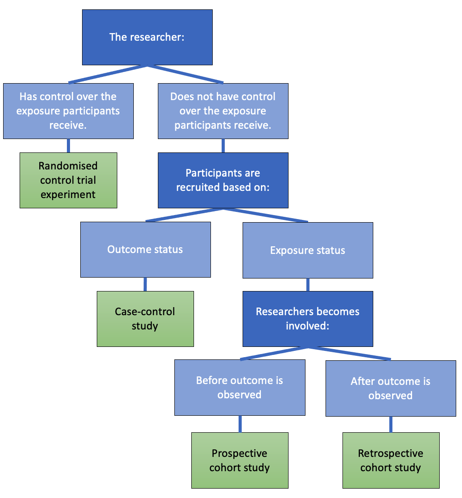
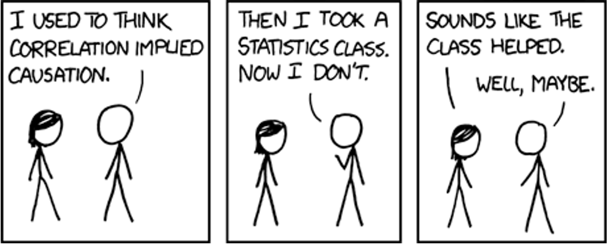
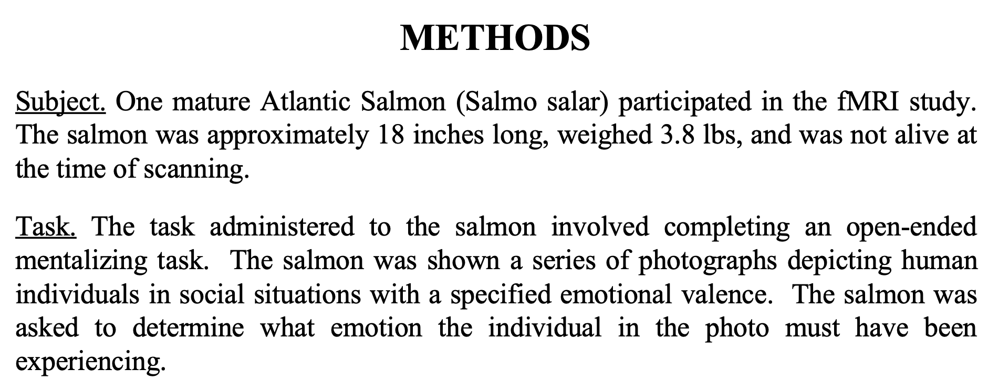
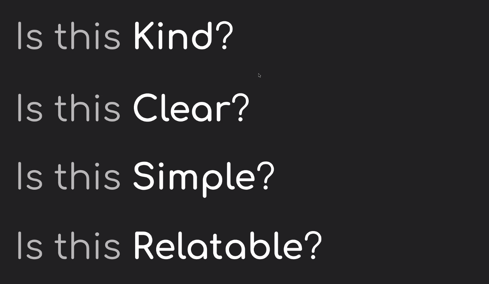
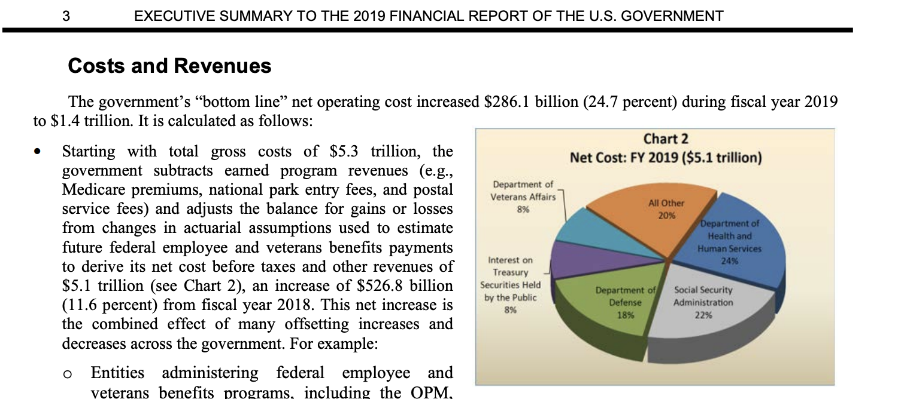
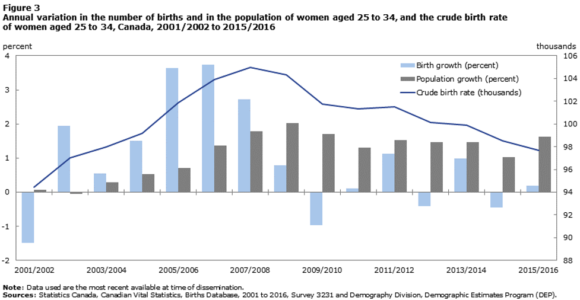

# Module 2 {#m2}

::: {.yellowbox data-latex=""}
Materials for January 24--February 4, 2022.
:::

## Learning Checklist

By the end of this module, you should be able to:

- Read csv, xlsx and RDS files in to R.

- Filter, merge, group and summarize data with dplyr functions.

- Create new variables.

- Use pipes %>% to link sequential operations on a dataset.

- Join datasets.

- Evaluate whether a dataset is tidy and alter it if note

- Create appropriate visualizations in ggplot using a range of geometries and aesthetics (scatter plot with geom_smooth, bar chart, histogram).

- Explain common misconceptions about data analysis and statistics in your own words (paraphrasing).

-   Recognize when confounding may be an issue.

-   Distinguish between an observational study and an experiment.

-   Describe a study design which prevents confounding.

-   Identify aspects of Informed Consent and recognize gaps in information, comprehension and voluntariness in a given situation.

-   Understand the basic principles for web scraping and using APIs.

-   Describe and identify selection bias and survivorship bias.

-   Demonstrate a general awareness of P-hacking and the reproducibility crisis.

-   Describe the idea of 'hypothesizing after knowing result'

-   Show why we must consider corrections when performing multiple testing. 

-   Consider ethical issues in modern data science, including algorithmic transparency, algorithmic bias and what it means when algorithms make the final decision.

-   Identify the main components of most statistical reports.

-   Implement a previewing and skimming strategy when reading an article.

### Key functions

-   Visualization 

    -   `ggplot()`
    -   `geom_point`
    -   `facet_wrap()`
    -   `geom_smooth()`
    -   `geom_bar()`

-   Transformation

    -   `filter()`
    -   `select()`
    -   `mutate()`
    -   `summarise()`
    -   `group_by()`
    -   `is.na()`
    -   `arrange()`

-   Loading data into R

    -   `readr::read_csv()` for .csv
    -   `readxl::read_excel()` for .xlsx
    -   `readRDS()`for .RDS

-   Viewing data

    -   `glimpse()`
    -   `head()`
    -   `str()`
    -   `View()`

-   Cleaning up variable names

    -   `janitor::clean_names()`

-   Introduced in data wrangling video

    -   `mutate_if()`
    -   `replace_na()`
    -   `is.numeric()`
    -   `full_join()`
    -   `left_join()`
    -   `right_join()`
    -   `distinct()`  
    -   `pivot_longer()`

-   Working with strings

    -   `str_replace()`  
    -   `str_replace_all()`  
    -   `str_remove()`  
    -   `str_c()`  
    -   `str_detect()`  
    -   `str_to_sentence()`

## Introduction to Module 2

This module introduces or recaps a range of necessary data wrangling and visualization skills as well as concepts about ethical professional practice for statisticians, and statistical communication information.

With respect to the ethical professional practice components, think of this as just a very high-level survey of these ideas; we aren't going very deep on any of them, but some will set up conversations/tasks later in the course.

+ We'll revisit some of these concepts in later classes, like __case-control studies__ and logistic regression, __black box algorithms__ (very briefly) when we discuss GAMs and issues of confounding, proxies and ethical sourcing of data, throughout.
+ We'll touch on __web scraping__ in the Team Up! activity for this module.

Folks who have taken or TAed STA130 might be more familiar with some of these concepts than others, but I'm not assuming much prior knowledge.

## Readings for this module

There are several required readings in this module. Keep in mind the [previewing and skimming strategies](#previewskim) discussed in Module 1. 

### R for Data Science (+ story time)

**Wickham & Grolemund. *R for Data Science*. 2017 [Chapter 3: Data Visualization](https://r4ds.had.co.nz/data-visualisation.html) and [Chapter 5: Data transformation](https://r4ds.had.co.nz/transform.html)**


Hadley Wickham is a bit of rockstar `r emo::ji("man_singer")` in the R world [^module2-1]. If you took part in the Independent Summer Statistics Community (ISSC), you're probably already well aware of my love for his and Garrett's excellent book, *R for Data Science*. When I brought on a new consultant for my business in New Zealand, he was transitioning from organic chemistry and wanted to become a better data analyst. He worked through this book and in just a few months was leading the analysis for client engagements. It is also the first resource to which I point students who are interested in extra materials for data science.

[^module2-1]: My friend literally got him to sign their laptop...

In the case study section of this module, I’ll walk you through a case study using a range of the functions introduced in these chapters and some personal favourites. After these readings and the case study, you should be ready to start your portfolio assessments.

### Common misconceptions about data analysis and statistics

**Motulsky, H.J., 2014. *Common misconceptions about data analysis and statistics*. <https://doi.org/10.1007/s00210-014-1037-6>**

For the [portfolio assessment](#portfolio), you will be asked to write some advice to future you, based on the article *Common misconceptions about data analysis and statistics* by Harvey J. Motulsky.

Focus on what surprised you, what you didn't know before, what you don't want to forget. You can disagree with the article's claims, too.

**Direct link: <https://www.ncbi.nlm.nih.gov/pmc/articles/PMC4203998/pdf/210_2014_Article_1037.pdf>**

### To predict and serve?

**Lum, K & Isaac, W. _To predict and serve?_ (2016). https://rss.onlinelibrary.wiley.com/doi/full/10.1111/j.1740-9713.2016.00960.x#sign960-bib-0001**

This article is an excellent and accessible introduction to ideas around predictive policing and the current issues. Consider it with the other comments under the [Analyzing data](#analyzingethics) section.

(Lum's other work, previously as the Lead Statistician at the Human Rights Data Analysis Group and now at Twitter is awesome!)

```{r, echo=FALSE, fig.align='center', out.width="50%"}

if (knitr:::is_latex_output()) {
  knitr::asis_output("There is a GIF in the web version. Not required content.")
} else {
 knitr::include_graphics("images/m2/precog.gif")
}
```

(If you've seen Minority Report, maybe you were already skeptical about predicting crimes before they happen...but probably for different reasons.)

### Science isn't broken

**Aschwanden, C. (2015). *Science Isn't Broken: It's just a hell of a lot harder than we give it credit for*. Retrieved from [https://fivethirtyeight.com/features/science-isnt-broken](https://fivethirtyeight.com/features/science-isnt-broken)**

This reading will also be used in the [Module 2 writing task](#module-2-writing-task). Please read the instructions there before approaching this reading, as it talks you through a practical example of (previewing and skimming)[#previewskim].

## Data wrangling and visualization

### Tidy data

#### A bit of advice...and why we need **tidy** data

> If I had one thing to tell biologists learning bioinformatics, it would be "write code for humans, write data for computers""".Vince Buffalo ([@vsbuffalo](<https://twitter.com/vsbuffalo/status/358699162679787521?ref_src=twsrc%5Etfw>)), July 20, 2013

This advice applies to everyone learning how to work with data.

The `dplyr` functions we are learning help us **"write code for humans"**, but how do we **"write data for computers"**?

> "It is often said that 80% of data analysis is spent on the process of cleaning and preparing the data" Hadley Wickham, creator of the tidyverse and developer of dplyr

```{r, echo=FALSE, fig.align='center', out.width="70%"}
knitr::include_graphics("images/m2/unruly.png")
```

Artwork by [\@allison_horst](<https://twitter.com/allison_horst>)

#### Rules of tidy data

There are three interrelated rules which make a dataset tidy:

1.  Each **variable** must have its own **column**.
2.  Each **observation** must have its own **row**.
3.  Each **value** must have its own **cell**.

```{r, echo=FALSE, fig.align='center', out.width="70%"}
knitr::include_graphics("images/m2/image_tidyData.png")
```

Image from: <https://r4ds.had.co.nz/tidy-data.html>

#### Recognizing Tidy Data

> "For a given dataset, it is usually easy to figure out what are observations and what are variables, but it is surprisingly difficult to precisely define variables and observations in general." (Wickham, 2014)

A general rule of thumb:

-   It is easier to describe functional relationships between variables (e.g., z is a linear combination of x and y, density is the ratio of weight to volume) than between rows.

-   It is easier to make comparisons between groups of observations (e.g., average of group A vs. average of group B) than between groups of columns.

(Wickham, 2014)

#### Further reading on tidy data (optional)

While I know many of you will have covered tidy data in STA130, I know others will not be familiar with it. You will need to be able to think about whether or not your data is tidy for several assessments in this course.

**Wickham & Grolemund. *R for Data Science*. 2017 [Chapter 12: Tidy data](https://r4ds.had.co.nz/tidy-data.html)**

### Student grades case study

There are (at least) two ways you could approach this case study:

a)  Try it yourself first with the file that has "\_guided" in the name and then watch the video.\
b)  Follow along with the video. I'll be using the file with "\_minimal" in the name.

I've tried to design it so either way will work, but I think following along with the video *might* be the best use of your time, if it works for your learning style.

[**Case study on the Jupyter Hub**](https://jupyter.utoronto.ca/hub/user-redirect/git-pull?repo=https%3A%2F%2Fgithub.com%2Fsta303-bolton%2Fsta303-w22-activities&urlpath=rstudio%2F&branch=master)

If you would rather work locally, there is information on how to download files from the JupyterHub in the [Resources section of the course guide](#using-rstudio-with-the-jupyterhub).

Note: You'll have to navigate to the Home directory in the Files pane to find this activity in `STA303-w22-activities/m2-casestudy`. See the [instructions](#using-rstudio-with-the-jupyterhub) using RStudio with the JupyterHub.

#### Videos

```{r, echo=FALSE, fig.align='center', out.width="60%"}

if (knitr:::is_latex_output()) {
  knitr::include_graphics("images/stop-video.png")
} 
```

Please note, I filmed these videos last year, so please ignore any assessment/admin comments. The actual R work is all still totally relevant.

```{r, echo=FALSE, fig.align='center', out.width="60%"}

knitr::include_graphics("images/stop-video.png")

```

- [Video 1: Set up](https://play.library.utoronto.ca/6f87f2df36d49522514fb4d638967b52)

- [Video 2: Data wrangling](https://play.library.utoronto.ca/watch/973c94fbbac4ceed5c10047a6e38d009)

- [Video 3: Data viz](https://play.library.utoronto.ca/56e0b46e07f3af60f346518ef7f1e478)


## Ethical professional practice for statisticians

The following sections consider the whys and whats of ethical practice organized under the categories of:

- [getting data](#getting-data): confounding and study designs, human research ethics, web scraping and APIs, Indigenous data sovereignty);  
- [analyzing data](#analyzingethics): HARKing & multiple testing;  
- [making decisions with data](#making-decisions-with-data): algorithmic bias and transparency.

There is a lot of ground covered, though lightly, and it may feel intimidating or overwhelming—there is so much to consider, so much we could get wrong! So, here is some advice from our TA Sonia Markes, who was part of crating this module: _developing the judgment and skills related to these topics takes time and no analysis is ever perfect—we rely on collaboration with other scientists and statisticians who all try to think critically to avoid harm and to improve our collective knowledge and understanding._

### Why should statisticians be ethical?

I hope this questions seems a bit silly to most of you, shouldn't we all strive to be ethical in our professional and personal lives? Well regardless of your personal philosophy, there are additional considerations with respect to our professional ethics.

- __Professional societies:__ You may have heard of the [Hippocratic oath](https://en.wikipedia.org/wiki/Hippocratic_Oath) ("first do no harm") in Medicine and there are similar codes of conduct for Statisticians ([see the links to the Canadian and US version below](#ethicscodes)) through our own professional societies.

- __Research ethics boards:__ If you are conducting research within universities, it will often have to be approved by a research ethics board. You need to have the skills and knowledge to help appropriately design studies that can be approved under these rules.

- __Legal and business considerations:__ Unethical behaviour can also get you are your future employers into trouble. There are of course reputational risks, but there can also be legal risks for creating algorithms that discriminate against protected attributes like gender or ethnicity.

Statistical tools are used to create knowledge. Therefore, anyone using statistical tools is responsible for the knowledge they create through their data collection and analyses.

As ethical statisticians it is important to:
+ be accurate in our analyses and conclusions
+ be alert to possible consequences of our results/recommendations on others
+ be honest in reporting results, even when we don't get the results we hoped for
+ be respectful of other reasonable results (based on well-conducted research) even if they differ from our own
+ be mindful of what your data represents, especially if it represents people or their behaviour (a study on people has _subjects_, not objects)
+ share credit when our work is based on the ideas of others
+ and more...

You will be asked to write your own code of ethics in your final project. 

#### Relevant codes of conduct for statistical societies/associations in North America {#ethicscodes}

__Statistical Society of Canada:__ https://ssc.ca/sites/default/files/data/Members/public/Accreditation/ethics_e.pdf  
__American Statistical Association:__  https://www.amstat.org/ASA/Your-Career/Ethical-Guidelines-for-Statistical-Practice.aspx

### Getting data

#### Confounding and study design

```{r, echo=FALSE, fig.align='center', out.width="70%"}
knitr::include_graphics("images/m2/confounding.png")
```


##### Confounders (i.e. confounding factors or confounding variables)

```{r, echo=FALSE, fig.align='center', out.width="100%"}
knitr::include_graphics("images/m2/confounding_image.png")
```

In an **observational study**, variables are "observed" (measured and recorded) without manipulation of variables or conditions by the researcher.

Two variables are **confounded** if their effects on the response variable are mixed together and there is no way to separate them out. If this is the case, we have no way of determining which variable is causing changes to the response.

__Example:__ As ice creams sales rise, so do drownings. But are people drowning because of ice cream? What would be a plausible confounder for this relationship? (Hint: ☀️🌡️️) 

There is no 'test' for confounding. But this is a great thing if you don't want the robots to take your job anytime soon. We need smart people who can think well about confounding.

**When we have data from an observational study, we can often only conclude association between variables, not causation.** It is worth noting that methods of causal inference are significant area of research for statisticians and others.


```{r, echo=FALSE, fig.align='center', out.width="70%"}
knitr::include_graphics("images/m2/picard.png")
```


So, do we give up on claiming causation?

</br>

No!


```{r, echo=FALSE, fig.align='center', out.width="65%"}
knitr::include_graphics("images/m2/oprah.png")
```


##### Designing studies to avoid confounding

In an **experiment** (or __randomized trial__ or __randomized control trial__) variables and/or conditions are manipulated by the researcher and the impact on other variable(s) is measured and recorded.

The key is to randomly assign some individuals to one treatment (or condition) and randomly assign others to another treatment (sometimes this other treatment is a __control__) _Note: you can have more than two treatments groups too—what is important is that individuals are randomly assigned to them!_

The groups (before treatments are applied) should be very similar to each other with respect to the other variables. Any differences between individuals in the treatment and control groups would just be due to random chance!

If there is a __significant difference__ in the __outcome__ between the two groups, we may have evidence that there is a __causal relationship__ between the treatment and the outcome.


##### Common study designs and how to recognize them

```{r, echo=FALSE, fig.align='center', out.width="45%"}

```


##### Causation from observational studies?

Although well-designed randomized trials are the gold standard way to establish a causal
relationship, observational studies can also help build __evidence__ for causation.

###### Bradford Hill criteria (not assessed)

+ Strength of association
+ Consistency
+ Specificity
+ Temporality
+ Biological gradient
+ Plausibility
+ Coherence
+ Experiment
+ Analogy

> Science is not a magic wand that turns everything it touches to truth. Instead, “science operates as a procedure of uncertainty reduction,” said Nosek, of the Center for Open Science. “The goal is to get less wrong over time.” This concept is fundamental — whatever we know now is only our best approximation of the truth. We can never presume to have everything right.

From the [_Science isn't broken_ reading](https://fivethirtyeight.com/features/science-isnt-broken) for this module (Aschwanden, 2015).


```{r, echo=FALSE, fig.align='center', out.width="90%"}

```

Source: https://xkcd.com/552/

#### Human research ethics

Ethical codes often emerge out of crisis events.

The Nuremberg code was formulated in August 1947 in Nuremberg, Germany, by American judges ^[Did this judgment mean Americans were always getting research ethics right? Definitely not. (Optional) [YouTube video about the Tuskegee Study](https://www.youtube.com/watch?v=afwK2CVpc9E)
] sitting in judgment of Nazi doctors accused of conducting murderous and torturous human experiments in concentration camps during the war.

The Nuremberg code codified many of our standard principles of ethical research, including:
+ research must appropriately balance risk and potential benefits
+ researchers must be well-versed in their discipline and ground human experiments in animal trials.

##### Principles of free and informed consent

###### Information

The research procedure, risks and anticipated benefits, alternative procedures (where therapy is involved), and a statement offering the participant the opportunity to ask questions and to withdraw at any time from the research.

###### Comprehension

The manner and context in which information is conveyed is as important as the information itself. For example, presenting information in a disorganized or rapid manner (with too little time to think about it or ask questions), may limit a participant's ability to make an informed choice.

###### Voluntariness

An agreement to participate in research constitutes a valid consent only if it is voluntary; this requires conditions free of coercion and inappropriate influence.


#### Web scraping and APIs

Web scraping (also known as web harvesting, web crawling or web data extraction) is any method of copying data from a webpage, usually to then store it in a spreadsheet or database.

Downloading a ready-made .csv file hosted by a site wouldn't be considered web scraping. (Although you might find a programmatic way to download many of these could be.)

##### What do you need to web scrape?

+ Some knowledge of URLs, HTML and CSS
  + URL - Universal Resource Locator
  + HTML - HyperText Markup Language
  + CSS - Cascading Style Sheets
+ The `rvest` and `polite` packages in R (or `Rcrawler`, there may be others too) or `Beautiful Soup` for Python
+ Professional ethics!


```{r, echo=FALSE, fig.align='center', out.width="90%"}
knitr::include_graphics("images/m2/you-can.png")
```


##### The Ethical Scraper

I, the web scraper will live by the following principles:

+ If you have a public API that provides the data I'm looking for, I'll use it and avoid scraping all together.
+ I will always provide a User Agent string that makes my intentions clear and provides a way for you to contact me with questions or concerns.
+ I will request data at a reasonable rate. I will strive to never be confused for a DDoS attack.
+ I will only save the data I absolutely need from your page. If all I need is OpenGraph meta-data, that's all I'll keep.
+ I will respect any content I do keep. I'll never pass it off as my own.
+ I will look for ways to return value to you. Maybe I can drive some (real) traffic to your site or credit you in an article or post.
+ I will respond in a timely fashion to your outreach and work with you towards a resolution.
+ I will scrape for the purpose of creating new value from the data, not to duplicate it.

Source: James Densmore, https://towardsdatascience.com/ethics-in-web-scraping-b96b18136f01

##### Terms and Conditions and Robots.txt

Many sites give instructions about what you're allowed and not allowed to do on them.
One way is through the Terms and Conditions and another is through a file called robots.txt.

__T&Cs__

Ideally, we should all be reading all the Terms and Conditions of all the websites we use…and of course I'm sure you dooooo.

But when in a hurry, search (CTRL+F or CMD+F)  “scrape”, “harvest” “crawl” and if none of those come up then “data” and “copied” more generally and that can give you a sense if they prohibit certain uses.

##### Robots.txt
Most large websites have a robots.txt page to give instructions about what 'robots' are and aren't allowed to visit the page. This is most often used for search engines, but we can check them too. Bad bots can still do what they want. 

More on these protocols (and templates you could add to your own site here).
http://www.robotstxt.org/robotstxt.html (optional)

An ethical scraper…
+ ...follows the site's terms and conditions and/or robots.txt.
+ ...uses an API when provided.
+ ...rate limits their requests.
  + I.e., respect a 'crawl limit' suggested by the site, 5 seconds is a polite default if not told otherwise.
+ ...credits their sources.


##### Using an API

API stands for __a__ pplication __p__ rogramming __i__ nterface. 

It is a structured way for data (broadly) requests to be made and fulfilled with computers. 

I like [this](https://www.howtogeek.com/343877/what-is-an-api/) comparison to a restaurant menu. You don't need to know HOW to make crème brûlée to be able to know you WANT it.


If you are using an API, there still may be rules about things like how many requests you can make in a certain time frame and rate limiting. Make sure you're aware of these rules and behave in the spirit of them!

Optional reading (not assessed): https://beanumber.github.io/mdsr2e/ch-ethics.html#sec:terms-of-use 


#### Indigenous data sovereignty

Countries and nations tend to want data collected and stored about them/their people to be subject to their laws. You might see examples of this in how government agencies require any cloud storage they use to have the servers be based within their boundaries. This area of thinking is often called __data sovereignty__.


Canada is one of many countries with a history of colonization by settler peoples and the displacement of, discrimination against, and in many cases mass murder of the Indigenous peoples. As countries like Canada go through processes of truth and reconciliation to address these violent and oppressive histories, _indigenous data sovereignty_ has also become a growing area of thought.


Why do statisticians needs to know about this? Because we must move from data gathering and analysis as further tools of oppression and be part of honouring the sovereignty of Indigenous peoples and nations over their own data. 

1. Be aware of Indigenous rights and interests in relation to data.
1. Understand protocols for consulting with Indigenous peoples about data collection, access and use.
1. Ensure data for and about Indigenous peoples we are given access to is safeguarded and protected.
1. Support quality and integrity of Indigenous data and its collection.
1. Advocate for Indigenous involvement in the governance of data repositories.
1. Support the development of Indigenous data infrastructure and security systems.


Several of these points are generalized from the Māori context in Aotearoa New Zealand. See https://www.temanararaunga.maori.nz/kaupapa.


##### How can U of T students develop their knowledge?

While there aren't yet specific data sovereignty trainings (we're looking at developing these resources), there are several workshops, events and trainings you have access to. 

Go to https://clnx.utoronto.ca and check out the Events & Workshops section.

+ St George Calendars: First Nations House - Indigenous Student Services 
+ Tri-Campus Calendar: Indigenous Cultural Education 

Look for workshops with __John Croutch__ and/or on the following topics:
+ Reconciliation: Walking the Path of Indigenous Allyship
+ Reflecting on Land Acknowledgements
+ Speaking Our Truths: The Journey Towards Reconciliation | 2 days P1 & P2

As well as being important knowledge for working and living in the Canadian context, as we go forwards there is going to be a competitive _disadvantage_ to being ignorant about these issues if seeking work in government, health and social agencies. Many private sector organizations are also making developing these competencies a priority in staff education. 

#### Selection bias

Selection bias can occur in a range of ways, but the key feature is that your sample is not representative of the population. 

__Example__: Suppose I want to email out a survey to investigate if U of T students think statistics is important for their future career. I only have the emails for students I teach...in statistics courses. If I randomly sample from this list of students, can I make claims about the population of all U of T students? No.

__Example__: _The healthy migrant effect_. It has been noticed in many countries that migrants have mortality advantages over local-born populations. While there are several possible things going on and being researched in this area, these findings likely show a component of 'selection bias' in that usually only healthy people can migrate, either due to health screening requirements in the country to which they are migrating, or by people with health complications self-selecting out due to inability/disinclination.

Survivorship bias is a specific type of selection bias.

##### Survivorship bias

_Note: There is a risk that I'm about to ruin a bunch of 'inspirational' internet content for you._ 

If you've spent any time on LinkedIn, and probably lots of other social media sites, you've probably seen an image like this one. Is it inspiring? Sure, maybe.... BUT as an attempted claim about the value of failure it commits the logical error of focusing on just the people who eventually succeeded. I'm sure there are plenty of unemployed, divorced, university dropouts _not_ writing _Parry Hotter and the Windows OS_...


```{r, echo=FALSE, fig.align='center', out.width="65%"}
knitr::include_graphics("images/m2/failures.jpg")
```
[Click for source.](https://www.thequotes.net/2013/08/failures-are-stepping-stones-to-success/)


### Analyzing data {#analyzingethics}

In our readings for this module, the reproducibility crisis, P-hacking and HARKing have been discussed. I won't cover P-hacking or the reproducibilty crisis any further, as these readings are great introductions, but the next few slides talk a little more about __HARKing__ and __multiple testing problems__.

+ Motulsky, H.J., (2014). _Common misconceptions about data analysis and statistics._ https://doi.org/10.1007/s00210-014-1037-6
+ Aschwanden, C. (2015). _Science Isn't Broken: It's just a hell of a lot harder than we give it credit for_. Retrieved from https://fivethirtyeight.com/features/science-isnt-broken

#### HARKing

HARKing is "__H__ ypothesizing __A__ fter the __R__ esults are __K__ nown". 

I sometimes talk about this as the 'no peeking rule' in setting up hypotheses. For example, you should never pick a one-tailed hypothesis test because of your data, it should only be based on findings from previous studies or a physical theory of a phenomenon.

There is a good introduction to this idea in the [Motulsky paper](https://link.springer.com/article/10.1007%2Fs00210-014-1037-6) you have been assigned for your portfolio assessment ). (Think the XKCD jelly bean comic!)

There are critiques about whether HARKing is as harmful to science as sometimes claimed and a lot of yummy philosophy of science that we won't go into. If you're interested in this area, try reading Rubin (2017), ["When Does HARKing Hurt? Identifying When Different Types of Undisclosed Post Hoc Hypothesizing Harm Scientific Progress"](https://journals.sagepub.com/doi/10.1037/gpr0000128) (optional).


```{r, echo=FALSE, fig.align='center', out.width="70%"}

if (knitr:::is_latex_output()) {
  knitr::asis_output("There is a GIF in the web version. Not required content.")
} else {
 knitr::include_graphics("images/m2/hark.gif")
}
```


#### Multiple testing problem

One of my favourite examples of positive academic trolling is the dead salmon study. The study used methodology for exploring animal reactions to human emotions expressed in photographs through fMRI scans.

```{r, echo=FALSE, fig.align='center', out.width="60%"}

```

If the researchers had ignored the issue of multiple comparisons (there are thousands of areas for which brain activation is measured) they might have ended up with test results that claimed the (dead) salmon was engaging in 'perspective-taking' when shown the photos of the humans. (It was not).

See the poster here: http://prefrontal.org/files/posters/Bennett-Salmon-2009.pdf

This is the reason we would want to run an [ANOVA](#anova) when we have more than two groups to compare the means of, instead of doing multiple t-tests between every pair of levels and it is mentioned in conjunction with HARKing in [Motulsky paper](https://link.springer.com/article/10.1007%2Fs00210-014-1037-6).

___But what is actually going on here?___

Suppose you've picked a significance level of $\alpha = 0.05$. When conducting just one test this means we're accepting a 5% risk of making a Type 1 Error, that is, rejecting the null hypothesis when we shouldn't. BUT, if we are conducting several tests at the same time, then we need to think about our __family-wise error rate__, which is our chance of making at least one Type 1 Error across all our tests.

So, if you are making a Type 1 Error 5% of the time, the idea is that 95% of the time you're not. And while 95% is pretty good, if you're doing $m$ independent tests, the not-making-an-error rate becomes $0.95^m$, e.g., if you're doing $20$ tests, $0.95^{20}=0.359$, meaning the chance of making at least one 'false discovery' is now $\sim64\%$

##### Correcting for multiple comparisons?

There are multiple methods investigators employ in an effort to have their Type 1 Error across multiple tests actually reflect the error rate they are comfortable with.

The simplest but most conservative of these is the Bonferroni correction where you just divide your significance level (e.g., 0.05) by the number of tests you are conducting  and use that as the new significance cut off. 

E.g. If you'd usually use a 5% threshold and are doing 20 tests, your new threshold is $$\alpha_{adjusted} = \frac{0.05}{20} = 0.0025.$$ 
As you can see, this is now a much stronger level of evidence we're requiring against our null hypothesis than when doing a single test.


### Making decisions with data


#### Algorithmic bias

Prediction models are taught what they "know" from training data. Training data can be incomplete, biased, or skewed. This can result in
__algorithmic bias__.

##### Proxy variables

There can also be situations where we know we DON'T want to use a variable as part of an algorithm, for ethical and often legal reasons (anti-discrimination laws about gender, race, health status, e.g. American's with Disabilities Act means you can't discriminate against people with mental health conditions). BUT there might be other variables in your data, like certain types of hobbies/memberships, home address, 'personality' quiz questions, that act as 'proxies' for these things, meaning they end up determining outcomes even when you don't want them to.


__Optional reading__

+ Amazon scrapped 'sexist AI' tool, BBC, 2018. https://www.bbc.com/news/technology-45809919  
+ Amazon discreetly abandoned gender-biased AI-based recruiting tool, HRK News, 2018 https://www.hrkatha.com/recruitment/amazon-discreetly-abandoned-gender-biased-ai-based-recruiting-tool/


#### Should algorithms be transparent?

Some predictive algorithms give us more than just a prediction: they also give us some
insight as to what factor(s) influenced the prediction. Examples you might have encountered in your studies already include linear regression models and classification trees.

Other algorithms yield predictions, but no information about how it got from the inputs
to the prediction, such as neural networks (you may see these in future courses). These are sometimes called 'black box' algorithms and many machine learning tools fall into this. We'll briefly talk more about this when we discuss generalized additive models later in the course. 

What is more important—getting the most accurate predictions, or understanding the factor(s) which influence a prediction?

When you approach a new statistical problem, try to figure out if you are aiming to make __predictions__, make __inferences__ about relationships between variables, or provide informative __summaries and descriptions__ of the data.

## Statistical communication

This section will be important to review as you work on your final project. You may want to scan it more quickly now and come back in more depth later in the semester.

### Prioritize statistical communication as part of your toolbox

While the technical skills of U of T statistics graduates are well received by employers. There is a common theme of communication skills not matching their business needs. 

This is part of the thinking behind the emphasis on writing in this course, your professional development task and the project, as well as providing opportunities to 'talk stats' in Team Up! groups. 

The section lays out some overarching tips about how to think about your role as a statistical communicator and some general tips about statistical reports, and their contents and structure.


#### What can statisticians learn about communication from Winston Churchill's mother's dinner conversation?

In the lead up to a British election during the Victorian era, Jennie Jerome (Churchill's mum) attended a dinner with the leader of the Conservatives, Benjamin Disraeli, and the leader of the Liberals, William Ewart Gladstone. She said:

> "When I left the dining room after sitting next to Gladstone, I thought he was the cleverest man in England. But when I sat next to Disraeli, I left feeling that I was the cleverest woman."

Who won that election? 

<br>

<br>

__Disraeli.__ ^[(Optional) Read more here: https://www.businessinsider.com/charismatic-leadership-tips-from-history-2016-10]


__So, what *can* statisticians learn about communication from Winston Churchill's mother's dinner conversation?__

I think of this story often when working with clients. Especially early in my career, while I was still building my confidence, there was always the impulse to 'show off' my stats knowledge through jargon in some attempt to show that I was 'worth the money' clients were paying.


And sure, you need to have substance and skill to do the job well. But always think of your job when communicating with non-statisticians as additionally one of **education**. 


You want repeat business? Or to impress your non-statistician manager? Then communicate in ways that helps them to 'aha!' moments. **Have them leave you feeling cleverer about statistics than they thought they were coming in.**


Below is a screenshot from a talk [Chelsea Parlett-Pelleriti, \@ChelseaParlett](https://twitter.com/ChelseaParlett) gave at the [Toronto Data Workshop](https://rohanalexander.com/toronto_data_workshop.html). These are the questions she asks herself when communicating about statistics and ones I think we should all ask ourselves, too. 

```{r, echo=FALSE, fig.align='center', out.width="50%"}

```

Parlett-Pelleriti, C. (2020) *Talking to non-statisticians about statistics*. Toronto Data Workshop presentation, September 24.

### What do statisticians usually *write*?

Statisticians must often write reports to summarize the results of scientific research or data analyses:

**Academia, health sciences, etc.**

- Write "methods" section of collaborative papers.  
- Present to research groups.

**Industry**

- Create slide decks (either stand-alone or for presentation) summarizing results of data analyses / research for use within the company.  
- Write reports summarizing results of data analyses / research for use within the company.  

### Common report components

#### Brief overview (ONE of the following, not both)

##### Abstract (or summary)

These are common academic articles.

* Short and to the point
* Self-contained (i.e., someone could read this and only this and get the gist of your work)
* Emphasize conclusions rather than specific methods
* Approximately 100–200 words
* No figures, no tables, no/few references.

###### 'Plain English' summaries 
These are also becoming popular in some academic journals. Think of this as something a high school student could read and understand the purpose of the article. [Nice suggestions + example here (optional).](https://www.agu.org/-/media/Files/Share-and-Advocate-for-Science/ToolkitPLS.pdf)]

##### Executive summary
You might see this more commonly in business or government contexts. It is a summary aimed at busy and **non-technical** 'executives' (for example) and would accompany or preface a more detailed technical report. Your ability to communicate flexibly to different audiences is very important here.

* Short and to the point
* Self-contained
* Use bullet points.
* Emphasize conclusions/recommendations.
* *Might* include the most important figures and tables, very carefully chosen.

#### Introduction {#introreport}

**Purpose**: provides background information about the project/research.
* Why was the investigation done?
* What research questions are considered in the report (scope)?

The final paragraph of the introduction should outline what is in the rest of the report. Think of it as the road map.

Important: If you are consulting for a client/collaborator ^[If you're interested in statistical consulting, STA490 is a great course (I'm biased), though often limited to students in the Methods and Practice Specialist and with very strict prerequisites], don't pretend to be an expert if you are not one! The purpose of this section is to provide context (as you understand it) for the rest of your report, so that the report is a complete document, and it is clear what you will and will not address.

#### Data summary (optional)

Useful if you feel you need more details than you can reasonably give in the Introduction and/or what will be discussed in a Methods section.

**Purpose**: describing the data, but not answering the research question (which you will put in the "Results" section).

**Might include:**
* Basic summary tables, graphs, and descriptive statistics.  
* Changes made to the data to make it suitable for analysis.  
* Discussion of decisions around missing data.  
* Large tables or series of graphs should go in an *appendix*, not in the main body of the report.

#### Methods {#methodsreport}

* Briefly describe the design of the scientific study, in the context of the analysis.
    - If you're writing for a collaborator, you don't need to tell the collaborator what *they* did. Use this section for what you did!
    - Resist the temptation to make a diary. This shouldn't be a digest of everything you've done (only the key analyses which you wish to comment on in the results section).
* Do `r colorize("NOT", "red")` include trivial information (e.g., "The data in Excel were saved in a text file and read into R“).
* Be clear which methods were used for what purpose, related to the context of the project. This will likely need to be clarified further in the results section.
* The required level of detail depends on the statistical method.
    - Basic/standard methods (e.g., t-tests, linear regression): do not need to explain.
    - More advanced methods: explain the general motivating ideas in words; you are not writing a statistics textbook!
* A separate methods section is traditional in many scientific journals, but can be difficult (and frustrating) to write if it is too disconnected from the analysis. *Sometimes* it is better to describe the methods and results together.


#### Results {#resultsreport}

* Make sure this section is clearly organized, point-by-point, in paragraphs.
* Computer output `r colorize("NEVER", "red")` goes in the body of the report, and RARELY in an appendix, though this depends on your audience/future users.  
  * I would encourage you to consider providing code in 'supplementary materials' as this can aid others with reproducing your results and learning from your work. Privacy and sensitivity of data considerations apply.  
* Include graphs and small tables that tell the main story; less relevant graphs/tables should go in an appendix.  
* If you include a figure/table, you must refer to it in the body of the report (NO lonely figures/tables!). Describe in words what the table/graph shows.
* If you find you are repeating all of the information that is in the graph or table, consider whether or not you need the graph or table.
The purpose of figures and tables is to illustrate a pattern, which should be clear for someone looking at it.
* Figures and tables require clear labels and captions (not too small!).
    - General advice/convention is that tables are read from top to bottom, and so **table captions go on top of the table**. Figures on the other hand are read 'bottom to top' and so **figure captions go below the figure**. If your image is not in a report (i.e. an info-graphic like our charts from the data exploration assessment) you might prefer to have a clear title (and subtitle) at the top instead of a caption.
* You may want to group similar graphs into a figure with sub-figures (e.g., Fig 1a, 1b —be sure that the labels/captions are large enough to read though)
* **Describe results in words** and include, parenthetically, the relevant statistics such as means with standard errors (or confidence intervals) or the test statistic with p-value. 
    - **Round appropriately!** What is an interesting or useful level of 'granularity' for this study?

```{r, echo=FALSE, fig.align='center', out.width="100%"}
#knitr::include_graphics(str_c(here::here(), "/images/m2/worst-graph.png"))
knitr::include_graphics("images/m2/worst-graph.png")
```
Source: https://twitter.com/ChelseaParlett/status/1335009390567456768


__Aside: Someone at the US Treasury is my arch nemesis, and they don't even know it.__   

```{r, echo=FALSE, fig.align='center', out.width="90%"}
#knitr::include_graphics(str_c(here::here(), "/images/m2/worst-graph.png"))

```
Source: https://fiscal.treasury.gov/files/reports-statements/financial-report/2019/executive-summary-2019.pdf


#### Conclusion/discussion {#concreport}

* __Summarize__ what was learned regarding the research question.
* Discuss possible __weaknesses/limitations__ in the study and/or analysis and specific suggestions for future considerations.
* If appropriate (often done in academic articles) discuss __strengths__/positive points of difference of this study also.
* Explain what the work was able to achieve and not able to achieve.

#### References {#referencesreport}

* Only include references that have been cited in the text.
* There are many different styles. I often use APA, but don't really have any strong preference. Be consistent and head any instructions relevant to where you are publishing and/or norms in the company/industry/discipline you are working in.

#### Appendices {#appreport}

* Include tables and figures which would __interrupt the flow__ of the report if they were included in the main body (e.g., less relevant, but still interesting)
* Keep in mind this is __*not* a dumping ground__. Only include graphs/tables which would be useful/interesting to your audience, and make sure any figures/tables you include there stand alone (e.g., with detailed titles and captions) and are supported by text if necessary.
* If you include an appendix, you should __point to it in the body of the text__, so that the reader knows when it is relevant to flip to it, if they want more information.

#### Final notes on organization

* The overall structure of most articles and reports? 
    - *Say what you're going to do and why,*
    - *do it,* 
    - *say what you did (and what it means).*
* The **ordering** of ideas should be consistent throughout your report.
E.g., if there are multiple research questions in the introduction, they should be addressed in the same order in the methods, results, and conclusion. This is such a simple thing, but easy to forget in the moment.
* You *could* also combine the methods/results sections and **organize your report by the question being answered** (with one subsection for each question).
    - In each subsection, state the methods used and the results.
Having separate sections for methods and results makes more sense if the same methods are used repeatedly.
* Many people only read the introduction and conclusion (or at least they start there...) so make these sections are complete and self-contained.

### Paraphrasing

*This section has been prepared by our Head TA, Amin.*

*STA303 and Amin's roll is supported by the Faculty of Arts and Science's English Language Learning and Writing teams. If you have particular challenges or questions about writing and communication, let us know! We may be able to direct you to specific resources and/or make STA303 specific ones.*

*This section will help you with your portfolio assessment and may also be useful as you take notes on the readings for this module.*

**Paraphrasing** is re-writing someone else's statement in your own words. To paraphrase well you need to (1) **provide a reference** (avoid plagiarizing) and (2) **understand** the text and **write** in your own words and create new sentence structures. Recommended resource: https://advice.writing.utoronto.ca/using-sources/paraphrase/.

#### Example activity prompt

Suppose you were asked to paraphrase the below text and provide your conclusions from the observations in the text and the graph in 100 to 200 words. The report is from Statistics Canada (Provencher, Milan, Hallman, & D'Aoust, 2018):

**Note: To avoid plagiarism**, I have:

(1) placed quotation marks ("") around the verbatim text copied and pasted below, and

(2) provided a reference in the previous sentence (Provencher, ... 2018) and the complete citation at the end under "References".]

> "The annual growth in the number of births in the past five years has fluctuated, compared with the period from 2002/2003 to 2008/2009, when it remained positive and stronger (2.1% on average). Between 2011 and 2012 and between 2013 and 2014, the number of births rose around 1.0% across Canada, while they fell 0.4% from 2012 to 2013 and from 2014 to 2015. There was only a small increase of 0.2% between 2015 and 2016. Since 2001, the total number of births fell only four times, in 2001/2002 and 2009/2010, and more recently in 2012/2013 and 2014/2015."

```{r, echo=FALSE, fig.align='center', out.width="100%"}

```

Source: Provencher, Milan, Hallman, & D'Aoust, 2018

The following provides guidance on what **poor**, **adequate** and **excellent** paraphrasing could look like. You will be putting this into practice with your [portfolio](#portfolio) writing task.

##### Sample partial/complete answers with overall gradings

###### Poor

-   Copying/pasting verbatim is NOT paraphrasing.

-   In the following, there is no change in structure, just a few words replaced.

"The `r colorize("~~annual growth~~", "red")` `r colorize("yearly increase", "blue")` in the number of births in the `r colorize("~~past~~", "red")` `r colorize("last", "blue")` five years has `r colorize("~~fluctuated~~", "red")` `r colorize("varied", "blue")`, compared with in contrast to the period from..."

###### Adequate

-   Changes in wording and structure but text is vague and does not help the reader understand the main points in context of location or time, nor does it provide the source of information.

*The number of births has fluctuated over time. There are times when the number is relatively high and sometimes it is relatively low. Not all increases were large with some being as little as 0.2%...*

This is adequate in that it is not obviously an academic integrity offence but it would not be particularly useful.

###### Excellent

-   Changes in wording and structure. Provides a good overview.
-   Conclusion with appropriate hedging: "...may have been a contributing factor..."
-   A shorter version without explaining all the points would have been okay too.
-   Stating the reason for observation is unknown and may require further inquiry would have been okay too.

*Based on the 2018 report provided by Statistics Canada, yearly birth growth in Canada was initially increasing from 2001/2002 up till 2008/2009 but then slowed down. At its peak, yearly birth growth reached nearly 4% while at its lowest, after 2008/2009, birth growth was even slightly negative at times. The number of births fell 4 times from 2001 to 2016, with 3 out of 4 of these times being in the second half of 2001 -- 2016. All these observations point toward a possible change at that time to disrupt the trends midway in 2008. The timing of the lowering of birth numbers coincides with the 2008 financial crisis in Canada and this may have been a contributing factor as families may have not had the financial certainty to have kids. A close examination of contributing factors through research is needed to see if this is true.*

#### How to think about paraphrasing?

Based on a method suggested by (Swales & Feak, 2012), identify: 

* important points from the text,  
* relationships,  
* linking phrases,  
* connectors, and  
* synonyms.

Below is an example of how you might have taken notes on the example paragraph to aid your paraphrasing. You _don't_ need to submit anything like this as part of your portfolio assessment. Submit the response to the prompt only. Please be aware that if you do not paraphrase correctly, you may receive a zero on the ENTIRE writing component. 

##### Example using the Swales & Feak (2012) approach

__Important points (your notes)__

-   Number of births has fluctuated in past 5 years.
-   The first half of 2001 -- 2016 period saw an average increase in births.
-   The second half of 2001 -- 2016 period saw an average increase in births.
-   Number of births fell 4 times from 2001 to 2016, with 3 out of 4 of these times being in the second half of 2001 -- 2016.

__Relationship between points__

-   Chronological order (more to less)  
-   Asymmetry in distribution of events  

__Linking phrases and expressions to use in paraphrasing__

-   but  
-   while  

__Verbs that might establish other relationships in paraphrasing__

-   Increase  
-   Decrease [not used, slowing down used instead]  
-   Coincides  

__Possible synonyms to use when paraphrasing__

-   fluctuated → varied [+between, +around], changed [not used]
-   compared with → in contrast to [not used]
-   annual→ yearly
-   rose / remained positive and stronger → increased

__Other considerations__

-   Who is the audience?

You are ready to re-write the report in your own words!

#### References {#pararef}

Provencher, C., Milan, A., Hallman, S., & D'Aoust, C. (2018). Report on the Demographic Situation in Canada. Fertility: Overview, 2012 to 2016. Statistics Canada. Retrieved from <http://www150.statcan.gc.ca/n1/pub//91-209-x/2018001/article/54956-eng.htm>

Swales, J., & Feak, C. B. (2012). Academic writing for graduate students : essential tasks and skills (3rd ed.). Ann Arbor: University of Michigan Press.
