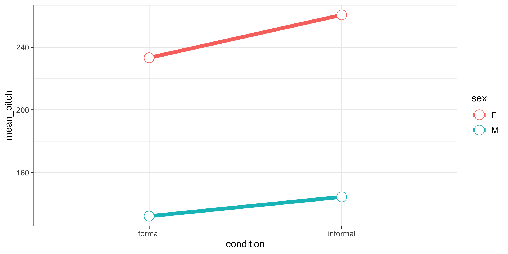
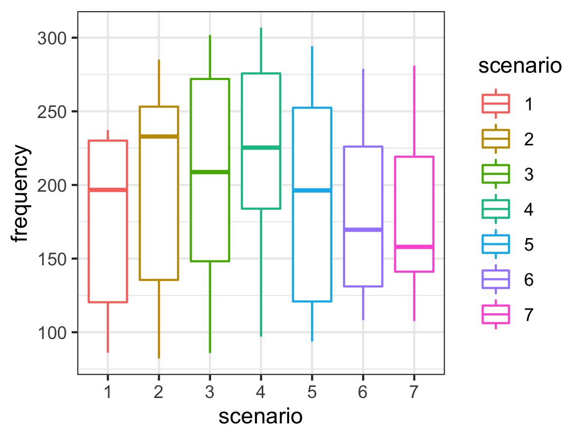

# Module 3 {#m3}

::: {.yellowbox data-latex=""}
Materials for February 7--February 18, 2022.
:::

## Learning checklist

By the end of this module, you should be able to:

- Describe grouping structures for correlated data.
- Discuss partitioning of sources of variability in mixed models.
- Identify situations where linear mixed models may be needed.
- Create plots to explore hierarchical data.
- Write the formula for LMMs.
- Fit LMMs with the `lmer` function using random slopes and random intercepts, as appropriate.
- Interpret the results of `lmer` outputs.
- Conduct appropriate tests to compare LMMs.
- Polish your professional writing.

## Introduction

This module recaps a few topics you should have encountered in previous courses: 
* statistical independence and correlated data,   
  * specifically, _from your understanding of the context/collection of data, can you identify whether observations are likely to be independent?_, and  
* maximum likelihood/maximum likelihood estimation .  

It also introduces an extension to regression, the **linear mixed model**, that uses maximum likelihood estimation to allow us to more flexibly deal with correlated data, that would violate our independence assumptions.

### How deep are we going on likelihoods?

We'll need the concept of maximum likelihood for most of the models we'll meet in this course. That said, __proofs about MLEs are not the focus of _this_ course.__

* You should have encountered the concept of likelihood in _STA238: Probability, Statistics and Data Analysis II_ OR  _STA261: Probability and Statistics II_.  
  * Having taken one of these is a pre-req for STA302, which is the pre-req for STA303.
* For more depth on this important and useful topic (mathematically and/or computationally) consider taking:
  * _STA355: Theory of Statistical Practice_, and/or 
  * _STA410: Statistical Computation_, and/or 
  * _STA422: Theory of Statistical Inference_ and/or 
  * _STA452: Mathematical Statistics I_ + _STA453: Mathematical Statistics II_

These recommendations are based only on the calendar entries for these courses, the [latest syllabi](https://www.statistics.utoronto.ca/resources/past-courses-outlines) of these courses are probably your best guide to what is covered.

#### Maximum likelihood review

$$L(\theta) = f(x | \theta) $$
* Likelihood helps us understand how well our model fits our data. 
* Maximizing the likelihood function estimates the coefficient values for our model that make *the data we actually observed the most likely*. 
  * That might feel a little backwards, as you could say the chance of observing out data is 100%, because we did...observe it...but hopefully the idea of picking the coefficient estimates for our model that make our data the most likely makes some sense. 

#### Properties of maximum likelihood estimators

For large sample sizes:

* Bias goes to 0 (as sample size increases)  
* Approximately minimum variance   
* Approximately normal distribution (usually)  

Another nice feature of MLEs are that they are '__invariant__' under transformation. This means that if $\hat\theta$ is an MLE of $\theta$, and $g$ is a 1-1 function, then $g(\hat\theta)$ is an MLE of $g(\theta)$. This will come in handy in future modules when we want to transform our coefficient estimates with link functions. 

#### Suggested reading

As this should mostly be a recap of likelihood, this is a great article on which to practice your [previewing and skimming strategies](#previewskim).

You may want to pay special attention to the likelihood ratio test.

[Chapter 2](https://bookdown.org/roback/bookdown-BeyondMLR/ch-beyondmost.html) (§ 2.1–2.9) of Roback, P. & Legler, J. Beyond Multiple Linear Regression. (2021). Retrieved from: https://bookdown.org/roback/bookdown-BeyondMLR/ (Links to an external site.) 

### Model comparison more generally

_Thank you to TA Ian for developing this section! He applies statistics in his own research in ecology._

- Model selection is a key component of the development of any statistical model. In model development, there may be multiple plausible hypotheses that can be evaluated simultaneously by parameterizing different models with the same data. These candidate models can differ in both fixed and random effects however the models generally have a similar structure (e.g., multiple combinations of a set of fixed effects). To test the hypotheses with the candidate models, one must determine and compare the support for each model to determine which model(s) fit the observed data the best. While the likelihood-ratio test is suitable when comparing two models to one another, there are certain situations when the goal is to compare multiple (> 2) models to identify the model that best fits the data. 

- There are many different criteria for model selection that can be used. Measures such as Akaike Information Criterion (AIC), adjusted $R^2$, and the Bayesian Information Criterion (BIC) measure the goodness of fit of the model to the data whereas others are focused on calculating the predictive performance of the model (e.g., prediction error rate, root mean square error). Model selection criteria focus on model fit however some will also consider model complexity as model fit generally increases with an increase in the number of model parameters. The selection of the appropriate criteria is generally dependent on the type of model and the purpose of model development (i.e. inference or prediction). 

- For this course, we will use likelihood ratio tests as well as the information-theoretic (I-T) approach using AIC for model selection. AIC measures the lack of model fit to the data based on the log-likelihood of the model while penalizing for the number of parameters in the model. Lower AIC values indicate that the model strongly fits the observed data whereas a higher value indicates a poor model fit. __The absolute AIC values can be challenging to interpret__ so the values are compared relative to one another. Among the candidate models, identify the lowest AIC value ($AIC_{min}$}) and calculate the differences between $AIC_{min}$ and the AIC values of every candidate model ($AIC_{i}$) to obtain AIC differences ($\Delta$AIC) for each model. In general, large values of $\Delta$AIC (> 10) indicate no support for the model, models with intermediate values (4-7) have little support, and models with small values (0-3) have strong support. These categories are arbitrary and may differ among studies. 

- There are scenarios where multiple models have similar support and there is no considerable difference among the model selection criteria. These models would then represent plausible models and support their associated hypotheses. Additionally, model weights can be calculated to evaluate the relative support of each model by the data. Larger weights indicate that the model is strongly supported by the data whereas small values suggest the model poorly fits the data. 

##### References

Burnham, K. P., Anderson, D. R., & Huyvaert, K. P. (2011). AIC model selection and multimodel inference in behavioral ecology: some background, observations, and comparisons. Behavioral ecology and sociobiology, 65(1), 23-35.


## Correlated data 

### Reading

[Chapter 7  (§ 7.3 and 7.8) of Roback, P. & Legler, J. Beyond Multiple Linear Regression. (2021). Retrieved from: https://bookdown.org/roback/bookdown-BeyondMLR/](https://bookdown.org/roback/bookdown-BeyondMLR/ch-corrdata.html#recognizing-correlation) 


### Key vocabulary

* __Fixed effects__: These are non-random quantities. All the coefficients you were estimating in STA302 are examples of fixed effects as you were not treating $\beta_1$ as a random variable, for example.
* __Random effects__: These ARE random quantities. These model parameters are treated as random variables.
* __Mixed effects model__: A model that includes both fixed and random effects as its parameters. These are also called hierarchical models and just mixed models. They are NOT the same as _mixed methods_, which is a 'mix' of _quantitative_ and _qualitative_ research methodology. 
* __Nested/nesting design__: Observational units are grouped within grouping units. There may be multiple levels of grouping.
* __Crossed effect design__: Every observational unit experiences every level of the treatment variable.
* __Observational units__: The person or thing on which your outcome of interest is measured. In an experiment we might also call this the 'experimental unit' or some might say 'statistical unit'. In [Chapter 7 of Beyond Multiple Linear Regression](https://bookdown.org/roback/bookdown-BeyondMLR/ch-corrdata.html#recognizing-correlation), these are referred to as 'level-one observational units'.
  * E.g. In a survey of our class, each student is the observational unit. When I am preparing my final grades, each assessment for each student is my unit of observation. This links back to tidy data (week 2). We want each observational unit to have its own row and only that one row.
* __Grouping units__: How your observational units are grouped together.  In [Chapter 7 of Beyond Multiple Linear Regression](https://bookdown.org/roback/bookdown-BeyondMLR/ch-corrdata.html#recognizing-correlation), these are referred to as 'level-two observational units', but you could have even more levels of grouping. Groups within groups, etc. 

## Statdew Valley interactive

[Click this text to go to the interactive](https://jupyter.utoronto.ca/hub/user-redirect/git-pull?repo=https%3A%2F%2Fgithub.com%2Fsta303-bolton%2Fsta303-w22-activities&urlpath=shiny%2Fsta303-w22-activities%2Finst%2Ftutorials%2Fsta303_m3_statdew%2Fsta303_m3_statdew-valley.Rmd&branch=master)

```{r, echo=FALSE, fig.align='center', out.width="100%"}
knitr::include_graphics("images/m3/statdewvalley.png")
```

Note: A 'static' version of this interactive follows, to aid review, but I recommend you work through the interactive the first time.

```{r setupstatdew, echo=FALSE, message=FALSE}
library(tidyverse)
tomatoes <- tibble(
  plant = rep(1:6, each = 4),
  fertilizer = rep(c("basic", "quality"), each = 12),
  weight = c(123, 124, 128, 125,
    135, 140, 129, 131,
    146, 143, 142.5, 145,
    135, 136, 150, 140.5,
    160, 159, 161, 170,
    162, 161, 152, 151))

set.seed(95)
honey <- tibble(
  hive = rep(rep(1:6, each = 3), times = 3),
  song = rep(c("No music", "Adagio in B minor by Mozart", "Butter by BTS"), each = 18),
  honey_g = c(196.56,199.58,200.71,195.8,199.58,200.71,226.8,227.55,220.75,193.15,197.69,190.13,192.4,195.8,194.29,175.39,169.34,185.97,234.73,236.62,241.92,225.66,226.8,223.02,259.3,248.72,263.46,238.89,237.38,235.11,244.94,245.7,247.21,165.18,167.07,162.54,255.15,254.01,252.88,232.47,233.22,235.49,267.62,266.86,268.38,242.29,250.23,241.92,272.53,272.16,268.75,234.36,232.09,228.69))

honey <- honey %>% 
  mutate(song = fct_relevel(song, "No music", after = 0)) %>% 
  mutate(hive = as_factor(hive)) 

honey_agg_int <- honey %>%   
  group_by(hive, song) %>% 
  summarize(honey_avg = mean(honey_g), .groups = "drop") 

honey_agg_hive <- honey %>% 
  group_by(hive) %>% 
  summarize(honey_avg_hive = mean(honey_g))

bee_int_mod <- lm(honey_g ~ song*hive, data = honey)
bee_agg_mod <- lm(honey_avg ~ song + hive, data = honey_agg_int)
bee_hive_mod <- lm(honey_avg_hive ~ 1, data = honey_agg_hive)

var_int <- summary(bee_int_mod)$sigma^2

var_ab <- summary(bee_agg_mod)$sigma^2 - var_int / 3

var_hive <- summary(bee_hive_mod)$sigma^2 - (summary(bee_agg_mod)$sigma^2)/3

```

### Welcome to Statdew Valley!

You're grandmother has asked you to take over her old farm plot in _Statdew Valley_. Armed with statistical knowledge, you set out to begin your new life!

There are two of datasets for you to analyze to better understand the operation of your farm.

Note: The final 'hint' for code chunks will be the solution.

</br>
</br>
</br>
</br>
_Yes, this is totally an homage to [Stardew Valley](https://www.stardewvalley.net/). Have I played? No, but à la Girlfriend Reviews on YouTube, this is based on "what it's like to live with someone who plays Stardew Valley."_

### Optional: Create your 16 bit character

You can use R for so much more than just running regressions! This section is __totally optional__, and definitely __not assessed.__


1. __Copy this code into a separate .Rmd__. It won't work from within a Shiny App (this interactive).  
1. Save the .Rmd and make sure it is in a folder, not in your Home directory. Rmd files in your Home directory will cause interactives to fail.
1. Choose an image to pixelate to get your character. You'll need to have a URL for it (or you could edit the code for a local file). I think it is easiest to upload to GitHub (or Google Photos) and then right click to copy the image address.
1. Play with the Shiny app interface for the pixelart package to help you get the settings right.
1. Update these settings in the code below.
1. [Super super optional] Post your character on the [optional discussion board for this week](https://q.utoronto.ca/courses/253305/discussion_topics/1616645). If you have a Stardew Valley character or some other pixel art of yourself, you can share that, too. This is just for fun, no requirement to participate. Please be sensible about making sure any images are _appropriate._ Don't use images of other people, etc. 

```{r pixelart, eval=FALSE}
# Install pixel art
# More info: https://privefl.github.io/pixelart
devtools::install_github("privefl/pixelart")

# Install tidyverse if you haven't
# install.packages("tidyverse")

# Install magick if you haven't
# install.packages("magick")

library(magick)
library(pixelart)
library(tidyverse)

# Upload a profile picture of yourself to GitHub or another service where you can then get the image address. With GitHub, you'll need to add ?raw=TRUE to the end of the URL (it is also what you get if you right click and select 'Copy Image Address' )

# Here is an example of mine
url = "https://github.com/sta303-bolton/other/blob/main/lb-for-statdew-valley.png?raw=true"

# Run Shiny app for pixel art models
# This should open in a new browser window
# You can use it to play around with the settings and once you're mostly happy, update the settings below based on them
pixelart::run_pixelart()

url = "https://github.com/sta303-bolton/other/blob/main/lb-for-statdew-valley.png?raw=true"
resize1 = 300
resize2 = 40
ncolors = 15
color_bg = "#FFFFFF"
saturation = 70
degrees = 0
left = 0
top = 0
right = 0
bottom = 0


# I made some changes to the plot_color_matrix function in the pixel art package to produce the look I wanted
# Most of this code is the same as from that package. Credit to: Florian Privé, author and creator of the package. 
plot_color_matrix <- function(raster){
    rows <- seq_len(nrow(raster))
    cols <- seq_len(ncol(raster))
    cbind(expand.grid(y = rev(cols), x = rows), expand.grid(color = t(raster), 
        stringsAsFactors = FALSE)) %>% ggplot() + geom_tile(aes_string("x", 
        "y", fill = "I(color)")) + coord_equal() + theme_void()
}

im0 <- url %>% magick::image_read() %>% magick::image_background(color_bg) %>% 
        crop(left = left, right = right, bottom = bottom, top = top) %>% 
        magick::image_rotate(degrees) %>% magick::image_modulate(saturation = 120)

im1 <- downsize(im0, resize1)

# this can take a while to run
kmeans <- kmeans_colors(im1, ncolors)

im2 <- downsize(im0, resize2)

plot_color_matrix(colors_kmeans(im2, kmeans))
    
```

```{r, echo=FALSE, fig.align='center', out.width="25%"}
knitr::include_graphics("images/m3/lb-for-statdew-valley.png")
```

```{r, echo=FALSE, fig.align='center', out.width="50%"}
knitr::include_graphics("images/m3/lb-example.png")
```


Is this GOOD character pixel art? No. But I think it is cool that you can do image manipulation in R! 


### Task 1: Tomatoes (part 1)

Suppose your farm has a small experimental tomato patch. You are interested in knowing if there is any difference between the weight of tomatoes produced from plants that are fertilized with basic fertilizer vs tomatoes produced from plants that are fertilized with quality fertilizer.

Tee patch has two plots, one for each fertilizer type. In each plot there are three tomato plants (all of the same species). Other growth influencing factors, like light exposure and precipitation are the same for each plot. 

4 tomatoes were chosen at random from each plant and weighed (reported in grams). This data is stored in `tomatoes`.

```{r, echo=FALSE, fig.align='center', out.width="100%"}
knitr::include_graphics("images/m3/tomatoplot.png")
```
*Layout of tomato patch*

```{r, echo=FALSE}
tomatoes <- tibble(
  plant = rep(1:6, each = 4),
  fertilizer = rep(c("basic", "quality"), each = 12),
  weight = c(123, 124, 128, 125,
    135, 140, 129, 131,
    146, 143, 142.5, 145,
    135, 136, 150, 140.5,
    160, 159, 161, 170,
    162, 161, 152, 151))
```

```{r, echo = TRUE}
glimpse(tomatoes)
```

#### Plot the tomat-ah dat-ah

Create a plot with `plant` on the x axis, `weight` on the y axis and coloured by `fertilizer` type. Choose a sensible geometry. I also used `theme_minimal()` because I like the way it looks. This is just an exploratory plot for our benefit, so it can be a bit rough. No title, etc. 

```{r tom_plot-solution, echo=TRUE}
tomatoes %>% 
  ggplot(aes(x = plant, y = weight, colour = fertilizer)) +
  geom_point() +
  theme_minimal()
```


*Note: We're going to take a pretty STA302 approach here. We'll start out by doing something WRONG and then improve it in the next section, still under the least squares framework. We can do this BECAUSE this is what is called a 'balanced data' design. That is, there is an equal number of observations in each combination of levels: 4 tomatoes per plant per fertilizer type plot.*


#### The WRONG approach: fixed effects only


**Fertilizer is our variable of interest**, so we need to include it in the model, but we might expect that tomatoes from the same plant are more similar to each other in weight than tomatoes from different plants. This also seems believable based on the plot. So, let's start by proposing a model like this:

##### Model

$$y_{i} = \alpha_j + \beta_k + \epsilon_{i}  $$

where $y_{i}$ is the weight of the $i^{th}$ tomato from plant $k$ in fertilizer plot $j$. Here, $\alpha_j$ is the population mean weight for fertilizer plot $j$ and $\beta_k$ is the difference of plant $k$ from that mean. 

The two longer horizontal lines in this graph represent $\alpha_{basic}$ and $\alpha_{quality}$ respectively. Each plant also has a shorter horizontal line shown which represents the mean weight of tomatoes from that plant. The distances (shown with the 6 vertical lines) are the $\beta$ values discussed above. (You're not required to be able to create this plot right now. If you're curious you can see the code in the .Rmd version of this activity.)

```{r, echo=FALSE, fig.cap="*Figure: Visual representation of the equation for this data*"}
tomatoes %>% 
  group_by(plant) %>% 
  mutate(plant_mean = mean(weight)) %>% 
  group_by(fertilizer) %>% 
  mutate(fert_mean = mean(weight)) %>% 
  ungroup() %>% 
  mutate(xstart = if_else(fertilizer == "basic", 0, 3.5)) %>% 
  mutate(xend = ifelse(fertilizer == "basic", 3.5, 6.5)) %>% 
  ggplot(aes(x = plant, y = weight, colour = fertilizer)) +
  geom_point() +
  theme_minimal() +
  geom_errorbar(aes(ymin = fert_mean, ymax = plant_mean), colour = rep(c("darkred", "blue"), each = 12)) +
  geom_segment(aes(x = xstart, xend = xend, y = fert_mean, yend = fert_mean, group = fertilizer), colour = rep(c("darkred", "blue"), each = 12))
```

Now, this probably looks a little different to how you've been writing models, but I hope it makes sense as describing the data that we're interested in.

__Question: Could we use this model to predict the average weight of tomatoes from a new plant (e.g. plant 7) grown in the quality fertilizer?__

Answer: No We have no coefficient for plant 7, so no, this model as it is currently won't help us make predictions for any plants other than the ones we've observed."

__Question: Is this model identifiable as currently set out? That is, is there only one possible set of values that we could set these parameters to to get the correct response value?__

Answer: No. The $\beta_k$ s are completely nested within our fertilizer levels, with three plants in the 'basic' fertilizer plot and three in the 'quality fertilizer plot'. Why is the a problem? In trying to fit these values, you'll end up with an infinite number of possible values, because you can add any value to $\alpha_{basic}$ and subtract the same value from $\beta_1$, $\beta_2$ and $\beta_3$ to get the same value of $y$. (Likewise for the 'quality' fertilizer plot and associated plants). Our model conceptualized in this way will not be identifiable."


#### Let's try some models: Part 1

1. Fit a model called `tom1` with `weight` as the outcome and `fertilizer` and `plant` as the predictors. Make sure `plant` is treated as a categorical (factor) variable, not numeric.
1. Fit a model called `tom2` with `weight` as the outcome and and just `fertilizer` as the predictor. 
1. Compare these models using ANOVA. 

```{r tom_mod-solution, echo=T}
tom1 <- lm(weight ~ as_factor(plant) + fertilizer, data = tomatoes)
tom2 <- lm(weight ~ fertilizer, data = tomatoes)
anova(tom1, tom2)
```

```{r}
result_tom1 <- anova(lm(weight ~ as_factor(plant) + fertilizer, data = tomatoes),  lm(weight ~ fertilizer, data = tomatoes))

pval <- sprintf("%.2e", result_tom1$`Pr(>F)`[2])
```

__Question: Is there any evidence against the hypothesis that a model with fertilizer alone fits the data as well as the model with both plant and fertilizer?__

A. "Yes, we have evidence against the fertilizer only model being just as good.  
B. "No, we can proceed with the fertilizer only model.


Answer: The p-value from our ANOVA above, `r pval`, suggests that there is strong evidence against there being no plant effect. Which means that we can't separate whether the fertilizer is having an effect or not, with this model.

To emphasize the problem further, let's fit another model


1. Fit `tom3`, that predicts `weight` with `plant` (as a factor) as the only independent variable.
1. Run an anova to compare `tom1` and `tom3`


```{r tom_same-solution, echo=TRUE}
tom1 <- lm(weight ~ as_factor(plant) + fertilizer, data = tomatoes)
tom3 <- lm(weight ~ as_factor(plant), data = tomatoes)
anova(tom1, tom3)
```

__Question: Think carefully about `tom1` and `tom3.` Which ONE of the following statements is TRUE based on the results of your ANOVA, above?__

A. We have very strong evidence against the claim that the plant only model fits the data as well as the model with plant and fertilizer.  
B. We have no evidence against the claim that the plant only model fits the data as well as the model with plant and fertilizer, and so it appears there isn't a difference between the fertilizers. 
C. Because of the nesting of plant within fertilizer, these models are actually really the SAME model and comparing them tells us nothing about the fertilizer.

Answer: C. These models actually are the SAME in terms of the information they have, because of the total nesting of plants within fertilizer plots. You'll notice the residual degrees of freedom are the same. So it is true that comparing them tells us nothing about fertilizer effects.


#### Summary

Approaching our model in this way has several problems. 

* Our model isn't __identifiable.__ In fact, if you run `summary(tom1)`, you'll see that the fertilizer coefficient is NA because of this! Oops.
* What we can model isn't that useful to us, because it doesn't __generalize__ to any new plants. (E.g., we can't say anything about a plant 7.)
* If we just fit the model is fertilizer, we know our __independence assumption__ is violated and don't know how much of a problem that will be for us. (Violated because we know observational units, tomatoes, are not independent when they come from the same plant.)

So, do we give up on our first farming task?

Nope!

### Task 1: Tomatoes (part 2)

#### The RIGHT approach: mixed effects

To approach this problem better, let us take a step back and realize that we really want to treat `fertilizer` and `plant` ___differently___. Fertilizer is a classic _fixed effect_ kind of variable. We want to be able to treat the parameter as fixed and we want to be able to use it to generalize so we can make claims about whether or not there is a difference between the fertilizers. Meanwhile, we're not _really_ that interested in the effects of each of these plants. We want information that will help us make decisions for future plants. What if we plant 20 new tomato plants? We want to be able make data driven claims in that case, too, not just for these 6 plants. BUT we also can't ignore the plant effects (independence assumption, as discussed).

Our solution? __Treat plant effect as a random variable__. We can think of these 6 plants as drawn from the population of all tomato plants (of this species, in these conditions). We can then understand each of their effects as an independent observation from this distribution. 

**Decision: We will model `fertilizer` as a fixed effect and `plant` as a random effect.**

##### Model
This looks like:
$$ y_i = \alpha_j + b_k + \epsilon_i$$

where, again, $y_{i}$ is the weight of the $i^{th}$ tomato from plant $k$ in fertilizer plot $j$. Here, $\alpha_j$ is again the population mean weight for fertilizer plot $j$ BUT $b_k \sim N(0, \sigma_b^2)$ and $\epsilon_i \sim N(0, \sigma^2)$. $b_k$ and $\epsilon_i$ are mutually independent.

Because we're in 'statistical easy mode' (balanced design) with this example, we can actually achieve all of this in the framework of ordinary least squares you learned in STA302. FIRST we have to do some data manipulation.


__Question: Can you guess what we need to do to our data?__

A. Calculate average weight by fertilizer type and refit with formula `weight_avg ~ plant`  
B. Calculate average weight by plant and refit with formula `weight_avg ~ fertilizer`  
C. Calculate average weight by plant and fertilizer and refit with formula `weight_avg ~ 1`  

Answer: We want to aggregate the data such that we have one value for each plant, the average weight of tomatoes from that plant. Then we will fit the model with the formula `weight_avg ~ fertilizer`.

1. Create a new dataset called `tom_agg` from the `tomatoes` dataset.
1. Group by both fertilizer and plant. Because plant is fully nested in fertilizer, this is just a convenient way to keep the fertilizer variable in the dataset.
1. Summarize so you get the mean tomato weight for each plant. Call this variable `weight_avg`.
1. Run `glimpse(tom_agg)`.

**Before you run the code, see if you can predict what the output should look based on these instructions.**


__Question: What will the new `tom_agg` data set look like?__

A. There will be one row for each plant, so 6 rows total. Three columns, for fertilizer, plant and weight_avg.", correct = TRUE),
B. There will be one row for each plant and fertilizer combination, so 2*6 = 12 rows total. Three columns, for fertilizer, plant and weight_avg."),
C. There will still be 24 rows and the original three columns, but now there will be an additional `weight_avg` column."),
D. We can't predict how many rows there will be, but there should be 3 columns.

Answer: Run the code and see! (or see below)


```{r tom_aggregate-solution, echo=TRUE}
tom_agg <- tomatoes %>% 
  group_by(fertilizer, plant) %>% 
  summarize(weight_avg = mean(weight), .groups = "drop")

glimpse(tom_agg)
```

Now that you've created the new appropriately aggregated dataset, `tom_agg`, use it to fit a model called `tom_final` that predicts `weight_avg` from `fertilizer`. Then run `summary()` on it. Calculate a 95% confidence interval for the effect of using quality fertilizer over basic fertilizer.


```{r tom_mod_correct-solution, echo=TRUE}
tom_final <- lm(weight_avg ~ fertilizer, data = tom_agg)
summary(tom_final)
confint(tom_final)
```


__Question: Which one of the following statements about our results is correct?__

A. We have weak evidence against the claim that fertilizer type has no effect on tomato weight.  
B. It is plausible, at the 95% confidence level, that on average, quality fertilizer produces tomatoes that are 10 grams heavier than tomatoes grown in basic fertilizer.  
C. At the 5% significance level we fail to reject the hypothesis that the average weight of tomatoes grown each fertilizer type is the same.  
D. Using a 5% significance level here, there is a chance that we are making a type II error.  
E. More than one of the above.
         
Answer: All of these are actually correct!   A) If using a 'strength' approach instead of a reject/fail to reject one, we often say a p-value between 0.1 and 0.05 is 'weak evidence'.   B) 10 is in our 95% confidence interval, so it is a 'plausible' or believable value, because a CI is a range of plausible values for our parameter.   C) Our p-value is larger than 0.05, so we fail to reject it at the 5% level.  D) Because we are failing to reject the null, there is a chance that we're wrong, and we SHOULD have rejected the null. Failing to reject the null when you should is a type II error. I remember this with 'fail **2** reject -> type **2**'

#### Variance of our random effect

When we are conducting mixed effects models, we're often interested in the variability of our random effects. So, we want to estimate $\sigma_b^2$ from the model above.

Firstly, we can think about what variability that isn't explained by our fixed effects. This is our *residual* variance. We get this from squaring the residual standard error in `tom_final`. This value is actually partitioned into two independent sources of variability, $\hat{\sigma}^2$, the variance of our random error, and $\hat{\sigma_b}^2$, the variance of our random effect. 

While you can derive this yourself if you like, let's also take as true the following:
$$\frac{\text{RSS}_{tom\_final}}{4} = \hat{\sigma_b}^2 + \frac{\hat{\sigma}^2}{4} $$.

The following just reruns the final code from the tasks above so I can use it.

```{r, include = TRUE}
tom_agg <- tomatoes %>% 
  group_by(fertilizer, plant) %>% 
  summarize(weight_avg = mean(weight), .groups = "drop")

tom_final <- lm(weight_avg ~ fertilizer, data = tom_agg)
summary(tom_final)

# Get the RSE and square it
overall_var <- summary(tom_final)$sigma^2
overall_var
```

Secondly, we actually have an estimate of $\hat{\sigma}^2$ from the model we fit right at the beginning, `tom1`. This is the variance we can't account for even after fitting both `plant` and `fertilizer` as fixed effects.

$\hat{\sigma}^2 = \frac{\text{RSS}_{tom1}}{\text{DF}_{tom1}}$


(This is just from our usual linear model theory. $\hat{\sigma} = \text{RSE} = \sqrt{\frac{\text{RSS}}{DF}}$, so $\hat{\sigma}^2 = \text{RSE}^2 = \frac{\text{RSS}}{DF}$)


```{r, include = TRUE}
tom1 <- lm(weight ~ as.factor(plant) + fertilizer, data = tomatoes)
summary(tom1)

# Get the RSE and square it
error_var <- summary(tom1)$sigma^2
error_var
```

The unexplained variability in our final model can be partitioned into the plant-to-plant variability and the random error variability. The random error variance is divided by the degrees of freedom of the final model.

$$\text{RSE}_{tom\_final}^2 = \frac{\text{RSS}_{tom\_final}}{4} = \hat{\sigma_b}^2 +  \frac{\hat{\sigma}^2}{4}$$

$$ = \hat{\sigma_b}^2 + \frac{\text{RSS}_{tom1}}{18}\cdot\frac{1}{4}$$

$$\hat{\sigma_b}^2 = \text{RSE}_{tom\_final}^2 - \text{RSE}^2_{tom1} \cdot\frac{1}{4}$$


```{r inclue = TRUE}
# Let's calculate the variance of the plant effect
plant_effect_var <- overall_var - error_var/4
plant_effect_var
```

So, $\hat{b} \sim N(0,$ `r round(plant_effect_var, 2)` $)$ . As you might expect, a lot of the variance in tomato weight that we can't account for just based on the fertilizer is due to plant-to-plant variation

### Task 2: Life is sweet as honey

Your grandmother was a bit eccentric when it came to farm management. She swore that her bees produced more honey if she played them music in the morning. In fact, she even mentioned that she thought they particularly liked K-pop. 

She left you some data that she thinks proves this. While the sample size isn't that large, you decide to take a look anyways. The data is called `honey` and records the honey produced each month for each of her 6 hives (in grams). Each hive listened to each of the song options (Butter by BTS, Adagio in B minor by Mozart and No music) for a month, three times. The order was randomized for each hive. It took 9 months to collect this data and the information your grandmother left you says honey production should have been fairly constant over this period and that all the hives experienced the same weather conditions, food access, etc.

(Note: this is definitely not accurate to how beekeeping or weather actually works...but ignore this for our purposes.)

```{r, echo=FALSE, fig.align='center', out.width="10%"}

```

```{r, echo = FALSE, eval = FALSE}
library(nlme)
data(Machines)

              
              c(22.3,28.6,15,21.1,27.3,22.3,
              18.9,18.5,22.8,14.5,20.8,20.3,
              17.7,16.3,24,13.7,21.8,19.3)
 # honey = round(c(runif(6, min = 20, max = 35), 
 #                     c(runif(6, min = 17, max = 22)),
 #                     c(runif(6, min = 10, max = 24))), 1)
              
Machines$score
glue::glue_collapse(round(Machines$score*0.453592/12*100, 2), sep = ",")

```


```{r, include = TRUE}
glimpse(honey)
```


#### Wrangle and plot the data

1. Wrangle the honey data so that the `song` variable is a factor in this order: No music, Adagio in B minor by Mozart and Butter by BTS. 
1. Make `hive` a factor variable also.
1. Save this over the original honey dataset.
1. Then, using your new version of the `honey` dataset, create a new dataset called `honey_agg_int`, where you group by `hive` and `song` and summarize to find the average amount of honey produced by each hive while listening to a given song. Call your averaged variable `honey_avg`.


```{r bee_wrangle-solution, echo=TRUE}
honey <- honey %>% 
  mutate(song = fct_relevel(song, "No music", after = 0)) %>% 
  mutate(hive = as_factor(hive)) 
  
honey_agg_int <- honey %>%   
  group_by(hive, song) %>% 
  summarize(honey_avg = mean(honey_g), .groups = "drop") 
```


1. Plot the `honey_agg_int` data with `song` on the x axis and `honey_avg` on the y axis.
1. In your aesthetic, you should also colour by hive and group by hive. (See the hint if you get stuck).
1. Use the point and line geometries.
1. Use `theme_minimal()` if you like.


```{r bee_plot-solution, echo=TRUE}
# This assumes you've run the correct code for the wrangling above
honey_agg_int %>% 
  ggplot(aes(x = song, y = honey_avg, colour = hive, group = hive)) +
  geom_point() +
  geom_line() +
  theme_minimal()
```

We've actually made an interaction plot for our data. There is a function in the core `stats` package that also does this for us.

```{r, include = TRUE}
interaction.plot(honey$song, honey$hive, honey$honey_g)
```


__Question: What has us worried about the independence assumption if we were just going to do regression as usual?__

A. We don't expect honey production while listening to the same song to be independent.  
B. We don't expect production for a given hive to be independent from month to month.  
C. We don't expect these observations to be independent because they all experienced the same weather conditions and food availability.  
D. No concerns about the independence assumption.


Answer: B. We expect that some hives will be more productive than others, naturally; a 'hive' effect. We want to estimate if there is in fact an effect of song, so that isn't an independence violation. We're glad the other conditions that could affect honey production were similar across the whole period for all hives as this means any difference we see is likely due to song effect (once we account for hive effect), not weather fluctuations.


This data is an example of __crossed effects__, because every hive experiences every level of the 'treatment', i.e. each hive listens to each song.


__Question: What would a completely nested version of this study look like?__

A. This is both nested and crossed already.  
B. Assign hives 1, 2 and to listen to randomly swap between no music for  and then Mozart for 9 months. Hives 4, 5 and 6 would be similar but BTS instead of Mozart.  
C. Repeated measures (x9) of honey production on each hive, listening to the same song, for 9 months.  
D. Not possible to design a nested version.
 
Answer: C. You can't be nested and crossed for the same grouping variable. A fully nested version of this would be much like our tomato study, with two hives assigned to each song.

#### Model formula

This looks like:
$$ y_{ijk} = \mu + \alpha_i + b_{j} + + (\alpha b)_{ij} + \epsilon_{ijk}$$

where $y_{ijk}$ is the amount of honey produced (in grams) in the $k^{th}$ month by the $j^{th}$ hive while listening to song $i$. Here, $\mu$ is the grand mean of honey production, $\alpha_i$ are the $I$ fixed effects for `song` and $b_j$ are the random effects for hive $j$. $(\alpha b)_{ij}$ are the $IJ$ interaction terms for the interaction between the the hive and the song. What does this represent here? Well, maybe some hives respond to a certain song quite differently to other hives. $(\alpha b)_{ij}$ is a random effect because any term involving a random effect must also be a random effect. $(\alpha b)_{ij} ~ \sim N(0, \sigma^2_{\alpha b})$, $b_k \sim N(0, \sigma_b^2)$ and $\epsilon_{ijk} \sim N(0, \sigma^2)$. All the random effects are mutually independent random variables.

#### Fit the models

1. Fit an interaction model (main effects and interactions) to predict honey production based on `song` and `hive`. Call it `bee_int_mod`.  
1. Fit a main effects (no interactions) model to predict honey production based on `song` and `hive` (no interaction). Call it `bee_main`.  
1. Compare these two models with ANOVA.

```{r bee_mod-solution, echo+T}
bee_int_mod <- lm(honey_g ~ song*hive, data = honey)
bee_main <- lm(honey_g ~ song + hive, data = honey)
anova(bee_int_mod, bee_main)
```


__Question: What do you think we can claim from the analysis above?__

A. It seems unlikely that the variance for the interaction terms is 0.  
B. There is no evidence against the hypothesis that the main effects model fits the data as well as the interaction model.  
C. These models are not identifiable.

Answer: A. Because the the model with the interaction explains the data significantly better than the main effects only model, we can say it seems like the variability explained by the interaction is going to be important, i.e. we need interaction terms because they aren't all the same value (which is how we'd have zero variance). These models are identifiable. (Run a summary on them, you'll get no errors.)

#### Model with our aggregated data

1. Run a new model using the `honey_agg_int` data, where `honey_avg` is the response and song and hive are fixed effects, no interactions. Save the model as `bee_agg_mod`.
1. Run an ANOVA on `bee_agg_mod`.

```{r, bee_agg_mod-solution, echo=TRUE}
bee_agg_mod <- lm(honey_avg ~ song + hive, data = honey_agg_int)
anova(bee_agg_mod)
```

The very low p-values you'll see above suggest that we can also reject $H_0: \sigma^2_b = 0$ and $H_0: \alpha_{BTS} = \alpha_{Mozart} = \alpha_{no\ song} = 0$ because it seems plausible that there is hive-to-hive variation, and that there are differences in honey production between the songs.

#### Describing our residuals

Recall the formula for the residual sum of squares (RSS):


$$RSS = \Sigma^{n}_{i=1} \color{green}{e_i}^2 = \Sigma^{n}_{i=1} (\color{orange}{y_i} - \color{blue}{\hat{y_i}})$$

where:

- $\color{green}{e_i}$ is the residual for observation $i$  
- $\color{orange}{y_i}$ is the observed value of the response variable for the $i^{th}$ observation  
- $\color{blue}{\hat{y_i}}$ is the __predicted__ value (from the model) for the $i^{th}$ observation  

##### Calculate the residual sum of squares for the `bee_int_mod` model. Save it as `rss_int`.


```{r, bee_int_rss-solution, echo=TRUE}
rss_int <- sum((honey$honey_g - predict(bee_int_mod))^2)
```


$$RSE = \sqrt{\frac{RSS}{\color{red}n-\color{blue}p-1}}$$

where:

- $RSS$ is the residual sum of squares
- $\color{red}n$ is the number of observations in your dataset (that are being used for the model, must be complete cases for the variables being used)
- $\color{blue}p$ is the number of coefficients being estimated in our model (not including the intercept)

##### Calculate the RSE for the `bee_int_mod` model.

- Start by getting the sample size from the data (i.e., don't 'hard code' it). Save it as `n_int`.  
  - Hint: `nrow()` is a useful function for finding the number of rows of a dataset.  
- Calculate the degrees of freedom for your model. This is 'easy' (for a given value of easy...) to do by hand for balanced designs, but not something you'll do for more complicated models in practice. 
  - Hint: $n-p-1$ 
  - Save the value as `df_int`
- Finally, use these objects and `rss` calculated above to calculate the RSE. Save the object as `rse_int`.  
  - You can check if you are right by comparing to the RSE from the fitted model: `Residual standard error: 3.634 on 36 degrees of freedom`  
  - You can also check it directly with `summary(bee_int_mod)$sigma`


```{r bee_int_rse-solution, echo=TRUE}
# Number of observations
n_int <- nrow(honey)
n_int

# Degrees of freedom for the model
df_int <- n_int - nrow(summary(bee_int_mod)$coefficients)
df_int

# Calculate RSE
rse_int <- sqrt(rss_int/(df_int))
rse_int

# Check RSE from the model
summary(bee_int_mod)

# We can pull the value directly from the model summary with $sigma
summary(bee_int_mod)$sigma
```


#### Calculating our random effect variances

##### Overview

In this section I'm just going claim a couple equations for how we can partition (separate into components) the unexplained variation in the models we have fit. 

We will have a variance component for every one of our random effects (and interactions between a fixed and random effect are also random effects themselves!) as well as the overall residual variance.

We can use this to claim what proportion of variance is explained by our different random effects and what proportion remains unexplained by our variables.

I practice, we'll let R handle this for us, especially as things will get a little messier when we leave the safety of balanced designs. See the Wood reading referenced in the credits if you want to cover this further now. Optional, _not_ assessed.

Basically, I want you to take away from this section that __we can estimate how much our different sources of variation are each contributing to our overall variation.__

##### Unexplained variance after fitting the interaction model 

As we saw above, our unexplained variability, after fitting the interaction model (the most complicated linear model possible for this data), `bee_int_mod`, gives us our $\sigma^2$, i.e., the variability of the error term is $\sigma^2 = 3.63^2$.

Save the squared residual standard error from the `bee_int_mod` model as `var_int`.


```{r setvarint-solution, echo=TRUE}
var_int <- summary(bee_int_mod)$sigma^2
var_int
```

##### RSE for main effects model on aggregated data

Next, we want to consider the what portion of the variability is explained by the interaction of hive and song. Our `bee_agg_mod` residual variance will come from two sources: the variance that CAN be explained by the interaction of hive and song AND the variability we cannot explain (even with out most complicated model), our random error.  

$$\text{RSE}_{bee\_agg}^2 = \sigma_{\alpha b}^2 + \frac{\sigma^2}{K} $$

So, $\text{RSE}_{bee\_agg}$ is the `sigma` value calculated from our main effects only model on the aggregated data, and $K$ is the number of observations at each level of our interaction, i.e., the number of levels we have averaged over in aggregating this data. We want this value as we can use it to take the average of the squared errors from our interaction model (remember that $sigma^2$ is the RSE squared.)

We can get $K$ from the context, by understanding that each hive was exposed to each song for 3 months and honey production was measured monthly. OR we can remember that this design is balanced and divide the total sample size ($n = 54$) by the number of combinations (levels of interaction) which will be 6 hives times 3 songs, which is then $\frac{54}{6\cdot 3} = 3$.

Doing some rearranging, we now can calculate $\sigma_{\alpha b}^2$ from other values we have available to us.

$$\sigma_{\alpha b}^2 = \text{RSE}_{bee\_agg}^2 - \frac{\sigma^2}{K} = $$ `r round(var_ab, 2)`

Calculate $\sigma_{\alpha b}^2$ and save it as `var_ab`.

```{r setvarab-solution, echo=TRUE}
var_ab <- summary(bee_agg_mod)$sigma^2 - var_int / 3
var_ab
```

##### Hive-to-hive variance

Finally, to get $\sigma^2_{b}$ we do one final aggregation and model.

Start by creating a new dataset called `honey_agg_hive`.

- Start with the `honey` data  
- Group by `hive`  
- Use summarize to get the `honey_avg_hive`  
  - You can use `.groups = "drop"` as an argument in your `summarize` call if you are getting a message about dropping groups.

```{r agghive-solution, echo=T}
honey_agg_hive <- honey %>% 
  group_by(hive) %>% 
  summarize(honey_avg_hive = mean(honey_g))

honey_agg_hive
```

Once you have your `honey_agg_hive` dataset, use it to fit an **intercept-only** model, saved as `bee_hive` that effectively just calculate one coefficient, the grand mean of honey production in our data. The __RSE__ for this model is really the same as the standard deviation of average honey production, hive-to-hive.


```{r varhth-solution, echo=T}
bee_hive <- lm(honey_avg_hive ~ 1, data = honey_agg_hive)
summary(bee_hive)

# Notice that the RSE here is just the SD of the average honey production hive-to-hive
sqrt(var(honey_agg_hive$honey_avg_hive))
```

So now we can take our hive-to-hive variability subtract the variability explained by the song and hive main effects, and find the variability in honey output hive-to-hive not explained by song or song/hive interactions. We are dividing by I (the number of songs) because we are averaging across them.

$$ \sigma_b^2 = \text{RSE}_{bee\_hive}^2 - \frac{\text{RSE}_{bee\_agg}^2}{I}$$

```{r varhive-solution, echo=TRUE}
# hive to hive variation, not explained by song or song/hive interaction
var_hive <- summary(bee_hive_mod)$sigma^2 - (summary(bee_agg_mod)$sigma^2)/3
var_hive
```


##### Summary of all our calculated error variances

```{r, echo=T}
# variance in honey production explained by the interaction of song and hive
var_ab <- summary(bee_agg_mod)$sigma^2 - var_int / 3
var_ab

# variance in honey production explained by hive to hive variance
var_hive <- summary(bee_hive_mod)$sigma^2 - (summary(bee_agg_mod)$sigma^2)/3
var_hive

# residual variance (unexplained)
var_int <- summary(bee_int_mod)$sigma^2
var_int

```

We can all talk about the proportion of variance explained by each of our sources of variation. This is also  called intraclass correlation coefficient (ICC) or the variance partition coefficient (VPC). We can calculate it by finding the sum 

```{r}
tibble(Source = c("song:hive", "hive", "residual"),
`Proportion of variance explained` = c(var_ab / (var_ab + var_hive + var_int),
var_hive / (var_ab + var_hive + var_int),
var_int / (var_ab + var_hive + var_int))) %>% 
  knitr::kable()
```

__Question: Which of our random effects explains the greatest variance in the honey production, after controlling for our fixed effects?__

A. Variations in the interaction between the hives and songs.  
B. Random noise.  
C. Hive-to-hive variability.  
D. Impossible to say.  
   
Answer: C. Of the three variances for our random effects, the variance for the hive effect is the largest, and so explains the greatest proportion of the variability in honey production not explained by the song differences."


#### Summary

Note the below notation is is based on using least squares and treating all variables as fixed effects. This isn't the way you would explain a linear model in practice, but I hope helps you see how we are thinking about partitioning our variance. It also helps remind us that regression is just fancy averaging.

```{r, echo=FALSE}
knitr::include_graphics("images/m3/fancyaveraging.png")
```

[Link to tweet](https://twitter.com/ajeanstevenson/status/1488601482505060352)

Note: The $\cdot$ you'll see in some of the following subscripts indicate where we are aggregating and averaging across that level of the data.


##### Full interaction model (includes main effects) (`bee_int_mod`)

+-----------------------------------------+-------------------------------------------------------------------------------------------------------------------------+----------------------------------------------------------------------------------------------+
| In R                                    | Notation                                                                                                                | RSE                                                                                          |
+=========================================+=========================================================================================================================+==============================================================================================+
| `lm(honey_g ~ song*hive, data = honey)` | $y_{ijk} = \mu + \alpha_i + b_j + (\alpha b)_{ij} + \epsilon_{ijk}$                                                     | $RSE^2$ is $\sigma^2$ is the unexplained variation after fitting the most complicated model. |
|                                         |                                                                                                                         |                                                                                              |
|                                         | **Traditional linear regression**                                                                                       |                                                                                              |
|                                         |                                                                                                                         |                                                                                              |
|                                         | $y_{ijk} = \beta_0 + \beta_2 \text{song}_i + \beta_2\text{hive}_j + \beta_3\text{song}_i\text{hive}_j + \epsilon_{ijk}$ |                                                                                              |
|                                         |                                                                                                                         |                                                                                              |
|                                         | \                                                                                                                       |                                                                                              |
|                                         | These are equivalent, just with different contrasts (how we set up our model matrix).                                   |                                                                                              |
+-----------------------------------------+-------------------------------------------------------------------------------------------------------------------------+----------------------------------------------------------------------------------------------+

##### Main effects only model, on hive/song aggregated data (`bee_agg_mod`)

+-----------------------------------------------+----------------------------------------------------------------------------------------+----------------------------------------------------------------------------------------------------------------------------------------------------------------------------------------+
| In R                                          | Notation                                                                               | RSE                                                                                                                                                                                    |
+===============================================+========================================================================================+========================================================================================================================================================================================+
| `lm(honey_g ~ song + hive, data = honey_agg)` | $y_{ij\cdot} = \mu + \alpha_i + b_j + \epsilon_{ij}$                                   | The $RSE^2$ here is the unexplained variation in the average honey production after accounting for the main effects of song and hive. We will use it to help find $\sigma_{\alpha b}$. |
|                                               |                                                                                        |                                                                                                                                                                                        |
|                                               | where                                                                                  |                                                                                                                                                                                        |
|                                               |                                                                                        |                                                                                                                                                                                        |
|                                               | $\epsilon_{ij} = (\alpha b)_{ij}+\frac{1}{K}\Sigma_{k=1}^n$                            |                                                                                                                                                                                        |
|                                               |                                                                                        |                                                                                                                                                                                        |
|                                               | **Traditional linear regression**                                                      |                                                                                                                                                                                        |
|                                               |                                                                                        |                                                                                                                                                                                        |
|                                               | $y_{ij\cdot} = \beta_0 + \beta_2 \text{song}_i + \beta_3\text{hive}_j + \epsilon_{ij}$ |                                                                                                                                                                                        |
+-----------------------------------------------+----------------------------------------------------------------------------------------+----------------------------------------------------------------------------------------------------------------------------------------------------------------------------------------+

##### Intercept only model for hives averages (`bee_hive_mod`)

+------------------------------------------+----------------------------------------------------------------------------+-----------------------------------------------------------------------------------------------------------------------------------------------------------------------------------+
| In R                                     | Notation                                                                   | RSE                                                                                                                                                                               |
+==========================================+============================================================================+===================================================================================================================================================================================+
| `lm(honey_g ~ 1, data = honey_agg_hive)` | $y_{\cdot j \cdot} = \mu + \frac{1}{I}\Sigma^I_{i = 1}\alpha_i + \epsilon$ | The $RSE^2$ here is hive-to-hive variation in average honey output (without taking into account the interaction between hive and song). We will use it to help find $\sigma_{b}$. |
|                                          |                                                                            |                                                                                                                                                                                   |
| (note aggregated dataset)                | where:                                                                     |                                                                                                                                                                                   |
|                                          |                                                                            |                                                                                                                                                                                   |
|                                          | $\epsilon_j = b_j + \frac{1}{I}\Sigma\epsilon_j$                           |                                                                                                                                                                                   |
|                                          |                                                                            |                                                                                                                                                                                   |
|                                          | **Traditional linear regression**                                          |                                                                                                                                                                                   |
|                                          |                                                                            |                                                                                                                                                                                   |
|                                          | $y_{\cdot j\cdot} = \beta_0 + \epsilon_{j}$                                |                                                                                                                                                                                   |
+------------------------------------------+----------------------------------------------------------------------------+-----------------------------------------------------------------------------------------------------------------------------------------------------------------------------------+


### Where to next?

We've done pretty much everything we can while remaining in the ordinary least squares context, and even in the simplest examples, all the aggregating and model fitting we're doing will get a little tedious. Now we will turn to fitting **linear mixed models** more in more sophisticated ways with a specialist package.

The models we'll be fitting will rely on maximum likelihood methods.

### Credits

* The commentary for this activity draws heavily on section 2.1 of 
Wood, S. Generalized Additive Models: An Introduction with R, 2nd Edition. 2017. https://ebookcentral-proquest-com.myaccess.library.utoronto.ca/lib/utoronto/detail.action?docID=4862399 (requires you to log in with your UTORid). 
* Overall concept based on the [Stardew Valley](https://www.stardewvalley.net/) game.
* Stardew Valley images from https://stardewcommunitywiki.com. 


## Vocal pitch case study: Part 1  (LMMs)

### Motivation

You're interested in a language and especially want to investigate how **voice pitch** (perceived “highness” or “lowness” of a voice) is related to politeness for speakers of that language.

### Design of the experiment
* You recruit 6 speakers of the language as subjects in your study. 
* There are 3 males and 3 females.
* Each subject is asked to respond to 14 hypothetical situations. 
    - 7 of these situations are *formal* situations that usually require politeness (e.g., giving an excuse for being late to your scary boss), and 
    - 7 were more *informal* situations (e.g., explaining to a friend why you are late). 
* For each hypothetical situation you measure the subjects voice pitch as they respond. You also take note of each of your subjects’ sex, since you know that’s another important influence on voice pitch.

Note: Much of the content here is adapted from Winter, B. (2013). **Linear models and linear mixed effects models in R with linguistic applications**. arXiv:1308.5499. The language considered was Korean.

```{r, figures-side, fig.show="hold", out.width="50%", echo=FALSE}
knitr::include_graphics(c("images/m3/boss.jpeg", "images/m3/friend.jpeg"))
```

Photos from unsplash.com

### Read in the data and explore it

For convenience, I have created a new variable called `condition`, it is just a modification of the `attitude` variable, that takes the level `formal` if the particular measurement was under formal conditions and `informal` if the measurement was under informal conditions. This variable contains the same information as the `attitude` variable, just coded how I want it to be, so I remove the `attitude` variable at the end. 


```{r, message=FALSE}
# data wrangling
polite_data = read_csv('data/m3/politeness_data.csv') %>% 
  mutate(condition = as_factor(if_else(attitude == "pol", "formal", "informal"))) %>% 
  mutate(sex = as_factor(gender)) 
```

```{r glimpse, echo=TRUE}
glimpse(polite_data, width=85)
```

```{r head, echo = TRUE}
head(polite_data)
```


__Without doing any analysis, how might this data violate our assumptions for a linear model?__

### Recall: Linear regression assumptions

1. **Errors are independent (observations are independent)**
2. Errors are identically distributed and the expected value of the errors is zero, $E[\epsilon_i]=0$
3. Constant variance (homoscedasticity), $var[\epsilon_i] = \sigma^2$.
4. A straight-line relationship exists between the errors $\epsilon_i$ and responses $y_i$


1.-3. are usually expressed as assuming the errors are i.i.d normally distributed with mean of zero and variance $\sigma^2$, 
$$\epsilon_i \sim N(0, \sigma^2)$$


#### Why we can't assume independence

Each subject has 14 measurements of their pitch (measured as the frequency of the vibration of your vocal cords) in different scenarios and different levels of politeness (formal/informal).

With this kind of data, since each subject gave multiple responses (a "repeated measures" design), we can see that this would violate the independence assumption that’s important in linear modelling: **multiple responses from the same subject cannot be regarded as independent from each other**. 

In this scenario, every person has a *slightly different* voice pitch. This personal factor affects all responses from the same subject, thus responses are inter-dependent (correlated) within subjects rather than independent. I.e., if you have a generally low voice, even if you change your pitch when you are being informal versus formal, you probably still have a generally low pitch.

There also differences, on _average_ in pitch by sex, so this is something we will also want to account for in our model, later.

__So what do we do?__


#### Let's start with a picture

Female subjects have an ID starting with "F" and males subjects have an ID starting with "M". __What do you see?__


```{r plot1, eval=FALSE, echo=TRUE}
polite_data %>% 
  ggplot(aes(x = condition, 
             y = frequency,
             color=subject)) +
  geom_boxplot() + 
  geom_point() +
  facet_wrap(~subject, nrow = 2) +
  ggtitle(label="Voice pitch by subjects and formal/informal setting") +
  theme_bw() +
  theme(legend.position = "none") # remove legend because we have facet names
```


```{r, out.width="100%", echo=FALSE}
knitr::include_graphics("images/m3/explore.png")
```

##### Key themes from our plot

1. Males tend to have lower voices than females. 
2. Within the male and the female groups, there is plenty of individual variation. Some subjects have relatively high pitch for their sex and others have relatively low values, regardless of the formal/informal version of the scenario.
3. Subjects seem to generally use a higher pitch when speaking informally than they do when speaking formally.

__Before we can go further with this case study, let's establish a few things...__


## Linear mixed models

### Thoughts on plots for hierarchical/correlated data generally

* Make use of faceted plots! You may have also seen these called lattice plots or trellis plots. These plots show you relationships in your data, conditioned on one or more of your other variables. Facet based on your grouping units.
* When working with ggplot you can facet by adding the `facet_wrap` command. You can control which variables you condition on and how many rows and columns the facets are organised into. (There are lots of other great features we won't go in to in depth here.) 

E.g. `plot +  facet_wrap(~one_var)` or 
`plot +  facet_wrap(~one_var + two var, nrow = 3)`

Assume `plot` is a ggplot object.


```{r, echo=FALSE, fig.align='center', out.width="100%"}
knitr::include_graphics("images/m3/trellis.jpeg")
```

These names come from the appearance of these plots being similar to the lattice of a garden trellis. They also show you different _faces_ (facets) of your data.]

### Assumptions

Linear mixed models assume that:

1. There is a continuous response variable.
2. We have modelled the dependency structure correctly (i.e. made correct choices about our random variables).
3. Our units/subjects are independent, even through observations within each subject are taken not to to be.
3. Both the random effects and within-unit residual errors follow normal distributions.
4. The random effects errors and within-unit residual errors have constant variance .

While it is possible to some extent to check these assumptions through various diagnostics, a natural concern is that if one or more assumptions do not hold, our inferences may be invalid. Fortunately it turns out that linear mixed models are robust to violations of some of their assumptions.

### Our model set up

#### Our STA302 linear model
$$\boldsymbol{y} = \boldsymbol{X\beta} + \boldsymbol{\epsilon}$$
$$\boldsymbol{\epsilon} \sim N(0, \Lambda_\theta)$$

#### Linear mixed model

$$\boldsymbol{y} = \boldsymbol{X\beta} + \boldsymbol{Zb} + \epsilon$$
$$\boldsymbol{b} \sim N(0, \psi_\theta),\ \  \boldsymbol{\epsilon} \sim N(0, \Lambda_\theta)$$

- $\boldsymbol{y}$ is vector of outcomes for subject $i$,
- $\boldsymbol{X}$ and $\boldsymbol{Z}$ are model matrices for the **fixed** and **random** effects, respectively, 
- the vector $\boldsymbol{\beta}$ describes the effect of covariates on the mean/expectation of the outcome, $b$ is the random effects for the units (assumed to be normally distributed with mean zero), 
- $\epsilon$ is the residual errors, normally distributed with a given variance and the errors within units are mutually independent. In this course we won't deal with more complicated situations than a simple error vector that is distributed $N(0, \sigma^2)$. 

#### Alternative formulations

Where you have observations $Y_{ij}$ for repeated measures $j$ on individuals $i$, you may also see:

$$Y_{ij} = \boldsymbol{X_{ij}\beta} + \epsilon_{ij}$$

Where  $\epsilon_{ij} = U_i + Z_{ij}$ and $Z_{ij} \sim N(0, \tau^2)$.

These errors are normally distributed BUT correlated.


OR 


$$Y_{ij}|U_i \sim N(\mu_{ij}, \tau^2)$$
$$\mu_{ij{ = \boldsymbol{X_{ij}\beta}+U_i}}$$
$$ [U_1,\ldots,U_M]^T \sim MVN(\boldsymbol0, \Sigma)$$

- fixed effects: $\boldsymbol{X_{ij}\beta}$ (what you're used to)
- random effects: $U_i$ for i in 1 to M (new part that makes this a linear mixed model)

### What can correlated errors look like?

#### Random intercepts

This is one example of dependence. Here, if a subject is above average in one observation, they're likely to be above average in their other observations.

```{r randint, include=FALSE, fig.align="center"}
set.seed(92)

rand_int <- tibble(subject = rep(c("S1", "S2"), times = 80), x = seq(0, 10, length.out = 160)+rnorm(160, 0 , 0.5), dep = x + rnorm(160, 0, 2) + 7*(subject=="S2"), indep = x + rnorm(160, 0, 2))

indep <- rand_int %>% 
  ggplot(aes(x = x, y = indep)) +
  geom_point(aes(color = subject)) +
  ggtitle("Independent") +
  geom_smooth(method = "lm", se=FALSE) +
  theme_minimal()

dep <- rand_int %>% 
  ggplot(aes(x = x, y = dep)) +
  geom_point(aes(color = subject)) +
  ggtitle("Dependent: random intercept") +
  geom_smooth(method = "lm", se=FALSE) +
  theme_minimal()

gridExtra::grid.arrange(indep, dep, nrow=1)
#ggsave("images/m3/randomintindep.png", indep, height = 5, width = 7)
#ggsave("images/m3/randomintdep.png", dep,  height = 5, width = 7)
```

```{r, echo=FALSE, fig.show = "hold", fig.align = "center", out.width = "49%"}
#knitr::include_graphics(c("images/m3/randomintindep.png","images/m3/randomintdep.png"))
```

#### Random slopes

```{r include=FALSE}
set.seed(92)
rand_slope <- tibble(x = seq(0, 10, length.out = 80), 
                     s1 = 2.5*x + rnorm(80, 0, 2),
                     s2 = 0.75*x + rnorm(80, 0, 2)) %>% 
  pivot_longer(c(s1, s2), "subject", values_to = "y") %>% 
  mutate(x = x + rnorm(160, 0 , 0.5))
                     
 rand_slope %>% 
  ggplot(aes(x = x, y = y)) +
  geom_point(aes(color = subject)) +
  ggtitle("Dependent: random slope") +
  geom_smooth(method = "lm", se=FALSE) +
  theme_minimal()
 
ggsave("images/m3/rand_slope.png", height = 5, width = 7)
```

```{r, echo=FALSE, fig.align='center', out.width="100%"}

```

In this case, not only would the residuals for subject 1 tend to be positive while the residuals for subject 2 would tend to be negative, the difference would get bigger as x increases. You don't want that kind of pattern in the residuals!


#### Random slopes and intercepts

```{r include=FALSE}
set.seed(92)
rand_s_i <- tibble(x = seq(0, 10, length.out =80), 
                     s1 = 4*x-5,
                     s2 = -2*x+30) %>% 
  pivot_longer(c(s1, s2), "subject", values_to = "y") %>% 
  mutate(x = x + rnorm(160, 0 , 0.5))
                     
 rand_s_i %>% 
  ggplot(aes(x = x, y = y)) +
  geom_point(aes(color=subject)) +
  ggtitle("Dependent: random slopes and intercepts")  +
  geom_smooth(method = "lm", se=FALSE) +
   theme_minimal()

 ggsave("images/m3/rand_slope_int.png", width =  7, height = 5)

```

```{r, echo=FALSE, fig.align='center', out.width="100%"}
knitr::include_graphics("images/m3/rand_slope_int.png")
```

```{r eval=FALSE, echo = FALSE}

serial_corr <- tibble(x = seq(0, 10, length.out =400), 
                     s1 = sin(x*pi*0.5) + 2 + x,
                     s2 = cos(x*pi) + x) %>% 
  pivot_longer(c(s1, s2), "subject", values_to = "y") %>% 
  mutate(x = x + rnorm(800, 0 , 0.5))
                     
 serial_corr %>% 
  ggplot(aes(x = x, y = y)) +
  geom_point(aes(color=subject)) +
  ggtitle("Dependent: serial correlation")  +
  geom_smooth(method = "lm", se=FALSE)


```

Subjects appear to have different slopes AND intercepts.


### How do we tell R which situation we're in?
We'll be using the `lmer()` function from the `lme4` package.

Many R packages provide a "vignette" to help you understand how to use the package and the theory behind it.


```{r echo=TRUE, eval=FALSE}
# This line only installs lme4 if you haven't got it installed already
if(!("lme4" %in% installed.packages())) install.packages("lme4")

install.packages("lme4")
vignette("lmer")
```

#### Vignette activity

___Have you ever looked at a package vignette before?___

Use the vignette for this package (see the code above) to try to fill out the syntax for the following situations. You may find Table 2 on page 7 of the vignette quite helpful.

```{r, echo=FALSE, out.width="100%"}
knitr::include_graphics("images/m3/table.png")
```

### Additional considerations

#### Linear mixed models come with lots of different names


#### Fixed vs. random effects

Fixed effects are the things you care about and want to estimate. You likely chose the factor levels for a specific reason or measured the variable because you are interested in the relationship it has to your response variable.
Random effects can be variables that were opportunistically measured whose variation needs to be accounted for but that you are not necessarily interested in (e.g. spatial block in a large experiment). The levels of the random effect are likely a random subset of all possible levels (although as a rule of thumb, there should usually be at least 5). However, if the experimental design includes nesting or non-independence of any kind, this needs to be accounted for to avoid pseudoreplication.

#### REML or ML {#reml}

The math behind maximum likelihood (ML) and restricted maximum likelihood (REML) is beyond what I will assess you on in this course. The main difference between the two is how they estimate the variance parameters. They will estimate $\beta$s the same way.

REML is effectively a two-stage approach where estimates of the random effects are conditioned on the fixed effects. REML accounts for the degrees of freedom lost when estimating the fixed effects and provides us with unbiased estimates of our variance components. ML estimates of the variance components tend to be biased downward (smaller than they should be), making us more likely to pick models with simpler random effects structures than we should. 

We __prefer ML__ if we need to compare two __nested__ models based on their _fixed effects_, as we can't do likelihood ratio tests with models fit with REML _unless_ the fixed effects are exactly the same. We __prefer REML__ when there is a large number of parameters or if our main goal is estimates of our model parameters (random and fixed). Which is _usually_ our goal.

For this course, we'll usually use REML, unless we are trying to compare nested models with the same random effects. There are often not major differences between the two methods, anyways.

#### Confidence intervals and tests

You can create Wald confidence intervals for fixed effects the way you're used to from STA302. BUT for our random effects things can get a bit more awkward. 

A variance must be in $[0, \infty)$, so what happens if you get an estimate for $\hat{\sigma_b^2}$ that is $0.02 \pm 0.04 = (-0.02, 0.06)$? We can get into trouble if our variance components are close to the boundary of the parameter space or if a test requires us to fix them at these boundaries.

Despite these difficulties, if our interval estimates of our variance components are pretty safely away from 0, then we can conclude the associated random effect is needed in the model. If it seems that a variance component is effectively 0, than we can conclude we don't need the associated random effect. We can also get this from likelihood ratio tests, where big or small p-values lead to clear-cut conclusions, but we face more challenges for making inferences when our p-value is close to our decision criteria.

## Vocal pitch case study: Part 2

Recall:

$$Y_{ij} = \boldsymbol{X_{ij}\beta} + Z_{i}\boldsymbol{b} + \epsilon_{ij}$$

- $Y_{ij}$ is the vocal pitch for the $i$th subject on the $j$th vocal response.
- $X_{ij}\beta$ has an intercept and an effect for sex and condition (formal/informal)
- $Z_ib$ represents subject $i$'s 'baseline' pitch
- $\epsilon_{ij}$ is random noise (and potentially other unmeasured confounders)


### Modelling individual means with random intercepts

We can consider each subject's mean vocal pitch and in our model we will assume different random intercepts for each subject. The mixed model estimates these intercepts for us.

We are going to use the package `lme4` and the function `lmer()` and then fit a model with only the random effect of subject (each subject gets their own intercept).

#### Random intercept only model

```{r echo=TRUE, message=FALSE}
# install.packages("lme4")
library(lme4) # load the package

sub_only = lmer(frequency ~ (1 | subject),  data = polite_data)
```


```{r, echo=TRUE}
summary(sub_only)
```

#### What does this model do?

`(1 | subject)` is the R syntax for a random intercept. It asks that we assume there is a different intercept for each subject. The '1' stands for the intercept and the term to the right of the '|' should be a nominal or factor variable to be used for the random effect. You can think of this formula as telling your model that it should expect that there’s going to be multiple responses per subject, and these responses will depend on each subject’s baseline level. This effectively resolves the non-independence that stems from having multiple responses by the same subject.

#### Interpreting this output

From top to bottom:

- The model was fit using restricted maximum likelihood (REML) - what is that? We'll see soon.  
- Then we are shown our formula again and the data this model was fit with.
- The next two parts we won't use much: there is much deeper you could go on the fitting and convergence of these models, but that is not within our scope, and we expect to see the scaled residuals centered near to 0.
- The next part gives us the estimated variances for the random effects in the model. Recall the variances we calculated diretly in the Statdew Valley activity.
- Finally, we have the fixed effect portions of the model, with a separate intercept but nothing else yet because we haven't added any fixed effects.

#### Adding our fixed effects

We're interested in the effects of a formal/informal scenario and sex on the pitch of the subject's voice, so we'll add these as fixed effects.

**Question of interest: What is the influence of formal vs informal condition on voice pitch in speakers of this language, while accounting for sex and variation within subjects?**

#### Model with condition and sex

```{r}
w_fixed = lmer(frequency ~ condition + sex + (1|subject), data=polite_data)
summary(w_fixed)
```

___You should be able to interpret the fixed effects in the way you are used to from linear models. Interpret the fixed effects coefficients below.___

```{r}
fixef(w_fixed)
```


Males have lower pitches than females by an average of 109 Hz and in informal situations speakers have a higher pitch by about 20 Hz on average.

#### Aside: Summary of means

```{r, echo=FALSE, out.width = 1000, eval=FALSE}
polite_data %>% 
  group_by(sex, condition) %>%
  summarise(mean_pitch = mean(frequency)) %>% 
  ggplot(aes(x=condition, y=mean_pitch, 
              colour=sex, group=sex)) +
    geom_line(size=2) + geom_point(size=5, shape=21, fill="white") +
  theme_bw()

ggsave("images/m3/aside.png", width = 8, height = 4)
```


```{r, echo=FALSE, out.width="910%"}
#ggsave("libs/images/wk5/aside.png", width = 7, wight = 5)
 
```

This gives us a general idea of what is going on...but doesn't account for variability at all! Maybe these differences don't actually mean anything in the context of the variability of our data. That is why we want to take a modelling approach.

#### Random slopes for condition

Previously we assumed that the effect of formal/informal conditions were the same for all subjects (one coefficient for this variable). However, the effect of the condition might be *different for different subjects*; that is, there might be a condition and subject interaction. For example, it might be expected that some people are more polite in formal scenarios, others less. We need a random slope model, where subjects and items are not only allowed to have differing intercepts, but where they are also allowed to have different slopes for the effect of formality on pitch.

```{r include=FALSE}
polite_data %>% 
  group_by(subject, condition) %>%
  summarise(mean_pitch = mean(frequency)) %>% 
  ggplot(aes(x=condition, y=mean_pitch, 
              colour=subject, group=subject)) +
    geom_line(size=2) + geom_point(size=5, shape=21, fill="white") +
  theme_bw()

ggsave("images/m3/subject_slopes.png", width = 4, height = 4)
```

```{r, echo=FALSE}
knitr::include_graphics("images/m3/subject_slopes.png")
```

___Do you think the slopes are different for different subjects?___

Note: The following model generates that warning `boundary (singular) fit: see ?isSingular` because our random effects are very small. This is an indication that we may be overfitting. We are including a random effect that we might not need to...(which, spoilers! is what we'll find out at the end of this secion using our model comparison).

```{r}
w_slopes = lmer(frequency ~ condition + sex + (1 + condition | subject),  data = polite_data)
summary(w_slopes)
```


These new condition slopes are looking pretty similar...
```{r}
coef(w_slopes)
```


Let's compare some models. `lmtest::lrtest` will run a likelihood ratio test for us.

___What is your conclusion? Do we need the random slopes?___


```{r}
lmtest::lrtest(w_fixed, w_slopes)
```

Note: We can happily do a likelihood ratio test because we have the same fixed effects and are only comparing nested random effects here. See the [additional considerations section](#reml) for why I mention this.

Conclusion from this test: The slopes are an unnecessary complication to our model. (I.e., No evidence against the hypothesis that the simpler model explains the data just as well.) 

#### Scenario random intercepts

___Does adding random intercepts for the scenarios improve the model?___

```{r, echo=FALSE}
polite_data$scenario = as.factor(polite_data$scenario)
scen_int <- ggplot(polite_data, aes(x=scenario, y=frequency, 
              colour=scenario)) +
    geom_boxplot() +
  theme_bw()

ggsave("images/m3/scen_int.png", height = 3, width = 4)
```

```{r, echo=FALSE}

```

```{r}
w_scen = lmer(frequency ~ condition + sex + (1|subject) + (1|scenario), data=polite_data)
summary(w_scen)
```

___Does adding random intercepts for the scenarios improve the model?___

```{r, echo = TRUE}
lmtest::lrtest(w_scen, w_fixed)
```

Conclusion from this test: Yes! Including a random effect for scenario does explain the data better. We have very strong evidence against the hypothesis that the simpler model fits the data just as well. 

### Scenario random slopes

___Does adding random slopes for the scenarios improve the model?___


```{r}
w_scen_slope = 
  lmer(frequency ~ condition + 
                  sex + (1|subject) + 
                  (1 + condition|scenario), 
       data=polite_data)
```


```{r, echo=FALSE}
scenario_slopes <- polite_data %>% 
  group_by(scenario, condition) %>%
  summarise(mean_pitch = mean(frequency), .groups = "drop") %>% 
  ggplot(aes(x=condition, y=mean_pitch, 
              colour=scenario, group=scenario)) +
    geom_line(size=2) + geom_point(size=5, shape=21, fill="white") +
  theme_bw()
```

```{r, echo=FALSE}
ggsave("images/m3/scenario_slopes.png", height = 2.5, width = 4)
```

```{r, echo=FALSE}
knitr::include_graphics("images/m3/scenario_slopes.png")
```

```{r}
summary(w_scen_slope)
```

___Does adding random slopes for the scenarios improve the model?___

```{r}
lmtest::lrtest(w_scen, w_scen_slope)
```

Conclusion from this test: We have no evidence against the claim that the model with the simpler random effects is as good a fit to the data as the model with the more complicated random effect structure.


## Interactions between random effects and fixed effects


Recall the honey data from the Statdew Valley interactive. 

> Your grandmother was a bit eccentric when it came to farm management. She swore that her bees produced more honey if she played them music in the morning. In fact, she even mentioned that she thought they particularly liked K-pop. 

> She left you some data that she thinks proves this. While the sample size isn't that large, you decide to take a look anyways. The data is called `honey` and records the honey produced each month for each of her 6 hives (in grams). Each hive listened to each of the song options (Dynamite by BTS, Adagio in B minor by Mozart and No music) for a month, three times. The order was randomized for each hive. It took 9 months to collect this data and the information your grandmother left you says honey production should have been fairly constant over this period and that all the hives experienced the same weather conditions, food access, etc.


```{r, echo = FALSE}
honey <- tibble(
  hive = rep(rep(1:6, each = 3), times = 3),
  song = rep(c("No music", "Adagio in B minor by Mozart", "Dynamite by BTS"), each = 18),
  honey_g = c(196.56,199.58,200.71,195.8,199.58,200.71,226.8,227.55,220.75,193.15,197.69,190.13,192.4,195.8,194.29,175.39,169.34,185.97,234.73,236.62,241.92,225.66,226.8,223.02,259.3,248.72,263.46,238.89,237.38,235.11,244.94,245.7,247.21,165.18,167.07,162.54,255.15,254.01,252.88,232.47,233.22,235.49,267.62,266.86,268.38,242.29,250.23,241.92,272.53,272.16,268.75,234.36,232.09,228.69))
```

```{r}

glimpse(honey, width = 80) 

```

### Model formula

I said the model formula would look like this:

$$y_{ijk} = \mu + \alpha_i + b_{j} + + (\alpha b)_{ij} + \epsilon_{ijk}$$ 

where $y_{ijk}$ is the amount of honey produced (in grams) in the $k^{th}$ month by the $j^{th}$ hive while listening to song $i$. Here, $\mu$ is the grand mean of honey production, $\alpha_i$ are the $I$ fixed effects for `song` and $b_j$ are the random effects for hive $j$. $(\alpha b)_{ij}$ are the $IJ$ interaction terms for the interaction between the the hive and the song. What does this represent here? Well, maybe some hives respond to a certain song quite differently to other hives. $(\alpha b)_{ij}$ is a random effect because any term involving a random effect must also be a random effect. $(\alpha b)_{ij} ~ \sim N(0, \sigma^2_{\alpha b})$, $b_k \sim N(0, \sigma_b^2)$ and $\epsilon_{ijk} \sim N(0, \sigma^2)$. All the random effects are mutually independent random variables.

### How would we fit this with `lmer`?

```{r}
library(lme4) # library from which we load the lmer function
```
This is how we would fit a model with _only_ a hive effect:
```{r}
mod0 <- lmer(honey_g ~ song + (1|hive), data = honey)
```

This is how we would fit our __full__ model, with a hive effect AND a hive and song interaction:
```{r}
mod1 <- lmer(honey_g ~ song + (1|hive) + (1|hive:song), data = honey)
```

#### Do we need the interaction?
```{r}
lmtest::lrtest(mod1, mod0)
```

Conclusion: We get a really small p-value, so we have strong evidence against the hypothesis that the simper model, with no song/hive interaction is as good as our full model.


## More fixed vs random effects practice

Consider the following two examples from [Roback & Legler (2021), section 7.10](https://bookdown.org/roback/bookdown-BeyondMLR/ch-corrdata.html#exercises-6). 
__Identify which variable is the response and which are the fixed effects and the random effects.__

> Cockroaches! For a study of cockroach infestation, traps were set up in the kitchen, bathroom, and bedroom in a random sample of 100 New York City apartments. The goal is to estimate cockroach infestation levels given tenant income and age of the building.

__Variables: room type, tenant income,apartment, building age, building, count of cockroaches__

> Radon in Minnesota. Radon is a carcinogen – a naturally occurring radioactive gas whose decay products are also radioactive – known to cause lung cancer in high concentrations. The EPA sampled more than 80,000 homes across the U.S. Each house came from a randomly selected county and measurements were made on each level of each home. Uranium measurements at the county level were included to improve the radon estimates.

__Variables: radon measurement, home, level of home, uranium, county__

### Answers

#### Cockroaches
* response: count of cockroaches
* fixed effects: room type (kitchen, bathroom, bedroom), tenant income, building
age
* random effects: apartment, building

#### Radon
* response: radon measurement
* fixed effects: level of home (e.g. upper or lower level), uranium (county level variable)
* random effects: home, county

## Advice for polishing your writing

The U of T writing advice site has some great short articles with tips about common writing mistakes and tips for improving your writing. The full list from the ['Revising'](https://advice.writing.utoronto.ca/revising/) section is below. Choose one or two that seem relevant to you and read them. If you don't know where to start, go for the ['Hit Parade'](https://advice.writing.utoronto.ca/revising/hit-parade-of-errors/).

- [Revising And Editing](https://advice.writing.utoronto.ca/revising/revising-and-editing/)

- [Hit Parade Of Errors In Grammar, Punctuation, and Style](https://advice.writing.utoronto.ca/revising/hit-parade-of-errors/)

- [Using the Computer to Improve Your Writing](https://advice.writing.utoronto.ca/revising/using-the-computer/)

- [Wordiness: Danger Signals and Ways to React](https://advice.writing.utoronto.ca/revising/wordiness/)

- [Unbiased Language](https://advice.writing.utoronto.ca/revising/unbiased-language/)

- [Punctuation](https://advice.writing.utoronto.ca/revising/punctuation/)

- [Fixing Comma Splices](https://advice.writing.utoronto.ca/revising/comma-splices/)

- [Faulty Parallelism](https://advice.writing.utoronto.ca/revising/faulty-parallelism/)

- [Passive Voice: When to Use It and When to Avoid It](https://advice.writing.utoronto.ca/revising/passive-voice/)

- [Fixing Dangling Modifiers](https://advice.writing.utoronto.ca/revising/dangling-modifiers/)

- [Some Tools and Rules to Improve Your Spelling](https://advice.writing.utoronto.ca/revising/spelling/)

- [Plurals](https://advice.writing.utoronto.ca/revising/plurals/)

- [Possessives](https://advice.writing.utoronto.ca/revising/possessives/)

- [Subject-Verb Agreement](https://advice.writing.utoronto.ca/revising/subject-verb-agreement/)

- [Sentence Fragments](https://advice.writing.utoronto.ca/revising/sentence-fragments/)


And [How Not to Plaigarize](https://advice.writing.utoronto.ca/using-sources/how-not-to-plagiarize/) is always worth reviewing!
