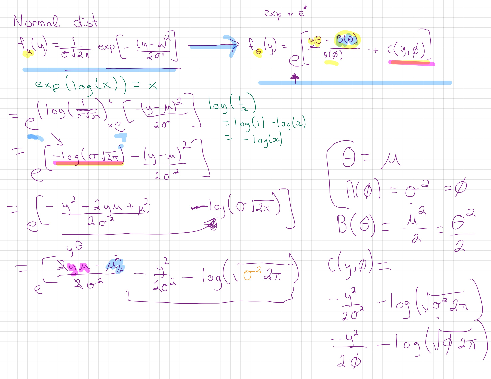
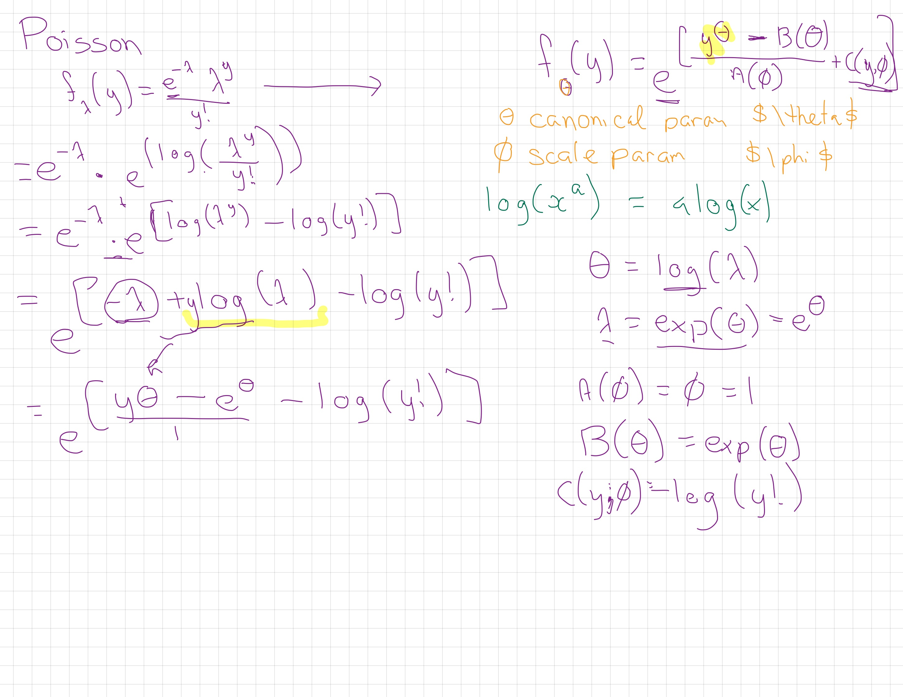
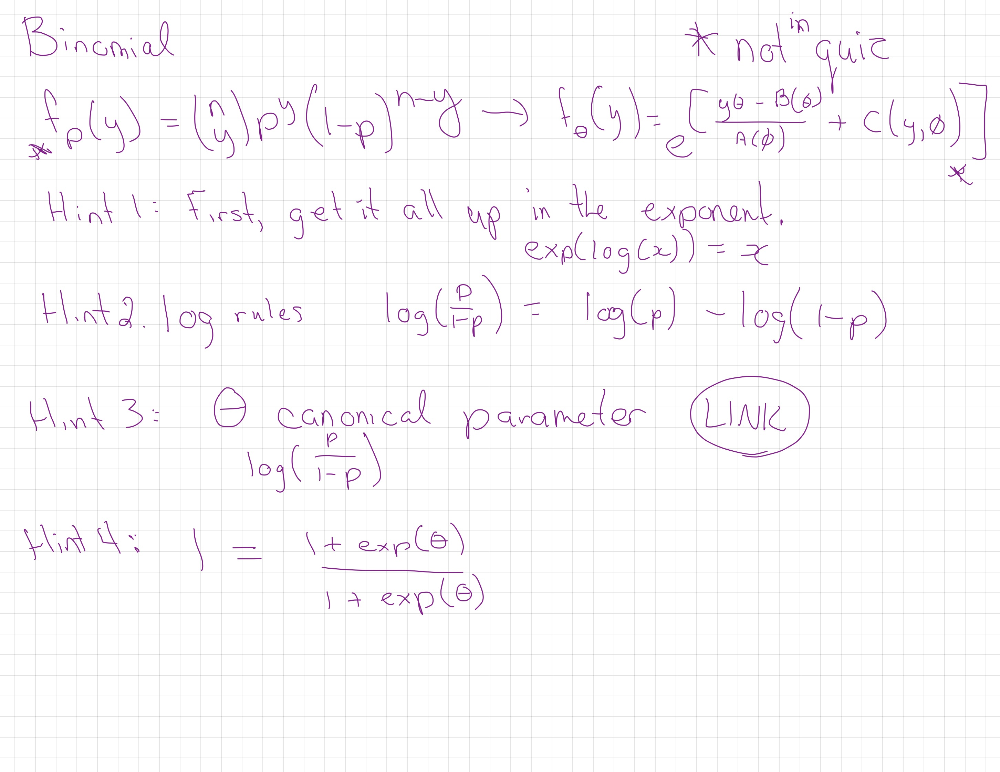

# Module 4 {#m4}

::: {.yellowbox data-latex=""}
Materials for February 28--March 11, 2022.
:::

## Learning checklist

-   Distributions

    -   Recognize a form of the probability density function for
        Bernoulli, binomial, Poisson, exponential, and gamma.

    -   Identify how changing values for a parameter affects the
        characteristics of the probability distribution.

    -   Identify the mean and variance for each distribution.

    -   Match the response for a study to a plausible random variable
        and provide reasons for ruling out other random variables.

    -   Match a histogram of sample data to plausible distributions.

        
- Odds, risks and logistic regression        

    -   Create tables and calculate joint, marginal and conditional
        probabilities with them.
        
    -    Calculate odds, risks, odds ratios (OR), and risk ratios (RR).

    -   Understand why ORs and RRs are similar for rare outcomes.

    -   Interpret logistic regression output.

    -   Differentiate between logistic regression models with binary and
        binomial responses.

    -   Use the residual deviance to compare models, and to test for
        lack-of-fit when appropriate.    

- GLM properties and unifying theory 

    -   State the assumptions of GLMs.

    -   Identify appropriate modeling approaches to start with from a
        description of a study/data.

    -   Determine if a probability distribution can be expressed in
        one-parameter exponential family form.

    -   Identify canonical links for distributions of one-parameter
        exponential family form.

-   Poisson regression

    -   Conduct Poisson regression and interpret the coefficients.

    -   Use and describes offsets, as appropriate.

    -   Check for overdispersion.

    -   Consider negative binomial, quasi-likelihoods, and zero-inflated
        extensions to Poisson regression.

## Introduction

In this module, we will draw on knowledge of common distributions from
your previous statistics courses, and then moving into logistics
regression, and then broadening our horizons further with the family of
models that come under the title of generalized linear models.

This big picture: A key assumption of linear regression you've worked
through so far is that is that the residuals should be normal. With our
current tools, we can't well account for binary data, probabilities
(bounded [0, 1]), skewed distributions or even counts and in many cases.

## Distributions (recap)

Much of this section should be recap of things you've learned in second-year statistics courses.

**Reading:** [Chapter
3](https://bookdown.org/roback/bookdown-BeyondMLR/ch-distthry.html) (§
3.3.1, 3.3.2, 3.3.4, 3.3.6, 3.4.2, 3.5) of Roback, P. & Legler, J.
Beyond Multiple Linear Regression. (2021).
<https://bookdown.org/roback/bookdown-BeyondMLR/>.

### Sections to preview and skim

-   [3.3.1 Binary Random
    Variable](https://bookdown.org/roback/bookdown-BeyondMLR/ch-distthry.html#sec-binary)
-   [3.3.2 Binomial Random
    Variable](https://bookdown.org/roback/bookdown-BeyondMLR/ch-distthry.html#sec-binomial)
-   [3.3.6 Poisson Random
    Variable](https://bookdown.org/roback/bookdown-BeyondMLR/ch-distthry.html#poisson-random-variable)
-   [3.4.1 Exponential Random
    Variable](https://bookdown.org/roback/bookdown-BeyondMLR/ch-distthry.html#exponential-random-variable)
-   [3.4.2 Gamma Random
    Variable](https://bookdown.org/roback/bookdown-BeyondMLR/ch-distthry.html#gamma-random-variable)

#### Recommended revision

-   [3.5 Distributions Used in
    Testing](https://bookdown.org/roback/bookdown-BeyondMLR/ch-distthry.html#distributions-used-in-testing)
-   Honestly, all of Chapter 3 is a great resource for revising these
    distributions.

### Reading guide

Try to answer the following for the selected distributions:

-   What is the probability distribution function?
-   What is/are the parameter(s)?
-   How do changes to the the parameter(s) effect the response?
-   What are the **mean** and **variance**?
-   What values can your response variable take?
-   When might you use this distribution? Come up with an example.
-   What R code can you use to explore the density of this distribution?
-   Can you simulate the distribution? Play with the parameters for
    yourself.

### Cheat sheet template

I've made a template for a 'cheat sheet' on which you can take these
notes/play with code. You can pull it on the [JupyterHub with this
link](https://jupyter.utoronto.ca/hub/user-redirect/git-pull?repo=https%3A%2F%2Fgithub.com%2Fsta303-bolton%2Fsta303-w22-activities&urlpath=rstudio%2F).
From your Home directory, you will need to navigate to
`sta303-w22-activities -> m4`. There are several Rmd you can play with
in this file. The one for this activity is: `1A dist-cheat-sheet.Rmd`.

## Ontario COVID hospitalizations

```{r, echo=FALSE, message=FALSE}
library(tidyverse)
```

Suppose you're interested in hospitalizations by age group in Ontario
due to COVID. This table also shows the estimated population in each age
group.

This data is old, it was retrieved from
<https://www.publichealthontario.ca/en/data-and-analysis/infectious-disease/covid-19-data-surveillance/covid-19-data-tool?tab=ageSex>
on 2021-02-28.

```{r, echo=FALSE}
ontario <- data.frame(
                 Age = c("0 to 09",
                               "10 to 19","20 to 29","30 to 39","40 to 49",
                               "50 to 59","60 to 69","70 to 79","80 to 89","90+"),
  Hospitalizations = c(98,92,402,
                               668,1010,1932,2714,3151,3354,1645),
                Population = c(1518527,
                               1617937,2100175,2056056,1876585,2060937,1795047,
                               1159898,539715,139551)
) 

knitr::kable(ontario, caption = "COVID-19 hospitalizations in Ontario, by age group")
```

### Creating tables in R

```{r, include=FALSE, eval=F}
ontario <- data.frame(
                 Age = c("0 to 09",
                               "10 to 19","20 to 29","30 to 39","40 to 49",
                               "50 to 59","60 to 69","70 to 79","80 to 89","90+"),
  Hospitalized = c(98,92,402,
                               668,1010,1932,2714,3151,3354,1645),
                Population = c(1518527,
                               1617937,2100175,2056056,1876585,2060937,1795047,
                               1159898,539715,139551)
) %>% 
  mutate(`Not hospitalized` = Population - Hospitalized) %>% 
  select(-Population) %>% 
  pivot_longer(-Age, names_to = "Status", 
               values_to = "n") %>% 
  group_by(Age, Status) %>% 
  expand(count = seq(1:n)) %>% 
  select(-count) %>% 
  ungroup()

# Save the data
saveRDS(ontario, "data/m4/ontario_full.RDS")
  
```

Suppose our raw data has an observation per row.

```{r, eval=FALSE}
# Read teh data in
ontario <- readRDS("data/m4/ontario_full.RDS")
head(ontario)
```

    Rows: 14,864,428
    Columns: 2
    $ Age    <fct> 0 to 09, 0 to 09, 0 to 09, 0 to 09, 0 to 09, 0 to 09, 0 to 09, 0 …
    $ Status <chr> "Hospitalized", "Hospitalized", "Hospitalized", "Hospitalized", "…

### Creating tables

You can create a table with the `table()` function in R. (The `xtabs`
function is also useful for creating cross (x) tables.)

```{r, eval=FALSE, echo=FALSE}
hosp_table <- table(ontario$Age, ontario$Status)
saveRDS(hosp_table, "data/m4/hosp_table.RDS")
```

```{r, include=FALSE}
hosp_table <- readRDS("data/m4/hosp_table.RDS")
```

```{r, eval=FALSE}
hosp_table <- table(ontario$Age, ontario$Status)
hosp_table
```

### Calculations with tables

From this kind of table there are three types of proportions that we can
calculate.

-   **Joint**

    -   Joint proportions reflect the proportion total observation for
        which given levels of your categorical variables co-occur. I.e.,
        what proportion of people were over 90 and hospitalized?
    -   General calculation: Cell value over the grand total.

-   **Marginal**

    -   Marginal proportions sum across rows or columns. I.e., what is
        the proportion the Ontario population that has been
        hospitalized? We'd need to add up all the hospitalized and then
        divide that by the sum of all the cells.
    -   General calculation: Row or columns sums over the grand total

-   **Conditional**

    -   Conditional proportions hold one variable level as given, it is
        a bit like zooming in to only one row or one column.
    -   General calculation: Cell value over a row or column sum.

The `margin.table()` and `prop.table()` functions will be very helpful
to us!

### Joint probabilities

Calculate joint proportions:

```{r, echo=TRUE}
hosp_table/sum(hosp_table)
```

$$\frac{n_{ij}}{\Sigma n_{ij}}$$

### Marginal probabilities

Proportion of people in each age group:

```{r, echo=TRUE}
round(margin.table(hosp_table, margin = 1)/sum(margin.table(hosp_table, margin = 1)), 3)
```

Proportion of people in each hospitalization status group:

```{r, echo=TRUE}
round(margin.table(hosp_table, margin = 2)/sum(margin.table(hosp_table, margin = 2)), 3)
```

### Conditional probabilities

Conditional on each row:

```{r, , echo=TRUE}
knitr::kable(prop.table(hosp_table, margin = 1))
```

Conditional on each column:

```{r, echo=TRUE}
knitr::kable(round(prop.table(hosp_table, margin = 2), 3))
```

### Risk and odds

"Risk" refers to the probability of the occurrence of an event or outcome. Statistically, risk = chance of the outcome of interest/all possible outcomes. The term "odds" is often used instead of risk. "Odds" refers to the probability of occurrence of an event/probability of the event not occurring. At first glance, though these two concepts seem similar and interchangeable, there are important differences that dictate where the use of either of these is appropriate.

:   From [Common pitfalls in statistical analysis: Odds versus
    risk](https://www.ncbi.nlm.nih.gov/pmc/articles/PMC4640017/)

### Hospitalization risk and odds

Let's focus on folks aged 80 to 89.

               Hospitalized Not hospitalized
      80 to 89         3354           536361

This **risk** of being hospitalized for this group is
$\frac{3354}{3354+536361} = 0.0062$.

The **odds** of being hospitalized are $\frac{3354}{536361} = 0.0063$.

These values look fairly similar. Odds and risks **will** be similar
when the outcome of interest is rare. This can be seen by the fact that
the only difference between the two calculations is whether the count of
the outcome is included in the denominator or not. As a rule of thumb,
an outcome is 'rare' if it occurs less than 10% of the time.

### Odds ratio and risk ratios

Risk ratios are also called 'relative' risks. Risk ratios and odds
ratios are...ratios of risks and odds respectively.

They are used to make comparisons between groups. Let's for example,
compare 80 to 89 year olds with 10 to 19 year olds.

               Hospitalized Not hospitalized
      10 to 19           92          1617845
      80 to 89         3354           536361

$$OR = \frac{3354/536361}{92/1617845} = 110$$
$$RR = \frac{3354/(3354+536361)}{92/(92+1617845)} = 109$$ Once again,
these values are similar because being hospitalized is (thankfully!)
rare.

### When do we use RR vs OR?

Calculation of *risk* requires as to know how many people are 'at risk'.
As we'll see next week, in case-control studies, where such totals are
not available to us, we cannot calculate a relative risk. BUT, we can
calculate odds ratios and make a comment on the strength of association
between our exposure and the outcome.

In cohort studies, where we do have the number number exposed, we can
calculate either/both.

Logistic regression, which we'll be seeing more of in the next few
weeks, calculates adjusted ORs and not RRs and so being able to
interpret them is going to be important to us.

## Generalized linear models (GLMs)

Generalized linear models are a **flexible** class of models that let us
*generalize* from the linear model to include more types of response
variables, such as *count, binary, and proportion data*.

```{r, echo=FALSE, fig.align='center', out.width="70%"}
knitr::include_graphics("images/m4/flex.jpg")
```

*Image description: A feminine person in active wear holding a yoga pose
where they are standing on their right foot, leaning forward and
extending their right arm and holding the left leg out behind their back
with their left arm.*

Let's get flexible, flexible...

### Assumptions of the Generalized Linear Model

-   The data $Y_1, Y_2, ..., Y_n$ are independently distributed, i.e.,
    cases are independent.

    -   Thus errors are independent... but NOT necessarily normally
        distributed.

-   The dependent variable $Y_i$ does NOT need to be normally
    distributed, but it assumes a distribution, typically from an
    exponential family (e.g. binomial, Poisson, gamma,...)

-   GLM does NOT assume a linear relationship between the dependent
    variable and the independent variables, but **it does assume a
    linear relationship between the transformed response (in terms of
    the link function) and the explanatory variables**; e.g., for binary
    logistic regression $logit(p) = \beta_0 + \beta_1X$.

-   The homogeneity of variance does NOT need to be satisfied.

-   It uses maximum likelihood estimation (MLE) rather than ordinary
    least squares (OLS) to estimate the parameters, and thus relies on
    large-sample approximations.

### Components of a Generalized Linear Model

Generalized linear models have three parts:

1.  **random** component: the response and an associated probability
    distribution\
2.  **systematic** component: explanatory variables and relationships
    among them (e.g., interaction terms)
3.  **link function**, which tell us about the relationship between the
    systematic component (or linear predictor) and the mean of the
    response

It is the **link function** that allows us to generalize the linear
models for count, binomial and percent data. It ensures the linearity
and constrains the predictions to be within a range of possible values.

### Generalized Linear Models

$Y_i \sim G(\mu_i, \theta)$\
$h(\mu_i) = X_i^T\beta$

-   $G$ is the distribution of the response variable
-   $\mu_i$ is a location parameter for observation $i$
-   $\theta$ are additional parameters for the density of $G$
-   $h$ is a link function
-   $X_i$ are covariates for observation $i$
-   $\beta$ is a vector of regression coefficients

### Ordinary Least Squares again

#### GLM

\begin{align*}
Y_i \sim & G (\mu_i, \theta)\\\\
h(\mu_i) = & X_i\^T \beta
\end{align*}

#### OLS

```{=tex}
\begin{align*}
Y_i \sim & N( \mu_i, \sigma^2)\\
\mu_i = & X^T_i \beta
\end{align*}
```

OLS is just a flavour of GLM when:  
- $G$ is a Normal distribution  
- $\theta$ is the variance parameter, denoted $\sigma^2$ - $h$ is the
identity function

## Binomial (or logistic) regression

```{=tex}
\begin{align*}
Y_i \sim & \text{Binomial}(N_i, p_i)\\
\log\left(\frac{p_i}{1-p_i}\right) = & X_i \beta
\end{align*}
```
-   $G$ is a Binomial distribution
-   ... or a Bernoulli if $N_i=1$
-   $h$ is the logit link

```{r logit, echo=FALSE, fig.height=5}
xseq = seq(-4.75,4.75,len=1001)
plot(xseq, exp(xseq)/(1+exp(xseq)),
  xaxs='i', ylim = c(0,1),
  type='l', xlab=expression(X[i]*beta), 
  ylab=expression(p[i]), col='grey', lwd=3)

```

-   $X_i^T \beta$ can be negative
-   $p_i$ is between 0 and 1.

Let's look at an example...

### Case study: Challenger disaster


```{r, echo=FALSE, fig.align='center', out.width="60%"}

knitr::include_graphics("images/stop-video.png")

```

The Challenger case study can be read and understood 'standalone', but if you prefer
having video commentary, this is the video I filmed last year. Not
required to watch and please ignore any references to assessments from
last year, etc.

[Video from last year](https://play.library.utoronto.ca/watch/90be23ecc7045074528121fafd36d5f2)

#### Shuttle data

On January 28, 1986, the Space Shuttle Challenger broke apart 73 seconds
into its flight, killing all seven crew members. The spacecraft
**disintegrated** over the Atlantic Ocean. The disintegration of the
vehicle began after a joint in its right rocket booster failed at
liftoff. The failure was caused by the **failure of O-ring seals** used
in the joint that were not designed to handle the unusually cold
conditions that existed at this launch.

```{r, echo=FALSE, fig.align='center', out.width="70%"}
knitr::include_graphics("images/m4/Challenger_explosion.jpg")
```

*Image description: spiralling trail of white/grey smoke against a black
background.*

We will look at a data set about the number of rubber O-rings showing
thermal distress for 23 flights of the space shuttle, with the ambient
temperature and pressure at which tests on the putty next to the rings
were performed.

#### Follow along with the case study

I've made a template for a 'cheat sheet' on which you can take these
notes/play with code. You can pull it on the [JupyterHub with this
link](https://jupyter.utoronto.ca/hub/user-redirect/git-pull?repo=https%3A%2F%2Fgithub.com%2Fsta303-bolton%2Fsta303-w22-activities&urlpath=rstudio%2F).
From your Home directory, you will need to navigate to
`sta303-w22-activities -> m4`. There are several Rmd you can play with
in this file. The one for this activity is: `1B challenger.Rmd`.

```{r shuttle, echo=TRUE}
# This package is available in the JupyterHub, but you may need to install if working locally
# install.packages("SMPracticals")
data('shuttle', package='SMPracticals')
rownames(shuttle) = as.character(rownames(shuttle))
shuttle[1:4,]
```

-   `m`: number of rings
-   `r`: number of damaged rings

Thus we have a situation where we are interested in the number of
successes out of a fixed number of trials. Hopefully your memories of
the Binomial distribution are being triggered by that language.

```{r shuttlePlot, echo=TRUE, fig.height=2}
# Base R plot
# plot(shuttle$temperature, shuttle$r/shuttle$m)

# ggplot
shuttle %>% 
  ggplot(aes(x = temperature, y = r/m)) +
  geom_point(size = 4) +
  theme_minimal()

```

#### Are shuttle rings more likely to get damaged in cold weather?

We can think of **m** as the number of trials, and **r** as the number
of "successes". (It feels weird to call damage a success, but it is our
outcome of interest, so we treat it as such.)

```{=tex}
\begin{align*}
Y_i \sim & \text{Binomial}(N_i, \mu_i)\\
\log\left(\frac{\mu_i}{1-\mu_i}\right) = & X_i \beta
\end{align*}
```
-   m: number of rings, $N_i$
-   r: number of damaged rings $Y_i$
-   pressure, temperature: covariates $X_i$
-   $\mu_i$: probability of a ring becoming damaged given $X_i$
-   $\beta_{\text{temperature}}$: parameter of interest

#### Inference: parameter estimation

```{=tex}
\begin{align*}
Y_i \sim & G (\mu_i, \theta)\\
h(\mu_i) = & X_i \beta\\
\pi(Y_1 ... Y_N; \beta, \theta)  = & 
\prod_{i=1}^N f_G (Y_i ; \mu_i, \theta)\\
\log L(\beta, \theta ; y_1 ... y_N) = &
\sum_{i=1}^N \log f_G (y_i; \mu_i, \theta)
\end{align*}
```
-   The $Y_i$ are *independently distributed*
-   **Joint density** $\pi$ of random variables $(Y_1 ...Y_N)$ is the
    product of the marginal densities $f_G$.
-   **Likelihood function** $L$ given observed data $y_1 ... y_N$ is a
    function of the parameters.
-   **Maximum Likelihood Estimation**: $$
    \hat\beta, \hat\theta = \text{argmax}_{\beta,\theta}L(\beta, \theta ; y_1 \ldots y_N)
    $$
-   The best parameters are those which are most likely to produce the
    observed data

#### Shuttle example in R

-   `glm` works like `lm` with a `family` argument.

-   Binomial models can take two types of inputs:

    -   If, as in this case, we have groups of trials, we need our
        response to be a matrix with two columns: `y` and `N-y`.
    -   If our `y` is a single 0/1 (or otherwise binary categorical
        variable) then we can set it up as usual, just a single column.

```{r shuttleEx, echo=TRUE, tidy=FALSE}
shuttle$notDamaged <- shuttle$m - shuttle$r
shuttle$y <- as.matrix(shuttle[,c('r','notDamaged')])
shuttleFit <- glm(y ~ temperature + pressure, 
  family=binomial(link='logit'), data=shuttle)
shuttleFit$coef
```

#### Summary of fit

```{r shuttleSummary, echo=TRUE}
#Summarise the model
summary(shuttleFit)
```

```{r, message=FALSE}
# Compute confidence intervals
confint(shuttleFit)
```

There is no evidence that pressure is significantly associated with
failure of O-rings...but how do we interpret these values?

#### Interpreting logistic models

```{=tex}
\begin{align*}
Y_i \sim & \text{Binomial}(N_i, \mu_i)\\
\log\left(\frac{\mu_i}{1-\mu_i}\right) = & \sum_{p=1}^P X_{ip} \beta_p\\
\left(\frac{\mu_i}{1-\mu_i}\right) = & \prod_{p=1}^P \exp(\beta_p)^{X_{ip}}
\end{align*}
```
-   $\mu_i$ is a probability
-   $\log[\mu_i / (1-\mu_i)]$ is a log-odds
-   $\mu_i / (1-\mu_i)$ is an odds
-   If $\mu_i \approx 0$, then $\mu_i \approx \mu_i / (1-\mu_i)$

```{=tex}
\begin{align*}
\beta_q = &\log\left(\frac{\mu_2}{1-\mu_2}\right) - \log\left(\frac{\mu_1}{1-\mu_1}\right) \\
\exp(\beta_q) = & \left(\frac{\mu_2}{1-\mu_2}\right) \left/ \left(\frac{\mu_1}{1-\mu_1}\right)\right. \\
\end{align*}
```
-   $\beta_q$ is the log-odds ratio
-   $\exp(\beta_q)$ is the odds ratio
-   $\exp(\text{intercept})$ is the baseline odds, when
    $X_{1} \ldots X_{n} = 0$.

#### Centring parameters

```{r shuttleC, echo=TRUE}
quantile(shuttle$temperature)
quantile(shuttle$pressure)
```

Currently the intercept is log-odds when temperature = 0 and pressure = 0. This isn't really a meaningful value for us to interpret, so we can center the covariate to a more meaningful baseline.

Let's centre the covariates so the intercept refers to:

    -   temperature = 70 (degrees Farenheit)

    -   pressure = 200 (pounds per square inch)

```{r shuttleFitC, echo=TRUE}
shuttle$temperatureC <- shuttle$temperature  - 70
shuttle$pressureC <-  shuttle$pressure - 200
shuttleFit2 <-  glm(y ~ temperatureC + pressureC, family='binomial', data=shuttle)
```

#### Shuttle odds parameters

```{r shuttleSummaryExpSetup, echo=TRUE, tidy=FALSE, message=FALSE}
par_table = cbind(est = summary(
  shuttleFit2)$coef[,1],
  confint(shuttleFit2))
rownames(par_table)[1]= "Baseline"
```

```{r shuttleSummaryExp, echo=TRUE}
round(exp(par_table),3) %>% 
  knitr::kable(caption = "MLEs of baseline odds and odds ratios, with 95% confidence
intervals.")
```

#### Interpreting shuttle parameters

Because we centred our variables on meaningful values of temperature and pressure, our intercept is meaningful to interpret.

We can read from the table above that the odds of a ring being damaged when temperature = 70 and pressure
    = 200 is `r round(exp(par_table[1,'est']), 3)`, which corresponds
    to a probability of:

```{r shuttleBaselineProb, echo=TRUE, tidy=FALSE}
round(exp(par_table[1,'est']) / (1+exp(par_table[1,'est'])), 3)
```

We can only make this claim about probability for the intercept value!

$$P(\text{damage}|\text{temp = 70, pressure = 200}) = \frac{\beta_0}{1+\beta_0}$$

Each degree increase in temperature (in Fahrenheit) decreases the odds of damage by (in percent)

```{r shuttleTemperaturePercent, echo=TRUE}
round(100*(1-exp(par_table[2,'est']) ), 3)
```

## GLMS: A unifying theory

### Optional accompanying video

```{r, echo=FALSE, fig.align='center', out.width="60%"}

knitr::include_graphics("images/stop-video.png")

```

The following section can be read and understood be able to 'standalone', but if you prefer
having video commentary, this is the video I filmed last year. Not
required to watch and please ignore any references to assessments from
last year, etc. Might be most interesting/useful for the exponential family re-arrangements.

[GLMS: A unifying theory](https://play.library.utoronto.ca/watch/fe7ad273500e61254a66884818512fe0)

### Readings

**Reading:** [Chapter
5](https://bookdown.org/roback/bookdown-BeyondMLR/ch-glms.html) of
Roback, P. & Legler, J. Beyond Multiple Linear Regression. (2021).
<https://bookdown.org/roback/bookdown-BeyondMLR/>.

**Optional reading:** Wood, S.N. Generalized Additive Models: An
Introduction with R, 2nd Edition. 2017.
<https://ebookcentral-proquest-com.myaccess.library.utoronto.ca/lib/utoronto/detail.action?docID=4862399>
(requires you to log in with your UTORid)

(The chapter in Wood covers more of the theory, but use what is covered
in the slides as your guide to what is assessable.)

### Recall

For a generalized model, we've said that:

$$Y_i \sim  \text{some distribution}(\mu_i);\ g(\mu_i) =  X_i^T\beta$$

### Exponential family forms

The first model we met in the Generalized Linear Model family was
logistic regression. But! there is a whole broader extended 'family' of
these models that have a unifying trait:

**their probability distribution function can be expressed in
exponential form:**

$$f_y(\theta)=e^{[ \{y\theta-B(\theta)\}/A(\phi)+C(y, \phi)]}$$

where $\phi$ is an arbitrary 'scale' parameter and $\theta$ is know as
the *canonical parameter* of the distribution. Functions A, B and C are
arbitrary functions. You'll see lots of different letters and symbols
used for these functions, I'm not sure which set to call the 'most'
popular versions.

As you'll see in this module's reading, we can also set $\phi = 1$ (or
it is by default 1 for Poisson and binomial) and talk about these as
members of a 'one-parameter exponential family' where you can write the
probability formula like this ( $\theta$ is the 'one parameter'):

$$f(y;\theta)=e^{[a(y)b(\theta)+c(\theta)+d(y)]}$$

The canonical (also called "natural") parameter of a one-parameter
exponential family is $\theta=g(\mu)$.

**Exponentials with an extra parameter**

The **Tweedie** and **negative binomial** distributions are also
commonly employed. They can be expressed as members of the exponential
family but with a single *additional* parameter. The negative binomial
is often used when we have count data that is **overdispersed** relative
to a Poisson distribution. I mostly only know Tweedie through its use by
**actuaries** and have never used it in research myself.

#### Show that the normal distribution is in the exponential family

I chat through the steps in the video linked above.

We want to get from the Normal distribtion:

$$f_\mu(y) =  \frac{1}{\sigma\sqrt{2\pi}}\text{exp}[-\frac{(y-\mu)^2}{2\sigma^2}]$$

To our genreal exponential form:

$$f_\theta(y) = \text{exp}[\frac{y\theta - B(\theta)}{A(\phi)} + c(y, \phi)]$$
Note, this is the same as above, I've just tried to make it a little easier to read and focus on what is in the exponent.

Using the fact that $\exp(\log(x)) = x$, some algebraic rearrangements (and remembering our log rules!), and a knowledge of the final form we want to reach, we can show that the normal distribution is part of the exponential family.

```{r, echo=FALSE, fig.align='center', out.width="100%"}

```

#### Show that the Poisson distribution is in the exponential family

I chat through the steps in the video linked above.

```{r, echo=FALSE, fig.align='center', out.width="100%"}

```

#### Your turn! Show that the binomial distribution is in the exponential family

I talk about some hints in the video linked above.

```{r, echo=FALSE, fig.align='center', out.width="100%"}

```

### Canonical link functions

A link function, $g(\mu_i)$ is **canonical** if $g(\mu_i) = \theta_i$.

We've been using the canonical link for logistic regression, the logit
link, where $g(\mu) = log(\frac{\mu}{n-\mu})$.

There are a few nice properties that come with using the canonical link:

* They ensure $\mu$ will be in the range the outcome variable can take (e.g. no probabilities greater than 1).  
* Two methods for finding the MLE, Newton's method and the Fisher scoring method, will be identical when using the canonical link.  
* Residuals will sum to 0, an 'observed unbiasedness'.  
* The Hessian for the log-likelihood will be equal to its expected value.  
* The Hessian is the matrix of second derivatives of the likelihood with respect to the parameters.  

### Exponential Family of Distributions

-   Includes most of our familiar distributions:

    -   normal, exponential, log-normal, gamma, chi-squared, beta,
        Bernoulli, Poisson, inverse Gaussian...and more!

-   Who's *not* in the family?

    -   Student's $t$-distribution, $F$-distribution, most distributions
        that are a mixture of others.

-   Provides a unified theory for generalized linear models.

-   A general, highly efficient method for finding MLEs numerically:
    Iterative weighted least squares (IRLS)

```{r, echo=FALSE, fig.align='center', out.width="30%"}
knitr::include_graphics("images/m4/we-are-family.png")
```

### Iteratively re-weighted least squares algorithm (a sketch)

1.  Start with an estimate of the mean, $\hat{\mu}_i = y_i + \delta_i$ (
    $\delta_i$ is usually 0, but sometimes it is a small constant to
    ensure that the $g(\mu_i$) is finite).
2.  Create some 'pseudodata', $z_i$, using the values from the previous
    step and the original data and the associated weights (there are
    equations for all of this, of course, but they're not being covered
    in this class).
3.  Find the value of $\hat{\beta}$ that minimizes the weighted least
    squares objective,
    $\Sigma^n_{i = 1}w_i(z_i - \textbf{X}_i \beta)^2$.
4.  Update $\theta = X\hat{\beta}$ and
    $\hat{\mu}_i = g^{-1}(X_i\hat{\beta})$ and start at step 2 again.

#### How do decide when to stop?

We can judge that this algorithm has converged? One common way is
checking the change in the negative log likelihood between each
iteration and stopping once it is near zero (for a given value of
'nearness'.)

### A quick note on the large sample distribution of $\hat{\beta}$

From the properties of maximum likelihood, we have that:
$\hat{\beta} \sim N(\beta, \mathcal{I}^{-1})$ or
$\hat{\beta} \sim N(\beta, \hat{\mathcal{I}}^{-1})$

This isn't an exact distributional result, it relies on large sample
approximations.

### Deviance

It is nice to be able to make comments about GLMs in a similar way we
are used to talking about the residual sum of squares in ordinary linear
regression.

The **deviance** can take on this role for us. (In our R output it is
called the *Residual deviance*.)

$$D = 2 \{ l(\hat{\beta}_{max}) - l(\hat{\beta)} \}\phi $$

$l(\hat{\beta}_{max})$ is the maximum likelihood of the saturated model
(super overfitting, one $\beta$ per observation) and is the highest log
likelihood we could possibly get with this data.

The **scaled deviance** is $D\text{*} = D/\phi$. Once again relying on
large sample results for likelihoods, we can say that if our model is
true, $D\text{*} \sim \chi^2_{n-p}$.

There is also the **null deviance**, $D_0$, which is the deviance
between the null model (only an intercept) and the saturated model
(perfect fit, one parameter per data point).

#### Comparing models

Suppose we're interested in testing:
$\text{H}_0\text{:}\  g(\mathbf{\mu}) = \mathbf{X}_0\mathbf{\beta}_0$ vs
$\ \text{H}_1\text{:}\  g(\mathbf{\mu}) = \mathbf{X}_1\mathbf{\beta}_1$

$\mathbf{\mu}$ is the expected value of our response variable (and our
observations are independent), and are from the same member of the
exponential family of distributions and the models are nested. (I.e.,
$\mathbf{X}_0 \subset \mathbf{X}_1$.)

We can show, though won't here, that we can apply the likelihood ratio
test as an expression of scaled model deviances, and that $\phi$ will
cancel (nice!) so that this still works for us for GLMs where our scale
parameter is not known.

A note on AIC from Simon Wood: *"In some quarters AIC has acquired cult
status as the one true way to model selection, in a similar way to
p-values, somewhat earlier. This is unfortunate nonsense. Like p-values,
AIC is useful as a rough and ready quantitative aid to selecting between
models, nothing more."*

#### Quasi-likelihood

We've assumed so far that we know our response distribution to be a
member of the exponential family, the whole unifying property of our GLM
framework, so far.

BUT, sometimes we don't know the distribution quite so precisely. We may
have a specific relationship between the mean and variance of the
response in mind, but that's it.

**Is all lost?**

No! WE can actually get pretty far with the idea of
**quasi-likelihood**.

```{r, echo=FALSE, fig.align='center', out.width="90%"}
knitr::include_graphics("images/m4/quasi.png")
```

Our main **practical interest** in this is that we can use it to model
count data for which our variance is higher than we could get from the
Poisson or binomial distributions.

Examples (family component of `glm`):\
`family = quasibinomial(link = "logit")` `family = quasipoisson`

#### So what does this whole section mean for us in practice?

-   We'll use the **canonical link** functions unless we have good
    reason to prefer something else (gamma is really the only example I
    tend to use a non-canonical link for).
-   Under the hood, `glm` is making use of nice properties of our
    **exponential family** and using the iteratively re-weighted least
    squares algorithm.
-   **Deviances** tell us about goodness-of-fit.
-   In this course, we'll use **likelihood ratio tests** when comparing
    nested GLMs.
-   We can (easily) use **quasi-likelihood** methods in situations where
    we want to 'loosen' up our distributional assumptions.

### Reading: Logistic regression

**Reading:** [Chapter
6](https://bookdown.org/roback/bookdown-BeyondMLR/ch-logreg.html) (§
6.2, 6.4) of Roback, P. & Legler, J. Beyond Multiple Linear Regression.
(2021). <https://bookdown.org/roback/bookdown-BeyondMLR/>.

This chapter should provide some good review of odds and logistic
regression.

### Logistic regression case study: Trying to lose weight

This case study is drawn from the content in [Chapter
6](https://bookdown.org/roback/bookdown-BeyondMLR/ch-logreg.html) (§
6.7) of Roback, P. & Legler, J. Beyond Multiple Linear Regression.
(2021). <https://bookdown.org/roback/bookdown-BeyondMLR/>.

It differs from the **Challenger** example in that the response is
binary (0/1) instead of a number of successes out of a given number of
trials. This is a really common application of these methods.

#### Access the code for the case studies

You can pull the code on to the [JupyterHub with this
link](https://jupyter.utoronto.ca/hub/user-redirect/git-pull?repo=https%3A%2F%2Fgithub.com%2Fsta303-bolton%2Fsta303-w22-activities&urlpath=rstudio%2F).
From your Home directory, you will need to navigate to
`sta303-w22-activities -> m4`. There are several Rmd you can play with
in this file. The ones for this reading `6.7 weightloss.Rmd` and
`6.7 weightloss_ans.Rmd`.

## Poisson regression key concepts + reading

### Reading

You may wish to read the entire Poisson regression chapter, but I
recommend you focus on these sections at least.

**Reading:** [Chapter
4](https://bookdown.org/roback/bookdown-BeyondMLR/ch-poissonreg.html) (§
4.2, 4.4, 4.6, 4.7, 4.8, 4.9, 4.10) of Roback, P. & Legler, J. Beyond
Multiple Linear Regression. (2021).
<https://bookdown.org/roback/bookdown-BeyondMLR/>.

### Key concepts for Poisson regression

#### Use case

Counts, which can also extend to rates, i.e. counts per some unit of
time or space.

#### Assumptions

-   Poisson response
-   Independence
-   Mean = variance
-   $log(\lambda)$ is a linear function of $x$

#### Model

$$Y_i \sim \text{Poisson}(\lambda_i) $$ $$\log(\lambda_i) = X_i\beta$$
**Canonical link: log**

-   We interpret **coefficients** as **risk ratios**

    -   Similar to logistic regression, we are interpreting the
        coefficients on the multiplicative scale after transforming with
        inverse of our link function.

-   **Offsets**

    -   Accounts for different denominators in rates, while allowing for
        counts to still be the response.

-   Note: We're using 'log' here to mean the 'natural log', i.e., base
    *e*. `log()` in R is also base e.\

-   **Overdispersion**

    -   A key assumption of Poission regression is that the mean and
        variance of our response are equal. If the variance is greater
        than the mean we have overdispersion.
    -   If we ignore overdispersion, our standard errors might be
        falsely small, meaning we'll probably have falsely small
        p-values, which might lead us to choose an more complicated
        model

-   **Negative binomial regression**

    -   This is another approach to dealing with overdispersion. As
        we've seen negative binomial isn't part of the one parameter
        exponential family, it requires a second parameter, but this
        gives us more flexibility AND assumes an explicit likelihood
        function (unlike quasipoisson).

-   **Zero-inflated Poisson (ZIP)**

    -   Some situations have two underlying processes, one that is
        Poisson and one that always produces zeros.

#### Zero-inflated Poisson situations

```{r, r, echo=FALSE,out.width="49%", out.height="20%",,fig.show='hold',fig.align='center'}
knitr::include_graphics(c("images/m4/fishing.jpeg", "images/m4/preggers.jpeg"))
```

Suppose you're modelling the fish caught by people staying at a lakeside
resort. The count of fish caught will always be zero for people who
don't go fishing and sometimes zero for people who do.

Another common example arises with fertility data. If you have the count
of live-births per person, for people who can give birth to a child,
some will never have children, either by choice (e.g., through
contraceptive use) or due to fertility/health status.]

### Poisson regression case studies: (1) Household size in the Philippines and (2) Campus crime

#### Reading guides for the case studies

Read through these case studies, experiment with the code and pay
particular attention to these questions.

##### Household size in the Philippines

-   How do we interpret the coefficients?
-   How do we compare models?
-   What are the reasons why this model might not fit well?

You can ignore 4.4.5 and 4.4.8, if you wish.

##### Campus crime (includes 4.7, 4.8 and 4.9)

-   Why would we use offsets in logistic regression?
-   How do we include offsets in the model in R?
-   What makes us concerned about our model assumptions?
-   How does this example help us account for multiple testing?

### Access the code for the case studies (optional)

You can pull the files on to the [JupyterHub with this
link](https://jupyter.utoronto.ca/hub/user-redirect/git-pull?repo=https%3A%2F%2Fgithub.com%2Fsta303-bolton%2Fsta303-w22-activities&urlpath=rstudio%2F).
From your Home directory, you will need to navigate to
`sta303-w22-activities -> m4`. There are several Rmd you can play with
in this file. The ones for this reading `4.4 phillipines.Rmd` and
`4.6 campus-crime.Rmd`.

## Extra for the curious (NOT assessed)

The information on the following slides is **not assessed in this
course**.

Consider taking a course like STA442 to go deeper! (Courses vary instructor to instructor, but the following is based on notes from Patrick Brown who has taught this course.)

### Efficient maximization (for your reference only)

-   Iteratively Reweighted Least Squares is the 'classic' algorithm when
    $G$ is in the exponential family
-   ... but GLMs are easy for any density which is differentiable
-   The derivatives with respect to $\beta$ are easy to compute with the
    chain rule 
    
\begin{multline*}
\frac{\partial}{\partial \beta_p} \log L(\beta, \theta ; y_1 \ldots t_N) = \\
   \sum_{i=1}^N \left[\frac{d}{d \mu} \log f_G (Y_i; \mu, \theta)
\right]_{\mu = h^{-1}(X_i^T\beta)} 
\left[ 
\frac{d}{d \eta}h^{-1}(\eta)
\right]_{\eta = X_i^T\beta} \cdot X_{ip}
\end{multline*}
    
-   Analytical expressions exist for the derivatives of $\log f_G$ and
    $h^{-1}$
-   Second derivatives are also tractable
-   Numerical maximization to find $\hat\beta$ is fast when derivatives
    are available

### Numerical maximizers (for your reference only)

-   There are hundreds of them!

-   `optim` is the standard `R` optimizer, which has 6 methods
    available.

    -   some methods will use gradients if you provide them.

-   `TrustOptim` uses derivatives and 'trust regions', the method used
    in INLA.

-   `ipopt` is probably the cutting edge.

-   Statisticians don't make enough use of of-the-shelf optimizers.

### Automatic differentiation (for your reference only)

$$\sum_{i=1}^N \left[\frac{d}{d \mu} \log f_G (Y_i; \mu, \theta)
\right]_{\mu = h^{-1}(X_i^T\beta)} 
\left[ 
\frac{d}{d \eta}h^{-1}(\eta)
\right]_{\eta = X_i^T\beta} \cdot X_{ip}$$

-   Overkill for most GLMs, but infinitely extensible.
-   Computers evaluate logs, sines, and other functions through some
    Taylor-series-like polynomial thing... which are easy to differentiate!
-   AD programs can take computer code and figure out how to
    differentiate it.
-   Used in Neural Nets, Hamiltonian MCMC, optimization, and many more.
