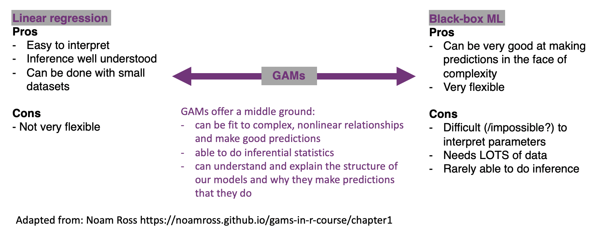
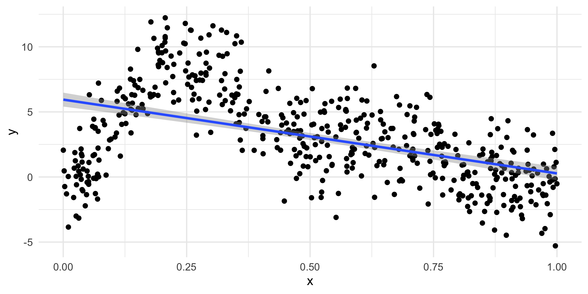
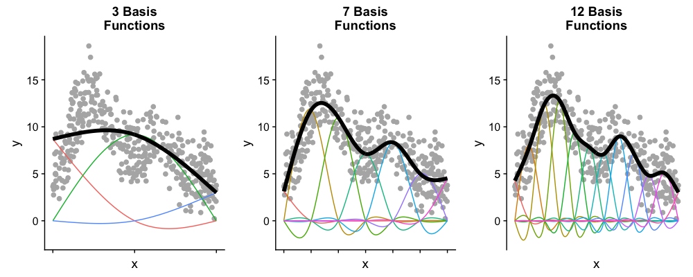
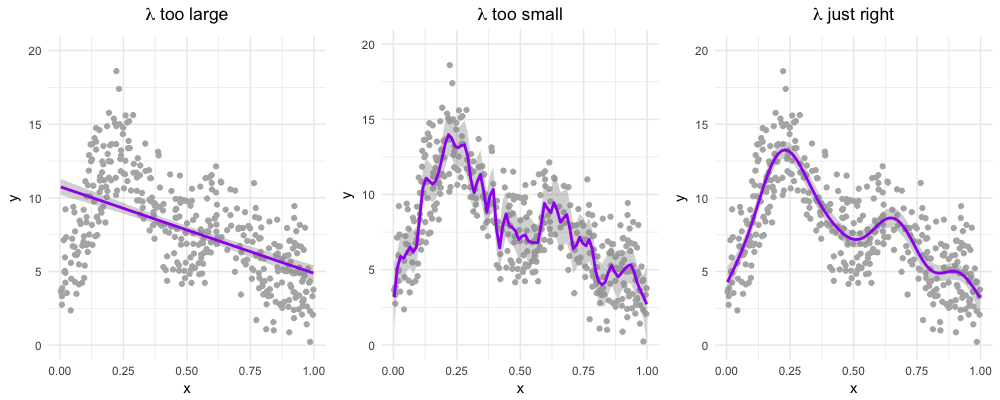

# Module 5 {#m5}

::: {.yellowbox data-latex=""}
Materials for March 21--April 1, 2022.
:::

## Introduction

**What models have we looked at so far?**

-   recapped linear regression + model matrices

-   linear **mixed** models (LMM)

    -   for when our observations aren't independent due to some sort of grouping

-   **generalized** linear models (GLM)

    -   for situations where linear models don't work because of the response type

**What's next?**

-   *generalized* linear mixed models (GLMM)

    -   when we shouldn't use LMMs because of the response
    -   and we shouldn't use GLMs because of grouping/repeated measures in our data

-   *generalized additive models* (GAM)

    -   when we want even more flexibility in the relationships between our predictors and response.

## GLMMs

### What were mixed effects, again?

We call these mixed effect models because they mix **fixed** effects (the way you're used to comparing the differences between treatments or effect of covariates) and **random** effects (generally experimental or observational blocks within which observations are grouped).

These types of models can be especially useful for people working with psychological, economic, social and ecological data.

### Pros and cons of generalized linear mixed models

**Pros**

-   Powerful class of models that combine the characteristics of generalized linear models (GLMs) and linear mixed models (LMMs).

-   They can be used with a range of response distributions (e.g. Poisson, Binomial, Gamma).

-   They can be used in a range of situations where observations are grouped in some way (not all independent).

-   Fast and can be extended to handle somewhat more complex situations (e.g. zero-inflated Poisson).

**Cons**

-   Some of the standard ways we've learned to test models don't apply.

-   Greater risk of making 'sensible' models that are too complex for our data to support.

Note: GLMMs are still under **active** development by statisticians so not all the answers are know (even by the experts working on them).

### Assumptions

#### Pause and think

**Based on the assumptions for the previous models we've considered in this course, what do you think the assumptions for GLMMs will be?**

#### The assumptions for GLMMs

-   Our units/subjects are independent, even through observations within each subject are taken not to to be. (Replace subjects with 'groups', same idea.)

-   Random effects come from a normal distribution.

-   The random effects errors and within-unit residual errors have constant variance. I.e., Are variances of data (transformed by the link function) homogeneous across categories?

-   The chosen link function is appropriate / the model is correctly specified.

#### Pause and think

Here are the general model forms for the classes of models we've met so far:

```{r, echo=FALSE}


```

(Recall that MVN is multivariate normal.)

#### Questions

1.  What are the similarities in each row?

2.  What are the similarities in each column?

3.  What do they all have in common?

### Example: Bacteria in blood samples 🦠💉

```{r  echo=TRUE}
# Data comes from the MASS package
data(bacteria, package='MASS')
head(bacteria)
```

-   `y` is presence or absence of a certain bacteria in a blood sample
-   `ID` is the subject the sample came from
-   `ap` represents the treatment variable, with levels 'p' for placebo and 'a' for active.
-   `week`, either 0, 2, 4, 6, or 11 indicates the number of weeks since the first test.

**The question:** does the treatment reduce the probability of bacteria in the sample?

**The complication:** data are not independent. Some people are more susceptible to bacteria/infection than others.

#### Bacteria model

```{=tex}
\begin{align*}
Y_{it} \sim & \text{Bernoulli}(\rho_{it})\\
\text{logit}(\rho_{it}) = & \mu + X_{it} \beta + U_i\\
U_i \sim & \text{N}(0, \sigma^2)
\end{align*}
```
-   $Y_{it}$ is presence of bacteria in individual $i$ at time $t$
-   $X_{it}$ has indicator variables for week and treatment type.
-   $U_i$ is an individual-level *random effect*.
-   $U_i > 0$ if $i$ is more likely than the average to have the bacteria (allows for within-individual dependence)

This is a *Generalized Linear Mixed Model* (GLMM)

### Inference for GLMMs

We know the probabilities of the $Y_{it}$ conditional on the random effects:

$$pr(Y_{it} | U_i;\mu,\beta) = \frac{\exp(X_{it} + U_i)}{1+\exp(X_{it} + U_i)}$$

If we knew the $U_i$, maximize the above to estimate $\hat\beta$

Integrate out the unknown $U_i$! $$
    pr(Y;\mu,\beta,\sigma) = \int   pr(Y | U; \mu,\beta) pr(U;\sigma) dU
$$writing $U =[U_1 \ldots U_N]$

Maximize the above to get $\hat\mu$, $\hat\beta$, $\hat{\theta}$

Plug-in parameter MLEs when predicting $U_i$ 

$$
\text{E}(U_i |Y; \hat{\mu},\hat{\beta}, \hat{\sigma})
$$

### Problems with Likelihood that affect our inference for GLMMs

**\~10 years ago**

-   We couldn't evaluate the likelihood, let alone maximize it.

-   There were approximate methods which get around this:

    -   Generalized Estimating Equations
    -   Penalized Quasi-likelihood
    -   Hierarchical Likelihood (Lee and Nelder)

-   They could provide good parameter estimates and standard errors for the $\beta$ but could be poor at finding $\text{var}(U_i | Y)$.

-   Packages: `proc glmix` in SAS, `glmmPQL` in R.

**Today**

-   Frequentist methods were later to arrive than Bayesian ones, but now they're here:

    -   Laplace approximations,
    -   importance sampling, and
    -   automatic differentiation.

-   Packages: `lme4`, `glmmTMB`, `prevmap`

### Back to the bacteria

```{r, echo =TRUE}
# How many children?
length(unique(bacteria$ID))

# How many weeks?
table(bacteria$week)

# Were all children tested each week?
table(bacteria$week)/50

# How many in each group?
bacteria %>% 
  group_by(ID) %>% 
  slice(1) %>% 
  group_by(ap) %>% 
  summarise(n = n())

```

#### Fitting a model with `lme4`

Create a new binary variable `y`:

```{r echo=TRUE}
bacteria$newy = as.integer(bacteria$y=='y')
```

Set treatment variable to placebo for everyone at week zero:

```{r echo=TRUE}
bacteria$ap[bacteria$week == 0] = 'p'
```

Set placebo to be the baseline:

```{r echo=TRUE}
bacteria$ap = fct_relevel(bacteria$ap, "p")
```

Run the model:

```{r pqlbac,echo=TRUE, result='hide', message=FALSE}
#install.packages("lme4")
bRes = lme4::glmer(newy ~ factor(week) + ap + (1 | ID), 
		family='binomial', data=bacteria)
```

#### Parameter estimates

```{r pqlbacshow, eval=TRUE, echo=TRUE}
bRes = lme4::glmer(newy ~ factor(week) + ap + (1 | ID), 
		family='binomial', data=bacteria)
summary(bRes)
```

```{r pqlbacCoef,echo=TRUE}
# VarrCorr lets us easily pull out the SD of the random effect
lme4::VarCorr(bRes)

# Let's grad the fixed effects
round(summary(bRes)$coef, digits=2)
```

#### Confidence intervals

-   This takes a long time to run
-   ...it is computing profile likelihoods so that we can estimate appropriate confidence intervals for our random (`.sig01`) and fixed effects.

```{r bacConfint, echo=TRUE, cache=TRUE, stuff=1}
(bConfint = confint(bRes))
```

Notice that were are reporting the standard deviation of the random effects, NOT the individual random effect for each person.

#### Aside: Plotting random effects

We focused a lot on the variance and standard deviation of our random effects, but these statistics are are OF something, namely the random effect values for each level of the random effect. We can see the random intercept associated with each subject in the plot below. Sometimes we might be interested in interpreting these values, but usually not as much as our fixed effect.

```{r, fig.height=6, fig.cap = "Value of the random intercepts for each subject in the bacteria study"}
# ranef() allows us to pull out the random effects
lattice::dotplot(lme4::ranef(bRes, condVar=TRUE)) 

```

#### Prepare a table for reporting

```{r, echo=T}
# Get the estimates transformed
ests <- format(round(exp(summary(bRes)$coeff)[,1], 2), nsmall = 2)
ests

# Get your confidence intervals
cis <- format(round(exp(bConfint),2)[-1,], nsmall = 2)
cis
```

```{r, echo=T}
## But make it even prettier
cis_pretty <- str_c("(", trimws(cis[,1]), ", ", cis[,2], ")")
cis_pretty

# What are the nice names for the rows and columns?
rownames_for_table <- c("Baseline odds", "Week 2", "Week 4", "Week 6", "Week 11", "Active treatment")
colnames_for_table <- c("Estimate", "95% CI")

my_pretty_table <- cbind(ests, cis_pretty)
rownames(my_pretty_table) <- rownames_for_table
colnames(my_pretty_table) <- colnames_for_table
```

```{r, echo=TRUE}
knitr::kable(my_pretty_table, align = c("r", "r"))
```

#### Pulling it all together: A short description of the methods (model written out previously)

This study investigates the association between an active treatment and the presence or absence of *H. influenzae* in children with otitis media in the Northern Territory of Australia. Children were randomly assigned to take either a placebo or drug after the baseline tests at week 0. 50 children were involved in the study (29 in treatment group, 21 in the placebo group) with blood tests conducted at 0, 2, 4, 6 and 11 weeks of treatment. Not all children were tested at all checks, but at least 80% were tested at any given check.

Our outcome of interest was the presence or absence of the bacteria and our predictors were week, treated as a factor, and whether the child was in that active treatment or placebo group. As there were repeated measures for each child, a generalized linear mixed model with logit link was used and random intercepts were estimated for each child.

Menzies School of Health Research 1999--2000 Annual Report. p.20. <http://www.menzies.edu.au/icms_docs/172302_2000_Annual_report.pdf>.

#### Pulling it all together: Results

The odds of there being bacteria in a blood sample at week 0 are roughly 16:1. Recall that all children are represented in the baseline as everyone was set as receiving the 'placebo' at week 0, i.e., no active treatment *before* treatment started.

Children receiving the treatment had 71% lower odds (95% confidence interval from 7 to 92% lower odds) of having bacteria present in the subsequent tests. There was no significant change in odds of finding bacteria in a child's blood test from week to week.

```{r bacteriatable, echo=FALSE, results='asis', fig.cap = "Results of logistic regression with random effect for subject for the bacteria example. Same table of results as above."}
knitr::kable(my_pretty_table, align = c("r", "r"))
```

### Generalized Linear Mixed Models, more generally

$$
\begin{aligned}
Y_i \sim &\pi(\lambda_i; \theta)\\
\lambda_i = & h(\eta_i) \\
\eta_i = & \mu + W_i \beta + U_i\\
U \sim & \text{MVN}[0,\Sigma(\theta)]
\end{aligned}
$$

-   The bacteria model has

    -   $\pi(\eta_i; \theta) = \text{Bernoulli}(\lambda_i)$
    -   $\theta = \sigma$
    -   $\Sigma(\theta) = \sigma^2 I$
    -   $h(x) = \log(x)$


-   The dimension of $U$ and sometimes $\beta$ is very large,

-   Whereas typically the number of elements in $\theta$ is small.

(MVN is multivariate normal)

### Some key conclusions

-   GLMMs are easy to fit (thanks to Taylor series/Gaussian approximations, which we're not covering here)
-   Interpreting GLMMs is similar to interpreting GLMs; we need to be thoughtful as link function makes interpretation subtle at times.
-   Personal preference dictates whether to use `glmmTMB` or `lme4::glmer`.
  - `glmmTMB` is faster on large datasets, but I find `lme4` approachable for beginners.
-   Be Bayesian if you wish, but Frequentist GLMMs are a feasible and convenient option.

### GLMM Reading

**Reading:** [Chapter 11](https://bookdown.org/roback/bookdown-BeyondMLR/ch-glms.html) of Roback, P. & Legler, J. Beyond Multiple Linear Regression. (2021). <https://bookdown.org/roback/bookdown-BeyondMLR/>.

This is a really interesting study that looks to update evidence from 2004/2005 that found that referees appeared to be 'evening out' foul calls across NCAA men's college basketball games. It also expands upon the original logistic regression that was applied to attempt to account for additional correlations in the data.

## Case control studies and conditional logistic regression (OPTIONAL)

Based on what we're focusing on this semester, I am making the content about case control studies and conditional logistic regression optional.

If you're interested in this, you can [check out the 28 minute video from last year](https://play.library.utoronto.ca/watch/71756e16598c3010d53f732f4be115b9), but it won't be assessed.

## GAMs

The models you're probably most familiar with at this point in your statistics education, namely those from courses like STA302 and 303, are on one of an interpretability continuum. We can (with some statistics training) interpret what the coefficients for linear regression mean about our data and make inferences in well understood ways. They aren't the most flexible of models though. On the other side, there are our 'black-box' machine learning methods. These can be incredibly flexible and valuable tools for prediction, but in many cases difficult, if not impossible to interpret.

Generalized additive models (or GAMs) are a form of non-parametric modelling that allow us some of the flexibility of machine learning and some of the interpretability of our classic statistical methods.

```{r, echo=FALSE, fig.align='center', out.width="95%"}

```

You might also see the following discussed in relation to this class of models:

-   Penalized likelihood\
-   Smoothing\
-   Fitting wiggly lines through points\
-   Semi-parametric models\
-   Splines

### A one tweet GAM lesson


<https://twitter.com/ucfagls/status/842444686513991680?ref_src=twsrc%5Etfw>

### Some fake data

It is very wiggly.

```{r echo=FALSE, fig.height=2.8}
library('mgcv')
set.seed(20)

f2 <- function(x) 0.2 * x^11 * (10 * (1 - x))^6 + 10 * (10 * x)^3 * (1 - x)^10
ysim <- function(n = 500, scale = 2) {
  x <- runif(n)
  e <- rnorm(n, 0, scale)
  f <- f2(x)
  y <- f + e
  data.frame(y = y, x = x, f2 = f)
}

my_data <- ysim()

p <- ggplot(my_data, aes(x = x, y = y)) +
  geom_point() +
  theme_minimal()

ggsave("images/m5/fake.png", p, width = 7, height = 3.5)
```

```{r, echo=FALSE, fig.align='center', out.width="95%"}
knitr::include_graphics("images/m5/fake.png")
```

### Linear model?

```{r, fig.height=2.3, fig.show='hide'}
p + geom_smooth(method="lm")
```

```{r, echo=FALSE}
ggsave("images/m5/linear.png", width = 7, height = 3.5)
```

```{r, echo=FALSE, fig.align='center', out.width="80%"}

```

Well, that seems bad...

#### Wouldn't something like this be much nicer?

```{r echo=FALSE, fig.show='hide'}
p + geom_smooth(method="gam", color="purple", formula = y ~ s(x, k = 7))
```

```{r, echo=FALSE}
ggsave("images/m5/nicer.png", width = 7, height = 3.5)
```

```{r, echo=FALSE, fig.align='center', out.width="80%"}
include_graphics("images/m5/nicer.png")
```

__But, HOW do we get the wiggles?__


That is our goal for the rest of this module.

### How do we get the wiggles?

**Answer: Splines!**

If you've looked at interference of waves in physics, you'll love this. If you haven't....you'll also love this!

 

GAMs are both *smooth* and *flexible* thanks to actually being made up of multiple not-as-flexible functions. *Imagine the Power Rangers robot teaching you a yoga class.*

-   Each smooth is the sum of a number of **basis functions**
-   Each basis function is multiplied by a coefficient
-   Each of those coefficients is a parameter of our model

### Splines

-   Splines are *functions* composed of simpler functions
-   Our simpler functions are *basis functions* & the set of basis functions is a *basis*
-   When we model using splines, each basis function $b_k$ has a coefficient $\beta_k$
-   The resulting spline is the sum of these weighted basis functions, evaluated at the values of $x$

$$s(x) = \sum_{k = 1}^K \beta_k b_k(x)$$

### Picturing basis functions

-   **Plot a** shows the basis functions of a GAM where all the coefficients are the same.\
-   **Plot b** shows the same basis functions *after* model-fitting, where each has a coefficient fit to the data.
-   Basis functions add up to create the overall smooth shape.

Describing this one, nonlinear relationship (one response and one explanatory variable) requires several parameters, plus an intercept.


Image created by [Noam Ross](https://github.com/noamross/gams-in-r-course/blob/master/images/basis-functions-1.png).

### Wiggle, wiggle, wiggle

```{r, echo=FALSE, fig.align='center', out.width="20%"}

if (knitr:::is_latex_output()) {
  knitr::asis_output("There is a GIF in the web version. Link: https://github.com/gavinsimpson/intro-gam-webinar-2020/blob/master/resources/basis-fun-anim.gif?raw=true.")
} else {
 knitr::include_graphics("https://github.com/gavinsimpson/intro-gam-webinar-2020/blob/master/resources/basis-fun-anim.gif?raw=true")
}
```

GIF by [Gavin Simpson](https://github.com/gavinsimpson)

#### Taking a peak at our coefficients

```{r}
library(mgcv) # you will need to install this
gam_mod <- gam(y ~ s(x, k=7), data=my_data, method="REML")
coef(gam_mod)
```

This is just some meaningless fake data, we'll work through a Case Study more fully.

#### How many basis functions do we want?

```{r, echo=FALSE, fig.align='center', out.width="100%"}

```

Image created by [Noam Ross](https://github.com/noamross/gams-in-r-course/blob/master/images/diffbasis-1.png).

#### Smoothing

```{r, echo=FALSE, fig.align='center', out.width="100%"}

```

Image created by [Noam Ross](https://github.com/noamross/gams-in-r-course/blob/master/images/diffsmooth-1.png).

#### Smoothing

You can think of our fit as being:

$$\text{penalized log lik} =\log(\text{Likelihood}) - \lambda \cdot \text{Wiggliness}$$

where $\lambda$ is a smoothing parameter.

We can set lambda with the `sp` (smoothing parameter) option in `gam()` BUT it is recommended that we let R find the best one for us using restricted maximum likelihood ("REML").

```{r, eval=FALSE}
# Sets parameter for the whole model
gam_mod <- gam(y ~ s(x), data=my_data, sp=0.1) 

# Set the parameter for one specific term
gam_mod <- gam(y ~ s(x1, sp=0.1) + s(x2), data=my_data) 

# Let R do it for you - the recommended way
gam_mod <- gam(y ~ s(x), data=my_data, method = "REML")

```

### Choices to make

#### Wiggliness

There are LOTS of ways to pick your wiggle: AIC, generalized cross-validation (GCV, part of the name of `mgcv` and the default for that package), ML and REML.

#### Basis complexity

We can set a maximum wiggliness by setting a 'size', k, that indicates a maximum number of small functions that could be used to build the model. If we set it bigger than the data, we'll get an error, and if we set it much bigger than needed, it is computationally costly.

Our effective degrees of freedom (edf) will always be less than k. We can check if we've been sensible in our choice of *k* with `gam.check()`.

#### Basis expansions

In the polynomial models we used a polynomial basis expansion of $\boldsymbol{x}$

-   $\boldsymbol{x}^0 = \boldsymbol{1}$ --- the model constant term
-   $\boldsymbol{x}^1 = \boldsymbol{x}$ --- linear term
-   $\boldsymbol{x}^2$
-   $\boldsymbol{x}^3$
-   ...

So! If the **effective degrees of freedom** we need for a term is approximately 1, then we're really just smoothing it down to a linear term, the way a covariate would usually enter a model as a fixed effect in our previous models. We may choose to just put it in the model as such, so that we can interpret the coefficient it receives.

### Generalized additive (mixed) models

We can combine everything we've done in this course so far into generalized additive models (including adding random effects).

```{=tex}
\begin{align*}
Y_i \sim & G(\mu_i, \theta)\\
g(\mu_i) = & X_i \beta + Z_iU + f(W_i)
\end{align*}
```
-   $Y_i$ are responses
-   $G$ is the response distribution
-   $X_i$, $Z_i$ and $W_i$ are covariates
-   $U$ are our random effects
-   $f(w)$ is some sort of wiggly line
-   If we put no restrictions or assumptions on $f$, the estimate $\hat f(w)$ will interpolate the data perfectly (which isn't very interesting)

**Random effects**

When fitted with REML or ML, *smooths* can be viewed as just fancy *random effects*. AND, excitingly, random effects can be viewed as smooths!

If your random effects are fairly simple, you can fit those in `mgcv::gam()` without needing the more complex GAMM functions, like `gamm4::gamm4()`

These two models are equivalent:

```{r ranefs-5, eval=FALSE}
# library(mgcv)
# You don't need to know anything about this data, 
# just consider how that variables enter the models
m_nlme <- lme4::lmer(travel ~ 1 + (1 | Rail), data = Rail, REML = TRUE) 
m_gam  <- gam(travel ~ s(Rail, bs = "re"), data = Rail, method = "REML")
```


### Random effects

The random effect basis, `bs = 're'`, is *not* as computationally efficient as *lme4* if we have complex random effects terms or even if we just have random effects with many levels (which isn't really that unusual with random effects).

Instead we could use `gamm()` or `gamm4::gamm4()`:

-   `gamm()` fits using `lme()`
-   `gamm4::gamm4()` fits using `lmer()` or `glmer()`

I.e., you're wanting a response with a conditional distribution that isn't *normal*, use `gamm4::gamm4()`

### Case studies: Cherry trees and Portugese larks

#### Access the code for the case studies

You can pull the code on to the [JupyterHub with this
link](https://jupyter.utoronto.ca/hub/user-redirect/git-pull?repo=https%3A%2F%2Fgithub.com%2Fsta303-bolton%2Fsta303-w22-activities&urlpath=rstudio%2F).
From your Home directory, you will need to navigate to
`sta303-w22-activities -> m5`. 

### Further comments on GAMs

#### GAMs are models too

How accurate your predictions are depends on how good the model is, as always. (Credit: Eric Pedersen & Gavin Simpson)

```{r misspecify-5, echo = FALSE, fig.show=FALSE, message=F, warning=F}
set.seed(15)
model_list = c("Appropriate model", 
               "Wrong distribution",
               "Heteroskedasticity",
               "Dependent data",
               "Wrong functional form")
n <- 60
sigma=1
x <- seq(-1,1, length=n)
model_data <- as.data.frame(expand.grid( x=x,model=model_list))
model_data$y <- 5*model_data$x^2 + 2*model_data$x
for(i in model_list){
  if(i == "Appropriate model"){
    model_data[model_data$model==i, "y"] <- model_data[model_data$model==i, "y"]+ 
      rnorm(n,0, sigma)
  } else if(i == "Wrong distribution"){
    model_data[model_data$model==i, "y"] <- model_data[model_data$model==i, "y"]+ 
      rt(n,df = 3)*sigma
  } else if(i == "Heteroskedasticity"){
    model_data[model_data$model==i, "y"] <- model_data[model_data$model==i, "y"]+  
      rnorm(n,0, sigma*10^(model_data[model_data$model==i, "x"]))
  } else if(i == "Dependent data"){
    model_data[model_data$model==i, "y"] <- model_data[model_data$model==i, "y"]+ 
      arima.sim(model = list(ar=c(.7)), n = n,sd=sigma) 
  } else if(i=="Wrong functional form") {
    model_data[model_data$model==i, "y"] <- model_data[model_data$model==i, "y"]+ 
      rnorm(n,0, sigma) + ifelse(model_data[model_data$model==i, "x"]>0, 5,-5)
  }
}
ggplot(aes(x,y), data= model_data)+
  geom_point()+
  geom_line(color=ifelse(model_data$model=="dependent data", "black",NA))+
  facet_wrap(~model)+
  geom_smooth(method=gam, colour="purple", formula = y~s(x,k=12),method.args = list(method="REML"))+
  theme(strip.text = element_text(size=16)) +
  theme_minimal()
```

#### Variable selection

Unmodified smoothness selection by GCV, AIC, REML etc. will not usually remove a smooth from a model (not set edf to 0). Most smoothing penalties view the null-space of a smooth as 'completely smooth' and so further penalization does not change it.

With `select = TRUE` we add an extra penalty to the null-space part (the part of the spline that is perfectly smooth).

If you don't have this, smoothness selection can usually only penalize a smooth back to a linear function

(because the penalty that's doing smoothness selection only works on the non-smooth (the wiggly) parts of the basis). To perform selection we need to be able to penalize the null space (the smooth parts of the basis) as well.

#### Smoothness selection

The `method` argument to gam selects the smoothness selection criterion. For many practitioners, 'ML' or 'REML' are their default choice, though not the default in `gam()`. Using a likelihood based approach essentially treats the smooth components as random effects.

#### More conditional distributions than you can shake a squiggly line at

A GAM is just a fancy GLM! So we can fit any of the models we've learned (Poisson, Logistic, Gamma as we saw today in the cherry example). The creators of the `mgcv` package (Simon Wood & colleagues (2016)) have extended the methods to some non-exponential family distributions that are also very helpful, of which we've seen Negative Binomial and Zero-inflated Poisson.

-   `binomial()`

-   `poisson()`

-   `Gamma()`

-   `inverse.gaussian()`

-   `nb()`

-   `tw()`

-   `mvn()`

-   `multinom()`

-   `betar()`

-   `scat()`

-   `gaulss()`

-   `ziplss()`

-   `twlss()`

-   `cox.ph()`

-   `gamals()`

-   `ocat()`

#### A symphony of smoothers

The type of smoother is controlled by the `bs` argument (think *b*asi*s*)

The default is a low-rank thin plate spline `bs = 'tp'`

Many others available (thanks Gavin Simpson for making this list):

-   Cubic splines `bs = 'cr'`
-   P splines `bs = 'ps'`
-   Cyclic splines `bs = 'cc'` or `bs = 'cp'`
-   Adaptive splines `bs = 'ad'`
-   Random effect `bs = 're'`
-   Factor smooths `bs = 'fs'`
-   Duchon splines `bs = 'ds'`
-   Spline on the sphere `bs = 'sos'`
-   MRFs `bs = 'mrf'`
-   Soap-film smooth `bs = 'so'`
-   Gaussian process `bs = 'gp'`

#### How do we talk about GAMs?

Presenting results from GAMs is similar to presenting results from other models we've learned except that for smoothed terms we have no single coefficient you can make inference from (i.e. negative, positive, effect size etc.).

For smoothed variables, we rely a lot on visual methods (e.g. `plot(gam_model)`) for describing our results and we can also make inference from predicted values.

For parametric variables, we can make inferences like we normally would.

GAMs are especially useful for accounting for a non-linear phenomenon that may not be the main thing you are interested in. This is similar to how we have already used random effects to account for correlation in our data that is not the main thing of interest but shouldn't be ignored.

### Conclusions

-   GAMs are GLMMs

-   Anything you can do with LMs/LMMs/GLMs/GLMMs you can do with GAMs

    -   All the different ways we learned to deal with response functions for GLM and GLMM apply here too

-   use ML to estimate parameters

-   use a lot of knots

#### Other GAMs things we won't get to look at in detail in this course

-   changing basis functions (see a list of options by running `?smooth.terms`)
