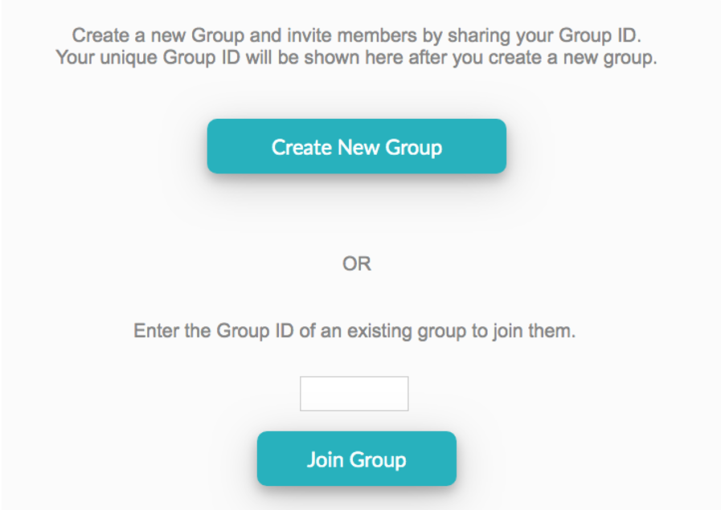
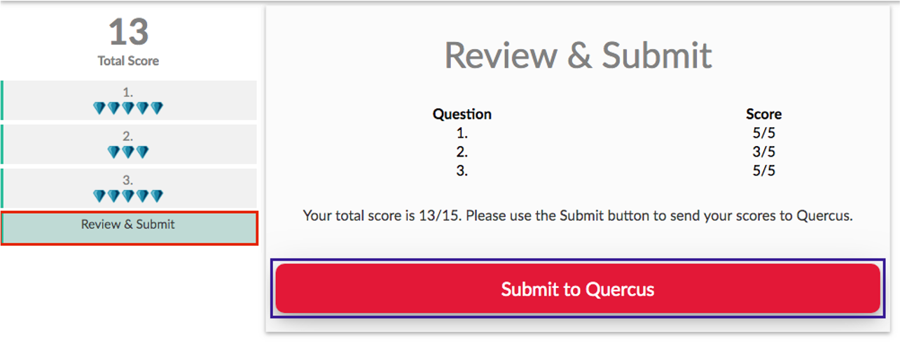

# (PART\*) Appendix {-}

# Resources

## Course tools overview

While we've tried to keep things as streamlined as possible, there are still several different tools we'll be using this semester. Your U of T login should work with all of them. The below PDF file provides an overview of how you'll be interacting with each one.

-   At the bottom of the page is an embedded slideshow introducing you to the JupyterHub.\
-   You can always access Piazza from the Navigation Menu on the left.\
-   Instructions for setting up your U of T Zoom are on the Zoom page and links are in the Navigation menu and on the home page.

```{r, echo=FALSE, message=FALSE, warning=FALSE}
library(tidyverse)
library(pander)
```

### Admin

```{r, echo=FALSE, message=FALSE, warning=FALSE}
tibble(
  Logo = c("images/course-tools/quercus.jpg" %>% pander::pandoc.image.return(),
           "images/course-tools/zoom.png" %>% pander::pandoc.image.return(),
          "images/course-tools/forms.png" %>% pander::pandoc.image.return(),
  "images/course-tools/markus_logo.jpeg" %>% pander::pandoc.image.return(),
  "images/course-tools/peer-scholar.png" %>% pander::pandoc.image.return()
  ),
  Description = c("[Quercus](https://q.utoronto.ca/) will be used for timed assessments, some submissions and announcements.",
                  "Synchronous classes and office hours will be hosted via [Zoom](https://utoronto.zoom.us). You MUST join using your U of T Zoom account to be admitted. Get your account: utoronto.zoom.us",
                  "Microsoft Forms will be used for several important administrative forms. You will need to be signed in to your U of T account in the same browser to access these.",
                  "[Markus](`r markus`) will be used for the submission of code and analysis documentation for several assessments.",
                  "peerScholar will be used for the Create, Asses and Reflect phases of the module writing and peer review tasks. You can access the peerScholar links through the associated Quercus assessments.")
) %>% 
pander::pander()
```

## Using RStudio with the JupyterHub

We will be using R through RStudio to conduct analyses in this course. If you have a local installation of R you are welcome to continue using that, but, for this course, you do not need to have R and RStudio installed. Instead, assessments and activities will be shared through the U of T JupyterHub. This gives you access to RStudio in your browser through your U of T login on any internet-connected device. It means you don't have to fight package installations and we can instead focus on the good stuff.

**Please read through the following slides, experiment with the example sharing link, make sure you know how to knit an Rmd to pdf + export the pdf, and practice navigating and moving files.**

<iframe src="https://rstudio-with-jupyerhub-uoft.netlify.app" width="100%" height="500" allowfullscreen="allowfullscreen" data-mce-fragment="1">

</iframe>

Link: <https://rstudio-with-jupyerhub-uoft.netlify.app>.


## Team Up!

[Link to student-facing Quercus Support resources.](https://q.utoronto.ca/courses/46670/pages/integration-team-up-for-students)


Please only attend one of these sessions if you are prepared to...

```{r, echo=FALSE, fig.align='center', out.width="60%"}
knitr::include_graphics("images/course-tools/engage.jpeg")
```

Image description: Captain Picard (of the Starship Enterprise) in uniform, pointing forwards. Text reads: ENGAGE

### To participate in these activities, you **need**:

-   A U of T LICENSED Zoom account to access the call. Some troubleshooting tips in this announcement: [Make sure your Zoom is licensed!](https://q.utoronto.ca/courses/253305/discussion_topics/1565885 "Make sure your Zoom is licensed!").

-   A reasonable **internet connection**.

-   A **working microphone.**

-   To be WILLING TO ACTIVELY PARTICIPATE. Please don't ruin this for others who are interested in engaging in meaningful group problem-solving.

    -   There is **no reason to come and lurk**. These sessions are the activity and nothing else.

    -   You can easily get marks for your 🧺knowledge basket in SOOO many other ways AND I will make an asynchronous practice version available so you don't miss out on practice. 

### **Before** the activity you should:

1.  Remember that **you don't have to participate in Team Up! activities**, there are plenty of other ways to earn your 🧺knowledge basket marks. 

    -   Only participate if you really are going to participate (see above).

2.  Check you can access **Shiny interactives** on the JupyterHub: [Module 1 interactive](https://jupyter.utoronto.ca/hub/user-redirect/git-pull?repo=https%3A%2F%2Fgithub.com%2Fsta303-bolton%2Fsta303-w22-activities&urlpath=shiny%2Fsta303-w22-activities%2Finst%2Ftutorials%2Fsta303_m1_tests%2F&branch=master).

    -   If you get a 'Not Found' error this is most likely due to one of two issues:

        -   Solution 1: Ensure you don't have any other interactives open. (Close any tabs with the orange-arcs JupyterHub logo).

        -   Solution 2: Go to <https://jupyter.utoronto.ca>, open a new RStudio session by going New -\> RStudio (see slide 3 of [these instructions](https://sta303-bolton.github.io/sta303-w22-courseguide/resources.html#using-rstudio-with-the-jupyterhub)) and move any .Rmd files in your 🏠Home directory (see slide 10 of [these instructions](https://sta303-bolton.github.io/sta303-w22-courseguide/resources.html#using-rstudio-with-the-jupyterhub)) to a new folder (or delete them if you don't need them). Remember: No naked Rmds in YOUR home!

3.  Decide if you want to be **randomized into a group** or **work with a group of people you already know in the course** (section/tut enrolment doesn't matter).

    -   If **randomizing**, join the Zoom link for the tutorial time you are attending. 'Arrive' on time as latecomers may not be placed in a group.

    -   If **working with your own group**, you don't need to join the call (but can if you get stuck with the tech!). Decide at which time you want to do the activity and set up a personal Zoom/Teams/WeChat/Instagram/carrier pigeon/semaphore chat. Zoom has nothing to do with Team Up!.

4.  Read over the Team Up! instructions below.

### Some rules/logistics

-   **Speak up!** Practice talking about statistics. For these activities, I'd honestly rather you be wrong out loud than right in silence.

-   **Be kind** and constructive. You are in a team, practice being a good team member.

-   Team Up! does not have a great back end. If you don't submit correctly or don't join a group correctly, I CANNOT go in and check or move you around. **FOLLOW INSTRUCTIONS**.

    -   No accommodations will be made for Team Up! issues. Team Up! marks will not be updated by hand (e.g., if you end up in a solo group/tech issues, etc.).

-   You must do this as a group activity, during a tutorial time, if you wish to receive a 🧺knowledge basket grade.

    -   **A 'group' is 2--4 people.**

    -   All members of groups of 1 (solos) and 5+ will receive a zero. Group size is based on what is **recorded by Team Up!** through your registration with your group codes.

-   You cannot do a Team Up! more than once.  You cannot attend both sessions.

-   If you have a ghost 👻in your room (randomized in the class organized Zoom call), please 'Ask for help' (there is a button). 'Raise hand' *doesn't* alert me if you're in a breakout room.

**Timing note: Assessment pages will become available at 15 minutes past the hour and remain available for 45 minutes. Ensure sure your team submits by the end of the session.**

### Team Up! Instructions

Participating in Team Up! activities can earn you knowledge basket points. They will be based on how well your team does, so work together and give it a good effort. 

You will complete the following 5 steps:
.midi[
1. **Introductions** (first/personal name + a one-word description of how your week is going so far). Use this time to confirm everyone understands the instructions.
2. **Driver** sets up Team Up! group
3. **Members** join Team Up! group
4. Complete the activity
5. **Submit** the activity


#### Step 1: Decide on roles

You will need: 

* An **Instructions Master** who is responsible for helping the team follow these instructions carefully.  
* A **Screensharer** who is responsible for sharing the activity on their screen. 

* A **Driver** for the Team Up! side of the activity. The Driver acts as team leader, responsible for navigating the quiz, confirming the team's final agreed upon answer to a question, and submitting the completed quiz score to Quercus.The Driver has a steering wheel next to their ID and is differently coloured than other Team Members.


Team Members (other than the Driver) participate and choose vote on answers, so all team mates can see what they have chosen, but they cannot submit their choices to Team Up!.


DECIDE THIS BEFORE CLICKING ANYTHING TO DO WITH TEAM UP!

#### Step 2: Driver sets up group

The person in your group whose first/personal name comes last alphabetically will be the Leader (Driver) for the session.

**The Driver must do the below steps FIRST to get the group code.** Then they will share the group code with all the members of the group so they can also join.

1  Log-in to Quercus from your device (phone, tablet, computer).

1 Click on the Team Up! assignment from the [Course Overview](`r course_overview`) page.


2 Click ‘Go to Tool’. If it is not appearing, refresh your page or try a different browser.

```{r, echo=FALSE, fig.align='center', out.width="50%", fig.align="center"}
knitr::include_graphics("images/course-tools/gototool.png")
```

NON-DRIVERS! DO NOT TOUCH ANYTHING!

3 Choose “Create New Group”

```{r, echo=FALSE, fig.align='center', out.width="100%", fig.align="center"}

```


4 Share group ID in Zoom 
```{r, echo=FALSE, fig.align='center', out.width="100%", fig.align="center"}
knitr::include_graphics("images/course-tools/group id.png")
```


#### Step 3: Members join

Once the Driver has shared the group ID, AND ONLY THEN do the following:

1 Click on the Team Up! assignment from the [Course Overview](`r course_overview`) page.


2 Click ‘Go to Tool’. If it is not appearing, refresh your page or try a different browser.

```{r, echo=FALSE, fig.align='center', out.width="50%", fig.align="center"}
knitr::include_graphics("images/course-tools/gototool.png")
```

3 Input the code your driver provided and click 'Join Group'. 

```{r, echo=FALSE, fig.align='center', out.width="45%", fig.align="center"}

```

#### Step 4: Complete the activity

1. You will need to have the __interactive activity (question document)__ associated with this task open on to see the answer options and update any code. __Be prepared to switch between Team Up! and the JupyterHub tab.__

2. The Driver chooses a question, and the team can participate by choosing their own answers and discussing their choices with each other. Once the team decides on a final answer, the driver chooses it and clicks the Check Answer button. **Note**: The Driver can check an answer despite what the team members choose, so be careful that you have consensus before clicking the Check Answer button. You cannot undo.

3. If the answer is __correct__, you will be awarded the full score or "diamonds" for that question. You will be able to proceed onward by clicking the Next button that will appear under the Check Answer button or by clicking on a question in the menu on the left. If your team's answer is __not correct__, discuss the question and choose again. Repeat until you get the correct answer. All teammates can see whether responses are correct/incorrect as well as their team's overall score as they progress through the Team Up! session.


#### Step 5: The Driver MUST click Submit to Quercus for your answers to be processed. 

If this is not done, no one on the team will get a grade!!!!

```{r, echo=FALSE, fig.align='center', out.width="70%", fig.align="center"}

```

## Zoom, Zoom, Zoom, Zoom... {#zoomzoomzoomzoom}

\
Access to STA303 synchronous meetings and office hours is restricted to our students.\
\

[Set up your U of T Zoom account](https://utoronto.zoom.us/signin)

### Make sure your Zoom is up to date

To participate fully, you will need Desktop client or mobile app: version 5.3.0 or higher. You can check your desktop client or mobile app version by following [these instructions.](https://support.zoom.us/hc/en-us/articles/201362393-Viewing-the-Zoom-version-number)

### Customize!

Once you have logged in, [please customize your profile](https://support.zoom.us/hc/en-us/articles/201363203-Customizing-your-Profile):

-   Update your name to your **preferred name** (what you would like us to call you in class) Note: this may not be allowed with your U of T settings, so don't worry if this doesn't work.

-   Add a **profile picture** (please make it a photo of YOU or an avatar that looks like you...we don't want Snoopy or Joe Biden^[Yes, these are real images students have used.] in class)


### VPN

There is a [University of Toronto VPN (UTORvpn)](https://isea.utoronto.ca/services/vpn/utorvpn/) that you have access to as a student. It may help with video quality and access to U of T resources.\
If you are based in mainland China, the [Alibaba Cloud Enterprise Network (CEN)Links to an external site.](https://onesearch.library.utoronto.ca/ic-faq-categories/alibaba-cloud-enterprise-network-cen-service) service should help with your Quercus access.

### Notes:

1.  Please always use your real name and face for this course, and be cautious about changing them and your virtual background for other meetings. A joke background for a call with family or friends may not be appropriate for class.

2.  For class meetings, the settings will always be that your camera and microphone are off to begin with so you have the control to check these things first.

3.  We do ask that, when possible, you use your microphone in office hours, breakout groups and any other small group meetings and strongly prefer that you use your camera AND microphone. We trust you to make the best choice for your environment, comfort and learning.

4.  You may get a **"This meeting is for authorized participants only message".** Choose the "Sign in with SSO" option to sign in.

### Changing your profile picture on Zoom and Quercus

Follow these instructions to add a profile picture (or bitmoji style avatar if you'd prefer) to [Quercus](https://community.canvaslms.com/docs/DOC-10599-4212710334) and [Zoom](https://support.zoom.us/hc/en-us/articles/201363203-Customizing-your-profile). I want this experience to be more social and less faceless. Please don't use photos of cartoon characters, etc. A good photo will be a close-up of your face so we can see who you are even when the photo is small.

### What to do if you experience technical difficulties during class?

**First**, (if possible) send me a chat note that you're having technical difficulties and are working to resolve them.

**Second**, leave the meeting and re-enter. This often resets things and resolves the problem. Before entering the meeting, make sure all of your devices are properly plugged in and Bluetooth devices are connected.

If that doesn't fix things, exit the meeting again and update your Zoom Client. This is the Zoom software that should be on your computer. Here's a short video tutorial explaining how to update the software: <https://www.youtube.com/watch?v=E7zERcVLUBM>.

After updating, enter the meeting again to see if this resolved your problems.

**Our synchronous classes are recorded, so if your technology is just going catastrophically wrong, go get a cup of tea/coffee/water and relax, you can catch up with the recording when it is posted on Quercus.**

### What to do if your instructor or TA is experiencing technical difficulties on Zoom

**First,** check the **chat** to see if the instructor or the project mentor have said what is going on and what they are doing to fix things and follow any instructions they give.

**Second**, if they have disappeared completely, wait 10 minutes (or until the end of the meeting time, whichever comes first) before closing the call. (You can do other things in the meantime, but be ready to jump back in).

**Third**, expect to see an announcement on Quercus afterwards telling you what to do (e.g. it might be to watch a video I'll record later, to review some slides or perhaps there is nothing to do and i'll see you next time).

## Student support services and resources

### Mental health support

You may find yourself feeling overwhelmed, depressed, or anxious. Lots of people feel the same way. There is help available from mental health professionals 24 hours a day via online and phone-based services. Here are some that are available to U of T students:

-   [MySSP - My Student Support Program](https://www.studentlife.utoronto.ca/hwc/myssp) 1-844-451-9700, or outside of Canada call 001-416-380-6578

-   [Good2Talk Student Helpline](https://good2talk.ca/) 1-866-925-5454, or text GOOD2TALK to 686868

-   [Distress Centres of Greater Toronto](https://www.torontodistresscentre.com/) 416-408-4357, or text 45645

There is also the new Navi tool for U of T students, it is a chatbot and your questions are totally anonymous. <http://uoft.me/navi>

The student union are also curating a list here: <https://www.utsu.ca/mental-health/>

### General University resources

The following are some important links to help you with academic and/or technical service and support:

-   [**Health & Wellness**](https://studentlife.utoronto.ca/department/health-wellness/) can help with appointments with a range of clinicians, nutrition, immunizations, sexual and reproductive health and much more. Many of their services continue to be available online.

-   **Arts & Sciences** student resources through [Sidney Smith Commons Online](https://sidneysmithcommons.artsci.utoronto.ca/)

-   **General** student services and resources at [Student Life](https://www.studentlife.utoronto.ca/ "Student Life")

    -   Tips for dealing with [multi-choice questions](https://studentlife.utoronto.ca/task/multiple-choice-tests-and-exams/) (MCQs)

    -   Book an appointment with a [learning strategist](https://studentlife.utoronto.ca/service/learning-strategist-connections/) (they can help you with strategies for MCQs also)

-   Full **library** service through the [University of Toronto Libraries](http://onesearch.library.utoronto.ca/ "University of Toronto Libraries")

-   Resources on **academic support** from the [Academic Success Centre](http://www.asc.utoronto.ca/ "Academic Success")

-   Learner support at the [**Writing** Centre](http://www.writing.utoronto.ca/ "Writing Centre")

-   Information about [**Accessibility** Services](http://accessibility.utoronto.ca/ "Accessibility Services")

-   Quercus Information in the [Canvas Student Guide](https://community.canvaslms.com/docs/DOC-10701)

-   Logistical and social support for **international students** at the [Center for International Experience](https://studentlife.utoronto.ca/cie)

Visit the A&S [online resources for students page](https://www.artsci.utoronto.ca/current/academic-advising-and-support/online-resources-students) for resources available to support you through your online studies. If you have further questions, please email [ask.artsci\@utoronto.ca](mailto:ask.artsci@utoronto.ca).

### Financial support

A list of University financial supports, work-study opportunities, as well as provincial and federal government programs is available on the University's [Financial Support & Funding Opportunity directory](https://www.viceprovoststudents.utoronto.ca/covid-19/funding-opportunity-directory/).

### Arts & Science COVID19 FAQ

The [**Arts & Science Undergraduate FAQ page**](https://www.artsci.utoronto.ca/covid19-artsci-student-faqs) addresses frequently asked questions that are specific to undergraduate students taking courses with the Faculty of Arts & Science. On this page you will find information for:

Messages from Dean Woodin can be found on the [A&S latest updates page](https://www.artsci.utoronto.ca/news/covid-19-and-u-ts-response-latest-updates-and-faqs).
