```{r, echo=FALSE}
source("links.R", local = knitr::knit_global())
library(knitr)
```

# How to use this course guide

```{r, echo=FALSE, out.width="50%", fig.align='center'}
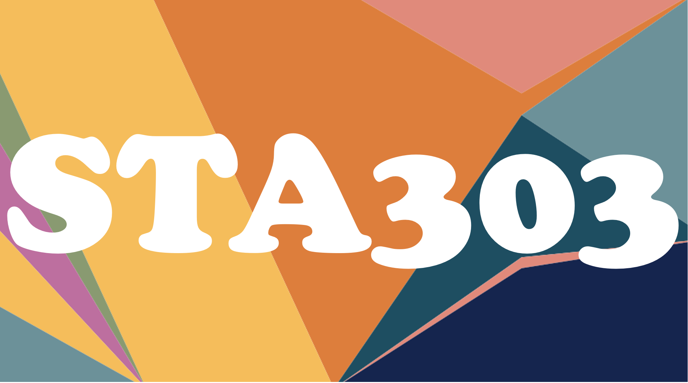
```

This course guide has been created in R using the [`bookdown`](https://bookdown.org/) package.

In the web version, you can put this guide into dark mode and change the font style, if you find a different display preferable. Play around with the buttons at the top of the screen and see what they do.

You can download a PDF version of the whole guide with the download button (on the web version, look for the PDF icon button at the top). Note that *many* parts of this guide will be updated as the course proceeds, so the PDF might not be that useful to you unless you are separating out relevant portions for your annotations/notes, etc. Alternatively, to get just a specific chapter, you can 'Print to PDF' from your browser, and this is also how you can get a PDF copy of any linked/embedded slides. Shortcut: Cmd+P or Ctrl+P, and select 'Save as PDF' (or similar).

## Communication policy reminder

All content and logistics questions must be asked on [Piazza](`r piazza`). Personal or private course matters should be emailed to [sta303@utoronto.ca](mailto:sta303@utoronto.ca). Quercus mail or emails sent directly to teaching team members will not be answered. If you've missed an assessment due to illness or emergency, please fill out the appropriate form.

See the [communication policy in the syllabus](#communication-policy) for more information.

## Intellectual property statement

Course material that has been created by your instructor (i.e., lecture slides, questions/solutions, and any other course material and resources made available to you) is the intellectual property of your instructor (or the credited holder of the copyright) and is made available to you for your personal use in this course. Sharing, posting, selling or using this material outside of your personal use in this course is not permitted under any circumstances and is considered an infringement of intellectual property rights. If you would like to record any course activities in this course, you MUST ask permission from your instructor in advance. According to intellectual property laws, not asking permission constitutes stealing.

### Tutoring companies

Tutoring companies do not have any right to suggest they are associated with this course. There is extensive support available within the course, department and university for all students. __It is the opinion of the author that many tutoring companies are a predatory scam and a potential risk to students' academic integrity.__ This statement should be prominently included by any such company seeking to share this resource.

## Contributors

Big thanks to Amin Banihashemi, Sonia Markes, Ian Richter, Dongyang (Dawn) Yang, Kevin Zhang, and Rob Zimmerman for their contributions to this course guide.

<!--chapter:end:index.Rmd-->

---
output:
  pdf_document: default
  html_document: default
---

```{r, echo=FALSE}
source("links.R", local = knitr::knit_global())
```

# Syllabus {#syllabus}

You can get a more visual PDF version of the syllabus [here](https://sta303-bolton.github.io/sta303-w22-courseguide/other-files/STA303-1002_W22_syllabus.pdf). This version is hopefully better suited to searching and screen readers.

*University of Toronto, Department of Statistical Sciences*\
*STA303/1002: Methods of Data Analysis II*

## Course information

**2022**\
**HALF YEAR, HALF CREDIT**

### Course description

The course focuses on using and interpreting advanced statistical methods with applications in a number of different areas. The overall theme of this course is dealing with situations where the assumptions of the regression models developed in STA302 may not apply. The course is a mixture of theory and application. Assignments will involve computing with R and there is a significant focus on written and oral communication.

### Class times

**Class**: Wednesdays

-   L0101: 10:00 a.m.---12:00 p.m. ET
-   L0201: 3:00 p.m.---5:00 p.m. ET

**Tutorials**: Alternating Thursdays

-   12:00 p.m.---1:00 p.m. ET or
-   5:00 p.m.---6:00 p.m. ET

**Delivery**

-   Wednesday classes will be **online** and recorded.

-   The Thursday tutorial time will alternate between group activities and TA office hours. They will be **online** for January, and an optional in-person stream for the fortnightly group activities is planned after that.

-   **Synchronous attendance** is recommended but not required to complete the course.

### Materials

All **materials** will be posted on [Quercus](https://q.utoronto.ca/courses/253305) and/or the [course guide](https://sta303-bolton.github.io/sta303-w22-courseguide/).

**Course discussion board:** [Piazza](http://piazza.com/utoronto.ca/winter2022/sta303sta1002/home)

### Teaching team

#### **Instructor**

Liza Bolton

**Pronouns:** [she/her](https://www.mypronouns.org/she-her)

**Email:** [sta303\@utoronto.ca](mailto:sta303@utoronto.ca)

**Office hours:** 2nd half of Wednesday classes

**Please call me:** Liza or Prof. Bolton/Prof. B

*How do you pronounce that?*

-   Liza: [a video...](https://www.youtube.com/watch?v=hWURas7fYwk)

-   Bolton: like the words "bowl" + "tonne"

#### Head TA

Amin Banihashemi ([he/him](https://www.mypronouns.org/he-him))

**Please call me:** Amin (A-meen [æˈmiːn or əˈmiːn] [bæniːˈhɑːʃɛmiː] decode [here](https://easypronunciation.com/en/phonetic-symbols-chart/british-english/ipa))

**Email**: [sta303\@utoronto.ca](mailto:sta303@utoronto.ca)

#### Teaching assistants

Vedant Choudhary, Shuang Di, Sonia Markes, Ian Richter, Xiaochuan Shi, Lei Sun, Liam Welsh, Dongyang Yang, Kevin Zhang, Robert Zimmerman

**Office hours:** Alternating Thursdays, see Quercus

**Email:** [sta303\@utoronto.ca](mailto:sta303@utoronto.ca)

## Land acknowledgment

The land on which our University operates is the traditional lands of the Anishinaabe, the Haudenosaunee, and the Mississaugas of the Credit. With the Dish With One Spoon treaty, these peoples agreed to share and protect this land, and all those who have come here since, both Indigenous and non-Indigenous, are invited into this treaty in a spirit of respect and peace. This land is also, more recently, subject to Treaty 13, a treaty between the Mississaugas and the British Crown.

In this course, we are coming together to discuss statistics, a field that has been part of historical and ongoing colonization, oppression, and harm of Indigenous peoples. Let us remind ourselves of our responsibilities to this land, its original peoples, and to each other and work to be ethical and culturally competent practitioners in our chosen fields.

We encourage you to consider the history of the land wherever you are. <https://www.whose.land/en/>

## Prerequisites

STA302/1001

I.e., we will assume that you are familiar with running linear regression analyses, including checking assumptions and some of the mathematical reasoning behind the models. Material from the second-year statistical theory courses which are prerequisites to STA302 will be drawn on extensively. Knowledge of programming with R is essential.

## Course format and organization

This course is composed of **five two-week modules** and **two assessment focus weeks.**

Each **module** has an "I show you, you show me" structure. It starts with you watching videos and/or doing readings and a guided code demonstration or other relevant class topics ("I show you"). This course is flipped, so the expectation is that you engage with some or all of the asynchronous content before Wednesday in the first week. Then you will do some or all of the following: a group problem-solving activity, practice quizzes, assessment activities.

During **assessment focus weeks**, no new content will be released.

## Learning objectives

By the end of the course, you will be able to:

-   **Wrangle** and **explore** a dataset

-   Create appropriate data **visualizations**

-   Describe **ethical** **considerations** in data analysis

-   Understand the assumptions and appropriate use cases for **linear mixed models, generalized linear models, generalized linear mixed models,** and **generalized additive models**

-   **Write** and **execute R code** for the model types covered

-   Accurately and appropriately **interpret** the results of the model types covered and communicate these to a range of **audiences**

## Textbooks

You do not have to purchase a textbook for this course. There are three texts that we will use extensively, and they are all freely available to you. Additional readings will be assigned as appropriate.

[Wickham. R for Data Science. 2019.](https://r4ds.had.co.nz)

[Legler and Roback. Broadening Your Statistical Horizons. 2019.](https://bookdown.org/roback/bookdown-bysh/)

[Wood. Generalized Additive Models: An Introduction with R, 2nd Edition. 2017.](https://ebookcentral-proquest-com.myaccess.library.utoronto.ca/lib/utoronto/detail.action?docID=4862399) (requires you to log in with your UTORid)

## Computing and minimum technical requirements

We will be using [RStudio](https://www.rstudio.com/) to make reproducible data analysis reports using [R](https://www.r-project.org/) and [R Markdown](http://rmarkdown.rstudio.com/).

You can use RStudio on your personal machine or through the U of T JupyterHub: [jupyter.utoronto.ca](https://jupyter.utoronto.ca/).

To participate in synchronous classes and office hours you will need a **U of T Zoom account.** If you do not yet have one, go to <https://utoronto.zoom.us/> to set one up. To participate fully, you will need Desktop client or mobile app: version 5.3.0 or higher or ChromeOS: version 5.0.0 (4241.1207) or higher. You can check your desktop client or mobile app version by following [these instructions.](https://support.zoom.us/hc/en-us/articles/201362393-Viewing-the-Zoom-version-number)

All students should consult the [minimum technical requirements](https://www.viceprovoststudents.utoronto.ca/covid-19/tech-requirements-online-learning/) for participation in online learning. If you are facing financial barriers to obtaining the required technology, please contact your [College Registrar's Office](https://www.artsci.utoronto.ca/current/academic-advising-and-support/college-registrars-offices) to obtain information regarding your potential eligibility for a need-based bursary.

## Course outline

The topics listed below are subject to change.

+-------------------------------------------------------------------------------------------+------------------------------------------------------------------+
| Module/focus                                                                              | Important dates                                                  |
+===========================================================================================+==================================================================+
| **Jan 10--21 Module 1: Welcome!**                                                         | **JAN 20** Prerequisite knowledge check due                      |
|                                                                                           |                                                                  |
| -   How this course works, assessments, admin, upward management                          | **JAN 23** Last day to enrol in S courses                        |
|                                                                                           |                                                                  |
| -   Common tests as linear regression and linear regression recap                         |                                                                  |
|                                                                                           |                                                                  |
| -   Reading strategy: previewing and skimming                                             |                                                                  |
|                                                                                           |                                                                  |
| -   [Optional] Get ahead for module 2 if unfamiliar with R Markdown, ggplot and dplyr     |                                                                  |
+-------------------------------------------------------------------------------------------+------------------------------------------------------------------+
| **Jan 24--Feb 4 Module 2: Professional skills for data analysis**                         | **FEB 1** Lunar New Year 🐯                                       |
|                                                                                           |                                                                  |
| -   Data visualization                                                                    | **FEB 2** Prerequisite check workshop                            |
|                                                                                           |                                                                  |
| -   Data cleaning, merging, and exploration                                               | **FEB 3** Professional dev proposal due                          |
|                                                                                           |                                                                  |
| -   Statistical communication                                                             | **FEB 3** Mini-portfolio due                                     |
|                                                                                           |                                                                  |
| -   Ethical professional practice                                                         |                                                                  |
+-------------------------------------------------------------------------------------------+------------------------------------------------------------------+
| **Feb 7--18 Module 3: Linear mixed models**                                               | **FEB 14** Valentine's Day 💕                                     |
|                                                                                           |                                                                  |
| -   Identifying correlated data                                                           | **FEB 17** Portfolio due                                         |
|                                                                                           |                                                                  |
| -   Fixed and random effects                                                              |                                                                  |
|                                                                                           |                                                                  |
| -   Fitting, visualizing and interpreting correlated data                                 |                                                                  |
|                                                                                           |                                                                  |
| -   Likelihood ratio tests                                                                |                                                                  |
+-------------------------------------------------------------------------------------------+------------------------------------------------------------------+
| **Feb 21--25 Reading Week: No class!**                                                    | **FEB 21** Family Day (U of T closed)                            |
+-------------------------------------------------------------------------------------------+------------------------------------------------------------------+
| **Feb 28--Mar 11 Module 4: Generalized linear models**                                    | **MAR 9** Mini-mixed assessment (12 hour window, 8 a.m.--8 p.m.) |
|                                                                                           |                                                                  |
| -   Theory for GLMs                                                                       |                                                                  |
|                                                                                           |                                                                  |
| -   Fitting models, checking assumptions and interpreting logistic and Poisson regression |                                                                  |
+-------------------------------------------------------------------------------------------+------------------------------------------------------------------+
| **Mar 14--18 Mixed assessment focus week**                                                | **MAR 13** Daylight savings begins                               |
|                                                                                           |                                                                  |
|                                                                                           | **MAR 14** Last day to cancel course                             |
|                                                                                           |                                                                  |
|                                                                                           | **MAR 16** Mixed assessment (12 hour window, 8 a.m.--8 p.m.)     |
+-------------------------------------------------------------------------------------------+------------------------------------------------------------------+
| **Mar 21--Apr 1 Module 5: GLMMS and GAMS**                                                | **MAR 31** Professional dev evidence and reflection due          |
|                                                                                           |                                                                  |
| -   Generalized linear mixed models                                                       |                                                                  |
|                                                                                           |                                                                  |
| -   Generalized additive mixed models                                                     |                                                                  |
+-------------------------------------------------------------------------------------------+------------------------------------------------------------------+
| **Apr 4--8 Project Focus week**                                                           | **APR 7** Final project due (bonus)                              |
|                                                                                           |                                                                  |
|                                                                                           | **APR 11** Project (no bonus)                                    |
+-------------------------------------------------------------------------------------------+------------------------------------------------------------------+

## Assessments

There are two special elements of assessment/grade calculation in this course that are important to be aware of in planning your approach to it.

-   *Two roads diverged in a yellow wood*[^syllabus-1]*:* You can opt for Path A or Path B to get your final mark. I will calculate your marks along both paths and then assign you the higher of the two as your final mark. (Grad students have a third option)

-   A-tisket, a-tasket[^syllabus-2], fill up your **knowledge basket**[^syllabus-3]:

    -   Personalize which of these assessments you do based on your interests and skills you want to develop.

    -   You can 'max out' your basket: just keep putting grades in until you get to 5%.

[^syllabus-1]: The Road Not Taken, by Robert Frost. But, dear traveller, you can in fact take both roads and then get whichever gives you the better mark. <https://www.poetryfoundation.org/poems/44272/the-road-not-taken>

[^syllabus-2]: A-tisket, a-tasket by Ella Fitzgerald, <https://www.youtube.com/watch?v=1bgFkeDLpSI>

[^syllabus-3]: "Whaowhia te kete mātauranga" is a Māori proverb meaning "Fill up the basket of knowledge". Mātauranga is specifically traditional Māori knowledge. You can listen to the pronunciation here <https://www.massey.ac.nz/student-life/m%C4%81ori-at-massey/te-reo-m%C4%81ori-and-tikanga-resources/te-reo-m%C4%81ori-pronunciation-and-translations/whakatauk%C4%AB-m%C4%81ori-proverbs/>

| Assessment            | Path A | Path B | STA1002 ONLY | Due dates                                                   |
|-----------------------|-------:|-------:|-------------:|-------------------------------------------------------------|
| Mini-portfolio        |      5 |      0 |            0 | Feb 3                                                       |
| Portfolio             |     20 |     25 |           25 | Feb 7                                                       |
| Mini-mixed assessment |      5 |      0 |            0 | Mar 9 (12-hour assessment window, 8:00 a.m.--8:00 p.m. ET)  |
| Mixed assessment      |     20 |     25 |           25 | Mar 16 (12-hour assessment window, 8:00 a.m.--8:00 p.m. ET) |
| Final project         |     45 |     45 |           50 | Apr 7 (2% pt bonus) \| Apr 11 (no bonus)                    |
| Knowledge basket      |      5 |      5 |            0 | Multiple                                                    |
| Total                 |    100 |    100 |          100 |                                                             |

Everything [^syllabus-4] in STA303 is due at 3:03 p.m. ET

[^syllabus-4]: Mixed assessment windows are 8-8, I couldn't make the 303 work out fairly.

Note: All times in this course are in Eastern Time (Toronto time). Please note that daylight savings will begin in Canada on March 13. If you are not based in Canada this may change the time conversion for you. Please keep this in mind.

### Knowledge basket

The following components are guaranteed knowledge basket assessment options. Additional opportunities may be offered throughout the course (Team Up!, speaker series reflections, etc.)

| Assessment                                          | \%      | Due date                                |
|-----------------------------------------------------|---------|-----------------------------------------|
| Pre-knowledge check: completion                     | 0.5     | Jan 20                                  |
| Pre-knowledge check: 80%+ or workshop               | 0.5     | Jan 20 (80%+ score) \| Feb 2 (workshop) |
| Professional development task proposal              | 1       | Feb 3                                   |
| Professional development task evidence & reflection | 3       | Mar 31                                  |
| Writing & peer review (Create-Assess-Reflect) x 5   | 0.5 X 5 | Friday-Tuesday-Friday each Module       |
| Module check-in x 5                                 | 0.1 X 5 | Last Friday of each Module              |

## Hours expectations

While everyone has different work styles and learning needs, I want to provide some guidance around how I expect this course to look for you.

Plan to be doing 6--8 hours of work on STA303 each week. In a **two-week module**, this may look like:

-   2--4 hours on videos and readings

-   1--3 hours of attending synchronous class or reviewing the recording and activities

-   1--2 hours on knowledge basket assessments

-   2--6 hours on other assessments

-   Remaining time attending reading announcements, office hours, checking Piazza, revision, etc.

## Marking concerns / regrade requests

Any request to have an assessment remarked must be submitted to [the appropriate form](https://forms.office.com/Pages/ResponsePage.aspx?id=JsKqeAMvTUuQN7RtVsVSEOKHUU3SzAJJhmOKjJhDWEpUNE02UzJaMUNQM0Q2U0RTOUlJS1JMM1dCTC4u) on the Forms page on Quercus under the following conditions:

-   **Wait** 24 hours after the release of grades. Use this time to go over any sample solutions and feedback, the instructions, and relevant course materials.

-   After the 24-hour period has finished, you will have one week to submit your regrade request. (I.e., one week + 24 hours total.)

-   Your request must include a detailed and thoughtful justification referring to your answer and the relevant course material to be considered. Please note that I reserve the right to review the grading of all questions or parts when you re-submit an assessment for reconsideration (i.e., your grade could go down).

-   You will receive a confirmation email upon submitting the form. Allow for two weeks for processing after the request window closes before following up.

-   The specific timeline and requirements for **final project regrade requests** will be announced later.

Only answers in English (or appropriate code, mathematical symbols) can be accepted in this course. Answers submitted in a different language will receive a 0 and will not be eligible for regrading. If you have an autotranslation extension on your browser, be very careful about how this can interact with Quercus.

**Please note that I reserve the right to review the grading of all questions or parts when you re-submit an assessment for reconsideration (i.e., your grade could go down).**

## Missed work policies

In general, late work is not accepted, without either:

-   an extension requested **48 hours** before the due date, or

-   a personal illness/emergency declaration no more than 3 days after the due date.

Please note that technical difficulties knitting an Rmd or getting the due time wrong do **not** constitute personal emergencies.

The following assessments are eligible:

-   Mini-portfolio

-   Portfolio

-   Mini-mixed assessment

-   Mixed assessment

-   Professional development proposal

-   Professional development evidence and reflection

Upon receipt of your request, we will contact you via email within 2 business days to confirm an accommodation, as appropriate.

### Exceptions

-   **Knowledge basket** assessments (other than the professional development task components) are not eligible for extensions.

-   There are no routine extensions granted for the **final project.** In exceptional circumstances, you can work with your College Registrar and me on this.

### IMPORTANT NOTES

-   If too much work is missed, even for valid reasons, an **oral exam** may be required to calculate a fair mark, at the discretion of the instructor. Please ensure you and/or your College Registrar get in touch with me as early as possible if this may be the case for you.

-   If you have accommodation letters from an accessibility advisor, make sure you read the instructions in the 'Accommodations and accessibility' section.

-   Unless discussed with your instructor first and an agreement is come to, if you submit an assessment, it will be assumed that you deemed yourself fit enough to do so and your grade will stand as calculated. No accommodation will be made based on claims of medical, physical, or emotional distress after the fact.

## Communication policy

*AKA How to get your questions answered*

Following our course communication policy helps ensure you receive answers and supports in a timely fashion, and also shows respect for the teaching team's time and effort. We reserve the right to ignore any correspondence that does not conform to this policy.

+---------------------------------------------------------------------------------------------------------------------+-------------------------------------------------------------------------------------------------------------------------------------------------------------------------------------------------------------------------------------------------------------------------------------------------------------------------------------+
| **Course logistics? e.g.,**                                                                                         | **PIAZZA FORUM**                                                                                                                                                                                                                                                                                                                    |
|                                                                                                                     |                                                                                                                                                                                                                                                                                                                                     |
| *- What is the deadline for the final project?*                                                                     | -   Link in Quercus' course navigation menu.                                                                                                                                                                                                                                                                                        |
|                                                                                                                     |                                                                                                                                                                                                                                                                                                                                     |
| *- Where do I submit the assignment?*                                                                               | -   Posts can be anonymous for your classmates, but instructors and TAs will be able to see your name.                                                                                                                                                                                                                              |
|                                                                                                                     |                                                                                                                                                                                                                                                                                                                                     |
| **Course content? e.g.,**                                                                                           | -   Before posting a question, double-check the syllabus AND search to see if someone else has already asked a similar question (you can edit the question to add yours or post a follow-up at the bottom).                                                                                                                         |
|                                                                                                                     |                                                                                                                                                                                                                                                                                                                                     |
| *- Why do we sometimes use glm() and sometimes use glmer()?*                                                        | \- Try to answer your classmates' questions---this is a great way to reinforce your own understanding while also helping your classmates! Don't worry if you aren't 100% sure of the answer---answers will be reviewed/endorsed/completed by the teaching team!                                                                     |
|                                                                                                                     |                                                                                                                                                                                                                                                                                                                                     |
| *- My code won't run for question \#1*                                                                              |                                                                                                                                                                                                                                                                                                                                     |
|                                                                                                                     |                                                                                                                                                                                                                                                                                                                                     |
| **Info to share with class? e.g.,**                                                                                 |                                                                                                                                                                                                                                                                                                                                     |
|                                                                                                                     |                                                                                                                                                                                                                                                                                                                                     |
| *- I have a link/resource/opportunity to share with my classmates*                                                  |                                                                                                                                                                                                                                                                                                                                     |
+---------------------------------------------------------------------------------------------------------------------+-------------------------------------------------------------------------------------------------------------------------------------------------------------------------------------------------------------------------------------------------------------------------------------------------------------------------------------+
| <br> **Missed an assessment due to illness or personal emergency?**                                                 | <br> **FORMS**                                                                                                                                                                                                                                                                                                                      |
|                                                                                                                     |                                                                                                                                                                                                                                                                                                                                     |
| <br> <br>                                                                                                           | -   Use the appropriate form linked on the [Forms](https://q.utoronto.ca/courses/253305/pages/forms) page on Quercus.                                                                                                                                                                                                               |
|                                                                                                                     |                                                                                                                                                                                                                                                                                                                                     |
| **Want to request a regrade of an assessment?**                                                                     | -   If you cannot meet a deadline because you are ill, please also refer to the **Missed Work** section in this syllabus. A doctor's note is not required, but if you have one you can upload it as supporting documentation.                                                                                                       |
|                                                                                                                     |                                                                                                                                                                                                                                                                                                                                     |
|                                                                                                                     | -   If you wish to request a regrade, please also refer to the **Marking Concerns** section in this syllabus. Be prepared to provide a detailed justification and possible supplementary materials. "I worked hard on this so I should get a better mark" is not an appropriate justification (yes, I do receive emails like that). |
+---------------------------------------------------------------------------------------------------------------------+-------------------------------------------------------------------------------------------------------------------------------------------------------------------------------------------------------------------------------------------------------------------------------------------------------------------------------------+
| <br> **Personal/sensitive circumstances?** (i.e., something which is not appropriate to share with the whole class) | <br> **COURSE EMAIL:** sta303\@utoronto.ca                                                                                                                                                                                                                                                                                          |
|                                                                                                                     |                                                                                                                                                                                                                                                                                                                                     |
|                                                                                                                     | -   Send emails from your utoronto.ca email address to ensure they don't automatically go to a Junk folder.                                                                                                                                                                                                                         |
|                                                                                                                     |                                                                                                                                                                                                                                                                                                                                     |
|                                                                                                                     | -   Include your full name and UTORid.                                                                                                                                                                                                                                                                                              |
|                                                                                                                     |                                                                                                                                                                                                                                                                                                                                     |
|                                                                                                                     | -   This account will be monitored by the head TA and course instructor; if you want to reach Prof. Bolton only please include [Prof. Bolton] in the **subject line**; do not email her directly about course matters.                                                                                                              |
|                                                                                                                     |                                                                                                                                                                                                                                                                                                                                     |
|                                                                                                                     | -   Allow at least 24 hours for a response during the week (Monday to Friday, ET) and do not expect responses on the weekend. Do not send a follow-up email until at least two business days (Toronto time) later.                                                                                                                  |
+---------------------------------------------------------------------------------------------------------------------+-------------------------------------------------------------------------------------------------------------------------------------------------------------------------------------------------------------------------------------------------------------------------------------------------------------------------------------+

**NEVER** send Quercus mail to the STA303 teaching team.

**NEVER** use the 'Add Comment' option on Quercus. They will not read.

Please. 🥺

## Accommodations and accessibility

If you have an accommodation letter from your accessibility advisor that is relevant to this course, please do the following:

-   Email your letter to [sta303\@utoronto.ca](mailto:sta303@utoronto.ca) with "Accommodation letter" as part of the email subject, CC your advisor and let us know anything else you wish us to know/any questions you have. Please do this as soon as possible after you enroll in the course/receive this syllabus.

-   Confirm any accommodations for each specific assessment **one week** before the assessment. (I.e., if you receive extra time for timed assessments, confirm this one week prior to the mixed assessments, even if we have already discussed this at the beginning of the semester.)

### Accessibility services

The University of Toronto is committed to accessibility. If you require accommodations for a disability or have any accessibility concerns about the course or course materials, please contact Accessibility Services as soon as possible: email [accessibility.services\@utoronto.ca](mailto:accessibility.services@utoronto.ca) or visit the website at [\<http://accessibility.utoronto.ca\>](http://accessibility.utoronto.ca/).

### Religious Accommodation

At the University of Toronto, we are part of a diverse community of students, staff, and faculty from a wide range of cultural and religious traditions. For this course, I have sought to avoid scheduling compulsory activities in ways that will clash with religious holy days (not captured by statutory holidays). If you anticipate missing a course activity due to a religious observance, please let me know as early in the course as possible. With sufficient notice---ideally at least three weeks---we can work together to make alternate arrangements.

## Recognized study groups

I would highly recommend you [get involved with an RSG](https://sidneysmithcommons.artsci.utoronto.ca/recognized-study-groups/join/). RSGs are small study groups of 3 to 6 students from the same course who meet weekly to learn course content in a collaborative environment.

## Meet to complete

Meet to Complete is an online "study with me" space where you can study alongside other students. To join Meet to Complete, enroll in the [Meet to Complete course on Quercus.](https://q.utoronto.ca/enroll/8CXECE) Learning, even online, doesn't need to be lonely!

## Feeling distressed?

You may find yourself feeling overwhelmed, depressed, or anxious. Lots of people feel the same way. There is help available from mental health professionals 24 hours a day via online and phone-based services listed on [this page in the course guide](https://sta303-bolton.github.io/sta303-w22-courseguide/resources.html#student-support-services-and-resources), as well as a range of other helpful U of T and community resources.

Accessibility Services (see above) also provides supports for mental health concerns.

## Intellectual property statement

Course material that has been created by your instructor (i.e., lecture slides, questions/solutions, and any other course material and resources made available to you) is the intellectual property of your instructor (or the credited holder of the copyright) and is made available to you for your personal use in this course. Sharing, posting, selling or using this material outside of your personal use in this course is not permitted under any circumstances and is considered an infringement of intellectual property rights. If you would like to record any course activities in this course, you MUST ask permission from your instructor in advance. According to intellectual property laws, not asking permission constitutes stealing.

## Academic integrity

### Plagiarism

You may be at risk of plagiarizing if you do not understand the rules and your responsibilities. You must not present the work of others as your own. This includes, but is certainly not limited to, copying text and including it in your writing without a citation and quotation marks.

There are many resources to help you learn more:

-   <https://www.academicintegrity.utoronto.ca/perils-and-pitfalls/>

-   <https://www.academicintegrity.utoronto.ca/smart-strategies/>

-   [This video](https://web.microsoftstream.com/video/496ed3f7-4136-420f-9108-b5f3605bc899) will be assigned later in the course.

YOU are responsible for knowing the content of the [University of Toronto's Code of Behaviour on Academic Matters](http://www.governingcouncil.utoronto.ca/policies/behaveac.htm). The University of Toronto treats cases of academic misconduct very seriously. Academic integrity is a fundamental value of learning and scholarship at the U of T. Participating honestly, respectfully, responsibly, and fairly in this academic community ensures that your U of T degree is valued and respected as a true signifier of your individual academic achievement.

Other potential offences include, but are not limited to:

-   Looking at someone else's answers.

-   Letting someone else look at your answers.

-   Misrepresenting your identity.

-   Falsifying or altering any documentation required by the University.

-   Falsifying institutional documents or grades.

All suspected cases of academic dishonesty will be investigated following the procedures outlined in the Code of Behaviour on Academic Matters. If you have any questions about what is or is not permitted in this course, please do not hesitate to contact me.

### Specific advice on untimed assessments

As a general rule, for untimed assessments, I encourage you to discuss course material with each other and ask others for advice. However, it is **not permitted** to share R code or written answers for anything that is to be handed in. For example, "For question 2 what R function did you use?" is a fair question when discussing course material with others in the class; "Please show me your R code for question 2" is not an appropriate question.

If writing or code is discovered to match another student's submission or outside source, this will be reported as an academic offense. **When asked to hand in code and the output it creates, the code you submit must have been used to generate the document.** If it does not (i.e., the submitted code does not match the submitted output), this is also considered an academic offense.

### Rules for timed assessments (e.g., mixed assessments)

While all timed assessments in this course are open-book, they are not "open-person". You MUST NOT discuss any details of the assessment with anyone else during the assessment window, regardless of your completion status. This includes, but is not limited to, current classmates, friends, and tutors. For example, even asking someone "which slide did you look at to answer question 3" is not appropriate for timed assessments.

### NOTE: BE CAREFUL ABOUT PRIVATE TUTORING COMPANIES

You may have been contacted by private tutoring companies trying to sell their services to you for statistics courses. Please be extremely careful with these services as some forms of tutoring can pose an academic offence risk. A good tutor helps you understand the subject area and supports your learning. A good tutor does not give you answers. **There are no shortcuts to learning. Learning takes time and effort.**

Be cautious about giving money to companies whose motivation is profit. They may tell you they have 'insider information'. They don't. They may even offer you the opportunity to commit academic offenses. Please do not put your University of Toronto education at risk by participating in these kinds of unacceptable behaviours. If you have any questions or concerns about what is okay and what is not in your course, please ask!

## Course design principles

Here are some of the principles around which I have designed this course. I hope they might provide some useful insight into why some things are the way they are, and help you think about how to navigate this course and make the best of it.

The teaching team really wants you to have a great time in this course, learn lots of delicious statistics, and become confident, competent, and useful statistical thinkers. Please approach us and this course with an open mind and help us make it a good experience for you by providing thoughtful, constructive feedback.

### Humans learn better 'little and often' but everyone is burnout from two years of a pandemic

I know some students absolutely hate weekly tasks and how common they have become with online learning, and that all the little tasks and deadlines can become overwhelming. I also know that cramming is the absolute worst way to learn and actually retain that learning.

This is why in this course:

-   I have taken things out or made them baskets options, based on student feedback

-   There is a knowledge basket that lets you approach frequent low-stakes practice in the way that suits you best and aims to facilitate and reward spaced repetition, the way science says is the best way to learn ([this free course is fantastic for learning more about how to learn](http://www.coursera.org/learn/learning-how-to-learn)).

-   Has been converted to have a two-week module structure to give you more flexibility.

-   Has two assessments pathways with different numbers of assessments.

### Writing is good for statisticians

Writing not only helps you explain yourself to others, it can also be a fulfilling act of creative personal expression and a way to clarify your own understanding of a concept. Writing is an important part of this course because it is an important skill for your future careers/next steps in education. Lots of support and information here: [\<https://writing.utoronto.ca/\>](https://writing.utoronto.ca).

### Course content is Accessible

My intention is to make this course accessible as possible with captions for all video and audio and Quercus/course guide design that is easy for folks using screen readers to navigate. If there is something I could do differently in this area that would make your life easier and you're comfortable to tell me, please do! One thing I know isn't great but, regretfully, don't have the resources to change, is the 'quality assurance' of the autogenerated captions for videos. Please reach out on Piazza if you're ever unsure about something they say.

<!--chapter:end:01-syllabus.Rmd-->

# Start here!

```{r, echo=FALSE}
source("links.R")
```

## Introductions

Hi folks,

Welcome to STA303! We're excited you're joining us on this statistical voyage. I look forward to introducing myself to you in our first class on Wednesday, but for now, there is are basic introductions below for me and our Head TA Amin. Feel free to skip to [How this course works](#howthiscourseworks), I know there is a lot to read in the module!

Looking forward to a great semester! See you in class on Wednesday.

### Professor Liza Bolton, Instructor

**Email:** [sta303\@utoronto.ca](mailto:sta303@utoronto.ca) (Put "[Prof. Bolton]" in the subject line to the email me directly)

**Pronouns:** [she/her](https://www.mypronouns.org/she-her)

Before moving (back) to Canada in 2019, I had lived more than half my life in New Zealand. (I still mention New Zealand a lot in class...) My current research areas are in statistics education and online learning, as well as health disparities across ethnic groups. I used to run a small consulting company and called myself a Data Ambassador. Why? Well, lots of people are consultants. I even did an internship in management consulting once upon a time. But it wasn't a satisfying title for what I wanted my work with people to look like. I wanted something that focused on the communication and interpersonal side, not just high quality and appropriate analysis. People who aren't confident in their ability to analyse their own data need a go-between, someone who can be an ambassador for their data! While I don't do consulting any more, I love helping students build their technical and professional skills so they can go out into the world and be excellent ambassadors for data themselves.

**Last movie I cried in**: Kiki's Delivery Service

**Favourite food**: Corn. Popped, on the cob, in a chip, Mmmmm.

**Book most often given as a gift**: [A Matter of Fact: Talking Truth in a Post-Truth World](https://www.goodreads.com/book/show/41123067-a-matter-of-fact) by Jess Berentson-Shaw

### Amin Banihashemi, Head TA

**Email:** [sta303\@utoronto.ca](mailto:sta303@utoronto.ca) (Amin will often be the one responding to your emails)

**Pronouns:** [he/him](https://www.mypronouns.org/he-him)

I'm a fourth-year PhD student at the Institute of Medical Science. I have been a TA for STA130 in DoSS for the past 3 years and this is my second semester as Head TA of STA303.

My area of research is clinical Neuroscience, something I am passionate about. I analyze images of brain and eye structures in neurodegenerative diseases. I investigate possible associations of these structures with each other and with the ability to remember well and carry out goal-oriented tasks successfully. I love creating reproducible statistical analysis workflows in R. I also like audiobooks, candlelight, and apple pie (which I make myself!)

## A few things to know upfront

-   **R** is the programming language used in this course.

-   I use and teach a lot of **`tidyverse`**, especially **`dplyr`** for data wrangling and **`ggplot`** for visualization.

    -   If you're not familiar with these, consider getting ahead by checking out:

        -   chapters 3 and 5 of [R for Data Science](https://r4ds.had.co.nz/) by Hadley Wickham & Garret Grolemund, and

        -   the [DoSS Toolkit](https://dosstoolkit.com/), especially the modules ['Hand me my plyrs'](https://dosstoolkit.com/#hand-me-my-plyrs) and [To ggplot or not to ggplot](https://dosstoolkit.com/#to-ggplot-or-not-to-ggplot).

-   [The entire course is online until Jan 31.](https://www.utoronto.ca/utogether/covid-19-planning-update) While some elements of the delivery of STA303 may be in person after that, the course will have a large online component regardless and **all assessments will be able to be completed and submitted online.**

    -   If you are enrolled in an **in-person tutorial**, you will have an option to attend online instead.

    -   Synchronous attendance is NOT required to pass this course, but being able to attend (online) synchronously at the times in the timetable may make things easier for you.

-   I *cannot* add students to a course, waive prerequisites or move them off a waitlist. If you or a friend have any questions of this nature, please reach out to the UG stats team ([ug.statistics\@utoronto.ca](mailto:ug.statistics@utoronto.ca)).

    -   Waitlisted STA303 students may access course materials by [filling out this form](https://forms.office.com/r/sKWPFFE2Cd), but they will not be able to complete assessments during this time. The course is designed to accommodate this.

-   Check out my [autoresponder message post](https://www.lizabolton.com/autoresponder.html) for FAQs and other useful information.

### Students joining off the waitlist

You do not have to submit any assessments you missed while on the waitlist. They are all knowledge basket assessments and you will have multiple future opportunities to make up those grades. See the [Syllabus](#syllabus) for more information.

If you have a *friend* on the waitlist, they can sign up to receive materials [here](https://forms.office.com/r/sKWPFFE2Cd).

## How this course works {#howthiscourseworks}

This course is organized into five two-week modules of learning + two one-week assessment-focus weeks.

All course material will be made available through this course guide and/or in Quercus.

All times listed are 'Toronto time', i.e. Eastern Time. Note that Daylight Savings Time begins `r daylight_savings`. You may find this time converter helpful: <https://www.timeanddate.com/worldclock/meeting.html>

#### **In most modules there be will be:**

-   Asynchronous content released at the beginning.

-   A synchronous class on Wednesday at 10:00 a.m. ET (L0101) and 3:00 p.m. ET (L0201).

    -   Both sessions will be the same, you only need to attend one.

    -   You must be logged in with your U of T Zoom account ([utoronto.zoom.us](https://utoronto.zoom.us)) to access the class.

    -   Synchronous classes will be recorded. You're expected to watch the recording if you cannot attend live. They will be posted on the [course overview](`r course_overview`) page.

-   A knowledge basket writing task.

    -   Create phase due first Friday at 3:03 p.m. ET.

    -    Assess phase due second Tuesday at 3:03 p.m. ET.

    -   Reflect phase due second Friday at 3:03 p.m. ET.

-   Office hours.

    -   __Prof office hours__ will occur during the second half of the Wednesday synchronous classes, i.e. approximately 11:10--12:00 p.m ET and 4:10--5:00 p.m., in the same Zoom call.

    -   __TA office hours__ will take place during the Thursday tutorial times (12:00 p.m. and 5:00 p.m. ET) on the _second_ Thursday of each module.

## Hours expectations

While everyone has different work styles and learning needs, I want to provide some guidance around how I expect this course to look for students.

Plan to be doing 6--8 hours of work on STA303 each *week.* In a two-week module, this may be comprised of:

-   2--4 hours on videos and readings

-   1--3 hours of attending synchronous class or reviewing the recording and activities

-   1--2 hours on knowledge basket assessments

-   2--6 hours on other assessments

-   Remaining time attending reading announcements, office hours, checking Piazza, revision, etc.

### Communication

-   Our course discussion board on [Piazza](`r piazza`) is to be used for all content and administration questions. *Only* sensitive or personal issues/questions should be sent to [sta303\@utoronto.ca](mailto:sta303@utoronto.ca). We reserve the right not to respond to emails that should be Piazza posts.

    -   Please ensure all course-related emails include your **UTORID**. 

-   There are several important [forms](#forms) that you may need if you miss an assessment due to **illness or emergency** or wish to request a **regrade** of an assessment.

-   I will use Quercus [announcements](`r announcements`) to share course information and updates. **Please make sure you read these**. I may also occasionally email or Quercus message you about things that relate specifically to you.

## To do now

-   Read the [Syllabus](#syllabus) (pdf version [here](`r syllabus_pdf`))

-   Join the [Piazza discussion board](`r piazza`).

-   Understand the [tools](#course-tools-overview) we will be using in this course.

-   Learn about some of the [services and supports](#student-support-services-and-resources) available to you as a U of T student.

-   Make sure you have a U of T Zoom account, <https://utoronto.zoom.us/>. Update it if needed, see more [here](#zoom-zoom-zoom-zoom).


<!--chapter:end:02-starthere.Rmd-->

# (PART\*) Assessments overview {.unnumbered}

# Assessment overview {#assessmentsoverview}

```{r, echo=FALSE}
source("links.R")
```

There are two special elements of assessment/grade calculation in this course that are important to be aware of in planning your approach to it.

-   *Two roads diverged in a yellow wood*[^assessments-1]*:* You can opt for Path A or Path B to get your final mark. I will calculate your marks along both paths and then assign you the higher of the two as your final mark. (Grad students have a third option, see below.)

-   A-tisket, a-tasket[^assessments-2], fill up your **knowledge basket**[^assessments-3]:

    -   Personalize which of these assessments you do based on your interests and skills you want to develop.

    -   You can 'max out' your basket: just keep putting grades in until you get to 5%.

[^assessments-1]: The Road Not Taken, by Robert Frost. But, dear traveller, you can in fact take both roads and then get whichever gives you the better mark. <https://www.poetryfoundation.org/poems/44272/the-road-not-taken>

[^assessments-2]: A-tisket, a-tasket by Ella Fitzgerald, <https://www.youtube.com/watch?v=1bgFkeDLpSI>

[^assessments-3]: "Whaowhia te kete mātauranga" is a Māori proverb meaning "Fill up the basket of knowledge". Mātauranga is specifically traditional Māori knowledge. You can listen to the pronunciation here <https://www.massey.ac.nz/student-life/m%C4%81ori-at-massey/te-reo-m%C4%81ori-and-tikanga-resources/te-reo-m%C4%81ori-pronunciation-and-translations/whakatauk%C4%AB-m%C4%81ori-proverbs/>

+-----------------------+--------+--------+--------------+-----------------------------------------+
| Assessment            | Path A | Path B | STA1002 ONLY | Due dates                               |
+=======================+=======:+=======:+=============:+=========================================+
| Mini-portfolio        | 5      | 0      | 0            | Feb 3                                   |
+-----------------------+--------+--------+--------------+-----------------------------------------+
| Portfolio             | 20     | 25     | 25           | Feb 7                                   |
+-----------------------+--------+--------+--------------+-----------------------------------------+
| Mini-mixed assessment | 5      | 0      | 0            | Mar 9 (12-hour assessment window, 8:00 a.m.–8:00 p.m. ET)                                |
+-----------------------+--------+--------+--------------+-----------------------------------------+
| Mixed assessment      | 20     | 25     | 25           | Mar 16 (12-hour assessment window, 8:00 a.m.–8:00 p.m. ET)                             |
+-----------------------+--------+--------+--------------+-----------------------------------------+
| Final project         | 45     | 45     | 50           | Apr 7 (2% pt bonus) \| Apr 11 (no bonus |
+-----------------------+--------+--------+--------------+-----------------------------------------+
| Knowledge basket      | 5      | 5      | 0            | Multiple                                |
+-----------------------+--------+--------+--------------+-----------------------------------------+
| Total                 | 100    | 100    | 100          |                                         |
+-----------------------+--------+--------+--------------+-----------------------------------------+

## Graduate student modification (1002H)

There is no difference in the grading scheme or assessment for graduate students enrolled in STA1002, other than an additional 'path' to your final grade where you may opt out of the 'basket' assessments, if you wish. This only applies to graduate students enrolled in STA1002, not to any students enrolled in STA303.

You don't need to advise me of your choice, I will calculate you mark all three ways above and give you the highest of those marks.

<!--chapter:end:03-assessments.Rmd-->

```{r, echo=FALSE}
source("links.R",  local = knitr::knit_global())
```


# Mini-portfolio

+-------------------------------------+------------------------------------------------------------------------------------------------------------------------------------------------------------------------+
| **Information**                     | **Note**                                                                                                                                                               |
+=====================================+========================================================================================================================================================================+
| Name                                | Mini-portfolio                                                                                                                                                         |
+-------------------------------------+------------------------------------------------------------------------------------------------------------------------------------------------------------------------+
| Type (Main, Mini or Basket)         | Mini                                                                                                                                                                   |
+-------------------------------------+------------------------------------------------------------------------------------------------------------------------------------------------------------------------+
| Value                               | 5% (Path A)                                                                                                                                                            |
|                                     |                                                                                                                                                                        |
|                                     | 0% (Path B)                                                                                                                                                            |
+-------------------------------------+------------------------------------------------------------------------------------------------------------------------------------------------------------------------+
| Due                                 | `r mini_portfolio`                                                                                                                                                             |
+-------------------------------------+------------------------------------------------------------------------------------------------------------------------------------------------------------------------+
| Submission instruction              | Submission: Via [Markus](`r markus`)                                                |
+-------------------------------------+------------------------------------------------------------------------------------------------------------------------------------------------------------------------+
| Accommodations and extension policy | In the case of a personal illness/emergency, a [declaration can be made](`r extension`), but must be submitted no more than 3 days after the due date. Extensions may be requested through the same form up to 48 hours before the due date. |
+-------------------------------------+------------------------------------------------------------------------------------------------------------------------------------------------------------------------+

Portfolio assessments aim to help you demonstrate your technical coding, statistical thinking, communication and reflection skills. This mini-portfolio also aims to recap and refresh knowledge from your previous statistics courses as well as building your ability to create quality data visualizations.

## General instructions

-   Be very careful to follow instructions on variable naming. If you do not, your code won't pass autograding and you will not receive the grades. This will not be eligible for regrading requests.

-   Comment your code! In an R code chunk comments start with a \# (pound sign or hastag symbol). Don't confuse this with the use of \# to denote different levels of headings in the text parts (governed by Markdown syntax) of an R Markdown document.

-   You should neatly format your code. No strict style is required, but make sure it is easy to read your work. (Optional) You may find [Google's R Style Guide](https://google.github.io/styleguide/Rguide.html#:~:text=R%20is%20a%20high%2Dlevel,Guide%20by%20Hadley%20Wickham%20license.) or the [Tidyverse Style Guide](https://style.tidyverse.org/) interesting.

-   DO include your code in the body of the PDF itself (don't set echo=FALSE, don't hide/suppress etc.). Note that this is _different_ to what you will be asked to do in the final project or in professional reporting. This is a demonstration of your skills.

- If asked to write and answer in words, write in full sentences.

-   KNIT EARLY AND OFTEN! Don't leave things till the last minute, your Rmd not knitting is not an emergency for which an extension will be granted.

### Template

You can access the template for this assessment [here](https://jupyter.utoronto.ca/hub/user-redirect/git-pull?repo=https%3A%2F%2Fgithub.com%2Fsta303-bolton%2Fsta303-w22-mini-portfolio&urlpath=rstudio%2F&branch=master).

There is currently a lot of 'filler text' and 'filler code' in the template that you will want to **delete.** Fun fact: All filler text sourced from [Hipster Ipsum](https://hipsum.co/), which Katy Wang in the UG Stats office introduced me to.

## Submission instructions

-   Submit both your Rmd (must be called: sta303-w22-mini-portfolio.Rmd) and PDF (must be called: sta303-w22-mini-portfolio.pdf) on MarkUs.
-   You do not need to submit any data or tex files.

## Cover page

You don't have to use the provided template, but you DO need to write your mini-portfolio in RMarkdown and include a cover page. The cover page must have:

-   A title and subtitle (you can use my examples in the template or update them as you see fit, no points for changing, but it might make it a better part of your own website or GitHUb portfolio, in the future)

-   Your name

-   Date (assessment submission date is fine)

In the template, you can change the colour of this cover to any colour you would like by replacing 6C3082 in the YAML (line 11) to another hex code. You could use this tool to help you: <https://htmlcolorcodes.com/color-picker/>

## Introduction

*Write this section last or second to last (before the refection).*

In the introduction section, write a brief summary of the skills you have demonstrated in this mini-portfolio, across the statistical skills sample, writing sample and reflection sections. Think of it like a **cover letter** for this document. It should be appropriate for a fairly general audience---imagine a future employer reading this. You may want to breifly explain the course context, as you understand it. What is STA303/1002 about? (Consider the [learning objectives in the syllabus](https://sta303-bolton.github.io/sta303-w22-courseguide/syllabus.html#learning-objectives))

Your introduction should be **no longer than 300 words** and must **fit on one page**.

## Statistical skills sample

### Task 1: Setting up libraries

Set up a chunk called `setup` where you load the `tidyverse` and `readxl` libraries. Set your chunk options to `message=FALSE` so all the package loading information isn't included in your our output. You will need to make sure you run this chunk each time you start a new session so you can use many of the functions required.

```{r, include=FALSE, message = FALSE}
library(tidyverse)
library(readxl)
```

### Task 2: Visualizing the variance of a Binomial random variable for varying proportions

**Goal**: Show visually that for a fixed value of $n$, $p=0.5$ will result in the largest variance for a Binomial random variable.

-   Choose two appropriate values of $n>0$ for your demonstration and save them as `n1` and `n2`

-   Create a vector of proportions, `props`, from 0 to 1, in steps of 0.01 (Tip: use the `seq()` function).

    -   If I suggest a function you haven't seen before, you can search its documentation in your console by typing a ? in front of the function name, e.g. ?seq.

-   Create a tibble (a data type in R, like a dataframe), `for_plot`, with the vector of `props` as the first variable, and two additional variables calculating the variance for each of your two chosen n values. (Call these `n1_var` and `n2_var`)

-   Create **two** plots, one for each of your values of $n$, using `ggplot` and apply `theme_minimal()` to each one. These should appear in your PDF and do not need to be saved with specific name.

    -   Add an appropriate **figure caption** to each chart (use fig.cap="Your text here" in the R chunk settings.

        -   An appropriate title should succinctly explain the chart and mention the chosen n value.

    -   Add a **caption** *within* the ggplot that says "Created by STUDENT NAME in STA303/1002, Winter 2022".

    -   Give the x and y labels appropriate **labels**.

#### Objects that must be carefully assigned to pass autograding

-   `n1` and `n2` (both should be integer vectors of length 1)
-   `props`, a numeric vector
-   `for_plot`, a tibble with three correctly named columns
### Task 3: Demonstrating frequentist confidence intervals as long-run probabilities of capturing a population parameter

**Goal**: Simulate a population of size 1000, using $N(10, 2)$, and take 100 independent, random samples of size 30 observations each from it. Calculate a Wald confidence interval (using an appropriate t-multiplier) for the population mean from each sample. Calculate what proportion of intervals contain the population mean and plot all these intervals, coloured by successful population mean capture or not.

#### Specific steps

-   Set the seed to the last three digits of your student ID (this is your numeric student identifier number, NOT your UTORID).

-   Set up the following objects with the appropriate simulation parameters, sample size and number of samples.

    -   `sim_mean` and `sim_sd`

    -   `sample_size`

    -   `number_of_samples`

-   Calculate the appropriate t-multiplier (function: `qt(...)`) for constructing a 95% confidence interval in this context. Make sure your degrees of freedom are appropriate. Save it as `tmult` for later use.

-   Create a vector called `population`, a simulated population using `sim_mean` and `sim_sd` and with 1000 values (function to generate random numbers from a normal distribution: `rnorm(...)`).

-   Find the *actual* true mean for your population and save it as `pop_param`. This should be a numeric vector of length 1.

-   Get 100 samples of size 30 from your population and save them in a vector called `sample_set`. (This might be a little tricky/unfamiliar, so here is one way to do it. You can just copy and paste this code.)

```
sample_set <- unlist(lapply(1:number_of_samples,
    function (x) sample(population, size = sample_size)))
```
-   Create a new vector called `group_id` that will allow you to label the values from the 100 different samples above. Hint: `rep(…)` will be useful here, and has a great little argument called `each`. Take a look at the documentation (`?rep`) to compare the behaviour of `times` and `each`.

-   Create a new `tibble` (a data type in R, like a dataframe), `my_sim`, that has two columns:`group_id` and `sample_set.`

-   Create a new tibble, `ci_vals`, that starts with the dataset `my_sim` and then groups by `group_id`, and summarizes appropriately to create two new columns: `mean` and `sd`, that hold the means and standard deviations. There should be one row per group.

-   Continue to change the tibble `ci_vals` by adding the following variables:

    -   `lower` and `upper`, two columns that hold the lower and upper bound of a 95% confidence interval for the group. You will need to calculate this. Consider the equations for a confidence interval and remember that we are using a t-multiplier that you have already calculated.

    -   `capture` which takes the values `TRUE` if the population parameter is in the 95% CI, and `FALSE` if not. These should be logical NOT character types.

-   Create an object called `proportion_capture` that uses `ci_vals` and stores the proportion of intervals you created that capture the population parameter. This should be done using the object names, not 'hard coded', so that if you changed your set.seed or your sample size, etc., and run all the code again, it would update this value. It should be a vector of length 1.

-   Plot these 100 confidence intervals in one plot, with the means indicated as points, as well as and a dotted line for the population parameter. `geom_errorbar()` will be very helpful.

    -   **Colour** the confidence intervals by whether or not they contain the population parameter.

        -   If the interval include the population parameter, colour it \#122451 if it DOES contain the parameter (TRUE) and \#B80000 if it DOES NOT (FALSE).

    -   Set the **figure caption** to "Exploring our long-run 'confidence' in confidence intervals. This figure shows how often 95% confidence intervals from 100 simple random samples capture the population mean. The population was simulated from N(10, 2)".

    -   Set the caption to "Created by STUDENT NAME in STA303/1002, Winter 2022". Replace STUDENT NAME with your name.

    -   Set the **legend title** to "CI captures population parameter".

    -   **Flip the coordinates** using `coord_flip()` so the intervals are horizontal across your chart.

-   Add the following sentence to your Markdown (not in a code chunk):

    -   $`$r proportion_capture\*100$`$ % of my intervals capture the the population parameter.

    -   Important! Use BACKTICKS around r proportion_capture\*100. Things you put in backticks with an r at the beginning will be processed as inline R code. This key is located under the escape button on many keyboards.You may need to remove some spaces compared to the above.

-   Briefly (\~1 paragraph) describe why we *can* include the population parameter in this plot AND why we cannot usually compare the population parameter to our confidence interval in practice (e.g., when working with data that has not been simulated). Write this for a non-statistical audience.

#### Objects that must be carefully assigned to pass autograding

-   `sim_mean` and `sim_sd`

-   `sample_size`

-   `number_of_samples`

-   `tmult`

-   `population`

-   `pop_param`

-   `group_id`

-   `sample_set`

-   `my_sim` , tibble with two columns

-   `ci_vals`, tibble with 6 columns (after all steps completed) (See [Errata](https://sta303-bolton.github.io/sta303-w22-courseguide/faqs-and-errata.html#errata) for note)

-   `proportion_capture`

```{r, fig.width=9, fig.height=12, fig.cap="This is generally what your output should look like for the confidence interval task. Note: It won't be exactly the same.", echo=FALSE}
# Set your seed to the last three digits of your student id
set.seed(111)

# Set up simulation parameters, sample size and number of samples
sim_mean <- 10
sim_sd <- sqrt(2)
sample_size <- 30
number_of_samples <- 100

# Set up T-multiplier
tmult <- qt(0.975, sample_size-1)

# Create a simulated true population
population <- rnorm(1000, sim_mean, sim_sd)

# Get the population parameter
pop_param <- mean(population)

# Get 100 samples
sample_set <- unlist(lapply(1:number_of_samples, 
                            function (x) sample(population, size = sample_size)))
  
# Set up group IDs
group_id <- rep(1:100, each = 30)

# Set up a tibble
my_sim <- tibble(group_id, sample_set)

ci_vals <- my_sim %>% 
  group_by(group_id) %>% 
  summarise(mean = mean(sample_set), sd = sd(sample_set)) %>% 
  mutate(lower = mean - tmult*sd/sqrt(sample_size),
         upper = mean + tmult*sd/sqrt(sample_size)) %>% 
  mutate(capture = lower <= pop_param & upper >= pop_param)

# What proportion of your intervals capture the population parameter
proportion_capture <- mean(ci_vals$capture)

ci_vals %>% 
  ggplot(aes(x = group_id, y = mean, color = capture)) +
  geom_point() +
  geom_errorbar(aes(ymin = lower, ymax = upper)) +
  theme_minimal() +
  geom_hline(yintercept = 10, lty = "dotted") +
  scale_color_manual(values = c("TRUE" = "#122451", "FALSE" = "#B80000")) +
  labs(color = "CI captures population parameter",
       caption = "Created by STUDENT NAME in STA303/1002, Winter 2022", 
       x = "", y = "") +
  theme(legend.position = "bottom",
        axis.text.y = element_blank()) +
    coord_flip() 

```

\newpage

### Task 4: Investigating whether there is an association between cGPA and STA303/1002 students correctly answering a question on global poverty rates

In the 'getting to know you' survey at the beginning of STA303, students who participated in the survey were asked:

-   What their current cumulative grade point average (CGPA) was at U of T.
-   Whether the proportion of people living below the global poverty line had halved, doubled or stayed about the same in the last 20 years.

So, what was the correct answer to the question about global poverty? [The proportion of the global population living below the poverty line has HALVED!](https://www.gapminder.org/ignorance/ignorance-test/results/question-3/)

In the .xlsx file called `sta303-mini-portfolio-poverty.xlsx` there are 200 observations that represent the patterns in our class but from which is is not possible to identify individual students. The final goal of this task is to test whether there is a difference in cGPA between students who correctly answered this question and those who did not.

#### Goal

-  Briefly describe the goal of this task to someone who has not read these instructions and only has a general awareness of hypothesis testing. **Put it in your own words.**

#### Wrangling the data

-  Load the data, `sta303-mini-portfolio-poverty.xlsx,` into an object called `cgpa_data`, and apply the `clean_names()` function from the `janitor` package. Pay attention to the path to the file when providing it to R. It won't know to look in the data folder if you don't tell it.\
-  Rename the cGPA variable to `cgpa` and the poverty question answer to `global_poverty_ans`.\
-  Clean the data so only appropriate cGPA variables are included.\
-  Create a new variable called `correct` that takes the value TRUE (logical, not character) if the respondent answered 'Halved' and FALSE if they answered 'Doubled' or "stayed about the same'.

All of the above changes should be saved into the dataset called `cgpa_data.` I recommend using pipes `%>%`. There is a keyboard shortcut too: Cmd+Shift+M (Mac) or Ctrl+Shift+M (Windows).

#### Visualizing the data

-  Create a set of histograms, in one figure, positioned on top of each other, that will allow you examine the data in a useful way.

#### Testing

-  Choose an appropriate test to test whether there is an association between cGPA and if a student in STA303/1002 answered this question correctly. JUSTIFY your choice appropriately.

-  Conduct the test AND the equivalent version using `lm()` **interpret the result of the test appropriately** in a sentence or two.


Recall the types of tests you have now encountered, in this and previous courses:

-   T-test `t.test(x, data = my_data)` or `t.test(x~y, data = my_data)`
-   ANOVA \`summary(aov(x\~y, data = my_data))
-   Wilcoxon test `wilcox.test(x, data = my_data)`
-   Mann-Whitney U `wilcox.test(x~y, data = my_data)` (note different use of wilcox function)
-   Kruskal-Wallis Rank Sum test `kruskal.test(x~y, data = my_data)`

Make sure you're considering the assumptions for the tests as well as some of the other criteria about which tests we choose to reach for. You may need ask some questions in office hours or find relevant readings to help you consider the non-parametric tests. Your strategies here might be something to consider in your reflection.

## Writing sample

#### Prompt

Read the below job ad and write about the skills you would need to apply. Write on at least 2 soft skills and 2 analytic skills. The ad targets those with a MSc/PhD or those with 2+ years of experience, but imagine this requirement is not there.

1.  **Soft skills**. What soft skills relating to communicating and working with others does the company seek?

    1.  In what way do you already possess two of these skills?

    2.  What evidence do you have of possessing one or two of these skills?

2.  **Analytic skills.** What analytic skills relating to software use and performing data analysis does the company seek?

    1.  In what way do you already possess two of these skills?

    2.  What evidence do you have of possessing one or two of these skills?

3.  **Connection to studies.** What other skills can you develop and what evidence can you accumulate during the remainder of your education to be ready for a similar job ad?

**Structure your answer under five headings: 'Introduction', 'Soft skills', 'Analytics skills', 'Connection to studies' and 'Conclusion'. Write your answers in full sentences, with appropriate paragraphing. There should be a brief introduction and conclusion. Imagine a future employer or graduate school admission officer was reading this, you should explain what you are going to do, do it (the three headings) and then sum up what you did.**

**Word count**: 300--500 words. **Please add a statement of your word count at the end of the passage.**

{width="361"}

#### Job add

##### Data Scientist (Remote)

**Category** Data Science & Analytics

**Location** Toronto, Ontario, Canada

**Department** Engineering and Product

At Yelp, it's our mission to connect people with great local businesses. Yelp's unique dataset contains billions of interactions between users and local business around the globe, from a user reviewing a neighborhood coffee shop to requesting a repair quote with a photo of a leaky faucet. Data Scientists at Yelp work to make sense of these interactions to deliver impactful analyses and products to our users, business partners and the general public.

The Data Science team performs analyses, builds models, and designs experiments that directly impact Yelp's business and users. Our centralized team is the most wide-ranging consumer of data at Yelp, adept at tasks from modeling content growth and user behavior to sharing insights about the health of local economies. With varied backgrounds and expertise, we strive for learning and growth in a collaborative environment.

We'd love to have you apply, even if you don't feel you meet every single requirement in this posting. At Yelp, we're looking for great people, not just those who simply check off all the boxes.

*This opportunity is fully remote and does not require you to be located in any particular region. We welcome applicants from throughout Canada.*

**We Are Looking For:**

-   3+ years of experience as a data scientist or MS/PhD and 2+ years of industry experience in a quantitative role.

-   Fluency with SQL and Python or R for data analysis.

-   Solid understanding of statistical inference, experimental design and analysis.

-   Enthusiasm for clean code and sharing reproducible results.

<!-- -->

-   Communication skills to work with partners on engineering, product and business teams.

-   An eye for great data visualization with Matplotlib, Plotly, ggplot, or Tableau.

-   If you don't have 2+ years of industry experience in a quantitative role, please take a look at our College Data Scientist roles instead!

**Where You Come In:**

-   Define key metrics to track Yelp's performance and inform product decisions.

<!-- -->

-   Assess and frame questions from partners into actionable deliverables.

-   Design, execute, and analyze complex experiments impacting millions of users.

-   Devise and evaluate models for diverse business needs, such as identifying growth opportunities, personalizing user experience, and matching consumers to businesses.

-   Own analyses start-to-finish and communicate key insights to stakeholders.

-   Share your technical skills to develop and maintain high-quality, reusable analysis tools.

#### LI-Remote

*At Yelp, we believe that diversity is an expression of all the unique characteristics that make us human: race, age, sexual orientation, gender identity, religion, disability, and education --- and those are just a few. We recognize that diverse backgrounds and perspectives strengthen our teams and our product. The foundation of our diversity efforts are closely tied to our core values, which include "Playing Well With Others" and "Authenticity."*

*We're proud to be an equal opportunity employer and consider qualified applicants without regard to race, color, religion, sex, national origin, ancestry, age, genetic information, sexual orientation, gender identity, marital or family status, veteran status, medical condition or disability.*

*We are committed to providing reasonable accommodations for individuals with disabilities in our job application process. If you need assistance or an accommodation due to a disability, you may contact us at accommodations-recruiting\@yelp.com or 415-969-8488.*

*Note: Yelp does not accept agency resumes. Please do not forward resumes to any recruiting alias or employee. Yelp is not responsible for any fees related to unsolicited resumes.*

[Accessed from **Yelp®** on Feb 28, 2021, 15:15 PM](https://www.yelp.careers/us/en/job/YELPUS97AE2C833B0240318A66253960395242EXTERNALENUS/Data-Scientist-Remote)

Large logo from Wikipedia <https://en.wikipedia.org/wiki/Yelp#/media/File:Yelp_Logo.svg>

\newpage

## Reflection

Briefly, 100 to 200 words each, answer the following questions:

-   What is something specific I'm proud of in this mini-portfolio?

-   How might I apply what I've learned and demonstrated in this mini-portfolio in future work and study, after STA303/1002?

-   What is something I'd do differently next time?

\newpage

## Rubric

There is a breakdown of the overall contribution of each component to your grade below, followed by a more detailed rubric.


```{r, echo=FALSE, message=FALSE}
require(tidyverse)

components <- readxl::read_xlsx("rubrics/mini-portfolio-rubric.xlsx") %>% 
  filter(!is.na(Component) & !is.na(`Percentage for component` )) %>% 
  mutate(`Percentage for component` = str_c(`Percentage for component`*100, "%")) %>% 
  select(Component, `Percentage for component`)

if (knitr:::is_latex_output()) {
  components %>% 
  kableExtra::kable(booktabs = T, align = c("l", "r")) %>%
  kableExtra::kable_styling(latex_options = c("striped", "HOLD_position"), font_size = 12) 
  
  
} else {
 components %>% 
  kableExtra::kable() %>%
  kableExtra::kable_styling() %>% 
  kableExtra::scroll_box(width = "100%")
}
```

```{=tex}
\newpage
\blandscape
```

```{r, echo=FALSE, message=FALSE}
rubric <- readxl::read_xlsx("rubrics/mini-portfolio-rubric.xlsx") %>% 
  filter(!is.na(Component)) %>% 
  select(-`Percentage for component`)

if (knitr:::is_latex_output()) {
  rubric %>% 
  kableExtra::kable(booktabs = T, longtable = T) %>%
  kableExtra::kable_styling(latex_options = c("striped", "repeat_header"), font_size = 8) %>% 
        kableExtra::column_spec(1:2, width = "5em") %>% 
        kableExtra::column_spec(3, width = "10em") %>% 
        kableExtra::column_spec(4:6, width = "16em")

} else {
 rubric %>% 
  kableExtra::kable() %>%
  kableExtra::kable_styling() %>% 
  kableExtra::scroll_box(width = "100%")
  }

```

```{=tex}
\elandscape
```

<!--chapter:end:04-mini-portfolio.Rmd-->

# Portfolio

+-------------------------------------+------------------------------------------------------------------------------------------------------------------------------------------------------------------------+
| **Information**                     | **Note**                                                                                                                                                               |
+=====================================+========================================================================================================================================================================+
| Name                                | Portfolio                                                                                                                                                         |
+-------------------------------------+------------------------------------------------------------------------------------------------------------------------------------------------------------------------+
| Type (Main, Mini or Basket)         | Main                                                                                                                                                                   |
+-------------------------------------+------------------------------------------------------------------------------------------------------------------------------------------------------------------------+
| Value                               | 20% (Path A)                                                                                                                                                            |
|                                     |                                                                                                                                                                        |
|                                     | 25% (Path B)                                                                                                                                                            |
+-------------------------------------+------------------------------------------------------------------------------------------------------------------------------------------------------------------------+
| Due                                 | `r portfolio`                                                                                                                                                             |
+-------------------------------------+------------------------------------------------------------------------------------------------------------------------------------------------------------------------+
| Submission instruction              | Submission: Via [Markus](`r markus`)                                                |
+-------------------------------------+------------------------------------------------------------------------------------------------------------------------------------------------------------------------+
| Accommodations and extension policy | In the case of a personal illness/emergency, a [declaration can be made](`r extension`), but must be submitted no more than 3 days after the due date. Extensions may be requested through the same form up to 48 hours before the due date. |
+-------------------------------------+------------------------------------------------------------------------------------------------------------------------------------------------------------------------+

### Instructions

To be announced.

<!--chapter:end:05-portfolio.Rmd-->

# Mini-mixed assessment

+-------------------------------------+------------------------------------------------------------------------------------------------------------------------------------------------------------------------+
| **Information**                     | **Note**                                                                                                                                                               |
+=====================================+========================================================================================================================================================================+
| Name                                | Mini-mixed assessment                                                                                                                                                         |
+-------------------------------------+------------------------------------------------------------------------------------------------------------------------------------------------------------------------+
| Type (Main, Mini or Basket)         | Mini                                                                                                                                                                   |
+-------------------------------------+------------------------------------------------------------------------------------------------------------------------------------------------------------------------+
| Value                               | 5% (Path A)                                                                                                                                                            |
|                                     |                                                                                                                                                                        |
|                                     | 0% (Path B)                                                                                                                                                            |
+-------------------------------------+------------------------------------------------------------------------------------------------------------------------------------------------------------------------+
| Due                                 | `r mini_mixed`                                                                                                                                                             |
+-------------------------------------+------------------------------------------------------------------------------------------------------------------------------------------------------------------------+
| Submission instruction              | Submission: Via Quercus quiz (50 minutes, 1 attempt, no pausing) and [Markus](`r markus`) (10 percentage point penalty for not submitting required files)                                              |
+-------------------------------------+------------------------------------------------------------------------------------------------------------------------------------------------------------------------+
| Accommodations and extension policy | In the case of a personal illness/emergency, a [declaration can be made](`r extension`), but must be submitted no more than 3 days after the due date. Extensions may be requested through the same form up to 48 hours before the due date. |
+-------------------------------------+------------------------------------------------------------------------------------------------------------------------------------------------------------------------+

### Instructions

To be announced.

<!--chapter:end:06-mini-mixed.Rmd-->

# Mixed assessment

+-------------------------------------+------------------------------------------------------------------------------------------------------------------------------------------------------------------------+
| **Information**                     | **Note**                                                                                                                                                               |
+=====================================+========================================================================================================================================================================+
| Name                                | Mixed assessment                                                                                                                                                         |
+-------------------------------------+------------------------------------------------------------------------------------------------------------------------------------------------------------------------+
| Type (Main, Mini or Basket)         | Main                                                                                                                                                                   |
+-------------------------------------+------------------------------------------------------------------------------------------------------------------------------------------------------------------------+
| Value                               | 20% (Path A)                                                                                                                                                            |
|                                     |                                                                                                                                                                        |
|                                     | 25% (Path B)                                                                                                                                                            |
+-------------------------------------+------------------------------------------------------------------------------------------------------------------------------------------------------------------------+
| Due                                 | `r mixed`                                                                                                                                                             |
+-------------------------------------+------------------------------------------------------------------------------------------------------------------------------------------------------------------------+
| Submission instruction              | Submission: Via Quercus quiz (2 x 50 minute components, 1 attempt, no pausing) and [Markus](`r markus`) (10 percentage point penalty for not submitting required files)                                              |
+-------------------------------------+------------------------------------------------------------------------------------------------------------------------------------------------------------------------+
| Accommodations and extension policy | In the case of a personal illness/emergency, a [declaration can be made](`r extension`), but must be submitted no more than 3 days after the due date. Extensions may be requested through the same form up to 48 hours before the due date. |
+-------------------------------------+------------------------------------------------------------------------------------------------------------------------------------------------------------------------+

### Instructions


<!--chapter:end:07-mixed.Rmd-->

# Final project
| **Information**                     | **Note**                                                                                                                                              |
|-------------------------------------|-------------------------------------------------------------------------------------------------------------------------------------------------------|
| Name                                | Final project                                                                                                                                         |
| Type (Main, Mini or Basket)         | Main                                                                                                                                                  |
| Value                               | 45%                                                                                                                                                   |
| Due                                 | `r final_project`                                                                                                                                     |
| Submission instruction              | Submission: Via [Markus](`r markus`)                                                                                                            |
| Accommodations and extension policy | There are no routine extensions granted for the final project. In exceptional circumstances, you can work with your College Registrar and me on this. |

### Instructions

To be announced.

#### Project groups

You can work on your project alone or with up to __three__ other students (regardless of section) for a group of __four__ total students.

Groups will need to register a few weeks in advance of the deadline (date TBC).

There will be opportunities to meet others in the class through some of the activities planned, and closer to the deadline to register groups, I will make the Piazza "Search for Teammates!" area available.

<!--chapter:end:08-final-project.Rmd-->

# Knowledge basket overview

You can max your knowledge basket out to the full 5% of your final grade.

+--------------------------------------------------------------------------------------------------------+--------------------------------+-----------------------------------------------------+
| Assessment                                                                                             | Possible percentage            | Due date                                            |
+:=======================================================================================================+:===============================+:====================================================+
| [Pre-knowledge check: completion](https://q.utoronto.ca/courses/253305/quizzes/235900)                 | 0.5%                           | Jan 20                                              |
+--------------------------------------------------------------------------------------------------------+--------------------------------+-----------------------------------------------------+
| [Pre-knowledge check: 80%+ or workshop](https://q.utoronto.ca/courses/253305/assignments/781204)       | 0.5%                           | Jan 20 (80%+ score) \| Feb 2 (workshop)             |
+--------------------------------------------------------------------------------------------------------+--------------------------------+-----------------------------------------------------+
| ['Getting to know you' survey](https://q.utoronto.ca/courses/253305/quizzes/235067)                    | 0.1%                           | Jan 13                                              |
+--------------------------------------------------------------------------------------------------------+--------------------------------+-----------------------------------------------------+
| [Module 1 graduate school info session and panel](https://q.utoronto.ca/courses/253305/quizzes/239864) | 0.1%                           | Jan 19 (session) \| Jan 21 (survey)                 |
+--------------------------------------------------------------------------------------------------------+--------------------------------+-----------------------------------------------------+
| Professional development task proposal                                                                 | 1% (graded on quality)         | Feb 3                                               |
+--------------------------------------------------------------------------------------------------------+--------------------------------+-----------------------------------------------------+
| Professional development task evidence & reflection                                                    | 3% (graded on quality)         | Mar 31                                              |
+--------------------------------------------------------------------------------------------------------+--------------------------------+-----------------------------------------------------+
| [Writing & peer review (Create-Assess-Reflect) x 5](#knowledge-basket-writing-and-peer-feedback)       | 0.5% x 5                       | Friday-Tuesday-Friday each Module                   |
|                                                                                                        |                                |                                                     |
| -   [Module 1](https://q.utoronto.ca/courses/253305/assignments/781343)                                |                                |                                                     |
|                                                                                                        |                                |                                                     |
| -   [Module 2](https://q.utoronto.ca/courses/253305/assignments/782393)                                |                                |                                                     |
|                                                                                                        |                                |                                                     |
| -   [Module 3](https://q.utoronto.ca/courses/253305/assignments/782398)                                |                                |                                                     |
|                                                                                                        |                                |                                                     |
| -   [Module 4](https://q.utoronto.ca/courses/253305/assignments/782399)                                |                                |                                                     |
|                                                                                                        |                                |                                                     |
| -   [Module 5](https://q.utoronto.ca/courses/253305/assignments/782400)                                |                                |                                                     |
+--------------------------------------------------------------------------------------------------------+--------------------------------+-----------------------------------------------------+
| [Module check-in x 5](#module-check-ins)                                                               | 0.1% X 5                       | Last Friday of each Module                          |
|                                                                                                        |                                |                                                     |
| -   [Module 1](https://q.utoronto.ca/courses/253305/quizzes/236273)                                    |                                |                                                     |
|                                                                                                        |                                |                                                     |
| -   [Module 2](https://q.utoronto.ca/courses/253305/quizzes/236279)                                    |                                |                                                     |
|                                                                                                        |                                |                                                     |
| -   [Module 3](https://q.utoronto.ca/courses/253305/quizzes/236280)                                    |                                |                                                     |
|                                                                                                        |                                |                                                     |
| -   Module 4                                                                                           |                                |                                                     |
|                                                                                                        |                                |                                                     |
| -   Module 5                                                                                           |                                |                                                     |
+--------------------------------------------------------------------------------------------------------+--------------------------------+-----------------------------------------------------+
| [Team Up! Activities](#team-up-activities)                                                             | 0.5% (graded on quality) X \~5 | First Thursdays of modules (not guaranteed for all) |
|                                                                                                        |                                |                                                     |
| -   Module 1 (get links on course overview page)                                                       |                                |                                                     |
| -   Module 2 (get links on course overview page)                                                       |                                |                                                     |
+--------------------------------------------------------------------------------------------------------+--------------------------------+-----------------------------------------------------+
| Punctuation art                                                                                        | 1% (graded on quality)         | April 8                                             |
+--------------------------------------------------------------------------------------------------------+--------------------------------+-----------------------------------------------------+

### Planning and tips

There are LOTS of ways to fill up your knowledge basket and I really encourage you to spend some time thinking about both your own working style, what the rhythym of your semester is going to look like and, most importantly, **what your personal learning and growth goals are**. Past students have told me they hated doing the writing tasks, but then embarked on a summer internship and found the practice had been really helpful to them and allowed them to stand out as both data cruncher AND communicator.

DO NOT LEAVE THIS TILL THE END! There will not be make up tasks offered if you get to the end of the semester and realize you're missing a few percentage points.

The knowledge basket activities listed in the (syllabus)(\#syllabus) are guaranteed, and there will also be some additional opportunities offered (for example the punctuation art and Team Up! options also included in the examples below).

### Examples

All the student below would earn their full 5%, but in very different ways.

#### Student A

| Task                     | Example grade/note   | Contribution to basket |
|:-------------------------|:---------------------|:-----------------------|
| Module 1 Team Up!        | 8% score             | 0.4%                   |
| Pre-knowledge check      | 60% score            | 0.5%                   |
| Module 5 writing task    | Completed all phases | 0.5%                   |
| PD Proposal              | 70% score            | 0.7%                   |
| PD Evidence & reflection | 70% score            | 2.1%                   |
| Punctuation art          | 100% score           | 1%                     |

#### Student B

| Task                     | Example grade/note | Contribution to basket |
|:-------------------------|:-------------------|:-----------------------|
| Pre-knowledge check      | 88% score          | 1%                     |
| PD Proposal              | 100% score         | 1%                     |
| PD Evidence & reflection | 99% score          | 2.7%                   |
| Punctuation art          | 100%               | 1%                     |

#### Student C

| Task                  | Example grade/note          | Contribution to basket |
|:----------------------|:----------------------------|:-----------------------|
| Pre-knowledge check   | 67% score                   | 0.5%                   |
| Pre-knowledge check   | Workshop                    | 0.5%                   |
| Module 1 check-in     | Complete                    | 0.1%                   |
| Module 2 check-in     | Complete                    | 0.1%                   |
| Module 3 check-in     | Complete                    | 0.1%                   |
| Module 4 check-in     | Complete                    | 0.1%                   |
| Module 5 check-in     | Complete                    | 0.1%                   |
| Module 1 Team Up!     | 80% score                   | 0.4%                   |
| Module 2 Team Up!     | 70% score                   | 0.35%                  |
| Module 3 Team Up!     | 85% score                   | 0.425%                 |
| Module 4 Team Up!     | 50% score                   | 0.25%                  |
| Module 5 Team Up!     | 10% score                   | 0.5%                   |
| Module 1 writing task | Completed all phases        | 0.5%                   |
| Module 2 writing task | Completed Create phase only | 0.245%                 |
| Module 3 writing task | Completed all phases        | 0.5%                   |
| Module 5 writing task | Completed all phases        | 0.5%                   |

<!--chapter:end:09-knowledge-basket-overview.Rmd-->

---
output:
  pdf_document: default
  html_document: default
---
```{r, echo=FALSE}
source("links.R")
```

# Knowledge basket: Writing and peer feedback

## General instructions {#writinggeneral}
The module writing and peer feedback activities have three stages.

-   **Create** phase due the first Friday of the module at 3:03 p.m. ET

-   **Assess** phase due the second Tuesday of the module at 3:03 p.m. ET

-   __Reflect__ phase due the second Friday of the module at 3:03 p.m. ET

### Create phase

The **Create** phase is due the first Friday of the module at 3:03 p.m. ET

-   Spend \~30 minutes writing a response to the prompt.

-   Write about 200--500 words. The word count isn't strict, but the submission requirements listed below ARE.

    -   The prompt should be clearly and comprehensively addressed.

    -   Your writing should be in full sentences and be broken into paragraphs as appropriate.

    -   Any grammatical or word choice errors should be minimal and not obstruct the meaning.

    -   There is a clear central idea that is well summarized in a concluding sentence(s).

    #### Submission requirements

    Your submission should be:

    -   typed (not handwritten)

    -   no more than one page

    -   single-spaced

    -   size 12 font

    -   margins should be no larger than 1 inch

    -   saved as a PDF

### Assess phase

The **Assess** phase is due the second Tuesday of the module at 3:03 p.m. ET

You will need to assess TWO of your peers in this phase. You will be asked:

-   if they have met the submission requirements,

-   to rate them on the rubric,

-   to make a short comment about a strength of this piece of writing,

-   to make a short comment about a way this piece of writing could be improved.

### Reflect phase

The **Reflect** phase is due second Friday of the module at 3:03 p.m. ET

-   Read the feedback received from your peers.

-   Rate the usefulness on a 3-point scale.

### General instructions

These assessments can be used to make up your knowledge basket. They are also useful in helping you prepare for your portfolio writing samples and final project writing.

Warning: MAKE SURE YOU CLICK SUBMIT! Check that each phase is showing as submitted. Students  have occasionally struggled with this in peerScholar's interface and no regrades/adjustments will be possible after the fact.

Your mark for this assessment will be based on participation. There will be separate marks for each phase, i.e., you can get part marks overall. 45% for completing create, 45% for completing assess, 10% for completing reflect. Please note that participation not in the spirit of the assessment (e.g. just putting the Lorem Ipsum text, or giving feedback like "write better" and nothing else) will not get you marks. 


## Module 1 writing task

+--------------------------------------------------------+----------------------------------------------------+
| **Information**                                        | **Note**                                           |
+:=======================================================+:===================================================+
| Name                                                   | Module 1 writing task                      |
+--------------------------------------------------------+----------------------------------------------------+
| Type (Main, Mini or Basket)                              | Basket                                             |
+--------------------------------------------------------+----------------------------------------------------+
| Value                                                  | 0.5% (0.245%, 0.245%, 0.01%) <br> Completion                                           |
+--------------------------------------------------------+----------------------------------------------------+
| Due                                                    | __Create phase__: `r m1_c`;  <br> __Assess phase__: `r m1_a`; <br> __Reflect phase__: `r m1_r`;                                |
+--------------------------------------------------------+----------------------------------------------------+
| Submission instructions                                | Submission: [Via peerScholar](`r m1_link`)                |
|                                                        |                                                    |
|                                                        | Marked for completion              |
+--------------------------------------------------------+----------------------------------------------------+
| Late submissions, accommodations, and extension policy | No late submissions, accommodations, or extensions. |
+--------------------------------------------------------+----------------------------------------------------+

### M1 Instructions

Make sure you are familiar with the [general instructions](#writinggeneral) for these types of tasks.

#### M1 Prompt

Discuss what you consider the most important dos and don'ts when giving peer feedback. What will make your peers' feedback most valuable to you?


#### M1 Rubric

<br>

<br>

```{r, echo=FALSE, message=FALSE}
require(tidyverse)
pd_prop_rubric <- read_csv("rubrics/m1-writing.csv") 

if (knitr:::is_latex_output()) {
  pd_prop_rubric %>% 
  kableExtra::kable(booktabs = T) %>%
  kableExtra::kable_styling(latex_options = c("striped"), font_size = 8) %>% 
        kableExtra::column_spec(2:5, width = "12em") 
  
  
} else {
 pd_prop_rubric %>% 
  kableExtra::kable() %>%
  kableExtra::kable_styling() %>% 
  kableExtra::scroll_box(width = "100%")
}

```

## Module 2 writing task

+--------------------------------------------------------+----------------------------------------------------+
| **Information**                                        | **Note**                                           |
+:=======================================================+:===================================================+
| Name                                                   | Module 2 writing task                      |
+--------------------------------------------------------+----------------------------------------------------+
| Type (Main, Mini or Basket)                              | Basket                                             |
+--------------------------------------------------------+----------------------------------------------------+
| Value                                                  | 0.5% (0.245%, 0.245%, 0.01%) <br> Completion                                           |
+--------------------------------------------------------+----------------------------------------------------+
| Due                                                    | __Create phase__: `r m2_c`;  <br> __Assess phase__: `r m2_a`; <br> __Reflect phase__: `r m2_r`;                                |
+--------------------------------------------------------+----------------------------------------------------+
| Submission instructions                                | Submission: [Via peerScholar](`r m2_link`)                |
|                                                        |                                                    |
|                                                        | Marked for completion              |
+--------------------------------------------------------+----------------------------------------------------+
| Late submissions, accommodations, and extension policy | No late submissions, accommodations, or extensions. |
+--------------------------------------------------------+----------------------------------------------------+

### M2 Instructions

Make sure you are familiar with the [general instructions](#writinggeneral) for these types of tasks.

#### M2 Prompt

Read [*Science isn't broken* (Aschwanden, 2015)](https://fivethirtyeight.com/features/science-isnt-broken/) using the *previewing* and *skimming* strategy outlined below. Discuss what you learn from the article, with a focus on what you **notice about your own thinking** when playing with the *"Hack Your Way To Scientific Glory*" interactive. Make sure you paraphrase appropriately (see [Module 2 paraphrasing section](#paraphrasing)) and add the reference for the article. (It is okay to put the reference by itself on a second page, if required.) 

Instead of reading from beginning to end try ***previewing*** and then ***skimming*** to be faster:

1.  Read the **title**. Pay attention to the "Filed Under" and date of publication.

   🤔*Why do you think we have assigned this reading to you?*

2.  Skip the text until the **interactive figure** called "*Hack Your Way To Scientific Glory*".

When you change political party in section 1, or other items in section 2, how does the p-value change in section 4 of the interactive figure?

   🤔*What do you understand from this figure? What do you notice about your own thinking as you play with it?*

**Tip:** Reading one paragraph before and after a figure helps clarify the figure.

3.  Skip the text until the **figure** of the football field.

   🤔 *What do you understand from this figure?*

4.  Skip the text until the **figure** called "*Same Data, Different Conclusions*".

   🤔 *What do you understand from this figure?*

6.  Read the two **bolded quotes**: "*Science is great, but*..." and "*Human fallibilities*...".

7.  Read the **last paragraph** (often the concluding paragraph).

8.  Now write your **200--500-word reflection** on what you have learned.

    -   **Paraphrase!** That is, use your own words, don't copy/paste. Use the [paraphrasing how-to from the week 2 module](https://q.utoronto.ca/courses/204826/pages/w2-paraphrasing "W2 Paraphrasing") to help you.

    -   Discuss what you noticed about your thinking while playing with the *Hack Your Way To Scientific Glory*" interactive.

    -   Include a **conclusion** at the end.

    -   Use in-text **citation** as follows (Aschwanden, 2015) and put the reference at the end.

9. Go back and read the entire text to see if your understanding was correct.

##### M2 Reference

Aschwanden, C. (2015). *Science Isn't Broken: It's just a hell of a lot harder than we give it credit for*. Retrieved from [https://fivethirtyeight.com/features/science-isnt-broken](https://fivethirtyeight.com/features/science-isnt-broken)

#### M2 Rubric

```{r, echo=FALSE, message=FALSE}
require(tidyverse)
rubric <- read_csv("rubrics/m2-writing.csv") %>% 
  filter(!is.na(Component))

if (knitr:::is_latex_output()) {
  rubric %>% 
  kableExtra::kable(booktabs = T) %>%
  kableExtra::kable_styling(latex_options = c("striped"), font_size = 8) %>% 
        kableExtra::column_spec(2:5, width = "12em") 
  
  
} else {
 rubric %>% 
  kableExtra::kable() %>%
  kableExtra::kable_styling() %>% 
  kableExtra::scroll_box(width = "100%")
  }

```

<!--chapter:end:10-knowledge-basket-writing.Rmd-->

---
output:
  html_document:
    df_print: paged
---

```{r, echo=FALSE}
source("links.R")
```

# Knowledge basket: Professional development task

```{r, echo=FALSE, fig.align='center', out.width="50%"}

knitr::include_graphics("images/assessments/tree-sounds.jpeg")
```

Image source: <https://www.nsta.org/q-if-tree-falls-forest-and-theres-no-one-around-hear-it-does-it-make-sound>

If a tree falls in a forest, and there's no one around to hear it, does it make a sound? Or, more relevant to this course, if you do a data analysis and can't share it with anyone in helpful ways, did you*really* do anything? With this in mind, you will have the opportunity to choose an area of relevant professional development to pursue over the course of the semester. This could include technical skills that make you better at collaborating with others (version control, Git, GitHub), creating things others will find useful (an R package) or practising communication (oral or written).

There is a 1% **proposal** due fairly early in the semester, and then the final submission of **evidence** of, and **reflection** on, your activity is worth 3% and due toward the end of the semster.

Example professional development tasks include:

-   Learning how to set up and use Git and GitHub (this might come in handy if collaborating on the final project with a group)

-   Setting up a personal profile website (a bit like a digital CV, GitHub provides free hosting for simple sites)

-   Participating in weekly TidyTuesday activities

-   Writing a stats blog

-   Developing an R package and sharing it on GitHub

-   A public speaking based activity like a debating society or Toastmasters

-   Conducting a series of interviews with industry professional or academics and publishing videos/write-ups

-   Create a wildly successful stats memes TikTok à la [Chelsea Parlett-Pelleriti](https://www.tiktok.com/@chelseaparlettpelleriti/video/6811647290709757189?u_code=d894729j1bcal8&preview_pb=0&language=en&timestamp=1585960235&user_id=6736543492652696582&utm_campaign=client_share&app=musically&utm_medium=ios&user_id=6736543492652696582&tt_from=twitter&utm_source=twitter&source=h5_m) (okay, maybe not this one...but she's well worth checking out)

Note: the task must be related to **communication or collaboration in some way**. For example, 'learning SQL' would not be sufficiently directly related to communication or collaboration, but developing an R package and sharing it with others requires communication (writing the documentation) and is a great way to contribute to the collaborative and supportive R community. If you are not sure, please ask!

You will use the SMART goals framework (see image below) when setting out your proposal. The more thought you put into this upfront, the easier collecting evidence and reflecting on your progress will be at the end. More information will be available on the respective assessment pages when they go live.

## Professional development proposal

+--------------------------------------------------------+----------------------------------------------------------------------------------------------------------------------------------------------------------------------------------------------------------------------------------------------------+
| **Information**                                        | **Note**                                                                                                                                                                                                                                           |
+:=======================================================+:===================================================================================================================================================================================================================================================+
| Name                                                   | Professional development proposal                                                                                                                                                                                                                  |
+--------------------------------------------------------+----------------------------------------------------------------------------------------------------------------------------------------------------------------------------------------------------------------------------------------------------+
| Type Main, Mini or Basket                              | Basket                                                                                                                                                                                                                                             |
+--------------------------------------------------------+----------------------------------------------------------------------------------------------------------------------------------------------------------------------------------------------------------------------------------------------------+
| Value                                                  | 1%                                                                                                                                                                                                                                                 |
+--------------------------------------------------------+----------------------------------------------------------------------------------------------------------------------------------------------------------------------------------------------------------------------------------------------------+
| Due                                                    | `r pd_prop`                                                                                                                                                                                                                            |
+--------------------------------------------------------+----------------------------------------------------------------------------------------------------------------------------------------------------------------------------------------------------------------------------------------------------+
| Submission instructions                                | Submission: PDF via [Markus](`r markus`)                                                                                                                                                                                                     |
+--------------------------------------------------------+----------------------------------------------------------------------------------------------------------------------------------------------------------------------------------------------------------------------------------------------------+
| Late submissions, accommodations, and extension policy | In the case of a personal illness/emergency, a [declaration can be made](`r extension`), but must be submitted no more than 3 days after the due date. Extensions may be requested through the same form up to 48 hours before the due date. |
+--------------------------------------------------------+----------------------------------------------------------------------------------------------------------------------------------------------------------------------------------------------------------------------------------------------------+

### Instructions

**There is a general overview of this task on the [professional development overview page](https://q.utoronto.ca/courses/204826/pages/professional-development).**

Example professional development tasks include:

-   Learning how to set up and use Git and GitHub (this might come in handy if collaborating on the final project with a group)

    -   Possible resource: <https://happygitwithr.com/>

-   Setting up a personal profile website (a bit like a digital CV, GitHub provides free hosting for simple sites)

    -   Possible resource: <http://jmcglone.com/guides/github-pages/>
    -   Possible resource: <https://uoft-doss-issc.github.io/website-workshop/>

-   Participating in weekly TidyTuesday activities

    -   Possible resource: <https://github.com/rfordatascience/tidytuesday>

-   Writing a stats blog

-   Developing an R package

    -   Possible resource: <https://r-pkgs.org/index.html>

-   A public speaking based activity like a debating society or Toastmasters

-   Conducting a series of interviews with industry professional or academics and publishing videos/write-ups

-   Create a wildly successful stats memes TikTok à la [Chelsea Parlett-Pelleriti](https://www.tiktok.com/@chelseaparlettpelleriti/video/6811647290709757189?u_code=d894729j1bcal8&preview_pb=0&language=en&timestamp=1585960235&user_id=6736543492652696582&utm_campaign=client_share&app=musically&utm_medium=ios&user_id=6736543492652696582&tt_from=twitter&utm_source=twitter&source=h5_m) (okay, maybe not this one...but she's well worth checking out)

1\. Choose a professional development task that you can devote at least 5--10 hours to over the next several weeks.

2\. Work through the SMART goals framework to describe what you will do. The more thought you put into this upfront, the easier collecting evidence and reflecting on your progress will be at the end. More information will be available on the respective assessment pages when they go live.

3\. Explain WHY the goal is a good choice for you and your career/further education path ('Relevant' criteria).

### Submission requirements

Your proposal should be:

-   typed (not handwritten)

-   one page[^knowledge-basket-pd-1]

-   single-spaced

-   size 12 font

-   margins should be no larger than 1 inch

-   saved as a PDF

[^knowledge-basket-pd-1]: References, if relevant, may be included on a second page, but a simple hyperlink may also be sufficient. References are not required.

With these specifications, your proposal will be approximately 500 words.

### Rubric

```{=tex}
\newpage
\blandscape
```
```{r, echo=FALSE, message=FALSE}
require(tidyverse)
pd_prop_rubric <- read_csv("rubrics/pd-prop.csv") 

if (knitr:::is_latex_output()) {
  pd_prop_rubric %>% 
  kableExtra::kable(booktabs = T) %>%
  kableExtra::kable_styling(latex_options = c("striped"), font_size = 8) %>% 
        kableExtra::column_spec(2:6, width = "12em") 
  
  
} else {
 pd_prop_rubric %>% 
  kableExtra::kable() %>%
  kableExtra::kable_styling() %>% 
  kableExtra::scroll_box(width = "100%")
}

```

\elandscape

### Checklist

Before submitting your proposal, check the following:

-   Your goal is specific. **(Specific)**

-   At least one resource you will use to help you is identified. **(Specific)**

-   It is clear how you will define success.**(Measurable)**

-   It is clear how you will measure your progress. **(Measurable)**

-   Your goal has an appropriate scope and is attainable. **(Attainable)**

    -   This is shown through a description of the steps you'll need to take and what potential problems you might face. Related to timeline below.

-   The goal is related to communication and/or collaboration appropriate for a statistician/data-related role. **(Relevant)**

-   It is clear why this goal is relevant to you personally. **(Relevant)**

-   The steps you want to complete can be completed in 7 weeks. (**Attainable** and **Time-bounded**)

-   A timeline with dates/weeks for the required steps is included. **(Time-bounded)**

-   The timeline shows some accommodation for troubleshooting/delays. **(Time-bounded)**

-   There is a clear concluding sentence or sentences that wrap(s) up the proposal.

-   You have proofread your proposal and made sure the structure is logical and there are not intrusive grammatical or word choice errors.

-   You have written in full sentences.

-   Your submission is typed (not handwritten), one page, single-spaced with size 12 font and the margins are no larger than 1 inch.

-   Your final version is saved as a PDF.

### Things to keep in minds as you start working towards your professional development goal

-   Track your time

    -   A time sheet should be part of your evidence submission

-   Create a work log document or file to store screenshots in, make notes of tasks you've completed

    -   This will make writing your reflection much easier

### Example smart goal

Note: This is *not* a collaboration/communication goal, but provides some examples of how to approach a SMART goal. Where there are ellipses ("...") we are suggesting there would be more of the same, but this example should be enough to give you the idea. You should *not* use ellipses in this way in your own proposal.

#### Specific

Goal: *"Climb to the peak of Mount Robson over 2 weeks in January and write one blog post for my website about the journey."*

Bad example: "Climb a mountain and write about it." Which mountain? What type of writing and with what purpose?

Resources: *"I will need climbing equipment, my camera, notebook ... "*

#### Measurable

Defining success: "*Reach the peak of Mount Robson and return and write at least 1 blog entry with a picture about the journey, all in 2 weeks."*

Bad example: "Climbed Mount Robson." Needs more details about what this success looks like. Walk up a few metres and turn back? Relates to time-bounded also.

Measuring my progress: *"I will measure my progress by how many steps of my goals I have accomplished and the altitude of my climb relative to the elevation of Mount Robson (3,954 m). I will have taken a picture "*

#### Attainable

You have or can you learn the required skills: *"I am sufficiently fit to make this climb safely and have climbed a similar mountain recently. I have a camera and am currently taking an online course on blogging."*

Possible steps I need to take:

1.  *Arrive at Mount Robson Visitors Center with my climbing plan.*

2.  *Climb until ... on first day.*

*...*

6.  *Write one blog entry with one picture.*

Bad example: "Make progress with my goal by 7% each day." Not useful to you, what does 7% actually mean here? Will it really be the same amount of progress every day?

Potential problems:

1.  *Weather might be bad, and I may have to delay my climb by a few days.*

Bad example: "Something might not work." What? In what way? Could you solve it?

#### Relevant

Personal relevance: "*The climbing experience will help me learn new skills like ... which will help me work towards becoming a professional climbing guide."*

Bad example*: "Seems like fun."*

#### Time-bounded:

*"A 2-week journey from Jan 25th:Days 1-3to climb;Days4-6return;5 days for delays;3days to rest."*

```{r, echo=FALSE, fig.align='center', out.width="100%"}

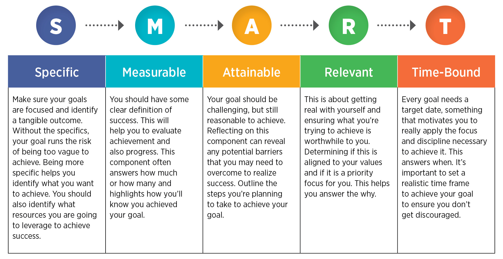
```

*Source: Canadian Management Center, <https://cmcoutperform.com/setting-smart-goals>*

## Professional development evidence and reflection

+--------------------------------------------------------+----------------------------------------------------------------------------------------------------------------------------------------------------------------------------------------------------------------------------------------------------+
| **Information**                                        | **Note**                                                                                                                                                                                                                                           |
+:=======================================================+:===================================================================================================================================================================================================================================================+
| Name                                                   | Professional development evidence & reflection                                                                                                                                                                                                                  |
+--------------------------------------------------------+----------------------------------------------------------------------------------------------------------------------------------------------------------------------------------------------------------------------------------------------------+
| Type Main, Mini or Basket                              | Basket                                                                                                                                                                                                                                             |
+--------------------------------------------------------+----------------------------------------------------------------------------------------------------------------------------------------------------------------------------------------------------------------------------------------------------+
| Value                                                  | 3%                                                                                                                                                                                                                                                 |
+--------------------------------------------------------+----------------------------------------------------------------------------------------------------------------------------------------------------------------------------------------------------------------------------------------------------+
| Due                                                    | `r pd_evidence`                                                                                                                                                                                                                            |
+--------------------------------------------------------+----------------------------------------------------------------------------------------------------------------------------------------------------------------------------------------------------------------------------------------------------+
| Submission instructions                                | Submission: PDF via [Markus](`r markus`)                                                                                                                                                                                                     |
+--------------------------------------------------------+----------------------------------------------------------------------------------------------------------------------------------------------------------------------------------------------------------------------------------------------------+
| Late submissions, accommodations, and extension policy | In the case of a personal illness/emergency, a [declaration can be made](`r extension`), but must be submitted no more than 3 days after the due date. Extensions may be requested through the same form up to 48 hours before the due date. |
+--------------------------------------------------------+----------------------------------------------------------------------------------------------------------------------------------------------------------------------------------------------------------------------------------------------------+

You may wish to use the provided template to complete this task. This is _not_ required to get full marks, but we believe this will be a helpful structure for you to ensure you have addressed all parts of the task.

### Templates

-   [template.docx](https://sta303-bolton.github.io/sta303-w22-courseguide/other-files/template.docx)

-   [template.Rmd](https://sta303-bolton.github.io/sta303-w22-courseguide/other-files/template.Rmd), [template.pdf](https://sta303-bolton.github.io/sta303-w22-courseguide/other-files/template.pdf), [template_rmd.zip](https://sta303-bolton.github.io/sta303-w22-courseguide/other-files/template_rmd.zip)

### Reflection and evidence components

#### Activity, alignment and lessons

**Activity**: Describe what you did and what you learned. Be **specific** but you don't need a step-by-step guide or dates, save that for your timesheet. Assume your reader has *not* read your proposal and that you are introducing your goal and plan to them for the first time. (It may help to imagine how you might explain this task and your progress in a job interview.)

##### Examples

-   *I wrote 4 blog posts on .... The first one was on ... One unanticipated activity I had to do was ...*\
-   *This task helped me learn how to write for general audience...*\
-   *Through this task I improved my...*

**Alignment**: How well did your activity and progress align with your proposal?

##### Examples

-   *My plan changed as my goal was not specific enough. I think the reason for this is ... I can set realistic goals next time by ...*\
-   *Most of my attainable steps and potential problems were correctly identified because ....*\
-   *This is a good method which I will use again when I need to ...*\
-   *My way of measuring progress worked because ... This is useful for next time because ...*

**Lessons**: What did you learn from using the SMART goal-setting experience?

##### Examples

-   *An interesting thing I learned from the SMART goal-setting exercise was that ...*\
-   *I prefer to modify the format of SMART goals to match my work habits by ...*

#### Evidence

Provide links **and/or** copy/paste a screenshot of a blog, website, Github repository, Rmd document, ... Provide commentary on what the image/link is and what it demonstrates. I.e., Describe what we should be seeing and understanding from what you've included and how it relates to your goals.

##### Examples

-   *The screenshot shows ... which is evidence of partially completing [goal] ...*

-   *The provided link goes to ... which relates to [goal] ...*

-   *Notice that there are separate buttons on the website for each of the ...*

#### Timesheet

Include a timesheet that briefly describes how you used your time (no specific format required, but something like the below is fine). Hours spent can be approximate.

Describe what you learned from filling your timesheet. This can be short and could include how you'd track your time differently in future, what you noticed about your work habits from tracking your time

##### Examples

*About ...% of my time was spent preparing, maybe because the task was new. This means for future tasks that are new I need to consider ....*

*The timesheet can be better suited to my work habits if ...*

+----------+--------------------+----------------+------------------------------------------------------------------------------------------------+
| **Week** | **Week starts on** | **Time spent** | **Activity**                                                                                   |
|          |                    |                |                                                                                                |
|          | **(Monday)**       | **(Hrs)**      | *(Brief description of what was done, e.g. what you read, what you tried on GitHub or state.)* |
+:=========+:===================+:===============+:===============================================================================================+
| 5        | Feb 7              | 1.5            | Example: Worked through chapters 1 & 2 of ...                                                  |
+----------+--------------------+----------------+------------------------------------------------------------------------------------------------+
| 6        | Feb 14             | 0              | Example: No progress this week                                                                 |
+----------+--------------------+----------------+------------------------------------------------------------------------------------------------+
|          | Feb 21             |                | *Reading week*                                                                                 |
+----------+--------------------+----------------+------------------------------------------------------------------------------------------------+
| 7        | Feb 28             | 1              | Example: Set up postcard home page and pushed to GitHub ...                                    |
+----------+--------------------+----------------+------------------------------------------------------------------------------------------------+
| 8        | Mar 7              | 2              | Example: Wrote one blog entry about ...                                                        |
+----------+--------------------+----------------+------------------------------------------------------------------------------------------------+
| 9        | Mar 14             | 1.5            | Example: Fixed coding error that ...[reason for error] .. by [fix] ...                         |
+----------+--------------------+----------------+------------------------------------------------------------------------------------------------+
| 10       | Mar 21             | 2              | Example: Edited the video on [topic] ... using [software] ...                                  |
+----------+--------------------+----------------+------------------------------------------------------------------------------------------------+

### Recommended structure

You do not *have* to set out your writing in this way to get full marks, but we believe this will be a helpful structure for you to ensure you have addressed all parts of the task.

+--------+---------------------------------+---------------------------------------------------+
| **\#** | **Section heading**             | **Format**                                        |
+:=======+:================================+:==================================================+
| 1      | Activity, alignment and lessons | \~3 paragraphs:                                   |
|        |                                 |                                                   |
|        |                                 | -   activity,                                     |
|        |                                 |                                                   |
|        |                                 | -   alignment,                                    |
|        |                                 |                                                   |
|        |                                 | -   SMART lessons                                 |
+--------+---------------------------------+---------------------------------------------------+
| 2      | Evidence                        | -   Selected screenshots of work done, links, ... |
+--------+---------------------------------+---------------------------------------------------+
| 3      | Timesheet                       | -   Fill provided template or create your own     |
|        |                                 |                                                   |
|        |                                 | -   1-3 sentences of what you learned             |
+--------+---------------------------------+---------------------------------------------------+

### Rubric

\newpage
\blandscape

```{r, echo=FALSE, message=FALSE}
require(tidyverse)
pd_prop_rubric <- read_csv("rubrics/pd-evidence.csv") 

if (knitr:::is_latex_output()) {
  pd_prop_rubric %>% 
  kableExtra::kable(booktabs = T) %>%
  kableExtra::kable_styling(latex_options = c("striped"), font_size = 8) %>% 
        kableExtra::column_spec(2:6, width = "12em") 
  
  
} else {
 pd_prop_rubric %>% 
  kableExtra::kable() %>%
  kableExtra::kable_styling() %>% 
  kableExtra::scroll_box(width = "100%")
}

```

\elandscape

<!--chapter:end:11-knowledge-basket-pd.Rmd-->

```{r, echo=FALSE}
source("links.R",  local = knitr::knit_global())
```

# Knowledge basket: Other

## 'Getting to know you' survey

+--------------------------------------------------------+----------------------------------------------------+
| **Information**                                        | **Note**                                           |
+:=======================================================+:===================================================+
| Name                                                   | 'Getting to know you' survey                       |
+--------------------------------------------------------+----------------------------------------------------+
| Type (Main, Mini or Basket)                              | Basket                                             |
+--------------------------------------------------------+----------------------------------------------------+
| Value                                                  | 0.1%                                               |
+--------------------------------------------------------+----------------------------------------------------+
| Due                                                    | `r know_survey`                                    |
+--------------------------------------------------------+----------------------------------------------------+
| Submission instructions                                | Submission: [Via Quercus survey](`r know_survey_link`)                |
|                                                        |                                                    |
|                                                        | Untimed survey, marked for completion              |
+--------------------------------------------------------+----------------------------------------------------+
| Late submissions, accommodations, and extension policy | No late submissions, accommodations, or extensions. |
+--------------------------------------------------------+----------------------------------------------------+

### Instructions

Answer the following questions to help me get to know the class. Some of the questions might seem a little random, but I'm hoping to use them for some future class activities.

(Some questions are from factfulnessquiz.com, you are not being marked on correctness, so please answer to the best of your ability without looking anything up.)

## Pre-knowledge check

+--------------------------------------------------------+----------------------------------------------------+
| **Information**                                        | **Note**                                           |
+:=======================================================+:===================================================+
| Name                                                   | Pre-knowledge check                                                                                          |
+--------------------------------------------------------+-----------------------------------------------------------------------------------------------------------------------+
| Type (Main, Mini or Basket)                              | Basket                                                                                                                |
+--------------------------------------------------------+-----------------------------------------------------------------------------------------------------------------------+
| Value                                                  | 0.5% for completion + 0.5% for a score of 80%+ OR active attendance at the prerequisite knowledge workshop 2022-02-02 |
+--------------------------------------------------------+-----------------------------------------------------------------------------------------------------------------------+
| Due                                                    | `r prereq_quiz` <br> (Workshop: `r prereq_workshop`)                                                                                             |
+--------------------------------------------------------+-----------------------------------------------------------------------------------------------------------------------+
| Submission instructions                                | Submission: [Via Quercus survey](`r prereq_quiz_link`)                                                                                           |
|                                                        |                                                                                                                       |
|                                                        | 60 minutes, 1 attempt, no pausing                                                                                                 |
+--------------------------------------------------------+-----------------------------------------------------------------------------------------------------------------------+
| Late submissions, accommodations, and extension policy | No late submissions, accommodations, or extensions.                                                                    |
+--------------------------------------------------------+-----------------------------------------------------------------------------------------------------------------------+

### Instructions

Answer the pre-knowledge check quiz questions to the best of your ability. In Quercus, you will see two assignment entries, one for the quiz and for storing your final score that takes into account completion of the quiz and the 80%+ score or workshop engagement/attendance.

__You are welcome to use any calculator you wish and/or R.__

There are 15 points across 16 questions, so you have about 4 minutes per point. The structure is outlined below. You may find having read the syllabus first helpful for question 1.

+-------------+--------------------------------+-------------------------------+--------+
| Question \# | Type                           | General topic area            | Points |
+=============+================================+===============================+========+
| 1           | Tick all that apply            | Academic integrity            | 1      |
+-------------+--------------------------------+-------------------------------+--------+
| 2           | Single choice (MCQ)            | Paraphrasing                  | 1      |
+-------------+--------------------------------+-------------------------------+--------+
| 3           | Fill in the blanks (3 numeric) | Rounding                      | 1      |
+-------------+--------------------------------+-------------------------------+--------+
| 4           | MCQ                            | Linear regression assumptions | 1      |
+-------------+--------------------------------+-------------------------------+--------+
| 5           | MCQ                            | Linearity                     | 1      |
+-------------+--------------------------------+-------------------------------+--------+
| 6           | Numeric                        | Distributions                 | 1      |
+-------------+--------------------------------+-------------------------------+--------+
| 7           | Numeric                        | Distributions                 | 1      |
+-------------+--------------------------------+-------------------------------+--------+
| 8           | MCQ                            | Distributions                 | 1      |
+-------------+--------------------------------+-------------------------------+--------+
| 9           | MCQ                            | Confidence intervals          | 1      |
+-------------+--------------------------------+-------------------------------+--------+
| 10          | MCQ                            | Algebra                       | 1      |
+-------------+--------------------------------+-------------------------------+--------+
| 11          | MCQ                            | Likelihood                    | 1      |
+-------------+--------------------------------+-------------------------------+--------+
| 12          | Numeric                        | Proportions                   | 0.5    |
+-------------+--------------------------------+-------------------------------+--------+
| 13          | Numeric                        | Proportions                   | 0.5    |
+-------------+--------------------------------+-------------------------------+--------+
| 14          | MCQ                            | Multiple linear regression    | 1      |
+-------------+--------------------------------+-------------------------------+--------+
| 15          | MCQ                            | Multiple linear regression    | 1      |
+-------------+--------------------------------+-------------------------------+--------+
| 16          | MCQ                            | P-values                      | 1      |
+-------------+--------------------------------+-------------------------------+--------+


#### Grade structure

- Completion of the quiz (all questions attempted) will earn you 0.5%.

- If you score 80% or more on the quiz, you earn an additional 0.5%.

- If you _do not_ score 80% or more, you can still earn this additional 0.5% by attending and actively engaging with the workshop on `r prereq_workshop`. 

- The maximum points to earn here is 1% (i.e., you cannot get BOTH the 80%+ and workshop attendance bonuses)

### Workshop attendance

If you didn't earn a full 1% from the pre-knowledge quiz (either didn't score over 80% or didn't complete it), you **can still earn 0.5 points towards your 🧺knowledge basket** by participating in this workshop.

-   For your attendance to count you must attend **at least 75% of a single 50-minute workshop** AND [**complete the post-event survey**](https://q.utoronto.ca/courses/253305/quizzes/242957 "Module 2 pre-knowledge post-workshop survey").

-   Please arrive on time! 

-   You can come to both if you want (they will be the same content though!) but cannot double up on points.

-   A recording of the session will be posted later, for your reference, but watching that will NOT be eligible for points.

-   You can do a **practice version** of the [pre-knowledge check](https://q.utoronto.ca/courses/253305/quizzes/242031 "Pre-knowledge check (practice version)") as many times as you like. There is also commentary on some of the question after you submit.


## Module check-ins

+--------------------------------------------------------+----------------------------------------------------+
| **Information**                                        | **Note**                                           |
+:=======================================================+:===================================================+
| Name                                                   | Module check-in 1--5                                                                                         |
+--------------------------------------------------------+-----------------------------------------------------------------------------------------------------------------------+
| Type (Main, Mini or Basket)                              | Basket                                                                                                                |
+--------------------------------------------------------+-----------------------------------------------------------------------------------------------------------------------+
| Value                                                  | 0.1% for completion |
+--------------------------------------------------------+-----------------------------------------------------------------------------------------------------------------------+
| Due                                                    | Second Fridays of Modules at 3:03 p.m.                                                                                            |
+--------------------------------------------------------+-----------------------------------------------------------------------------------------------------------------------+
| Submission instructions                                | Submission: [Via Quercus surveys](`r assignments_link`)                                                                                    |
|                                                        |                                                                                                                       |
|                                                        | Untimed, unlimited attempts                                                                                                 |
+--------------------------------------------------------+-----------------------------------------------------------------------------------------------------------------------+
| Late submissions, accommodations, and extension policy | No late submissions, accommodations, or extensions.                                                                    |
+--------------------------------------------------------+-----------------------------------------------------------------------------------------------------------------------+

### Instructions

Module check-ins are a short questionnaire to help me 'take the pulse' of the class. Each survey will like take only 5--10 minutes and will be available about 6:00 p.m. on the second Wednesday of each module, until 3:03 p.m. ET on the second Friday.


## Team Up! activities

+--------------------------------------------------------+---------------------------------------------------------------------------------------------------------------------+
| **Information**                                        | **Note**                                                                                                            |
+:=======================================================+:====================================================================================================================+
| Name                                                   | Team Up! activities (aiming for one per module)                                                                     |
+--------------------------------------------------------+---------------------------------------------------------------------------------------------------------------------+
| Type (Main, Mini or Basket)                            | Basket                                                                                                              |
+--------------------------------------------------------+---------------------------------------------------------------------------------------------------------------------+
| Value                                                  | 0.5% (graded on quality)                                                                                            |
+--------------------------------------------------------+---------------------------------------------------------------------------------------------------------------------+
| Due                                                    | End of tutorial time (first Thursdays)                                                                              |
+--------------------------------------------------------+---------------------------------------------------------------------------------------------------------------------+
| Submission instructions                                | Submission: Via Team Up! (links through Quercus)                                                                    |
|                                                        |                                                                                                                     |
|                                                        | Usually \~50 minutes, one attempt (as a group), but with options to retry incorrect questions (for partial points). |
+--------------------------------------------------------+---------------------------------------------------------------------------------------------------------------------+
| Late submissions, accommodations, and extension policy | No late submissions, accommodations, or extensions.                                                                 |
+--------------------------------------------------------+---------------------------------------------------------------------------------------------------------------------+

See the [course overview page on Quercus](https://q.utoronto.ca/courses/253305/pages/course-overview) for the links to the versions with answers.


## Graduate school info session

| **Information**                                        | **Note**                                            |
|:-------------------------------------------------------|:----------------------------------------------------|
| Name                                                   | Module 1 graduate school info session and panel     |
| Type (Main, Mini or Basket)                            | Basket                                              |
| Value                                                  | 0.1%                                                |
| Due                                                    | `r m1_friday`                                       |
| Submission instructions                                | Submission: [Via Quercus](`r m1_gradschool`)        |
| Late submissions, accommodations, and extension policy | No late submissions, accommodations, or extensions. |


There will be two versions of this session, each in class time on January 19, 2022, 10:10 to 11:00 a.m. and 3:10 to 4:00 p.m.

These sessions will have a short presentation from the administrators/program managers of some potentially relevant U of T graduate programs as well as a panel discussion with some of the course TAs. They will talk about their experiences, things they wish they'd know, and reference letters.

**10:00 a.m. class:** [Master of Financial Insurance (MFI)](https://mfi.utoronto.ca/) and [Master of Science in Applied Commuting (MScAC)](https://mscac.utoronto.ca/) administrators + TA panel

**3:00 p.m. class:** [Master of Science in Statistics and PhD in Statistics](https://www.statistics.utoronto.ca/future-students/our-graduate-programs) administrator (note: Alison will also share some general advice for if you're looking at program elsewhere as well) + TA panel


To earn the 0.1 points up for attending a grad school information session and panel you must attend for at least 75% of one of the sessions (i.e., you cannot just log in and then log out again) AND complete the short questionnaire. There are three questions, you must answer Q1 and 2, but Q3 is optional.

__Notes__: 

- You _cannot_ earn double points for attending both sessions.  
- Attendance is not required, there are plenty of other ways to earn 🧺knowledge basket points.  
- You can attend either session (or both, if you really wanted). There are no section restrictions for STA303.
- The session is _not_ being recorded.
- PollEverywhere has nothing to do with your attendance/knowledge basket points. You don't have to engage with it if you do not want to.


## Punctuation art

| **Information**                                        | **Note**                                            |
|:-------------------------------------------------------|:----------------------------------------------------|
| Name                                                   | Punctuation art                                     |
| Type (Main, Mini or Basket)                            | Basket                                              |
| Value                                                  | 1%                                                  |
| Due                                                    | `r oneperc`                                         |
| Submission instructions                                | Submission: [Via Quercus ](`r punctart_link`)                            |
| Late submissions, accommodations, and extension policy | No late submissions, accommodations, or extensions. |


### Instructions

This is a self-contained mini-code and communication activity. It can be submitted anytime before the due date.

Note: If you like this idea and want to build it out further into your professional development task, or an aspect of it, you _can_, but this task/prompt can only be used once. I.e., if you do a punctiation art based component for your professional development, you cannot also submit this assessment.

#### Prompt

Use R to create a representation of the entire text of a book, using only the punctuation.

#### Examples

  - https://www.theguardian.com/books/gallery/2016/feb/23/say-what-books-with-the-words-removed-punctuation-maps-in-pictures
  - https://www.mentalfloss.com/article/75602/what-famous-novels-look-stripped-everything-punctuation
  
  
```{r, echo=FALSE, out.width="100%", fig.align='center'}
knitr::include_graphics("images/assessments/hound_of_the_baskervilles.png")
```

#### Skills

- regular expressions  
- ggplot (could use base if you prefer)

#### Tips

- Works in the public domain are probably going to be the easiest to access. [Project Gutenburg](https://www.gutenberg.org/) has .txt versions of many classics.

```{r, eval=FALSE}
# Read in the text of hounds of the Baskervilles and remove the front matter and end matter
text <- readLines("https://www.gutenberg.org/cache/epub/3070/pg3070.txt")[0:7298+61]
```

#### Submission instructions

Submit the following:

- Commented code that produces your punctuation art (Rmd file)
- Your final art output (PNG recommended)
- A PDF one-page description that: 
    - introduces what your output shows,
    - how you got the text data (make sure you credit the source),
    - notable steps in preparing the data to create your art, and
    - a brief summary of the skills you learned or demonstrated in this task.
- If you would be willing to have your art shared with future students, please include at the end of your write-up "I give my permission for my punctuation art to be shared [anonymously | and credited to me, <name>]". Update the statement appropriately, e.g., _I give my permission for my punctuation art to be shared and credited to me, Liza Bolton._. If you have posted it on social media or a personal website, you're welcome to also provide that link.

#### Rubric

+---------------------+---------------------------------------------------------+----------------------------------------------------------------------------+---------------------------------------------+
|                     | **Missing or insufficient** 0%                          | P**artial** 0.5%                                                           | **Complete** 1%                             |
+=====================+=========================================================+============================================================================+=============================================+
| **Task completion** | No submission OR instructions insufficiently satisfied. | Some appropriate work shown, but may be somewhat incomplete or irrelevant. | Prompt/instructions sufficiently satisfied. |
+---------------------+---------------------------------------------------------+----------------------------------------------------------------------------+---------------------------------------------+


<!--chapter:end:12-knowledge-basket-other.Rmd-->

# (PART\*) Modules {-}

# Module 1 {#m1}

:::: {.yellowbox data-latex=""}
Materials for January 10--21, 2022.
::::

## Learning Checklist
By the end of this module, you should be able to:

- Understand the structure and policies of STA303.  
- Be able to open and work with an RMarkdown document, knit to pdf and export that pdf (RStudio, JupyterHub).
- [STA302 review] Explain the assumptions of linear regression and identify situations where they might be violated.  
- Describe the execution and purpose of several common statistical tests (one-sample t-test, paired sample t-test, two-sample t-test, one-way ANOVA), and identify how to conduct them in a linear regression framework.  
- Create a reproducible example (reprex) for use in explaining an error being produced by your code.

## Instructor information

**Prof. Liza Bolton**

**Course email**: sta303@utoronto.ca

**Office hours**: During the second half of Wednesday classes: 11:10—12:00 p.m. ET and 4:10—5:00 p.m. ET

Please do not email my individual email with STA303 questions or use Quercus mail. It makes it harder to keep track of and address your questions. Sending me messages on three different platforms will NOT speed up my response. I will not respond messages that don't follow the course communication policy.

You can see the latest version of [my email autoresponder here](https://www.lizabolton.com/autoresponder.html).

## Upward management tips

'Upward management' is basically managing your manager. ^[I used to haaaate this concept because I learned it while doing a consulting internship at a large international professional services firm and I really struggled with my manager.] If you make their life easier and help them be more effective, this should also make *your* life easier and is a good investment in your own career and skills building.

While our course isn't a business, some of the basic parts of this concept apply well to your time at university AND can set you up for success in graduate studies and your future career.

**But why should you put effort into upward managing me?** Well, while I will always seek to treat all students fairly and to listen to your feedback, YOU can make this easier or harder for me, and thus make this course better or worse for yourselves. 

For example, if I have to use all my time and energy following up on unclear emails for more information and dealing with students who haven't followed instructions etc. etc....I won't have that energy to put into writing TeamUp! activities to give you extra practice and opportunities to earn bonus points.


### Communicate using the tools your manager prefers  
* **In business**, this means knowing who likes face-to-face vs email, or whether your manager would rather receive an instant message than an email for a quick question.
* **In STA303**, this means: 
  - Using Piazza for all course admin and content questions.
  - Using the appropriate forms for accommodations and regrade requests.
  - Emailing **sta303@utoronto.ca** for private issues not otherwise covered by the other tools, e.g. emailing me your Accommodation Services letter, requesting an extension to an assessment that conflicts with essential travel.
  - Asking questions in office hours.
  

### Write good emails (when emails are appropriate)

- **In business**, this might mean:
  - Choosing who should be the main recipients vs CCed/BCCed. 
  - Ensuring your contact details are clear in your signature.
  - Make sure the subject line is informative and short
  - Making the text of the email as clear and concise as possible.
  - Use proper grammar and punctuation. 
  - Don't use emoji in formal emails. If in doubt, leave 'em out.

- **In STA303**, this looks like:
  - Everything in the right-hand column, plus the following.
  - Starting an email with "Hi Prof. Bolton," or "Hi Liza,".^["Dear Madam" and "To my esteemed professor" honestly make me uncomfortable.]
  - Sign off the email with your **preferred name** (i.e. what should I call you when I reply) and if your have different official name, include that and your UTORid below your name.
  - Subject line including [Prof. Bolton] or [TA name] if your email is for a specific person.


### Understand your manager's goals
- **In business**, this might look like understanding their KPIs and how you can help make sure these are met.
- **In STA303**, most of *my* goals are *for you*, like that you learn useful statistical skills, improve your writing skills etc. I also personally want to improve as an instructor and have fun talking about something I love. 
  - You can help me with these goals by working on this course every week, trying your best, asking for help early and often, engaging with feedback gathering mechanisms and providing constructive feedback if something is not working.

### Demonstrate self-management and resilience while also asking for help and flagging problems early. 

- **In business**, this might look like:
  - Being proactive about addressing possible problems before they occur. Managers like a 'no surprises' policy.
  - Preparing a list of questions to cover in a meeting or to compile in an organized fashion into one email (instead of ten). 
  - Searching for answers yourself before asking your manager and improving your strategies for finding available information.

- **In STA303**, this looks like:
  - Putting in a little effort into find answers before posting on Piazza/asking in class. (*Have you searched Piazza? have you re-read/watched the assigned materials? have your checked the syllabus and recent announcements?*)
  - Come to office hours often, lists of questions very welcome!
  - Getting in touch (or asking your registrar to) **early** if you might hate to miss a lot of class. It is usually easier to find a solution if I know things ahead of time, or as soon as possible after.


## Recap of linear models

### Why model?

- The goal of a model is to provide a (relatively) simple summary of a dataset.
- We can describe data AND make predictions.

### Linear models 

In a linear model, 

$y_i = \beta_0 + \beta_1x_{1i} + ... + \beta_px_{pi} + \epsilon_i$  

The response is predicted by a linear function of
explanatory (or predictor) variables plus an error term.

a.k.a.

__DATA = MODEL + ERROR__


### Linear regression assumptions

**L**: your model is **L**inear.

**I**: Errors are **I**ndependent (usually satisfied if observations are independent).

**N**: Errors are **N**ormally distributed  with expected value zero, $E[\epsilon_i]=0$


**E**: **E**qual/constant variance (homoscedasticity), $\text{var}[\epsilon_i] = \sigma^2$.


We can express "I N E" above as assuming the errors are i.i.d Normal with mean of zero and variance $\sigma^2$, 
$$\epsilon_i \sim N(0, \sigma^2)$$

### What makes it a _linear_ model?

A model is **linear** if it is *linear in the parameters*. That is, all the $\beta$ enter the model in a linear way. It is totally fine if the predictor variables enter the model in a non-linear way.

#### Linear
- $y_i = \beta_0 + \beta_1x_i + \beta_2x_i^2 + \epsilon_i$  
- $y_i = \beta_0 + γ_1δ_1x_{1i} + \beta_2\exp(x_{2i}) + \epsilon_i$

#### NOT linear
- $y_i = \beta_0 + \beta_1x_i^{\beta_2} + \epsilon_i$  
- $y_i = \beta_0 exp(\beta_1x_{1i}) + \epsilon_i$

Internally screaming "DON'T LET THE BETAS TOUCH" often helps me remember what is not linear. Additionally, don't let them do anything _weird_, like get exponentiated.


### Optional refresher reading

#### Brief discussion of assumptions with examples
Section 1.3 of *Broaden your Statistical Horizons* on the assumptions of OLS
https://bookdown.org/roback/bookdown-bysh/ch-MLRreview.html#ordinary-least-squares-ols-assumptions
 [freely accessible]
 
#### Fitting linear models in R
Section 1.6 of *Broaden your Statistical Horizons* on Multiple linear regression (bootstrapping not assessed) https://bookdown.org/roback/bookdown-bysh/ch-MLRreview.html#multreg [freely accessible]

#### Delicious mathematics

Chapter 1 of *Wood, S. N. (2017). Generalized additive models : An introduction with r, second edition*
http://go.utlib.ca/cat/13435628 [you will need to log in to the U of T library for access]

## The data for module 1

The data we'll be looking for the next section of this week is from the `palmerpenguins` package by Allison Horst.

```{r}
# install.packages("palmerpenguins")
library(palmerpenguins)
```


```{r, echo=FALSE, fig.align='center', out.width="70%"}
knitr::include_graphics("images/m1/lter_penguins.png")
```

_Artwork by \@allison_horst_

```{r, echo=FALSE, fig.align='center', out.width="20%"}

if (knitr:::is_latex_output()) {
  knitr::asis_output("There is a GIF in the web version. Not required content.")
} else {
 
}
```

### Let's meet the penguins 

```{r, message=FALSE}
library(tidyverse)

glimpse(penguins, width = 80) # width here just influences how this is displayed
```

The `glimpse` function comes from the `tibble` package, which is in loaded by the `tidyverse` package.

One of the most common issues students encounter when learning R is that they are trying to use functions that they haven't installed or loaded the package for. Make sure you've read the [slides about RStudio on the JupyerHub](https://q.utoronto.ca/courses/204826/pages/course-tools#jupyter) because packages you install there will need to be **reinstalled each session** if they are not the list of automatically available ones. 
`tidyverse` is automatically available so you only need to run `library(tidyverse)` or use the namespace for the function `tibble::glimpse()`. 

### The variables

I hope most of the variables here are clear from their names. In particular, we will be interested in `species`, which has three levels (`r unique(penguins$species)`), `sex`  (`r unique(penguins$sex)`), `body_mass_g` (body mass in grams) and `flipper_length_mm` (length of their flippers measure in mm). We're not using the variables about the bills, but I thought this diagram was interesting anyway.

```{r, echo=FALSE, fig.align='center', out.width="40%"}
knitr::include_graphics("images/m1/culmen_depth.png")
```
_Artwork by \@allison_horst_


```{r, echo=FALSE}
flipper_bill <- penguins %>% 
  filter(!is.na(sex)) %>% 
  ggplot(aes(x = flipper_length_mm,
                             y = bill_length_mm)) +
  geom_point(aes(color = species, 
                 shape = sex),
             size = 3,
             alpha = 0.8) +
  geom_smooth(method = "lm", se = FALSE, aes(color = species)) +
  theme_minimal() +
  scale_color_manual(values = c("darkorange","purple","cyan4")) +
  labs(title = "Flipper and bill length",
       subtitle = "Dimensions for Adelie, Chinstrap and Gentoo Penguins at Palmer Station LTER",
       x = "Flipper length (mm)",
       y = "Bill length (mm)",
       color = "Penguin species",
       shape = "Sex",
       caption = "Source: @allison_horst, palmerpenguins package") +
  theme(
        legend.background = element_rect(fill = "white", color = NA),
        plot.title.position = "plot",
        plot.caption = element_text(hjust = 0, face= "italic"),
        plot.caption.position = "plot")
ggsave("images/m1/ah_plot.png", flipper_bill, width = 7, height = 5)
```

```{r, echo=FALSE, fig.align='center', out.width="90%"}
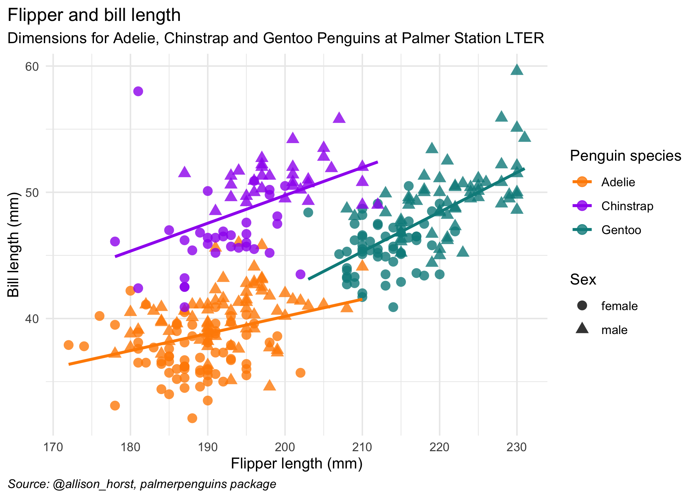
```

Here are all our variables of interest in one plot.

Note: In  this chart and in future analyses involving `sex`, penguins with an unknown sex have been removed.

## Common statistical tests as linear regression

[There is an interactive version of the below notes at this link.](https://jupyter.utoronto.ca/hub/user-redirect/git-pull?repo=https%3A%2F%2Fgithub.com%2Fsta303-bolton%2Fsta303-w22-activities&urlpath=shiny%2Fsta303-w22-activities%2Finst%2Ftutorials%2Fsta303_m1_tests%2F&branch=master)

```{r setup, include = FALSE}
install.packages("palmerpenguins", repos = "https://cloud.r-project.org")

# TODO make these available again
#remotes::install_github("rstudio/learnr", force = TRUE)
#library(learnr)
#remotes::install_github("rstudio-education/gradethis")
#gradethis::gradethis_setup()


library(knitr)
library(palmerpenguins)
library(tidyverse)

knitr::opts_chunk$set(echo = FALSE)

# replace include=FALSE with include=TRUE (note lack of spaces) to create the version that has the answers in it
```

### Introduction

You have probably encountered several statistical tests in your studies so far. 

#### Parametric
**E.g. one-sample t-tests, paired t-tests, two-sample t-tests, one-way ANOVA, two-way ANOVA**  
Parametric tests make assumptions about the distribution of the population from which our sample data have been drawn.

#### Non-parametric
**E.g. Wilcoxon signed rank, Mann Whitney-U, Kruskal-Wallace**  
Non-parametric tests do not assume that our outcome is Normally distributed. They are sometimes called 'distribution-free', but note that this is because they have fewer assumptions than parametric tests, not because they have no assumptions at all.

#### Aside: But why are there two types of tests?

Parametric tests are more **powerful**, i.e., they have a better chance of detecting an effect if there is one there to find. So why would you ever use a less powerful test? Well, with great power comes ~~great responsibility~~ more assumptions that must be valid to proceed. 

```{r, echo=FALSE, fig.align='center', out.width="50%"}

if (knitr:::is_latex_output()) {
  knitr::asis_output("There is a GIF in the web version. Not required content. \\url{https://tenor.com/view/spider-man-uncle-ben-with-great-power-comes-great-responsibility-its-true-just-saying-gif-24193883}")
} else {
 knitr::include_graphics("images/m1/uncleben.gif")
}

```

Non-parametric tests are a great choice when your outcome is an ordinal variable, is ranks, or there are problematic outliers. 

For the purposes of this lesson, we're going to focus more on parametric tests, but also take a look at the corresponding non-parametric tests with the slight white lie that they are just ranked versions of their parametric companions. This approach is pretty good as long as you have a reasonable sample size.


_Imagine this:_   
_You're on a ship trying to spot land. **Parametric** tests are the crew member with the best eyesight, but they can be fussy and the conditions have to be right for them to work in or they will breakdown._

_**Non-parametric** tests are the crew member with not quite as good eyesight, but they're more laid back about the conditions you make them work in._

In the following sections we'll explore several of these tests.

### One-sample t-test

I am assuming you've seen this in a 200-level statistics course or equivalent. Brief recap below.

#### Use case

You want to know if it is believable that the population mean is a certain value (our 'hypothesized value' below).

#### Assumptions
1. The data are continuous.
2. The data are normally distributed.
3. The sample is a simple random sample from its population. Each individual in the population has an equal probability of being selected in the sample

(Do these sound familiar from linear regression?)

#### Hypotheses
$$H_0: \mu = \text{hypothesized val}$$
$$H_1: \mu \ne \text{hypothesized val}$$

What are we doing? Finding the strength of evidence against the claim that the population mean is some hypothesized value.

The test statistic, t, is calculated as follows:

$$ t = \frac{\bar{x} - \text{hypothesized val}}{s/\sqrt{n}} $$

We then compare this t value to the t-distribution with degrees of freedom df = n - 1 and find the area under the curve that represents the probability of values likes ours or more extreme.


#### Example

Suppose existing research suggests that the average weight of penguins is 4000 grams. You want to see if this makes sense for your new penguins data.

$$H_0: \mu = 4000$$
$$H_1: \mu \ne 4000$$

The `penguins` dataset is already loaded, you you don't have to run any libraries. Use the `t.test()` function run a one-sample t-test.


```{r onesamplt, echo=T}
t.test(penguins$body_mass_g, mu = 4000, var.equal = TRUE)
```


#### Now as a linear model

First, consider the following, what would a linear regression with no predictor variables and just an intercept tell you?

Create a linear regression model called `mod1`(replace the blank below) that is an 'intercept only model' with `body_mass_g` as the response.

```{r onesamptlin-check, echo=T}
mod1 <- lm(body_mass_g ~ 1, data=penguins)
summary(mod1)
```

It turns out the estimate from this linear regression is the same as the sample mean. 

```{r, echo=TRUE, echo=T}
mean(penguins$body_mass_g, na.rm = TRUE) #na.rm = TRUE removes missing values
```

Now, recall that with the t-test, we calculate our test statistic by subtracting the hypothesized value from the mean. Let's run the linear model again, but on the left-hand side of the formula, subtract the hypothesized value.


```{r onesamptlin2, echo=T}
mod2 <- lm(body_mass_g-4000 ~ 1, data=penguins)
summary(mod2)
```


Compare the results of this `summary(mod2)` and your earlier t-test. You should see that the t value, degrees of freedom and p-value are the same for both analyses.

Thus, our one sample t-test hypotheses,
$$H_0: \mu = \text{hypothesized val}$$
$$H_1: \mu \ne \text{hypothesized val}$$

are equivalent to our linear regression hypotheses about the intercept,

$$H_0: \beta_0 = \text{hypothesized val}$$
$$H_1: \beta_0 \ne \text{hypothesized val}.$$

#### Wilcoxon signed-rank test

While the linear regression approach to the one-sample t-test is exact, we can also approximate the Wilcoxon rank-sign test with linear regression. See below. 

```{r, echo=FALSE, fig.align='center', out.width="90%"}
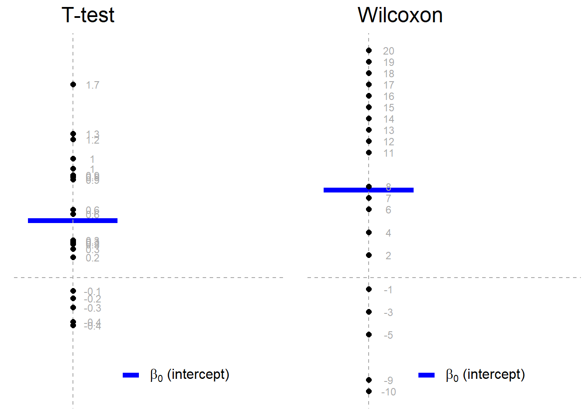
```

Note: The above is just example from some toy data, but aims to illustrate how a t-test is treating the data and how the Wilcoxon test is treating the data. 

```{r, echo=TRUE}
# Function to get signed rank of each observation  
signed_rank = function(x) sign(x) * rank(abs(x))

# The wilcoxon test function 
wilcox.test(penguins$body_mass_g, mu = 4000)

# Equivalent linear model
mod3 <- lm(signed_rank(penguins$body_mass_g-4000) ~ 1)
summary(mod3)
```

[Optional] Check out the theory behind the rank transformation in section 3.0.2 https://lindeloev.github.io/tests-as-linear/#3_pearson_and_spearman_correlation

#### Paired sample t-test and Wilcoxon matched pair

A paired t-test is equivalent to a one sample t-test if you just consider $x_{\text{diff}\ i} = x_{1i} - x_{2i}$, i.e., $x_{\text{diff}\ i}$ is the difference of the paired values for each observation, and proceed with $x_{\text{diff}\ i}$ as you would in the one sample case. Likewise for the Wilcoxon. 

The R code (not evaluated here) would be as follows:

```{r, eval = FALSE, echo=TRUE}
# Built-in Wilcoxon matched pairs
wilcox.test(x1, x2, paired = TRUE)

# Equivalent linear model:
summary(lm(signed_rank(x1 - x2) ~ 1))
```

### Dummy variables

Let's take a quick detour before we explore the next tests. We'll need to understand the concept of dummy variables and contrasts first.

#### The matrices we use for linear regression

Recall that we can express our linear regression in matrix form: 
  
  $$\mathbf{y} = X\boldsymbol\beta + \boldsymbol\varepsilon$$
  
  where

$$
  \mathbf{y} = \begin{pmatrix} 
y_1 \\\ 
y_2 \\\ 
\vdots \\\ 
y_n 
\end{pmatrix} ,
$$
$$
  \boldsymbol\beta = \begin{pmatrix} \beta_0  \\\ \beta_1  \\\ \beta_2  \\\ \vdots  \\\ \beta_p \end{pmatrix}, \quad
\boldsymbol\varepsilon = \begin{pmatrix} \varepsilon_1  \\\ \varepsilon_2  \\\ \vdots  \\\ \varepsilon_n \end{pmatrix}
$$
  
  and 

$$X = \begin{pmatrix} \mathbf{x}^\mathsf{T}_1 \\ \mathbf{x}^\mathsf{T}_2 \\ \vdots \\ \mathbf{x}^\mathsf{T}_n \end{pmatrix}
= \begin{pmatrix} 1 &  x_{11} & \cdots & x_{1p} \\
1 & x_{21} & \cdots & x_{2p} \\
\vdots & \vdots & \ddots & \vdots \\
1 & x_{n1} & \cdots & x_{np}
\end{pmatrix}$$
  
  We often talk about **X** as the **model matrix**  (or design or regressor matrix) and it will be the focus of this section.

#### Getting our model matrix in R

Let's start by fitting a model with `body_mass_g` as the response and `flipper_length_mm` and `species` as the predictor variables.

(Note: Users of statistics use a lot of different words to refer to the same thing. Can you think of other terms people might use instead of _response_ and _predictor_?)

```{r modmat1, echo=T}
mod4 <- lm(body_mass_g ~ flipper_length_mm + species, data=penguins)
summary(mod4)
```

Now we can use the `model.matrix()` function to extract the model matrix for `mod4`. I've applied `head()` to stop the entire thing being printed.


```{r modmat2, echo=T}
head(model.matrix(mod4), n = 20)
```


You'll notice that even though we only had an intercept and two variables, we have four columns in our model matrix. You should also notice that R has given the columns helpful names, and that we have a column for the Chinstrap species and the Gentoo species, but not the Adelie species.

Further, recall that when we are working with a categorical variables we call the different values the the variables can take **"levels"**. I may also refer to these as factor variables, and talk about the "levels of the factor". 

What R is doing is dropping the first level (alphabetically) of the categorical variable and then creating **dummy variables** for each of the other levels.

The dropped level becomes our **reference level** and this should be familiar from interpreting summary output in previous courses where you have conducted multiple linear regressions with categorical variables. 

A dummy variable is also called an indicator variable, and it *indicates* whether or not the given observation takes that level or not. I.e., if the 40th penguin in this dataset had a 1 in the speciesGentoo column, then I know it is a Gentoo penguin, and that it won't have a 1 in the speciesChinstrap column because each penguin can only have one species.

More generally, the sum across the row of the dummy variables for one categorical variable will either be 0 (if that observation has the reference level) or 1 (not the reference level) but you will never have more than one 'one' amongst the dummies for a given categorical variable.

###### [Unassessed aside] Why do we have to drop one of the levels?

You may recall that for the matrix calculations required to get our vector of $\beta$s, we need to be able to invert X our matrix. We can only invert matrices for which all the columns are linearly independent and if we have the intercept AND dummies for all the levels of the categorical variable, our matrix will be linearly dependent.

Additional optional discussion [here](#matrices).

### Two means 

Back to tests!

Independent t-tests let you compare two means. I am assuming you've seen this in a 200-level statistics course or equivalent. Brief recap below.

#### Use case

You want to know if it is believable that two independent groups have the same population mean.

#### Assumptions

1. The data are continuous.
2. The data are normally distributed (in each group).
3. Each group is a simple random sample from its population. Each individual in the population has an equal probability of being selected in the sample
4. The variances for the groups are equal. 

Notice that these are the same assumptions as the one-sample t-test, but with the equality of variances assumption added.

#### Hypotheses

$$H_0: \mu_1 = \mu_2$$
$$H_1: \mu_1 \ne \mu_2$$

What are we doing? Finding the strength of evidence against the claim that the population means for both groups are the same. This differs from the one sample test because we have uncertainty about BOTH values here. Both are population parameters that we don't know. 

The test statistic, t, is calculated as follows:

$$ t = \frac{\bar{x_1} - \bar{x_2}}{\sqrt{s^2(\frac{1}{n_1} + \frac{1}{n_2})}} $$

We then compare this t value to the t-distribution with degrees of freedom $df = n_1 + n_2 - 2$ and find the area under the curve that represents the probability of values likes ours or more extreme.


#### Example

Conduct an independent t-test to test if the mean of `body_mass_g` is the same for male and female penguins (`sex`). Add your code below. Note: you must set `, var.equal = TRUE` as one of the arguments for it two be the independent t-test. If you don't set this we are conducting a *Welch's t-test*. I won't be covering this, but it is covered in the source credited at the end of this activity.


```{r twosamp, echo=T}
t.test(body_mass_g ~ sex, data = penguins, var.equal = TRUE)
```


Now, based on what we've learned, write a linear model using the `lm()` function to do the same this as our independent t-test. Save the model as `mod5`.

```{r twosamplin, echo=T}
mod5 <- lm(body_mass_g ~ sex, data = penguins)
summary(mod5)
```


Take a moment to match up parts of the outputs that are the same. There is a difference here in that the sign of the test statistics differs. That does not matter as out t-distribution is symmetrical and we're doing a two-tailed test. 


#### Mann-Whitney U
Similar idea to before, except for this test it is just rank not signed rank.

```{r, echo=TRUE}
# Wilcoxon / Mann-Whitney U (multiple names)
wilcox.test(body_mass_g ~ sex, data = penguins)

# As linear model with our dummy-coded group_y2:
summary(lm(rank(body_mass_g) ~ sex, data = penguins))
```

### ANOVA

#### Use case

You've probably seen 'ANOVA' in the context of model comparison, but it is also a popular test in psychology and other disciplines. 

Let's look specifically at one-way ANOVA (or the F-test). It tests if all the means for several groups (more than 2) are the same or if at least one is different. 

I hope this sounds a bit like the next evolution from the independent t-test...

(+ 1000 stats respect points to anyone who draws Pokemon-esque evolutions of these three tests...with regression as the mega-evolution...)

#### Assumptions

And it just so happens that the assumptions for the one-way ANOVA (also called the F-test) are EXACTLY the same as for the independent t-test.

```{r, echo=FALSE, fig.align='center', out.width="50%"}

if (knitr:::is_latex_output()) {
  knitr::asis_output("There is a GIF in the web version. Not required content. \\url{https://gifst.blogspot.com/2019/03/snl-hi-saturday-night-live-hey-kate.html}")
} else {
 
}
```


1. The data are continuous.
2. The data are normally distributed (in each group).
3. Each group is a simple random sample from its population. Each individual in the population has an equal probability of being selected in the sample
4. The variances for the groups are equal. 

#### Hypotheses

$$H_0: \mu_1 = \mu_2 = ... = \mu_k $$

$$H_1: \text{at least one }\mu \text{ differs from the others} $$

#### Example

Let's now look at body mass across species. Suppose we wanted to know if was believable that the the means body mass in grams was the same across all three species. This is when we could fit a quick ANOVA to test this. The `aov()` allows us to do this.

```{r, echo = TRUE}
summary(aov(body_mass_g ~ species, data = penguins))
```

That looks a lot like the output from calling summary on `lm()`...in fact, aov is just a wrapper for lm! Which means it has been linear regression the whole time. 


### Credits

Credit to **Jonas Kristoffer Lindeløv** for the excellent resource this resource is based on. [There are more examples there than we will cover in this course.](https://lindeloev.github.io/tests-as-linear/)

## Reproducible examples (reprex)

### What is a reproducible example?

Well, it is an example that someone else can reproduce...

Specifically, it is a minimal example needed for someone helping you to reproduce an error or other behaviour you would like to show them with. 

This is especially helpful while we are all working online! I can't look over your shoulder in a lab to see what's wrong. 

```{r, echo=FALSE, fig.align='center', out.width="50%"}

if (knitr:::is_latex_output()) {
  knitr::asis_output("There is a GIF in the web version. Not required content.")
} else {
 knitr::include_graphics("images/m1/throwcomp.gif")
}
```

### Why should you care about creating reproducible examples?

- Useful professional skill for those working with R and other programming languages in graduate school/future employment (concepts transferable to programming in any language).
- The best way to help me (and the TAs and your classmates) help YOU on Piazza.
- The process of preparing a reprex to ask for help forces you to think about your code in a specific way that can help you spot the problem without actually having to ask anyone else (this literally happened to me about 2 hours before writing this slide!)


#### Other things to know

- Please try to use use reprexes when asking for help on Piazza!
  - The outputs from the reprex package work beautifully on Piazza, too. 
  - No more upside down photos of computer screens taken from phones, please! 
- `reprex` is installed in the JupyterHub and will be loaded whenever we run `library(tidyverse)`
- You won't have to worry about the data side of reprexes as much for this course, as in almost all cases we will all be working with the same data. But! It is a key skill if you will be working with data and programming languages in the future.

### Watch the creator of the reprex package explain it

Jenny Bryan is a hero of mine, and this was even BEFORE I knew she was the creator of the `reprex` package.

I think the whole video is excellent, and you're very welcome to watch all of it, but at minimum, please watch the following time intervals:

- 0:00 - 7:20 (background and initial demo)
- 14:08 - 29:48 (philosophy and examples)

**The video and slides are on this page: https://reprex.tidyverse.org/articles/articles/learn-reprex.html**

### Using reprexes on Piazza

[Watch this 4 minute video.](https://play.library.utoronto.ca/f395cfcc26b4009cbc28c1aa9a86096c)

```{r, echo=FALSE, fig.align='center', out.width="60%"}

if (knitr:::is_latex_output()) {
  
} 
```

Web version embedding for MyMedia is not great, I would recommending opening the link and/or going full screen. 

<div><iframe src="https://play.library.utoronto.ca/watch/f395cfcc26b4009cbc28c1aa9a86096c" width="900" height="500" allowfullscreen="allowfullscreen"></iframe></div>

## Reading strategy: previewing and skimming {#previewskim}

In graduate school and/or in future employment, it is likely that you will need gather and synthesize information from a range of written sources. To decide if a source is useful to you, and to be as efficient and effective as possible, it is important to have strategies for approaching reading. 

In the next module, for the knowledge basket writing task, you will be guided through reading an article called Science isn't broken and asked to respond to it. You can also keep this in mind as a stategry for 'first reads' of course notes, or when re-reading to find some.

__Previewing__ a written text helps you think about the origins and purpose of the text, how it is organised, and where you expect to find information.

__Skimming__ is done after previewing, and is a strategy of reading key paragraphs, like the first and last which usually introduce and conclude the piece, as well as reading the opening sentences of in-between paragraphs and paying attention to figures, captions and any other emphasized text.

## Getting ahead on Module 2

Students who are unfamiliar with the `tidyverse`, especially `dplyr` and `ggplot2`, may find Module 2 to be quite full on. You may wish to start the readings for the next module early in this case.

**Wickham & Grolemund. *R for Data Science*. 2017 [Chapter 3: Data Visualization](https://r4ds.had.co.nz/data-visualisation.html) and [Chapter 5: Data transformation](https://r4ds.had.co.nz/transform.html)**

<!--chapter:end:20-module1.Rmd-->

# Module 2 {#m2}

::: {.yellowbox data-latex=""}
Materials for January 24--February 4, 2022.
:::

## Learning Checklist

By the end of this module, you should be able to:

- Read csv, xlsx and RDS files in to R.

- Filter, merge, group and summarize data with dplyr functions.

- Create new variables.

- Use pipes %>% to link sequential operations on a dataset.

- Join datasets.

- Evaluate whether a dataset is tidy and alter it if note

- Create appropriate visualizations in ggplot using a range of geometries and aesthetics (scatter plot with geom_smooth, bar chart, histogram).

- Explain common misconceptions about data analysis and statistics in your own words (paraphrasing).

-   Recognize when confounding may be an issue.

-   Distinguish between an observational study and an experiment.

-   Describe a study design which prevents confounding.

-   Identify aspects of Informed Consent and recognize gaps in information, comprehension and voluntariness in a given situation.

-   Understand the basic principles for web scraping and using APIs.

-   Describe and identify selection bias and survivorship bias.

-   Demonstrate a general awareness of P-hacking and the reproducibility crisis.

-   Describe the idea of 'hypothesizing after knowing result'

-   Show why we must consider corrections when performing multiple testing. 

-   Consider ethical issues in modern data science, including algorithmic transparency, algorithmic bias and what it means when algorithms make the final decision.

-   Identify the main components of most statistical reports.

-   Implement a previewing and skimming strategy when reading an article.

### Key functions

-   Visualization 

    -   `ggplot()`
    -   `geom_point`
    -   `facet_wrap()`
    -   `geom_smooth()`
    -   `geom_bar()`

-   Transformation

    -   `filter()`
    -   `select()`
    -   `mutate()`
    -   `summarise()`
    -   `group_by()`
    -   `is.na()`
    -   `arrange()`

-   Loading data into R

    -   `readr::read_csv()` for .csv
    -   `readxl::read_excel()` for .xlsx
    -   `readRDS()`for .RDS

-   Viewing data

    -   `glimpse()`
    -   `head()`
    -   `str()`
    -   `View()`

-   Cleaning up variable names

    -   `janitor::clean_names()`

-   Introduced in data wrangling video

    -   `mutate_if()`
    -   `replace_na()`
    -   `is.numeric()`
    -   `full_join()`
    -   `left_join()`
    -   `right_join()`
    -   `distinct()`  
    -   `pivot_longer()`

-   Working with strings

    -   `str_replace()`  
    -   `str_replace_all()`  
    -   `str_remove()`  
    -   `str_c()`  
    -   `str_detect()`  
    -   `str_to_sentence()`

## Introduction to Module 2

This module introduces or recaps a range of necessary data wrangling and visualization skills as well as concepts about ethical professional practice for statisticians, and statistical communication information.

With respect to the ethical professional practice components, think of this as just a very high-level survey of these ideas; we aren't going very deep on any of them, but some will set up conversations/tasks later in the course.

+ We'll revisit some of these concepts in later classes, like __case-control studies__ and logistic regression, __black box algorithms__ (very briefly) when we discuss GAMs and issues of confounding, proxies and ethical sourcing of data, throughout.
+ We'll touch on __web scraping__ in the Team Up! activity for this module.

Folks who have taken or TAed STA130 might be more familiar with some of these concepts than others, but I'm not assuming much prior knowledge.

## Readings for this module

There are several required readings in this module. Keep in mind the [previewing and skimming strategies](#previewskim) discussed in Module 1. 

### R for Data Science (+ story time)

**Wickham & Grolemund. *R for Data Science*. 2017 [Chapter 3: Data Visualization](https://r4ds.had.co.nz/data-visualisation.html) and [Chapter 5: Data transformation](https://r4ds.had.co.nz/transform.html)**


Hadley Wickham is a bit of rockstar `r emo::ji("man_singer")` in the R world [^module2-1]. If you took part in the Independent Summer Statistics Community (ISSC), you're probably already well aware of my love for his and Garrett's excellent book, *R for Data Science*. When I brought on a new consultant for my business in New Zealand, he was transitioning from organic chemistry and wanted to become a better data analyst. He worked through this book and in just a few months was leading the analysis for client engagements. It is also the first resource to which I point students who are interested in extra materials for data science.

[^module2-1]: My friend literally got him to sign their laptop...

In the case study section of this module, I’ll walk you through a case study using a range of the functions introduced in these chapters and some personal favourites. After these readings and the case study, you should be ready to start your portfolio assessments.

### Common misconceptions about data analysis and statistics

**Motulsky, H.J., 2014. *Common misconceptions about data analysis and statistics*. <https://doi.org/10.1007/s00210-014-1037-6>**

For the [portfolio assessment](#portfolio), you will be asked to write some advice to future you, based on the article *Common misconceptions about data analysis and statistics* by Harvey J. Motulsky.

Focus on what surprised you, what you didn't know before, what you don't want to forget. You can disagree with the article's claims, too.

**Direct link: <https://www.ncbi.nlm.nih.gov/pmc/articles/PMC4203998/pdf/210_2014_Article_1037.pdf>**

### To predict and serve?

**Lum, K & Isaac, W. _To predict and serve?_ (2016). https://rss.onlinelibrary.wiley.com/doi/full/10.1111/j.1740-9713.2016.00960.x#sign960-bib-0001**

This article is an excellent and accessible introduction to ideas around predictive policing and the current issues. Consider it with the other comments under the [Analyzing data](#analyzingethics) section.

(Lum's other work, previously as the Lead Statistician at the Human Rights Data Analysis Group and now at Twitter is awesome!)

```{r, echo=FALSE, fig.align='center', out.width="50%"}

if (knitr:::is_latex_output()) {
  knitr::asis_output("There is a GIF in the web version. Not required content.")
} else {
 
}
```

(If you've seen Minority Report, maybe you were already skeptical about predicting crimes before they happen...but probably for different reasons.)

### Science isn't broken

**Aschwanden, C. (2015). *Science Isn't Broken: It's just a hell of a lot harder than we give it credit for*. Retrieved from [https://fivethirtyeight.com/features/science-isnt-broken](https://fivethirtyeight.com/features/science-isnt-broken)**

This reading will also be used in the [Module 2 writing task](#module-2-writing-task). Please read the instructions there before approaching this reading, as it talks you through a practical example of (previewing and skimming)[#previewskim].

## Data wrangling and visualization

### Tidy data

#### A bit of advice...and why we need **tidy** data

> If I had one thing to tell biologists learning bioinformatics, it would be "write code for humans, write data for computers""".Vince Buffalo ([@vsbuffalo](<https://twitter.com/vsbuffalo/status/358699162679787521?ref_src=twsrc%5Etfw>)), July 20, 2013

This advice applies to everyone learning how to work with data.

The `dplyr` functions we are learning help us **"write code for humans"**, but how do we **"write data for computers"**?

> "It is often said that 80% of data analysis is spent on the process of cleaning and preparing the data" Hadley Wickham, creator of the tidyverse and developer of dplyr

```{r, echo=FALSE, fig.align='center', out.width="70%"}
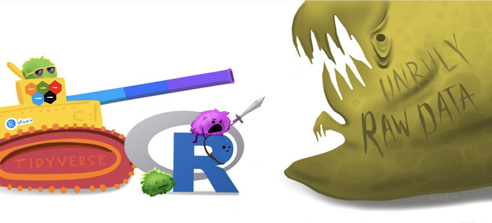
```

Artwork by [\@allison_horst](<https://twitter.com/allison_horst>)

#### Rules of tidy data

There are three interrelated rules which make a dataset tidy:

1.  Each **variable** must have its own **column**.
2.  Each **observation** must have its own **row**.
3.  Each **value** must have its own **cell**.

```{r, echo=FALSE, fig.align='center', out.width="70%"}
knitr::include_graphics("images/m2/image_tidyData.png")
```

Image from: <https://r4ds.had.co.nz/tidy-data.html>

#### Recognizing Tidy Data

> "For a given dataset, it is usually easy to figure out what are observations and what are variables, but it is surprisingly difficult to precisely define variables and observations in general." (Wickham, 2014)

A general rule of thumb:

-   It is easier to describe functional relationships between variables (e.g., z is a linear combination of x and y, density is the ratio of weight to volume) than between rows.

-   It is easier to make comparisons between groups of observations (e.g., average of group A vs. average of group B) than between groups of columns.

(Wickham, 2014)

#### Further reading on tidy data (optional)

While I know many of you will have covered tidy data in STA130, I know others will not be familiar with it. You will need to be able to think about whether or not your data is tidy for several assessments in this course.

**Wickham & Grolemund. *R for Data Science*. 2017 [Chapter 12: Tidy data](https://r4ds.had.co.nz/tidy-data.html)**

### Student grades case study

There are (at least) two ways you could approach this case study:

a)  Try it yourself first with the file that has "\_guided" in the name and then watch the video.\
b)  Follow along with the video. I'll be using the file with "\_minimal" in the name.

I've tried to design it so either way will work, but I think following along with the video *might* be the best use of your time, if it works for your learning style.

[**Case study on the Jupyter Hub**](https://jupyter.utoronto.ca/hub/user-redirect/git-pull?repo=https%3A%2F%2Fgithub.com%2Fsta303-bolton%2Fsta303-w22-activities&urlpath=rstudio%2F&branch=master)

If you would rather work locally, there is information on how to download files from the JupyterHub in the [Resources section of the course guide](#using-rstudio-with-the-jupyterhub).

Note: You'll have to navigate to the Home directory in the Files pane to find this activity in `STA303-w22-activities/m2-casestudy`. See the [instructions](#using-rstudio-with-the-jupyterhub) using RStudio with the JupyterHub.

#### Videos

```{r, echo=FALSE, fig.align='center', out.width="60%"}

if (knitr:::is_latex_output()) {
  
} 
```

Please note, I filmed these videos last year, so please ignore any assessment/admin comments. The actual R work is all still totally relevant.

```{r, echo=FALSE, fig.align='center', out.width="60%"}


```

- [Video 1: Set up](https://play.library.utoronto.ca/6f87f2df36d49522514fb4d638967b52)

- [Video 2: Data wrangling](https://play.library.utoronto.ca/watch/6653b80f2a13fb7338132ae14e5a03c8)

- [Video 3: Data viz](https://play.library.utoronto.ca/56e0b46e07f3af60f346518ef7f1e478)


## Ethical professional practice for statisticians

The following sections consider the whys and whats of ethical practice organized under the categories of:

- [getting data](#getting-data): confounding and study designs, human research ethics, web scraping and APIs, Indigenous data sovereignty);  
- [analyzing data](#analyzingethics): HARKing & multiple testing;  
- [making decisions with data](#making-decisions-with-data): algorithmic bias and transparency.

There is a lot of ground covered, though lightly, and it may feel intimidating or overwhelming—there is so much to consider, so much we could get wrong! So, here is some advice from our TA Sonia Markes, who was part of crating this module: _developing the judgment and skills related to these topics takes time and no analysis is ever perfect—we rely on collaboration with other scientists and statisticians who all try to think critically to avoid harm and to improve our collective knowledge and understanding._

### Why should statisticians be ethical?

I hope this questions seems a bit silly to most of you, shouldn't we all strive to be ethical in our professional and personal lives? Well regardless of your personal philosophy, there are additional considerations with respect to our professional ethics.

- __Professional societies:__ You may have heard of the [Hippocratic oath](https://en.wikipedia.org/wiki/Hippocratic_Oath) ("first do no harm") in Medicine and there are similar codes of conduct for Statisticians ([see the links to the Canadian and US version below](#ethicscodes)) through our own professional societies.

- __Research ethics boards:__ If you are conducting research within universities, it will often have to be approved by a research ethics board. You need to have the skills and knowledge to help appropriately design studies that can be approved under these rules.

- __Legal and business considerations:__ Unethical behaviour can also get you are your future employers into trouble. There are of course reputational risks, but there can also be legal risks for creating algorithms that discriminate against protected attributes like gender or ethnicity.

Statistical tools are used to create knowledge. Therefore, anyone using statistical tools is responsible for the knowledge they create through their data collection and analyses.

As ethical statisticians it is important to:
+ be accurate in our analyses and conclusions
+ be alert to possible consequences of our results/recommendations on others
+ be honest in reporting results, even when we don't get the results we hoped for
+ be respectful of other reasonable results (based on well-conducted research) even if they differ from our own
+ be mindful of what your data represents, especially if it represents people or their behaviour (a study on people has _subjects_, not objects)
+ share credit when our work is based on the ideas of others
+ and more...

You will be asked to write your own code of ethics in your final project. 

#### Relevant codes of conduct for statistical societies/associations in North America {#ethicscodes}

__Statistical Society of Canada:__ https://ssc.ca/sites/default/files/data/Members/public/Accreditation/ethics_e.pdf  
__American Statistical Association:__  https://www.amstat.org/ASA/Your-Career/Ethical-Guidelines-for-Statistical-Practice.aspx

### Getting data

#### Confounding and study design

```{r, echo=FALSE, fig.align='center', out.width="70%"}
knitr::include_graphics("images/m2/confounding.png")
```


##### Confounders (i.e. confounding factors or confounding variables)

```{r, echo=FALSE, fig.align='center', out.width="100%"}
knitr::include_graphics("images/m2/confounding_image.png")
```

In an **observational study**, variables are "observed" (measured and recorded) without manipulation of variables or conditions by the researcher.

Two variables are **confounded** if their effects on the response variable are mixed together and there is no way to separate them out. If this is the case, we have no way of determining which variable is causing changes to the response.

__Example:__ As ice creams sales rise, so do drownings. But are people drowning because of ice cream? What would be a plausible confounder for this relationship? (Hint: ☀️🌡️️) 

There is no 'test' for confounding. But this is a great thing if you don't want the robots to take your job anytime soon. We need smart people who can think well about confounding.

**When we have data from an observational study, we can often only conclude association between variables, not causation.** It is worth noting that methods of causal inference are significant area of research for statisticians and others.


```{r, echo=FALSE, fig.align='center', out.width="70%"}
knitr::include_graphics("images/m2/picard.png")
```


So, do we give up on claiming causation?

</br>

No!


```{r, echo=FALSE, fig.align='center', out.width="65%"}
knitr::include_graphics("images/m2/oprah.png")
```


##### Designing studies to avoid confounding

In an **experiment** (or __randomized trial__ or __randomized control trial__) variables and/or conditions are manipulated by the researcher and the impact on other variable(s) is measured and recorded.

The key is to randomly assign some individuals to one treatment (or condition) and randomly assign others to another treatment (sometimes this other treatment is a __control__) _Note: you can have more than two treatments groups too—what is important is that individuals are randomly assigned to them!_

The groups (before treatments are applied) should be very similar to each other with respect to the other variables. Any differences between individuals in the treatment and control groups would just be due to random chance!

If there is a __significant difference__ in the __outcome__ between the two groups, we may have evidence that there is a __causal relationship__ between the treatment and the outcome.


##### Common study designs and how to recognize them

```{r, echo=FALSE, fig.align='center', out.width="45%"}
knitr::include_graphics("images/m2/studies.png")
```


##### Causation from observational studies?

Although well-designed randomized trials are the gold standard way to establish a causal
relationship, observational studies can also help build __evidence__ for causation.

###### Bradford Hill criteria (not assessed)

+ Strength of association
+ Consistency
+ Specificity
+ Temporality
+ Biological gradient
+ Plausibility
+ Coherence
+ Experiment
+ Analogy

> Science is not a magic wand that turns everything it touches to truth. Instead, “science operates as a procedure of uncertainty reduction,” said Nosek, of the Center for Open Science. “The goal is to get less wrong over time.” This concept is fundamental — whatever we know now is only our best approximation of the truth. We can never presume to have everything right.

From the [_Science isn't broken_ reading](https://fivethirtyeight.com/features/science-isnt-broken) for this module (Aschwanden, 2015).


```{r, echo=FALSE, fig.align='center', out.width="90%"}
knitr::include_graphics("images/m2/xkcd_552.png")
```

Source: https://xkcd.com/552/

#### Human research ethics

Ethical codes often emerge out of crisis events.

The Nuremberg code was formulated in August 1947 in Nuremberg, Germany, by American judges ^[Did this judgment mean Americans were always getting research ethics right? Definitely not. (Optional) [YouTube video about the Tuskegee Study](https://www.youtube.com/watch?v=afwK2CVpc9E)
] sitting in judgment of Nazi doctors accused of conducting murderous and torturous human experiments in concentration camps during the war.

The Nuremberg code codified many of our standard principles of ethical research, including:
+ research must appropriately balance risk and potential benefits
+ researchers must be well-versed in their discipline and ground human experiments in animal trials.

##### Principles of free and informed consent

###### Information

The research procedure, risks and anticipated benefits, alternative procedures (where therapy is involved), and a statement offering the participant the opportunity to ask questions and to withdraw at any time from the research.

###### Comprehension

The manner and context in which information is conveyed is as important as the information itself. For example, presenting information in a disorganized or rapid manner (with too little time to think about it or ask questions), may limit a participant's ability to make an informed choice.

###### Voluntariness

An agreement to participate in research constitutes a valid consent only if it is voluntary; this requires conditions free of coercion and inappropriate influence.


#### Web scraping and APIs

Web scraping (also known as web harvesting, web crawling or web data extraction) is any method of copying data from a webpage, usually to then store it in a spreadsheet or database.

Downloading a ready-made .csv file hosted by a site wouldn't be considered web scraping. (Although you might find a programmatic way to download many of these could be.)

##### What do you need to web scrape?

+ Some knowledge of URLs, HTML and CSS
  + URL - Universal Resource Locator
  + HTML - HyperText Markup Language
  + CSS - Cascading Style Sheets
+ The `rvest` and `polite` packages in R (or `Rcrawler`, there may be others too) or `Beautiful Soup` for Python
+ Professional ethics!


```{r, echo=FALSE, fig.align='center', out.width="90%"}
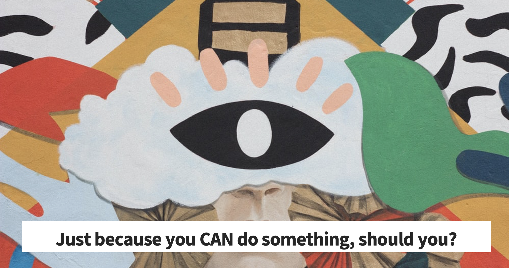
```


##### The Ethical Scraper

I, the web scraper will live by the following principles:

+ If you have a public API that provides the data I'm looking for, I'll use it and avoid scraping all together.
+ I will always provide a User Agent string that makes my intentions clear and provides a way for you to contact me with questions or concerns.
+ I will request data at a reasonable rate. I will strive to never be confused for a DDoS attack.
+ I will only save the data I absolutely need from your page. If all I need is OpenGraph meta-data, that's all I'll keep.
+ I will respect any content I do keep. I'll never pass it off as my own.
+ I will look for ways to return value to you. Maybe I can drive some (real) traffic to your site or credit you in an article or post.
+ I will respond in a timely fashion to your outreach and work with you towards a resolution.
+ I will scrape for the purpose of creating new value from the data, not to duplicate it.

Source: James Densmore, https://towardsdatascience.com/ethics-in-web-scraping-b96b18136f01

##### Terms and Conditions and Robots.txt

Many sites give instructions about what you're allowed and not allowed to do on them.
One way is through the Terms and Conditions and another is through a file called robots.txt.

__T&Cs__

Ideally, we should all be reading all the Terms and Conditions of all the websites we use…and of course I'm sure you dooooo.

But when in a hurry, search (CTRL+F or CMD+F)  “scrape”, “harvest” “crawl” and if none of those come up then “data” and “copied” more generally and that can give you a sense if they prohibit certain uses.

##### Robots.txt
Most large websites have a robots.txt page to give instructions about what 'robots' are and aren't allowed to visit the page. This is most often used for search engines, but we can check them too. Bad bots can still do what they want. 

More on these protocols (and templates you could add to your own site here).
http://www.robotstxt.org/robotstxt.html (optional)

An ethical scraper…
+ ...follows the site's terms and conditions and/or robots.txt.
+ ...uses an API when provided.
+ ...rate limits their requests.
  + I.e., respect a 'crawl limit' suggested by the site, 5 seconds is a polite default if not told otherwise.
+ ...credits their sources.


##### Using an API

API stands for __a__ pplication __p__ rogramming __i__ nterface. 

It is a structured way for data (broadly) requests to be made and fulfilled with computers. 

I like [this](https://www.howtogeek.com/343877/what-is-an-api/) comparison to a restaurant menu. You don't need to know HOW to make crème brûlée to be able to know you WANT it.


If you are using an API, there still may be rules about things like how many requests you can make in a certain time frame and rate limiting. Make sure you're aware of these rules and behave in the spirit of them!

Optional reading (not assessed): https://beanumber.github.io/mdsr2e/ch-ethics.html#sec:terms-of-use 


#### Indigenous data sovereignty

Countries and nations tend to want data collected and stored about them/their people to be subject to their laws. You might see examples of this in how government agencies require any cloud storage they use to have the servers be based within their boundaries. This area of thinking is often called __data sovereignty__.


Canada is one of many countries with a history of colonization by settler peoples and the displacement of, discrimination against, and in many cases mass murder of the Indigenous peoples. As countries like Canada go through processes of truth and reconciliation to address these violent and oppressive histories, _indigenous data sovereignty_ has also become a growing area of thought.


Why do statisticians needs to know about this? Because we must move from data gathering and analysis as further tools of oppression and be part of honouring the sovereignty of Indigenous peoples and nations over their own data. 

1. Be aware of Indigenous rights and interests in relation to data.
1. Understand protocols for consulting with Indigenous peoples about data collection, access and use.
1. Ensure data for and about Indigenous peoples we are given access to is safeguarded and protected.
1. Support quality and integrity of Indigenous data and its collection.
1. Advocate for Indigenous involvement in the governance of data repositories.
1. Support the development of Indigenous data infrastructure and security systems.


Several of these points are generalized from the Māori context in Aotearoa New Zealand. See https://www.temanararaunga.maori.nz/kaupapa.


##### How can U of T students develop their knowledge?

While there aren't yet specific data sovereignty trainings (we're looking at developing these resources), there are several workshops, events and trainings you have access to. 

Go to https://clnx.utoronto.ca and check out the Events & Workshops section.

+ St George Calendars: First Nations House - Indigenous Student Services 
+ Tri-Campus Calendar: Indigenous Cultural Education 

Look for workshops with __John Croutch__ and/or on the following topics:
+ Reconciliation: Walking the Path of Indigenous Allyship
+ Reflecting on Land Acknowledgements
+ Speaking Our Truths: The Journey Towards Reconciliation | 2 days P1 & P2

As well as being important knowledge for working and living in the Canadian context, as we go forwards there is going to be a competitive _disadvantage_ to being ignorant about these issues if seeking work in government, health and social agencies. Many private sector organizations are also making developing these competencies a priority in staff education. 

#### Selection bias

Selection bias can occur in a range of ways, but the key feature is that your sample is not representative of the population. 

__Example__: Suppose I want to email out a survey to investigate if U of T students think statistics is important for their future career. I only have the emails for students I teach...in statistics courses. If I randomly sample from this list of students, can I make claims about the population of all U of T students? No.

__Example__: _The healthy migrant effect_. It has been noticed in many countries that migrants have mortality advantages over local-born populations. While there are several possible things going on and being researched in this area, these findings likely show a component of 'selection bias' in that usually only healthy people can migrate, either due to health screening requirements in the country to which they are migrating, or by people with health complications self-selecting out due to inability/disinclination.

Survivorship bias is a specific type of selection bias.

##### Survivorship bias

_Note: There is a risk that I'm about to ruin a bunch of 'inspirational' internet content for you._ 

If you've spent any time on LinkedIn, and probably lots of other social media sites, you've probably seen an image like this one. Is it inspiring? Sure, maybe.... BUT as an attempted claim about the value of failure it commits the logical error of focusing on just the people who eventually succeeded. I'm sure there are plenty of unemployed, divorced, university dropouts _not_ writing _Parry Hotter and the Windows OS_...


```{r, echo=FALSE, fig.align='center', out.width="65%"}
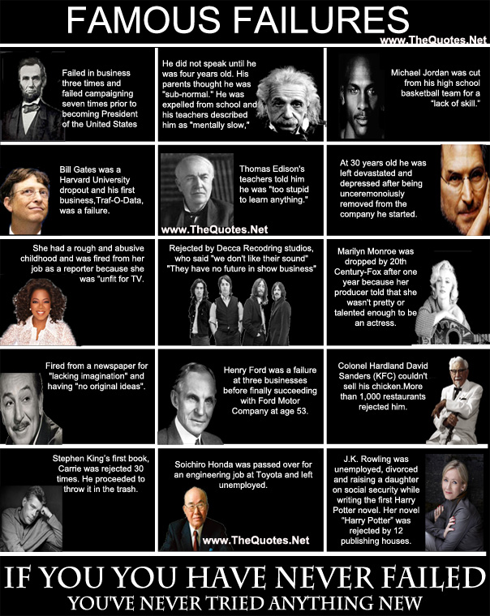
```
[Click for source.](https://www.thequotes.net/2013/08/failures-are-stepping-stones-to-success/)


### Analyzing data {#analyzingethics}

In our readings for this module, the reproducibility crisis, P-hacking and HARKing have been discussed. I won't cover P-hacking or the reproducibilty crisis any further, as these readings are great introductions, but the next few slides talk a little more about __HARKing__ and __multiple testing problems__.

+ Motulsky, H.J., (2014). _Common misconceptions about data analysis and statistics._ https://doi.org/10.1007/s00210-014-1037-6
+ Aschwanden, C. (2015). _Science Isn't Broken: It's just a hell of a lot harder than we give it credit for_. Retrieved from https://fivethirtyeight.com/features/science-isnt-broken

#### HARKing

HARKing is "__H__ ypothesizing __A__ fter the __R__ esults are __K__ nown". 

I sometimes talk about this as the 'no peeking rule' in setting up hypotheses. For example, you should never pick a one-tailed hypothesis test because of your data, it should only be based on findings from previous studies or a physical theory of a phenomenon.

There is a good introduction to this idea in the [Motulsky paper](https://link.springer.com/article/10.1007%2Fs00210-014-1037-6) you have been assigned for your portfolio assessment ). (Think the XKCD jelly bean comic!)

There are critiques about whether HARKing is as harmful to science as sometimes claimed and a lot of yummy philosophy of science that we won't go into. If you're interested in this area, try reading Rubin (2017), ["When Does HARKing Hurt? Identifying When Different Types of Undisclosed Post Hoc Hypothesizing Harm Scientific Progress"](https://journals.sagepub.com/doi/10.1037/gpr0000128) (optional).


```{r, echo=FALSE, fig.align='center', out.width="70%"}

if (knitr:::is_latex_output()) {
  knitr::asis_output("There is a GIF in the web version. Not required content.")
} else {
 knitr::include_graphics("images/m2/hark.gif")
}
```


#### Multiple testing problem

One of my favourite examples of positive academic trolling is the dead salmon study. The study used methodology for exploring animal reactions to human emotions expressed in photographs through fMRI scans.

```{r, echo=FALSE, fig.align='center', out.width="60%"}
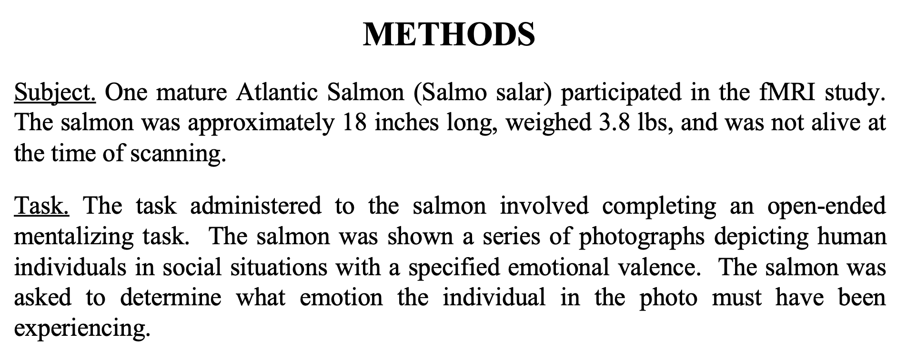
```

If the researchers had ignored the issue of multiple comparisons (there are thousands of areas for which brain activation is measured) they might have ended up with test results that claimed the (dead) salmon was engaging in 'perspective-taking' when shown the photos of the humans. (It was not).

See the poster here: http://prefrontal.org/files/posters/Bennett-Salmon-2009.pdf

This is the reason we would want to run an [ANOVA](#anova) when we have more than two groups to compare the means of, instead of doing multiple t-tests between every pair of levels and it is mentioned in conjunction with HARKing in [Motulsky paper](https://link.springer.com/article/10.1007%2Fs00210-014-1037-6).

___But what is actually going on here?___

Suppose you've picked a significance level of $\alpha = 0.05$. When conducting just one test this means we're accepting a 5% risk of making a Type 1 Error, that is, rejecting the null hypothesis when we shouldn't. BUT, if we are conducting several tests at the same time, then we need to think about our __family-wise error rate__, which is our chance of making at least one Type 1 Error across all our tests.

So, if you are making a Type 1 Error 5% of the time, the idea is that 95% of the time you're not. And while 95% is pretty good, if you're doing $m$ independent tests, the not-making-an-error rate becomes $0.95^m$, e.g., if you're doing $20$ tests, $0.95^{20}=0.359$, meaning the chance of making at least one 'false discovery' is now $\sim64\%$

##### Correcting for multiple comparisons?

There are multiple methods investigators employ in an effort to have their Type 1 Error across multiple tests actually reflect the error rate they are comfortable with.

The simplest but most conservative of these is the Bonferroni correction where you just divide your significance level (e.g., 0.05) by the number of tests you are conducting  and use that as the new significance cut off. 

E.g. If you'd usually use a 5% threshold and are doing 20 tests, your new threshold is $$\alpha_{adjusted} = \frac{0.05}{20} = 0.0025.$$ 
As you can see, this is now a much stronger level of evidence we're requiring against our null hypothesis than when doing a single test.


### Making decisions with data


#### Algorithmic bias

Prediction models are taught what they "know" from training data. Training data can be incomplete, biased, or skewed. This can result in
__algorithmic bias__.

##### Proxy variables

There can also be situations where we know we DON'T want to use a variable as part of an algorithm, for ethical and often legal reasons (anti-discrimination laws about gender, race, health status, e.g. American's with Disabilities Act means you can't discriminate against people with mental health conditions). BUT there might be other variables in your data, like certain types of hobbies/memberships, home address, 'personality' quiz questions, that act as 'proxies' for these things, meaning they end up determining outcomes even when you don't want them to.


__Optional reading__

+ Amazon scrapped 'sexist AI' tool, BBC, 2018. https://www.bbc.com/news/technology-45809919  
+ Amazon discreetly abandoned gender-biased AI-based recruiting tool, HRK News, 2018 https://www.hrkatha.com/recruitment/amazon-discreetly-abandoned-gender-biased-ai-based-recruiting-tool/


#### Should algorithms be transparent?

Some predictive algorithms give us more than just a prediction: they also give us some
insight as to what factor(s) influenced the prediction. Examples you might have encountered in your studies already include linear regression models and classification trees.

Other algorithms yield predictions, but no information about how it got from the inputs
to the prediction, such as neural networks (you may see these in future courses). These are sometimes called 'black box' algorithms and many machine learning tools fall into this. We'll briefly talk more about this when we discuss generalized additive models later in the course. 

What is more important—getting the most accurate predictions, or understanding the factor(s) which influence a prediction?

When you approach a new statistical problem, try to figure out if you are aiming to make __predictions__, make __inferences__ about relationships between variables, or provide informative __summaries and descriptions__ of the data.

## Statistical communication

This section will be important to review as you work on your final project. You may want to scan it more quickly now and come back in more depth later in the semester.

### Prioritize statistical communication as part of your toolbox

While the technical skills of U of T statistics graduates are well received by employers. There is a common theme of communication skills not matching their business needs. 

This is part of the thinking behind the emphasis on writing in this course, your professional development task and the project, as well as providing opportunities to 'talk stats' in Team Up! groups. 

The section lays out some overarching tips about how to think about your role as a statistical communicator and some general tips about statistical reports, and their contents and structure.


#### What can statisticians learn about communication from Winston Churchill's mother's dinner conversation?

In the lead up to a British election during the Victorian era, Jennie Jerome (Churchill's mum) attended a dinner with the leader of the Conservatives, Benjamin Disraeli, and the leader of the Liberals, William Ewart Gladstone. She said:

> "When I left the dining room after sitting next to Gladstone, I thought he was the cleverest man in England. But when I sat next to Disraeli, I left feeling that I was the cleverest woman."

Who won that election? 

<br>

<br>

__Disraeli.__ ^[(Optional) Read more here: https://www.businessinsider.com/charismatic-leadership-tips-from-history-2016-10]


__So, what *can* statisticians learn about communication from Winston Churchill's mother's dinner conversation?__

I think of this story often when working with clients. Especially early in my career, while I was still building my confidence, there was always the impulse to 'show off' my stats knowledge through jargon in some attempt to show that I was 'worth the money' clients were paying.


And sure, you need to have substance and skill to do the job well. But always think of your job when communicating with non-statisticians as additionally one of **education**. 


You want repeat business? Or to impress your non-statistician manager? Then communicate in ways that helps them to 'aha!' moments. **Have them leave you feeling cleverer about statistics than they thought they were coming in.**


Below is a screenshot from a talk [Chelsea Parlett-Pelleriti, \@ChelseaParlett](https://twitter.com/ChelseaParlett) gave at the [Toronto Data Workshop](https://rohanalexander.com/toronto_data_workshop.html). These are the questions she asks herself when communicating about statistics and ones I think we should all ask ourselves, too. 

```{r, echo=FALSE, fig.align='center', out.width="50%"}
knitr::include_graphics("images/m2/chelsea.png")
```

Parlett-Pelleriti, C. (2020) *Talking to non-statisticians about statistics*. Toronto Data Workshop presentation, September 24.

### What do statisticians usually *write*?

Statisticians must often write reports to summarize the results of scientific research or data analyses:

**Academia, health sciences, etc.**

- Write "methods" section of collaborative papers.  
- Present to research groups.

**Industry**

- Create slide decks (either stand-alone or for presentation) summarizing results of data analyses / research for use within the company.  
- Write reports summarizing results of data analyses / research for use within the company.  

### Common report components

#### Brief overview (ONE of the following, not both)

##### Abstract (or summary)

These are common academic articles.

* Short and to the point
* Self-contained (i.e., someone could read this and only this and get the gist of your work)
* Emphasize conclusions rather than specific methods
* Approximately 100–200 words
* No figures, no tables, no/few references.

###### 'Plain English' summaries 
These are also becoming popular in some academic journals. Think of this as something a high school student could read and understand the purpose of the article. [Nice suggestions + example here (optional).](https://www.agu.org/-/media/Files/Share-and-Advocate-for-Science/ToolkitPLS.pdf)]

##### Executive summary
You might see this more commonly in business or government contexts. It is a summary aimed at busy and **non-technical** 'executives' (for example) and would accompany or preface a more detailed technical report. Your ability to communicate flexibly to different audiences is very important here.

* Short and to the point
* Self-contained
* Use bullet points.
* Emphasize conclusions/recommendations.
* *Might* include the most important figures and tables, very carefully chosen.

#### Introduction {#introreport}

**Purpose**: provides background information about the project/research.
* Why was the investigation done?
* What research questions are considered in the report (scope)?

The final paragraph of the introduction should outline what is in the rest of the report. Think of it as the road map.

Important: If you are consulting for a client/collaborator ^[If you're interested in statistical consulting, STA490 is a great course (I'm biased), though often limited to students in the Methods and Practice Specialist and with very strict prerequisites], don't pretend to be an expert if you are not one! The purpose of this section is to provide context (as you understand it) for the rest of your report, so that the report is a complete document, and it is clear what you will and will not address.

#### Data summary (optional)

Useful if you feel you need more details than you can reasonably give in the Introduction and/or what will be discussed in a Methods section.

**Purpose**: describing the data, but not answering the research question (which you will put in the "Results" section).

**Might include:**
* Basic summary tables, graphs, and descriptive statistics.  
* Changes made to the data to make it suitable for analysis.  
* Discussion of decisions around missing data.  
* Large tables or series of graphs should go in an *appendix*, not in the main body of the report.

#### Methods {#methodsreport}

* Briefly describe the design of the scientific study, in the context of the analysis.
    - If you're writing for a collaborator, you don't need to tell the collaborator what *they* did. Use this section for what you did!
    - Resist the temptation to make a diary. This shouldn't be a digest of everything you've done (only the key analyses which you wish to comment on in the results section).
* Do `r colorize("NOT", "red")` include trivial information (e.g., "The data in Excel were saved in a text file and read into R“).
* Be clear which methods were used for what purpose, related to the context of the project. This will likely need to be clarified further in the results section.
* The required level of detail depends on the statistical method.
    - Basic/standard methods (e.g., t-tests, linear regression): do not need to explain.
    - More advanced methods: explain the general motivating ideas in words; you are not writing a statistics textbook!
* A separate methods section is traditional in many scientific journals, but can be difficult (and frustrating) to write if it is too disconnected from the analysis. *Sometimes* it is better to describe the methods and results together.


#### Results {#resultsreport}

* Make sure this section is clearly organized, point-by-point, in paragraphs.
* Computer output `r colorize("NEVER", "red")` goes in the body of the report, and RARELY in an appendix, though this depends on your audience/future users.  
  * I would encourage you to consider providing code in 'supplementary materials' as this can aid others with reproducing your results and learning from your work. Privacy and sensitivity of data considerations apply.  
* Include graphs and small tables that tell the main story; less relevant graphs/tables should go in an appendix.  
* If you include a figure/table, you must refer to it in the body of the report (NO lonely figures/tables!). Describe in words what the table/graph shows.
* If you find you are repeating all of the information that is in the graph or table, consider whether or not you need the graph or table.
The purpose of figures and tables is to illustrate a pattern, which should be clear for someone looking at it.
* Figures and tables require clear labels and captions (not too small!).
    - General advice/convention is that tables are read from top to bottom, and so **table captions go on top of the table**. Figures on the other hand are read 'bottom to top' and so **figure captions go below the figure**. If your image is not in a report (i.e. an info-graphic like our charts from the data exploration assessment) you might prefer to have a clear title (and subtitle) at the top instead of a caption.
* You may want to group similar graphs into a figure with sub-figures (e.g., Fig 1a, 1b —be sure that the labels/captions are large enough to read though)
* **Describe results in words** and include, parenthetically, the relevant statistics such as means with standard errors (or confidence intervals) or the test statistic with p-value. 
    - **Round appropriately!** What is an interesting or useful level of 'granularity' for this study?

```{r, echo=FALSE, fig.align='center', out.width="100%"}
#knitr::include_graphics(str_c(here::here(), "/images/m2/worst-graph.png"))
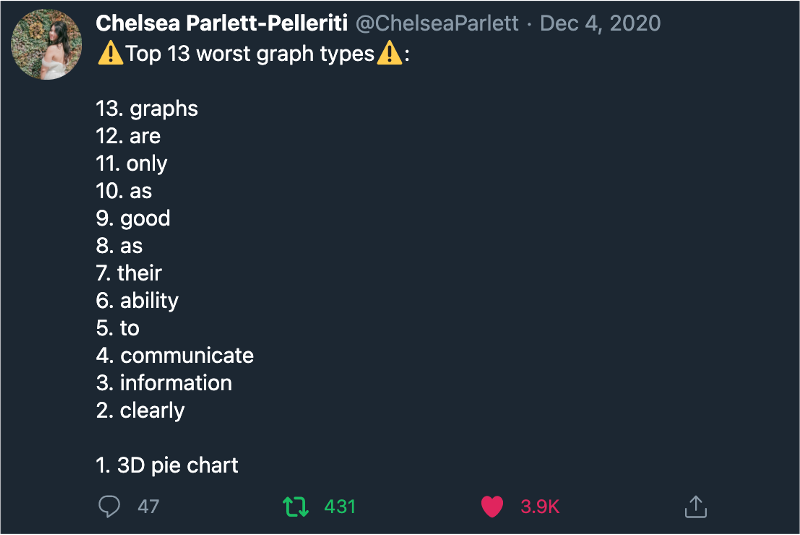
```
Source: https://twitter.com/ChelseaParlett/status/1335009390567456768


__Aside: Someone at the US Treasury is my arch nemesis, and they don't even know it.__   

```{r, echo=FALSE, fig.align='center', out.width="90%"}
#knitr::include_graphics(str_c(here::here(), "/images/m2/worst-graph.png"))
knitr::include_graphics("images/m2/fiscal.png")
```
Source: https://fiscal.treasury.gov/files/reports-statements/financial-report/2019/executive-summary-2019.pdf


#### Conclusion/discussion {#concreport}

* __Summarize__ what was learned regarding the research question.
* Discuss possible __weaknesses/limitations__ in the study and/or analysis and specific suggestions for future considerations.
* If appropriate (often done in academic articles) discuss __strengths__/positive points of difference of this study also.
* Explain what the work was able to achieve and not able to achieve.

#### References {#referencesreport}

* Only include references that have been cited in the text.
* There are many different styles. I often use APA, but don't really have any strong preference. Be consistent and head any instructions relevant to where you are publishing and/or norms in the company/industry/discipline you are working in.

#### Appendices {#appreport}

* Include tables and figures which would __interrupt the flow__ of the report if they were included in the main body (e.g., less relevant, but still interesting)
* Keep in mind this is __*not* a dumping ground__. Only include graphs/tables which would be useful/interesting to your audience, and make sure any figures/tables you include there stand alone (e.g., with detailed titles and captions) and are supported by text if necessary.
* If you include an appendix, you should __point to it in the body of the text__, so that the reader knows when it is relevant to flip to it, if they want more information.

#### Final notes on organization

* The overall structure of most articles and reports? 
    - *Say what you're going to do and why,*
    - *do it,* 
    - *say what you did (and what it means).*
* The **ordering** of ideas should be consistent throughout your report.
E.g., if there are multiple research questions in the introduction, they should be addressed in the same order in the methods, results, and conclusion. This is such a simple thing, but easy to forget in the moment.
* You *could* also combine the methods/results sections and **organize your report by the question being answered** (with one subsection for each question).
    - In each subsection, state the methods used and the results.
Having separate sections for methods and results makes more sense if the same methods are used repeatedly.
* Many people only read the introduction and conclusion (or at least they start there...) so make these sections are complete and self-contained.

### Paraphrasing

*This section has been prepared by our Head TA, Amin.*

*STA303 and Amin's roll is supported by the Faculty of Arts and Science's English Language Learning and Writing teams. If you have particular challenges or questions about writing and communication, let us know! We may be able to direct you to specific resources and/or make STA303 specific ones.*

*This section will help you with your portfolio assessment and may also be useful as you take notes on the readings for this module.*

**Paraphrasing** is re-writing someone else's statement in your own words. To paraphrase well you need to (1) **provide a reference** (avoid plagiarizing) and (2) **understand** the text and **write** in your own words and create new sentence structures. Recommended resource: https://advice.writing.utoronto.ca/using-sources/paraphrase/.

#### Example activity prompt

Suppose you were asked to paraphrase the below text and provide your conclusions from the observations in the text and the graph in 100 to 200 words. The report is from Statistics Canada (Provencher, Milan, Hallman, & D'Aoust, 2018):

**Note: To avoid plagiarism**, I have:

(1) placed quotation marks ("") around the verbatim text copied and pasted below, and

(2) provided a reference in the previous sentence (Provencher, ... 2018) and the complete citation at the end under "References".]

> "The annual growth in the number of births in the past five years has fluctuated, compared with the period from 2002/2003 to 2008/2009, when it remained positive and stronger (2.1% on average). Between 2011 and 2012 and between 2013 and 2014, the number of births rose around 1.0% across Canada, while they fell 0.4% from 2012 to 2013 and from 2014 to 2015. There was only a small increase of 0.2% between 2015 and 2016. Since 2001, the total number of births fell only four times, in 2001/2002 and 2009/2010, and more recently in 2012/2013 and 2014/2015."

```{r, echo=FALSE, fig.align='center', out.width="100%"}
knitr::include_graphics("images/m2/paraphrase.png")
```

Source: Provencher, Milan, Hallman, & D'Aoust, 2018

The following provides guidance on what **poor**, **adequate** and **excellent** paraphrasing could look like. You will be putting this into practice with your [portfolio](#portfolio) writing task.

##### Sample partial/complete answers with overall gradings

###### Poor

-   Copying/pasting verbatim is NOT paraphrasing.

-   In the following, there is no change in structure, just a few words replaced.

"The `r colorize("~~annual growth~~", "red")` `r colorize("yearly increase", "blue")` in the number of births in the `r colorize("~~past~~", "red")` `r colorize("last", "blue")` five years has `r colorize("~~fluctuated~~", "red")` `r colorize("varied", "blue")`, compared with in contrast to the period from..."

###### Adequate

-   Changes in wording and structure but text is vague and does not help the reader understand the main points in context of location or time, nor does it provide the source of information.

*The number of births has fluctuated over time. There are times when the number is relatively high and sometimes it is relatively low. Not all increases were large with some being as little as 0.2%...*

This is adequate in that it is not obviously an academic integrity offence but it would not be particularly useful.

###### Excellent

-   Changes in wording and structure. Provides a good overview.
-   Conclusion with appropriate hedging: "...may have been a contributing factor..."
-   A shorter version without explaining all the points would have been okay too.
-   Stating the reason for observation is unknown and may require further inquiry would have been okay too.

*Based on the 2018 report provided by Statistics Canada, yearly birth growth in Canada was initially increasing from 2001/2002 up till 2008/2009 but then slowed down. At its peak, yearly birth growth reached nearly 4% while at its lowest, after 2008/2009, birth growth was even slightly negative at times. The number of births fell 4 times from 2001 to 2016, with 3 out of 4 of these times being in the second half of 2001 -- 2016. All these observations point toward a possible change at that time to disrupt the trends midway in 2008. The timing of the lowering of birth numbers coincides with the 2008 financial crisis in Canada and this may have been a contributing factor as families may have not had the financial certainty to have kids. A close examination of contributing factors through research is needed to see if this is true.*

#### How to think about paraphrasing?

Based on a method suggested by (Swales & Feak, 2012), identify: 

* important points from the text,  
* relationships,  
* linking phrases,  
* connectors, and  
* synonyms.

Below is an example of how you might have taken notes on the example paragraph to aid your paraphrasing. You _don't_ need to submit anything like this as part of your portfolio assessment. Submit the response to the prompt only. Please be aware that if you do not paraphrase correctly, you may receive a zero on the ENTIRE writing component. 

##### Example using the Swales & Feak (2012) approach

__Important points (your notes)__

-   Number of births has fluctuated in past 5 years.
-   The first half of 2001 -- 2016 period saw an average increase in births.
-   The second half of 2001 -- 2016 period saw an average increase in births.
-   Number of births fell 4 times from 2001 to 2016, with 3 out of 4 of these times being in the second half of 2001 -- 2016.

__Relationship between points__

-   Chronological order (more to less)  
-   Asymmetry in distribution of events  

__Linking phrases and expressions to use in paraphrasing__

-   but  
-   while  

__Verbs that might establish other relationships in paraphrasing__

-   Increase  
-   Decrease [not used, slowing down used instead]  
-   Coincides  

__Possible synonyms to use when paraphrasing__

-   fluctuated → varied [+between, +around], changed [not used]
-   compared with → in contrast to [not used]
-   annual→ yearly
-   rose / remained positive and stronger → increased

__Other considerations__

-   Who is the audience?

You are ready to re-write the report in your own words!

#### References {#pararef}

Provencher, C., Milan, A., Hallman, S., & D'Aoust, C. (2018). Report on the Demographic Situation in Canada. Fertility: Overview, 2012 to 2016. Statistics Canada. Retrieved from <http://www150.statcan.gc.ca/n1/pub//91-209-x/2018001/article/54956-eng.htm>

Swales, J., & Feak, C. B. (2012). Academic writing for graduate students : essential tasks and skills (3rd ed.). Ann Arbor: University of Michigan Press.

<!--chapter:end:21-module2.Rmd-->

# Module 3

<!--chapter:end:22-module3.Rmd-->

# Module 4

<!--chapter:end:23-module4.Rmd-->

# Module 5

<!--chapter:end:24-module5.Rmd-->

# References {-}

<!--chapter:end:49-references.Rmd-->

# (PART\*) Appendix {-}

# Resources

## Course tools overview

While we've tried to keep things as streamlined as possible, there are still several different tools we'll be using this semester. Your U of T login should work with all of them. The below PDF file provides an overview of how you'll be interacting with each one.

-   At the bottom of the page is an embedded slideshow introducing you to the JupyterHub.\
-   You can always access Piazza from the Navigation Menu on the left.\
-   Instructions for setting up your U of T Zoom are on the Zoom page and links are in the Navigation menu and on the home page.

```{r, echo=FALSE, message=FALSE, warning=FALSE}
library(tidyverse)
library(pander)
```

### Admin

```{r, echo=FALSE, message=FALSE, warning=FALSE}
tibble(
  Logo = c("images/course-tools/quercus.jpg" %>% pander::pandoc.image.return(),
           "images/course-tools/zoom.png" %>% pander::pandoc.image.return(),
          "images/course-tools/forms.png" %>% pander::pandoc.image.return(),
  "images/course-tools/markus_logo.jpeg" %>% pander::pandoc.image.return(),
  "images/course-tools/peer-scholar.png" %>% pander::pandoc.image.return()
  ),
  Description = c("[Quercus](https://q.utoronto.ca/) will be used for timed assessments, some submissions and announcements.",
                  "Synchronous classes and office hours will be hosted via [Zoom](https://utoronto.zoom.us). You MUST join using your U of T Zoom account to be admitted. Get your account: utoronto.zoom.us",
                  "Microsoft Forms will be used for several important administrative forms. You will need to be signed in to your U of T account in the same browser to access these.",
                  "[Markus](`r markus`) will be used for the submission of code and analysis documentation for several assessments.",
                  "peerScholar will be used for the Create, Asses and Reflect phases of the module writing and peer review tasks. You can access the peerScholar links through the associated Quercus assessments.")
) %>% 
pander::pander()
```

## Using RStudio with the JupyterHub

We will be using R through RStudio to conduct analyses in this course. If you have a local installation of R you are welcome to continue using that, but, for this course, you do not need to have R and RStudio installed. Instead, assessments and activities will be shared through the U of T JupyterHub. This gives you access to RStudio in your browser through your U of T login on any internet-connected device. It means you don't have to fight package installations and we can instead focus on the good stuff.

**Please read through the following slides, experiment with the example sharing link, make sure you know how to knit an Rmd to pdf + export the pdf, and practice navigating and moving files.**

<iframe src="https://rstudio-with-jupyerhub-uoft.netlify.app" width="100%" height="500" allowfullscreen="allowfullscreen" data-mce-fragment="1">

</iframe>

Link: <https://rstudio-with-jupyerhub-uoft.netlify.app>.


## Team Up!

[Link to student-facing Quercus Support resources.](https://q.utoronto.ca/courses/46670/pages/integration-team-up-for-students)


Please only attend one of these sessions if you are prepared to...

```{r, echo=FALSE, fig.align='center', out.width="60%"}
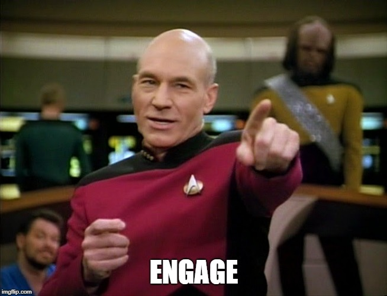
```

Image description: Captain Picard (of the Starship Enterprise) in uniform, pointing forwards. Text reads: ENGAGE

### To participate in these activities, you **need**:

-   A U of T LICENSED Zoom account to access the call. Some troubleshooting tips in this announcement: [Make sure your Zoom is licensed!](https://q.utoronto.ca/courses/253305/discussion_topics/1565885 "Make sure your Zoom is licensed!").

-   A reasonable **internet connection**.

-   A **working microphone.**

-   To be WILLING TO ACTIVELY PARTICIPATE. Please don't ruin this for others who are interested in engaging in meaningful group problem-solving.

    -   There is **no reason to come and lurk**. These sessions are the activity and nothing else.

    -   You can easily get marks for your 🧺knowledge basket in SOOO many other ways AND I will make an asynchronous practice version available so you don't miss out on practice. 

### **Before** the activity you should:

1.  Remember that **you don't have to participate in Team Up! activities**, there are plenty of other ways to earn your 🧺knowledge basket marks. 

    -   Only participate if you really are going to participate (see above).

2.  Check you can access **Shiny interactives** on the JupyterHub: [Module 1 interactive](https://jupyter.utoronto.ca/hub/user-redirect/git-pull?repo=https%3A%2F%2Fgithub.com%2Fsta303-bolton%2Fsta303-w22-activities&urlpath=shiny%2Fsta303-w22-activities%2Finst%2Ftutorials%2Fsta303_m1_tests%2F&branch=master).

    -   If you get a 'Not Found' error this is most likely due to one of two issues:

        -   Solution 1: Ensure you don't have any other interactives open. (Close any tabs with the orange-arcs JupyterHub logo).

        -   Solution 2: Go to <https://jupyter.utoronto.ca>, open a new RStudio session by going New -\> RStudio (see slide 3 of [these instructions](https://sta303-bolton.github.io/sta303-w22-courseguide/resources.html#using-rstudio-with-the-jupyterhub)) and move any .Rmd files in your 🏠Home directory (see slide 10 of [these instructions](https://sta303-bolton.github.io/sta303-w22-courseguide/resources.html#using-rstudio-with-the-jupyterhub)) to a new folder (or delete them if you don't need them). Remember: No naked Rmds in YOUR home!

3.  Decide if you want to be **randomized into a group** or **work with a group of people you already know in the course** (section/tut enrolment doesn't matter).

    -   If **randomizing**, join the Zoom link for the tutorial time you are attending. 'Arrive' on time as latecomers may not be placed in a group.

    -   If **working with your own group**, you don't need to join the call (but can if you get stuck with the tech!). Decide at which time you want to do the activity and set up a personal Zoom/Teams/WeChat/Instagram/carrier pigeon/semaphore chat. Zoom has nothing to do with Team Up!.

4.  Read over the Team Up! instructions below.

### Some rules/logistics

-   **Speak up!** Practice talking about statistics. For these activities, I'd honestly rather you be wrong out loud than right in silence.

-   **Be kind** and constructive. You are in a team, practice being a good team member.

-   Team Up! does not have a great back end. If you don't submit correctly or don't join a group correctly, I CANNOT go in and check or move you around. **FOLLOW INSTRUCTIONS**.

    -   No accommodations will be made for Team Up! issues. Team Up! marks will not be updated by hand (e.g., if you end up in a solo group/tech issues, etc.).

-   You must do this as a group activity, during a tutorial time, if you wish to receive a 🧺knowledge basket grade.

    -   **A 'group' is 2--4 people.**

    -   All members of groups of 1 (solos) and 5+ will receive a zero. Group size is based on what is **recorded by Team Up!** through your registration with your group codes.

-   You cannot do a Team Up! more than once.  You cannot attend both sessions.

-   If you have a ghost 👻in your room (randomized in the class organized Zoom call), please 'Ask for help' (there is a button). 'Raise hand' *doesn't* alert me if you're in a breakout room.

**Timing note: Assessment pages will become available at 15 minutes past the hour and remain available for 45 minutes. Ensure sure your team submits by the end of the session.**

### Team Up! Instructions

Participating in Team Up! activities can earn you knowledge basket points. They will be based on how well your team does, so work together and give it a good effort. 

You will complete the following 5 steps:
.midi[
1. **Introductions** (first/personal name + a one-word description of how your week is going so far). Use this time to confirm everyone understands the instructions.
2. **Driver** sets up Team Up! group
3. **Members** join Team Up! group
4. Complete the activity
5. **Submit** the activity


#### Step 1: Decide on roles

You will need: 

* An **Instructions Master** who is responsible for helping the team follow these instructions carefully.  
* A **Screensharer** who is responsible for sharing the activity on their screen. 

* A **Driver** for the Team Up! side of the activity. The Driver acts as team leader, responsible for navigating the quiz, confirming the team's final agreed upon answer to a question, and submitting the completed quiz score to Quercus.The Driver has a steering wheel next to their ID and is differently coloured than other Team Members.


Team Members (other than the Driver) participate and choose vote on answers, so all team mates can see what they have chosen, but they cannot submit their choices to Team Up!.


DECIDE THIS BEFORE CLICKING ANYTHING TO DO WITH TEAM UP!

#### Step 2: Driver sets up group

The person in your group whose first/personal name comes last alphabetically will be the Leader (Driver) for the session.

**The Driver must do the below steps FIRST to get the group code.** Then they will share the group code with all the members of the group so they can also join.

1  Log-in to Quercus from your device (phone, tablet, computer).

1 Click on the Team Up! assignment from the [Course Overview](`r course_overview`) page.


2 Click ‘Go to Tool’. If it is not appearing, refresh your page or try a different browser.

```{r, echo=FALSE, fig.align='center', out.width="50%", fig.align="center"}

```

NON-DRIVERS! DO NOT TOUCH ANYTHING!

3 Choose “Create New Group”

```{r, echo=FALSE, fig.align='center', out.width="100%", fig.align="center"}
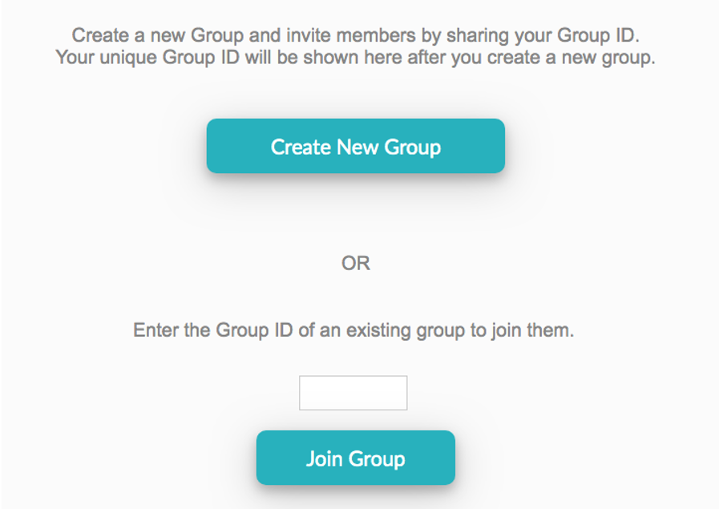
```


4 Share group ID in Zoom 
```{r, echo=FALSE, fig.align='center', out.width="100%", fig.align="center"}
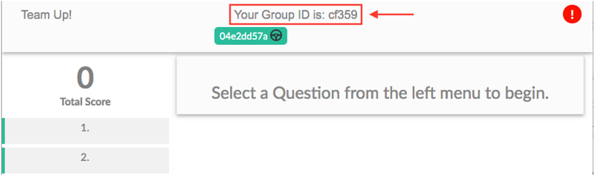
```


#### Step 3: Members join

Once the Driver has shared the group ID, AND ONLY THEN do the following:

1 Click on the Team Up! assignment from the [Course Overview](`r course_overview`) page.


2 Click ‘Go to Tool’. If it is not appearing, refresh your page or try a different browser.

```{r, echo=FALSE, fig.align='center', out.width="50%", fig.align="center"}

```

3 Input the code your driver provided and click 'Join Group'. 

```{r, echo=FALSE, fig.align='center', out.width="45%", fig.align="center"}

```

#### Step 4: Complete the activity

1. You will need to have the __interactive activity (question document)__ associated with this task open on to see the answer options and update any code. __Be prepared to switch between Team Up! and the JupyterHub tab.__

2. The Driver chooses a question, and the team can participate by choosing their own answers and discussing their choices with each other. Once the team decides on a final answer, the driver chooses it and clicks the Check Answer button. **Note**: The Driver can check an answer despite what the team members choose, so be careful that you have consensus before clicking the Check Answer button. You cannot undo.

3. If the answer is __correct__, you will be awarded the full score or "diamonds" for that question. You will be able to proceed onward by clicking the Next button that will appear under the Check Answer button or by clicking on a question in the menu on the left. If your team's answer is __not correct__, discuss the question and choose again. Repeat until you get the correct answer. All teammates can see whether responses are correct/incorrect as well as their team's overall score as they progress through the Team Up! session.


#### Step 5: The Driver MUST click Submit to Quercus for your answers to be processed. 

If this is not done, no one on the team will get a grade!!!!

```{r, echo=FALSE, fig.align='center', out.width="70%", fig.align="center"}
knitr::include_graphics("images/course-tools/submit.png")
```

## Zoom, Zoom, Zoom, Zoom... {#zoomzoomzoomzoom}

\
Access to STA303 synchronous meetings and office hours is restricted to our students.\
\

[Set up your U of T Zoom account](https://utoronto.zoom.us/signin)

### Make sure your Zoom is up to date

To participate fully, you will need Desktop client or mobile app: version 5.3.0 or higher. You can check your desktop client or mobile app version by following [these instructions.](https://support.zoom.us/hc/en-us/articles/201362393-Viewing-the-Zoom-version-number)

### Customize!

Once you have logged in, [please customize your profile](https://support.zoom.us/hc/en-us/articles/201363203-Customizing-your-Profile):

-   Update your name to your **preferred name** (what you would like us to call you in class) Note: this may not be allowed with your U of T settings, so don't worry if this doesn't work.

-   Add a **profile picture** (please make it a photo of YOU or an avatar that looks like you...we don't want Snoopy or Joe Biden^[Yes, these are real images students have used.] in class)


### VPN

There is a [University of Toronto VPN (UTORvpn)](https://isea.utoronto.ca/services/vpn/utorvpn/) that you have access to as a student. It may help with video quality and access to U of T resources.\
If you are based in mainland China, the [Alibaba Cloud Enterprise Network (CEN)Links to an external site.](https://onesearch.library.utoronto.ca/ic-faq-categories/alibaba-cloud-enterprise-network-cen-service) service should help with your Quercus access.

### Notes:

1.  Please always use your real name and face for this course, and be cautious about changing them and your virtual background for other meetings. A joke background for a call with family or friends may not be appropriate for class.

2.  For class meetings, the settings will always be that your camera and microphone are off to begin with so you have the control to check these things first.

3.  We do ask that, when possible, you use your microphone in office hours, breakout groups and any other small group meetings and strongly prefer that you use your camera AND microphone. We trust you to make the best choice for your environment, comfort and learning.

4.  You may get a **"This meeting is for authorized participants only message".** Choose the "Sign in with SSO" option to sign in.

### Changing your profile picture on Zoom and Quercus

Follow these instructions to add a profile picture (or bitmoji style avatar if you'd prefer) to [Quercus](https://community.canvaslms.com/docs/DOC-10599-4212710334) and [Zoom](https://support.zoom.us/hc/en-us/articles/201363203-Customizing-your-profile). I want this experience to be more social and less faceless. Please don't use photos of cartoon characters, etc. A good photo will be a close-up of your face so we can see who you are even when the photo is small.

### What to do if you experience technical difficulties during class?

**First**, (if possible) send me a chat note that you're having technical difficulties and are working to resolve them.

**Second**, leave the meeting and re-enter. This often resets things and resolves the problem. Before entering the meeting, make sure all of your devices are properly plugged in and Bluetooth devices are connected.

If that doesn't fix things, exit the meeting again and update your Zoom Client. This is the Zoom software that should be on your computer. Here's a short video tutorial explaining how to update the software: <https://www.youtube.com/watch?v=E7zERcVLUBM>.

After updating, enter the meeting again to see if this resolved your problems.

**Our synchronous classes are recorded, so if your technology is just going catastrophically wrong, go get a cup of tea/coffee/water and relax, you can catch up with the recording when it is posted on Quercus.**

### What to do if your instructor or TA is experiencing technical difficulties on Zoom

**First,** check the **chat** to see if the instructor or the project mentor have said what is going on and what they are doing to fix things and follow any instructions they give.

**Second**, if they have disappeared completely, wait 10 minutes (or until the end of the meeting time, whichever comes first) before closing the call. (You can do other things in the meantime, but be ready to jump back in).

**Third**, expect to see an announcement on Quercus afterwards telling you what to do (e.g. it might be to watch a video I'll record later, to review some slides or perhaps there is nothing to do and i'll see you next time).

## Student support services and resources

### Mental health support

You may find yourself feeling overwhelmed, depressed, or anxious. Lots of people feel the same way. There is help available from mental health professionals 24 hours a day via online and phone-based services. Here are some that are available to U of T students:

-   [MySSP - My Student Support Program](https://www.studentlife.utoronto.ca/hwc/myssp) 1-844-451-9700, or outside of Canada call 001-416-380-6578

-   [Good2Talk Student Helpline](https://good2talk.ca/) 1-866-925-5454, or text GOOD2TALK to 686868

-   [Distress Centres of Greater Toronto](https://www.torontodistresscentre.com/) 416-408-4357, or text 45645

There is also the new Navi tool for U of T students, it is a chatbot and your questions are totally anonymous. <http://uoft.me/navi>

The student union are also curating a list here: <https://www.utsu.ca/mental-health/>

### General University resources

The following are some important links to help you with academic and/or technical service and support:

-   [**Health & Wellness**](https://studentlife.utoronto.ca/department/health-wellness/) can help with appointments with a range of clinicians, nutrition, immunizations, sexual and reproductive health and much more. Many of their services continue to be available online.

-   **Arts & Sciences** student resources through [Sidney Smith Commons Online](https://sidneysmithcommons.artsci.utoronto.ca/)

-   **General** student services and resources at [Student Life](https://www.studentlife.utoronto.ca/ "Student Life")

    -   Tips for dealing with [multi-choice questions](https://studentlife.utoronto.ca/task/multiple-choice-tests-and-exams/) (MCQs)

    -   Book an appointment with a [learning strategist](https://studentlife.utoronto.ca/service/learning-strategist-connections/) (they can help you with strategies for MCQs also)

-   Full **library** service through the [University of Toronto Libraries](http://onesearch.library.utoronto.ca/ "University of Toronto Libraries")

-   Resources on **academic support** from the [Academic Success Centre](http://www.asc.utoronto.ca/ "Academic Success")

-   Learner support at the [**Writing** Centre](http://www.writing.utoronto.ca/ "Writing Centre")

-   Information about [**Accessibility** Services](http://accessibility.utoronto.ca/ "Accessibility Services")

-   Quercus Information in the [Canvas Student Guide](https://community.canvaslms.com/docs/DOC-10701)

-   Logistical and social support for **international students** at the [Center for International Experience](https://studentlife.utoronto.ca/cie)

Visit the A&S [online resources for students page](https://www.artsci.utoronto.ca/current/academic-advising-and-support/online-resources-students) for resources available to support you through your online studies. If you have further questions, please email [ask.artsci\@utoronto.ca](mailto:ask.artsci@utoronto.ca).

### Financial support

A list of University financial supports, work-study opportunities, as well as provincial and federal government programs is available on the University's [Financial Support & Funding Opportunity directory](https://www.viceprovoststudents.utoronto.ca/covid-19/funding-opportunity-directory/).

### Arts & Science COVID19 FAQ

The [**Arts & Science Undergraduate FAQ page**](https://www.artsci.utoronto.ca/covid19-artsci-student-faqs) addresses frequently asked questions that are specific to undergraduate students taking courses with the Faculty of Arts & Science. On this page you will find information for:

Messages from Dean Woodin can be found on the [A&S latest updates page](https://www.artsci.utoronto.ca/news/covid-19-and-u-ts-response-latest-updates-and-faqs).

<!--chapter:end:50-resources.Rmd-->

# FAQs and Errata

## Frequently asked questions

While [Piazza](`r `piazza`) is our main class question and answer board, this page will have some static Questions and Answers for frequently asked questions. Use Cmd + F (Mac) or Ctrl + F (PC) to search for keywords on this page.

Additionally, make sure you're familiar with the [Syllabus](#syllabus). I've tried to explain as much as I could there.

### Course admin

#### STA303 pre-requisites {#prereq-faq}

##### *I didn't take STA302 or an equivalent course, can I still take STA303?*\
No, sorry. We enforce pre-reqs strictly. This isn't up to me. You will be removed from the course. Please **reach out to the UG stats team ([ug.statistics\@utoronto.ca](ug.statistics@utoronto.ca))** about questions of this nature.

-   [Book an appointment during their office hours](https://outlook.office365.com/owa/calendar/DepartmentofStatisticalSciencesUndergraduate@utoronto.onmicrosoft.com/bookings/ "https://outlook.office365.com/owa/calendar/DepartmentofStatisticalSciencesUndergraduate@utoronto.onmicrosoft.com/bookings/").

-   For grad courses, please email [grad.statistics\@utoronto.ca](mailto:grad.statistics@utoronto.ca).

#### Lecture and tutorial times

##### *How exactly do the tutorials and lectures work?*

__Wednesdays__: 1st part is (recorded) content/demo and the second is office hour (unrecorded). Aiming for half-half, but will vary.

__Thursdays__: The 1st Thursday of a module will have a Team Up! or other practice activity. This will also be made available asynchronously, but the knowledge basket points for a Team Up! can only be earned by __synchronous, group participation__. The 2nd Thursday will be drop-in TA office hours to get help on content and assessments. 

Thursday sessions are not recorded, but the Team Up! or other activities content will be made available to everyone. There are several other ways to earn your knowledge basket points if this doesn't suit your tech setup (e.g. no mic) or time zone.

#### Recorded lectures

##### *"Where can I find recorded lectures and how soon can I expect them to be available?"*

Recorded lectures will be linked on the [Course overview](`r course_overview`) page. I aim to have the links up within 24 hours of class. They take some time to process.

#### Sections

##### *"Do L0101 and L0201 cover the same materials?"*

Yes. The only difference is when your synchronous class is. See the below question in  "Attending synchronous class".

#### Attending synchronous class

##### *"Can I attend the synchronous class for the other section?"*

Yes!\*

\*If the number of attendees is getting too close to the call cap of 300 (this is a Zoom license thing), preference will be given to those enrolled in the session and others will be asked to leave. Any Team Up! activity bonuses will also be applied—section/session does not matter.

##### *"Why can't I access the class/office hour Zoom meeting?"*

You must have and be signed in with your University of Toronto Zoom account. Use the 'SSO' (single sign-on) option. More info and troubleshooting advice [here](#zoomzoomzoomzoom).

##### *"Will STA303/STA1002 be able to be completed online-only?"* 

Yes.

-   **STA303** will be a flipped course, with content delivered online and opportunities for activities both in-person (subject to health advice) and online. All assessments will be completed and submitted online.

-   If you are enrolled in an **in-person tutorial**, you will have an option to attend online instead.

-   Synchronous attendance is NOT required to pass this course, but being able to attend (online) synchronously at the times in the timetable may make things easier for you.

##### *"Where is your **office**?"*/*"Can I come see you in-person?"* 

At this stage, I cannot offer in-person office hours nor student meetings in my office. Drop-ins are not currently allowed for any instructors or TAs in Statistical Sciences, unless they have told you they have organized another meeting space for this purpose.

### Assessments FAQ

#### Knowledge basket FAQ

##### _"I don't really understand the knowledge basket, how will that work? Can we earn more than 5 marks?"_

The knowledge basket maxes out at 5%, otherwise I get in trouble for giving away too many "free" points. (I know, I wish.)

##### _"Can we do as many knowledge basket activities as we want in order to gain the full 5%?"_

Yes! But do try to plan ahead, as I won't be adding a bunch of make-up opportunities at the end...part of the goal is to incentivize personalized, regular participation in the course to create the best learning outcomes for you.

##### _"How fast will we receive grades back for the knowledge basket activities?"_

It will depend, but many should be fairly quick—a few days if autograded/based on completion. 1–2 weeks for professional development proposal and evidence & reflection.


##### _"I am not too sure what ‘pre-knowledge quiz: 80% or workshop’ is supposed to mean."_

If you score 80% or more on the pre-knowledge check, you automatically get 0.5% for doing it + 0.5% for a high score. If you do the check but get less than 80% you get 0.5% for completion, and can still get that additional 0.5% if you come participate in the workshop.

Workshop open to all. And you don't have to go if you have other plan for filling your basket. It is meant to be helpful to you, though. 

And no, you can't get the workshop AND 80%+ points. One or the other for a max of 1%.

##### _"What will additional opportunities like speaker series reflections be like?"_

May vary depending on the speaker/workshop, but for next week (grad panel) it will likely be attendance + a short Quercus survey. Just confirming a few things still so, TBA. (Watch for more details in announcements.)

##### _"Are the three phases of each writing assignment graded on completion?"_

Yes, but see caveats [here in the general instructions for the writing tasks.](https://sta303-bolton.github.io/sta303-w22-courseguide/knowledge-basket-writing-and-peer-feedback.html#general-instructions)


##### _"No questions, although seems to be a hectic course with a lot of minor deadlines."_

If you don't want lots of little deadlines, you don't have to have lots of little deadlines! Do the professional development tasks + a few Team Ups! or the professional development task + punctuation art. Throw in the pre-knowledge check and you're looking great! 

#### Portfolios FAQ

##### _"I am curious about the format of portfolio and assessment and how they will be conducted."_

2022-01-12: __More info over the next two weeks__, but these will be a lot like a traditional assignment, but with a writing task (the module writing tasks are good indicators and practice) and some additional narrative about what you're learning/demonstrating. You'll submit commented code in an Rmd and the associated PDF. 


#### Mixed assessments FAQ

##### _"How does the mixed assessment work? Is it like a midterm?"_

Mostly, except there will also be a small amount of pre-work. More information closer too, but the overall goal is to make it more real-world. When you prep for a big meeting in the real world, you might calculate some summary stats, have a few basic plots ready, have some notes, etc. Sure, there are some things where you'll have to think it through in the moment (in the mixed assessment and in the real world), but I hope having the untimed pre-work helps lessen some of the test anxiety folks can feel. Less mind reading, more targeted prep. 

##### _"What's the difference between mini and mixed assessments? Are they both term tests?"_

One is bigger and one is smaller. ;) But yeah, the mini has one 50 minute timed component while the main mixed assessment will have more pre-work and two 50 minute timed parts.

##### _Will we get some sample practice problems to work on before the mini-mixed and mixed assessments?_

The 'mini' is effectively practice problems for the main, but Team Up!s will also be useful practice for the mixed assessments. If there isn't a Team Up! (which you've be able to review asynchronously for study purposes) for a module I'll offer a practice quiz (no points) option or other practice activity.


##### _"What exactly will we do in assessment weeks?"_

There is __no new content or writing module__. They are a time to focus your 6–8 hours of weekly STA303 time on the assessment. __Mixed:__ doing the pre-work and the 100 minute (2 x 50) timed component. __Project week:__ working with your group/self, asking questions in office hours. The expectation is that you'll start the project well before then, but I know the end of the semester can be stressful and busy, so I'm making things as simple and focused for you as I can.


#### Final project FAQ

##### _"What kind of activities will the final project entail?"_

More details before reading week, but you will receive data and a client brief and be asked to create a written report that includes an executive summary as well as a more technical report.


#### Assessments: General FAQ

##### _"How we can choose path A or B for the marking scheme-- would this be on Quercus?"_

As long as you're okay with getting the higher of the two marks, I'll calculate your grade both ways and give you the higher one.

##### _"So are all assessment due on Thursday 3:03?"_

Almost all the big ones! The mixed assessments have a window, but professional development proposal, professional development evidence & reflection, mini-portfolio, portfolio and project are all due on a Thursday at 3:03 p.m.

##### _"Are we allowed to answer assignments with programming languages other than R?"_

This is an R-based course, so only coding assessments using R will be accepted. (Note: For the professional development task ONLY you could use another language in a blog post/write-up etc., as we are grading your goal-setting and reflection on a communication/collaboration task, not your code directly.)

##### _"What are the minimum requirements to pass the course?"_

50% overall, no special conditions.


### Team Up!

#### Troubleshooting & FAQ advice from U of T CTSI

[__Link to student facing Quercus Support resources__.](https://q.utoronto.ca/courses/46670/pages/integration-team-up-for-students)

##### *"My screen seems to be lagging compared to those of my group members (e.g., I'm not on the same question as the driver/members, the answer I chose does not appear on my group members' screens, etc.)"*

As long as you are logged in, you will receive your grade, so just continue to participate by communicating with your team. Almost always, your device will re-sync with the rest of your team's devices within a minute or two. If not, refresh your screen once. Repeatedly refreshing is not usually helpful!

##### *"I've been disconnected. Will my quiz progress be saved? Can I re-join my group?"*

Enter the Team Up! session again and you will automatically be put back into your group. Your progress will be saved, and you will return to the question you or your group was working on. This is true for the Driver as well as any team member.

##### *"How do I send my completed quiz results?"*

Click the large red "Submit to Quercus" button at the end of the Team Up! quiz.

##### *"Can we change our group driver?"*

You can request a driver change by pressing the red exclamation mark in the top right of your Team Up! quiz.

##### *"How is the driver for our group chosen, and how can the driver pass the group ID to others in remote classes?"*

Group members can decide who will be the Driver (ideally someone with a good internet connection). The Driver can pass the group ID to other members verbally through chat or microphone in breakout rooms.

##### *"The Driver of my group has to leave unexpectedly or their device has stopped functioning. How do we proceed with the quiz?"*

Request for a Driver Change using the red button at the top right of your Team Up! Session. This button only provides help for Driver Changes. You may also need to speak with your instructor or TA.

## Other

### References

##### *"Can you (Prof. Bolton) write me a reference?"*

Please read my personal policy [here](https://www.lizabolton.com/references.html) to get a sense of under what circumstances I could write for you, but basically, a good mark in one class is not sufficient and you need to have at least two 'activities' with me. [If you believe you meet my basic criteria, you can request a reference from me [here](https://forms.office.com/r/XHqjGXjCru).]{style="background-color: #FFD700"} I will then accept or decline based on the the information provided.

##### *"Do you (Prof. Bolton) have any research opportunities available?"*

**Research/work study/teaching assistant opportunities:**

-   See the [Department website](https://www.statistics.utoronto.ca/employment-opportunities/cupe-positions-unit-1 "https://www.statistics.utoronto.ca/employment-opportunities/cupe-positions-unit-1"). The main round of TA recruitment occurs during the summer but there are occasionally emergency postings.

-   Some information about opportunities with me on my [website](https://www.lizabolton.com/opportunities.html).

-   **Reading courses:** STA496/497: Readings in Statistics must be registered for as part of [special enrolment during July](https://utoronto.sharepoint.com/sites/ArtSci-STA/Undergrad/SitePages/Special-Enrolment-Courses--STA490Y1,-STA492H1-and-STA496H1-STA497H1.aspx "https://utoronto.sharepoint.com/sites/ArtSci-STA/Undergrad/SitePages/Special-Enrolment-Courses--STA490Y1,-STA492H1-and-STA496H1-STA497H1.aspx"). I will not be taking on any further students.

    -   If you're thinking about the future, I usually consider taking on a small number of STA497 students for a **half-credit, year long version.**

    -   There is much more information about my past students, research interests and what a course with me might be like on my website: [https://www.lizabolton.com/reading_courses.html](https://www.lizabolton.com/reading_courses.html)

## Errata

+----+------------------------------------------+----------------------------------------------------------------------------------------------------------------------------------------------------------------------------------------------------------------------------------------------------------------------------------------------------------------------------------+
| ID | Location                                 | Note                                                                                                                                                                                                                                                                                                                             |
+:===+:=========================================+:=================================================================================================================================================================================================================================================================================================================================+
| 1  | Module 1 Team Up!                        | See corrected [asynch answers](https://jupyter.utoronto.ca/hub/user-redirect/git-pull?repo=https%3A%2F%2Fgithub.com%2Fsta303-bolton%2Fsta303-w22-activities&urlpath=shiny%2Fsta303-w22-activities%2Finst%2Ftutorials%2Fsta303_m1_teamup_asynch%2FSTA303_m1_teamup_synch.Rmd&branch=master). Marks were corrected for all groups. |
+----+------------------------------------------+----------------------------------------------------------------------------------------------------------------------------------------------------------------------------------------------------------------------------------------------------------------------------------------------------------------------------------+
| 2  | HTML version of Syllabus in course guide | Mention of a different % for the knowledge basket for Path A. Both paths have a 5% cap.                                                                                                                                                                                                                                          |
+----+------------------------------------------+----------------------------------------------------------------------------------------------------------------------------------------------------------------------------------------------------------------------------------------------------------------------------------------------------------------------------------+
| 3  | Mini-portfolio instructions              | There should be 6 columns, not 5 in the tibble `ci_vals`.                                                                                                                                                                                                                                                                        |
|    |                                          |                                                                                                                                                                                                                                                                                                                                  |
|    |                                          | `ci_vals`, tibble with ~~5~~ 6 columns (after all steps completed)                                                                                                                                                                                                                                                               |
+----+------------------------------------------+----------------------------------------------------------------------------------------------------------------------------------------------------------------------------------------------------------------------------------------------------------------------------------------------------------------------------------+

<!--chapter:end:51-faqs-plus.Rmd-->

# Bits and pieces

## Code to generate course art

```
# install.packages('readr')
# install.packages('tidyverse')
# install.packages("devtools")
# devtools::install_github("BlakeRMills/MetBrewer")

library(readr)
library(MetBrewer)
library(tidyverse)

course_code <- "STA303"

my_colours <- c(met.brewer("Cross", n = 8), met.brewer("Cross", n = 9))

set.seed(parse_number(course_code))

ngroup=17
names=paste("G_",seq(1,ngroup),sep="")
DAT=data.frame()

for(i in seq(1:30)){
  data=data.frame( matrix(0, ngroup , 3))
  data[,1]=i
  data[,2]=sample(names, nrow(data))
  data[,3]=prop.table(sample( c(rep(0,100),c(1:ngroup)) ,nrow(data)))
  DAT=rbind(DAT,data)
}
colnames(DAT)=c("Year","Group","Value")
DAT=DAT[order( DAT$Year, DAT$Group) , ]

ggplot(DAT, aes(x=Year, y=rev(Value), fill=Group )) +
  geom_area(alpha=1  )+
  theme_bw() +
  scale_fill_manual(values = my_colours)+
  theme(
    text = element_blank(),
    line = element_blank(),
    title = element_blank(),
    legend.position="none",
    panel.border = element_blank(),
    panel.background = element_blank(),
    plot.margin = margin(0, -2.7, 0, -2.7, "cm"))

ggsave(paste0(course_code, "-base.png"), width = 24, height = 2)

```

## M1 supporting information on matrices (not assessed) {#matrices}

### Background

#### Some true things about matrices
- The **rank** of a matrix is the number of linearly independent columns your matrix has.  
- If the number of columns = the rank of the matrix all the columns are **linearly independent**. If the umber of columns is > the rank of the matrix, all the columns are _not_ linearly independent.  
- You can only **invert** a square matrix if all its columns are linearly independent. (Determinant non-zero).


**Why do we care?**  In linear regression, to estimate $\boldsymbol\beta$, our vector of coefficients, we calculate $(\boldsymbol X^T\boldsymbol X)^{-1}\boldsymbol X^T\boldsymbol Y$. The elements of $\boldsymbol\beta$ can't be estimated if $\boldsymbol X^T\boldsymbol X$ (a square matrix) isn't invertible.

Clarification to what I said in the tests activity: We usually perform regression with an intercept because we don't want to assume out line passes through the origin, **0**. So, if there is an intercept, (column of 1s in the model matrix) we must convert every categorical variable with $k$ levels into $k-1$ dummy variables to have the intercept and still satisfies linear independence. IF we ditch the intercept, we can have k dummies, but this is only usually useful in the specific case of ANOVA. 


### Example 

```{r, message=FALSE}
library(tidyverse)
library(palmerpenguins)
```

```{r}
# function to replace NAs with 0 and text with 1
dummify <- function(x){
  if_else(is.na(x), 0, 1)
}

# create a smaller toy version of the penguin dataset (just for diplay purposes)
set.seed(24601)
pengwings <- penguins %>% 
  group_by(species) %>% 
  sample_n(4) %>% 
  select(body_mass_g, species)

pengwings

# creating a version of the data where there is a dummy column for each level of species instead of one species column
wider <- pengwings %>% 
  pivot_wider(id_cols = everything(), names_from = species, values_from = species, names_prefix = "species.") %>% 
  mutate_at(vars(starts_with("species.")), dummify)

wider
```

#### Classic regression, k-1 dummies (intercept)

```{r}
mod1 <- lm(body_mass_g ~ species, data = pengwings)
summary(mod1)
head(model.matrix(mod1))
```

Does the rank of the model matrix equal the number of columns?
```{r}
qr(model.matrix(mod1))$rank == ncol(model.matrix(mod1))
```

Okay, linearly independent, we're good to go!

#### Classic regression but trying to force k dummies (with an intercept)
```{r}
mod2 <- lm(body_mass_g ~ species.Adelie + species.Gentoo + species.Chinstrap, data=wider)
summary(mod2)
model.matrix(mod2)
qr(model.matrix(mod2))$rank
```

Does the rank of the model matrix equal the number of columns?
```{r}
qr(model.matrix(mod2))$rank == ncol(model.matrix(mod2))
```

Not linearly independent. Why?

Well, this intercept column is a linear combination of the three species columns!


```{r}
m <- model.matrix(mod2)

m[,1] == m[,2] + m[,3] + m[,4]
```
### Regression NOT classic, actually ANOVA! (no intercept)
```{r}
mod3 <- lm(body_mass_g ~ 0 + species.Adelie + species.Gentoo + species.Chinstrap, data=wider)
summary(mod3)
model.matrix(mod3)
qr(model.matrix(mod3))$rank
```

_Challenge question for +100 stats respect points: How do you interpret these coefficients?_

Does the rank of the model matrix equal the number of columns?
```{r}
qr(model.matrix(mod3))$rank == ncol(model.matrix(mod3))
```

Great, back to being linearly independent.

### Further reading (if you want it)

As I said at the beginning, I'm not planning to assess you on any of this. If you're interested in knowing more, or just think matrix algebra is delicious, I think this is a delightfully approachable walk through. https://online.stat.psu.edu/stat462/node/132/ 

## P-values (recap)

Remember: "Small but mighty!" The _smaller_ the p-value, the _stronger_ the evidence against the null hypothesis.

- We should never be making claims in in favour/against the alternative hypothesis. Our _statistical_ claims are always about the null. This may inform practical decisions in less strict ways, depending on practical significance, risks, etc., but a correct statistical claim for a p-value should ALWAYS be about the null. Absolutes are rare in teaching statistics.  
- A common threshold for rejecting or failing to reject the null hypothesis is 0.05. This is mostly from habit/convention, rather than some truly meaningful cosmic value. "Yeah, 1 in 20? Unlikely, sure." Difference disciplines/sub-disciplines develop norms appropriate to their context. 
- Many statisticians—especially in light of the reproducibilty crisis and poor public, and even sometimes researcher, understanding of p-values—prefer to make statements about the __strength__ of evidence, not just reject/fail to reject.

+--------------------------+----------------------------------------------------+
| P-value range            | Strength comment                                   |
+==========================+====================================================+
| \> 0.1                   | No evidence against the null                       |
+--------------------------+----------------------------------------------------+
| 0.05 \< p-value \> 0.1   | Weak evidence against the null hypothesis          |
+--------------------------+----------------------------------------------------+
| 0.01 \< p-value \< 0.05   | Moderate/some evidence against the null hypothesis |
+--------------------------+----------------------------------------------------+
| 0.001 \< p-value \< 0.01 | Strong evidence against the null hypothesis        |
+--------------------------+----------------------------------------------------+
| \< 0.001                 | Very strong evidence against the null hypothesis   |
+--------------------------+----------------------------------------------------+

### What if you get a value that is exactly one of these thresholds?

It would be very rare to get a p-value of exactly one of these thresholds. If you were to, you could decide based on your judgment of the context. Should you be more or less conservative in your interpretation based on the needs of the project/client?

So, you'll almost always have something, that while it may round to 0.001 (or another threshold), is really something like 0.001345789 or 0.00098963. What judgment would you make in each case, with this in mind?

But remember, these are __fuzzy boundaries based on easy-to-grasp probabilities for humans__, particularly humans used to thinking in base 10. 1 in 20, 1 in 100, 1 in 1000, etc. Easy to think about but not universally meaningful thresholds. Honestly, being a little over or under really doesn't make that much of a difference. P-values are continuous random variables. We impose discrete categories for our own ease. Used too rigidly, these guidelines have the same problem as rejecting/failing to reject, but just with a few more levels.

<!--chapter:end:52-appendix.Rmd-->

# Announcements summary

This is mostly to aid searching, as you can easily search the course guide, but not always as easily the full text of announcements on Quercus.

+-----------------------------------------------------------------------------------------------------------------------------------------------------------+--------------------------+---------------------------------------------------------------------------------------------------------------------------------------------------------------------------------------------------------------------------------------------------------------------------------------------------------------------------------+
| Title (and link)                                                                                                                                          | Date                     | Key topics                                                                                                                                                                                                                                                                                                                      |
+:==========================================================================================================================================================+:=========================+:================================================================================================================================================================================================================================================================================================================================+
| [Welcome to STA303/1002!](https://q.utoronto.ca/courses/253305/discussion_topics/1558090)                                                                 | 2022-01-10 3:03 p.m. ET  | -   Welcome                                                                                                                                                                                                                                                                                                                     |
|                                                                                                                                                           |                          |                                                                                                                                                                                                                                                                                                                                 |
|                                                                                                                                                           |                          | -   Course structure and delivery                                                                                                                                                                                                                                                                                               |
|                                                                                                                                                           |                          |                                                                                                                                                                                                                                                                                                                                 |
|                                                                                                                                                           |                          | -   How the course is managing online/in-person                                                                                                                                                                                                                                                                                 |
|                                                                                                                                                           |                          |                                                                                                                                                                                                                                                                                                                                 |
|                                                                                                                                                           |                          | -   Communication policy                                                                                                                                                                                                                                                                                                        |
|                                                                                                                                                           |                          |                                                                                                                                                                                                                                                                                                                                 |
|                                                                                                                                                           |                          | -   To dos                                                                                                                                                                                                                                                                                                                      |
|                                                                                                                                                           |                          |                                                                                                                                                                                                                                                                                                                                 |
|                                                                                                                                                           |                          | -   [Volunteer notetaker role](#notetaker)                                                                                                                                                                                                                                                                                      |
|                                                                                                                                                           |                          |                                                                                                                                                                                                                                                                                                                                 |
|                                                                                                                                                           |                          | -   [Volunteer student representative role](#studentrep)                                                                                                                                                                                                                                                                        |
+-----------------------------------------------------------------------------------------------------------------------------------------------------------+--------------------------+---------------------------------------------------------------------------------------------------------------------------------------------------------------------------------------------------------------------------------------------------------------------------------------------------------------------------------+
| [STA303 L0101 class starts online in 20 minutes (10:10 a.m.)](https://q.utoronto.ca/courses/253305/discussion_topics/1564941)                             | 2022-01-12 9:50 a.m.     | For L0101                                                                                                                                                                                                                                                                                                                       |
|                                                                                                                                                           |                          |                                                                                                                                                                                                                                                                                                                                 |
|                                                                                                                                                           |                          | -   Reminder that class starts at 10:10                                                                                                                                                                                                                                                                                         |
|                                                                                                                                                           |                          |                                                                                                                                                                                                                                                                                                                                 |
|                                                                                                                                                           |                          | -   Link to Zoom (and reminder to be licensed)                                                                                                                                                                                                                                                                                  |
|                                                                                                                                                           |                          |                                                                                                                                                                                                                                                                                                                                 |
|                                                                                                                                                           |                          | -   Link to slides on the course overview page                                                                                                                                                                                                                                                                                  |
+-----------------------------------------------------------------------------------------------------------------------------------------------------------+--------------------------+---------------------------------------------------------------------------------------------------------------------------------------------------------------------------------------------------------------------------------------------------------------------------------------------------------------------------------+
| [Make sure your Zoom is licensed!](https://q.utoronto.ca/courses/253305/discussion_topics/1565885)                                                        | 2022-01-12 1:41 p.m.     | How to ensure authorization/license on your U of T Zoom account                                                                                                                                                                                                                                                                 |
+-----------------------------------------------------------------------------------------------------------------------------------------------------------+--------------------------+---------------------------------------------------------------------------------------------------------------------------------------------------------------------------------------------------------------------------------------------------------------------------------------------------------------------------------+
| [STA303 L0201 class starts online in 20 minutes (3:10 p.m.)](https://q.utoronto.ca/courses/253305/discussion_topics/1565901)                              | 2022-01-12 2:50 p.m.     | For L0201                                                                                                                                                                                                                                                                                                                       |
|                                                                                                                                                           |                          |                                                                                                                                                                                                                                                                                                                                 |
|                                                                                                                                                           |                          | -   Reminder that class starts at 3:10                                                                                                                                                                                                                                                                                          |
|                                                                                                                                                           |                          |                                                                                                                                                                                                                                                                                                                                 |
|                                                                                                                                                           |                          | -   Link to Zoom (and reminder to be licensed)                                                                                                                                                                                                                                                                                  |
|                                                                                                                                                           |                          |                                                                                                                                                                                                                                                                                                                                 |
|                                                                                                                                                           |                          | -   Link to slides on the course overview page                                                                                                                                                                                                                                                                                  |
|                                                                                                                                                           |                          |                                                                                                                                                                                                                                                                                                                                 |
|                                                                                                                                                           |                          | -   Note that the first part of the session will probably run long                                                                                                                                                                                                                                                              |
+-----------------------------------------------------------------------------------------------------------------------------------------------------------+--------------------------+---------------------------------------------------------------------------------------------------------------------------------------------------------------------------------------------------------------------------------------------------------------------------------------------------------------------------------+
| [Team Up!: Important information for tutorial sessions today](https://q.utoronto.ca/courses/253305/discussion_topics/1567484)                             | 2022-01-13 10:15 a.m.    | -   What you need to participate in Team Up! activities                                                                                                                                                                                                                                                                         |
|                                                                                                                                                           |                          |                                                                                                                                                                                                                                                                                                                                 |
|                                                                                                                                                           |                          | -   What to do before the activity                                                                                                                                                                                                                                                                                              |
|                                                                                                                                                           |                          |                                                                                                                                                                                                                                                                                                                                 |
|                                                                                                                                                           |                          | -   Rules and logistics                                                                                                                                                                                                                                                                                                         |
+-----------------------------------------------------------------------------------------------------------------------------------------------------------+--------------------------+---------------------------------------------------------------------------------------------------------------------------------------------------------------------------------------------------------------------------------------------------------------------------------------------------------------------------------+
| [Reminders before the 5 p.m. team up](https://q.utoronto.ca/courses/253305/discussion_topics/1569336)                                                     | 2022-01-13 4:31 p.m.     | -   Reminder to read previous announcement carefully                                                                                                                                                                                                                                                                            |
|                                                                                                                                                           |                          |                                                                                                                                                                                                                                                                                                                                 |
|                                                                                                                                                           |                          | -   Key points                                                                                                                                                                                                                                                                                                                  |
+-----------------------------------------------------------------------------------------------------------------------------------------------------------+--------------------------+---------------------------------------------------------------------------------------------------------------------------------------------------------------------------------------------------------------------------------------------------------------------------------------------------------------------------------+
| **'Getting to know you' survey grades posted**                                                                                                            | 2022-01-13 7:56 p.m.     |                                                                                                                                                                                                                                                                                                                                 |
+-----------------------------------------------------------------------------------------------------------------------------------------------------------+--------------------------+---------------------------------------------------------------------------------------------------------------------------------------------------------------------------------------------------------------------------------------------------------------------------------------------------------------------------------+
| [An end of week recap](https://q.utoronto.ca/courses/253305/discussion_topics/1570036)                                                                    | 2022-01-14 2:30 p.m.     | -   Slides and recordings from class as well as a version of the **Team Up! questions with answers** are all available on the [Course overview](https://q.utoronto.ca/courses/253305/pages/course-overview "Course overview") page.                                                                                             |
|                                                                                                                                                           |                          |                                                                                                                                                                                                                                                                                                                                 |
|                                                                                                                                                           |                          | -   Join Piazza, our course discussion board.                                                                                                                                                                                                                                                                                   |
|                                                                                                                                                           |                          |                                                                                                                                                                                                                                                                                                                                 |
|                                                                                                                                                           |                          | -   **Frequently Asked Questions** are answered [here in the course guide](https://sta303-bolton.github.io/sta303-w22-courseguide/faqs-and-errata.html). (Save yourself and others time: Please check this and the [syllabus](https://q.utoronto.ca/courses/253305/assignments/syllabus "Syllabus") *before* asking on Piazza.) |
|                                                                                                                                                           |                          |                                                                                                                                                                                                                                                                                                                                 |
|                                                                                                                                                           |                          | -   Module 1 writing reminder.\                                                                                                                                                                                                                                                                                                 |
+-----------------------------------------------------------------------------------------------------------------------------------------------------------+--------------------------+---------------------------------------------------------------------------------------------------------------------------------------------------------------------------------------------------------------------------------------------------------------------------------------------------------------------------------+
| Module Team Up! grades posted                                                                                                                             | 2022-01-17 10:05 a.m.    | See the FAQs in [this announcement](https://q.utoronto.ca/courses/253305/discussion_topics/1572993).                                                                                                                                                                                                                            |
+-----------------------------------------------------------------------------------------------------------------------------------------------------------+--------------------------+---------------------------------------------------------------------------------------------------------------------------------------------------------------------------------------------------------------------------------------------------------------------------------------------------------------------------------+
| Knowledge basket (overall grade return) grade *updated*                                                                                                   | 2022-01-17 10:07 a.m.    | See the FAQs in [this announcement](https://q.utoronto.ca/courses/253305/discussion_topics/1572993).                                                                                                                                                                                                                            |
+-----------------------------------------------------------------------------------------------------------------------------------------------------------+--------------------------+---------------------------------------------------------------------------------------------------------------------------------------------------------------------------------------------------------------------------------------------------------------------------------------------------------------------------------+
| [Week 2 overview](See%20the%20information%20in%20this%20announcement.)                                                                                    | 2022-01-17 10:10 a.m.    | -   🧺Knowledge basket grades have been updated                                                                                                                                                                                                                                                                                  |
|                                                                                                                                                           |                          |                                                                                                                                                                                                                                                                                                                                 |
|                                                                                                                                                           |                          |     -   If your Team Up! grade is missing it is because your team didn't submit or you ended up in a solo group ID                                                                                                                                                                                                              |
|                                                                                                                                                           |                          |                                                                                                                                                                                                                                                                                                                                 |
|                                                                                                                                                           |                          | -   Grad school info session and panel on Wednesday (in class) + Prof office hours                                                                                                                                                                                                                                              |
|                                                                                                                                                           |                          |                                                                                                                                                                                                                                                                                                                                 |
|                                                                                                                                                           |                          | -   TA office hours on Thursday                                                                                                                                                                                                                                                                                                 |
|                                                                                                                                                           |                          |                                                                                                                                                                                                                                                                                                                                 |
|                                                                                                                                                           |                          | -   Get a head start on Module 2 with these readings and case study                                                                                                                                                                                                                                                             |
|                                                                                                                                                           |                          |                                                                                                                                                                                                                                                                                                                                 |
|                                                                                                                                                           |                          | -   Welcome to those who have just joined off the waitlist (don't worry about any missed assessments)                                                                                                                                                                                                                           |
+-----------------------------------------------------------------------------------------------------------------------------------------------------------+--------------------------+---------------------------------------------------------------------------------------------------------------------------------------------------------------------------------------------------------------------------------------------------------------------------------------------------------------------------------+
| [Second Wednesday speaker series: grad school info session and panel + office hour today](https://q.utoronto.ca/courses/253305/discussion_topics/1579898) | 2022-01-19 9:30 a.m.     | FAQ for the grad school info session and panel.                                                                                                                                                                                                                                                                                 |
+-----------------------------------------------------------------------------------------------------------------------------------------------------------+--------------------------+---------------------------------------------------------------------------------------------------------------------------------------------------------------------------------------------------------------------------------------------------------------------------------------------------------------------------------+
| [M1: Updates, reminders and resources](https://q.utoronto.ca/courses/253305/discussion_topics/1582038)                                                    | 2022-01-20 12:00 p.m. ET | -   What does the announcement about **in-person/online** mean for STA303/1002? (Not much.)                                                                                                                                                                                                                                     |
|                                                                                                                                                           |                          |                                                                                                                                                                                                                                                                                                                                 |
|                                                                                                                                                           |                          | -   **To-dos** (Things due today, tomorrow, or that you can work on now)                                                                                                                                                                                                                                                        |
|                                                                                                                                                           |                          |                                                                                                                                                                                                                                                                                                                                 |
|                                                                                                                                                           |                          | -   **TA office hours** in tutorial times this week (12 p.m. and 5 p.m.)                                                                                                                                                                                                                                                        |
|                                                                                                                                                           |                          |                                                                                                                                                                                                                                                                                                                                 |
|                                                                                                                                                           |                          | -   **Resources** mentioned in Wednesday's grad school information session and panel                                                                                                                                                                                                                                            |
+-----------------------------------------------------------------------------------------------------------------------------------------------------------+--------------------------+---------------------------------------------------------------------------------------------------------------------------------------------------------------------------------------------------------------------------------------------------------------------------------------------------------------------------------+
| **Module 1 graduate school info session and panel**                                                                                                       | 2022-01-24 10:34 a.m. ET |                                                                                                                                                                                                                                                                                                                                 |
+-----------------------------------------------------------------------------------------------------------------------------------------------------------+--------------------------+---------------------------------------------------------------------------------------------------------------------------------------------------------------------------------------------------------------------------------------------------------------------------------------------------------------------------------+
| **Pre-knowledge check (final grade return)**                                                                                                              | 2022-01-24 10:34 a.m. ET | Will be updated again after the workshop                                                                                                                                                                                                                                                                                        |
+-----------------------------------------------------------------------------------------------------------------------------------------------------------+--------------------------+---------------------------------------------------------------------------------------------------------------------------------------------------------------------------------------------------------------------------------------------------------------------------------------------------------------------------------+
| **Module 1 check-in**                                                                                                                                     | 2022-01-24 10:34 a.m. ET |                                                                                                                                                                                                                                                                                                                                 |
+-----------------------------------------------------------------------------------------------------------------------------------------------------------+--------------------------+---------------------------------------------------------------------------------------------------------------------------------------------------------------------------------------------------------------------------------------------------------------------------------------------------------------------------------+
| **Knowledge basket (overall grade return)**                                                                                                               | 2022-01-24 10:34 a.m. ET | Updated with new assessments                                                                                                                                                                                                                                                                                                    |
+-----------------------------------------------------------------------------------------------------------------------------------------------------------+--------------------------+---------------------------------------------------------------------------------------------------------------------------------------------------------------------------------------------------------------------------------------------------------------------------------------------------------------------------------+
| **'Getting to know you' survey**                                                                                                                          | 2022-01-24 10:35 a.m. ET | See previous release, this was for any remaining hidden grades from folks who had recently joined the course.                                                                                                                                                                                                                   |
+-----------------------------------------------------------------------------------------------------------------------------------------------------------+--------------------------+---------------------------------------------------------------------------------------------------------------------------------------------------------------------------------------------------------------------------------------------------------------------------------------------------------------------------------+
| **Pre-knowledge check (quiz)**                                                                                                                            | 2022-01-24 10:36 a.m. ET |                                                                                                                                                                                                                                                                                                                                 |
+-----------------------------------------------------------------------------------------------------------------------------------------------------------+--------------------------+---------------------------------------------------------------------------------------------------------------------------------------------------------------------------------------------------------------------------------------------------------------------------------------------------------------------------------+
| **Module 1 writing**                                                                                                                                      | 2022-01-24 10:36 a.m. ET |                                                                                                                                                                                                                                                                                                                                 |
+-----------------------------------------------------------------------------------------------------------------------------------------------------------+--------------------------+---------------------------------------------------------------------------------------------------------------------------------------------------------------------------------------------------------------------------------------------------------------------------------------------------------------------------------+
| Module 2: Launch + Knowledge basket update                                                                                                                | 2022-01-24 10:45 a.m. ET | -   **Module 2: Professional skills for data analysis** is available now                                                                                                                                                                                                                                                        |
|                                                                                                                                                           |                          |                                                                                                                                                                                                                                                                                                                                 |
|                                                                                                                                                           |                          |     -   **Mini-portfolio instructions** will be up by tomorrow and we will go over it in class on Wednesday                                                                                                                                                                                                                     |
|                                                                                                                                                           |                          |                                                                                                                                                                                                                                                                                                                                 |
|                                                                                                                                                           |                          | -   🧺Knowledge basket **grades** have been **updated** (if you have a question about your grade, please make sure you read this section carefully before posting)                                                                                                                                                               |
|                                                                                                                                                           |                          |                                                                                                                                                                                                                                                                                                                                 |
|                                                                                                                                                           |                          | -   What happens if you/someone you know were **removed** from the course (**UCheck**)?                                                                                                                                                                                                                                         |
|                                                                                                                                                           |                          |                                                                                                                                                                                                                                                                                                                                 |
|                                                                                                                                                           |                          | -   What to do if you've joined off the **waitlist** (don't worry about missed  🧺knowledge basket assessments)                                                                                                                                                                                                                  |
|                                                                                                                                                           |                          |                                                                                                                                                                                                                                                                                                                                 |
|                                                                                                                                                           |                          | -   Statistics **job opportunities** + student rep opportunities                                                                                                                                                                                                                                                                |
+-----------------------------------------------------------------------------------------------------------------------------------------------------------+--------------------------+---------------------------------------------------------------------------------------------------------------------------------------------------------------------------------------------------------------------------------------------------------------------------------------------------------------------------------+
| [M2: Mid-week megaphone 📣](https://q.utoronto.ca/courses/253305/discussion_topics/1590418)                                                                | 2022-01-26 9:00 a.m. ET  | -   **Mini-portfolio instructions** now available and we will go over the assessment in class today                                                                                                                                                                                                                             |
|                                                                                                                                                           |                          |                                                                                                                                                                                                                                                                                                                                 |
|                                                                                                                                                           |                          | -   Deadlines this week                                                                                                                                                                                                                                                                                                         |
|                                                                                                                                                           |                          |                                                                                                                                                                                                                                                                                                                                 |
|                                                                                                                                                           |                          |     -   Team Up! tomorrow                                                                                                                                                                                                                                                                                                       |
|                                                                                                                                                           |                          |                                                                                                                                                                                                                                                                                                                                 |
|                                                                                                                                                           |                          | -   Opportunities: Toronto Data Workshop & funded training in teaching technical skills                                                                                                                                                                                                                                         |
|                                                                                                                                                           |                          |                                                                                                                                                                                                                                                                                                                                 |
|                                                                                                                                                           |                          | -   *No points* [practice version of the pre-knowledge check](https://q.utoronto.ca/courses/253305/quizzes/242031) available now                                                                                                                                                                                                |
+-----------------------------------------------------------------------------------------------------------------------------------------------------------+--------------------------+---------------------------------------------------------------------------------------------------------------------------------------------------------------------------------------------------------------------------------------------------------------------------------------------------------------------------------+
| Module 2 Team Up! grades posted                                                                                                                           | 2022-01-31 5:28 p.m.     | See the FAQs in [this announcement](https://q.utoronto.ca/courses/253305/discussion_topics/1603374).                                                                                                                                                                                                                            |
+-----------------------------------------------------------------------------------------------------------------------------------------------------------+--------------------------+---------------------------------------------------------------------------------------------------------------------------------------------------------------------------------------------------------------------------------------------------------------------------------------------------------------------------------+
| [M2: Second week overview + TA OH in 30 minutes](https://q.utoronto.ca/courses/253305/discussion_topics/1603374)                                          | 2022-01-31 5:30 p.m. ET  | -   🙋[New College Statistics Aid Center office hours run by one of our course TAs (Lei) 6:00 to 9:00 p.m. ET](https://q.utoronto.ca/courses/253305/pages/office-hours "Course overview") TODAY --- all welcome!                                                                                                                 |
|                                                                                                                                                           |                          |                                                                                                                                                                                                                                                                                                                                 |
|                                                                                                                                                           |                          | -   [🙋Bonus mini-portfolio office hour with TA Rob TOMORROW (Feb 1, 2:10 to 4:00 p.m. ET)](https://q.utoronto.ca/courses/253305/pages/office-hours)                                                                                                                                                                             |
|                                                                                                                                                           |                          |                                                                                                                                                                                                                                                                                                                                 |
|                                                                                                                                                           |                          | -   Second Wednesday speaker series: **Pre-knowledge workshop** with TA Dawn (🧺0.5 pts)                                                                                                                                                                                                                                         |
|                                                                                                                                                           |                          |                                                                                                                                                                                                                                                                                                                                 |
|                                                                                                                                                           |                          | -   🧺Knowledge basket **grades** have been **updated** (if you have a question about your grade, please make sure you read this section carefully before posting)                                                                                                                                                               |
|                                                                                                                                                           |                          |                                                                                                                                                                                                                                                                                                                                 |
|                                                                                                                                                           |                          | -   **Student representatives:** [Yutong Chen](mailto:ytste.chen@mail.utoronto.ca) & [Zhelan Li](mailto:zhelan.li@mail.utoronto.ca) (reach out with feedback!)                                                                                                                                                                  |
|                                                                                                                                                           |                          |                                                                                                                                                                                                                                                                                                                                 |
|                                                                                                                                                           |                          | -   [Optional] Are your **R coding skills** feeling rusty, crusty, or not really there?                                                                                                                                                                                                                                         |
|                                                                                                                                                           |                          |                                                                                                                                                                                                                                                                                                                                 |
|                                                                                                                                                           |                          | -   [Optional; get ahead] Readings for **Module 3**                                                                                                                                                                                                                                                                             |
|                                                                                                                                                           |                          |                                                                                                                                                                                                                                                                                                                                 |
|                                                                                                                                                           |                          | -   [Optional; get ahead] Writing sample prompt for the **portfolio assessment** (full instructions coming soon)                                                                                                                                                                                                                |
+-----------------------------------------------------------------------------------------------------------------------------------------------------------+--------------------------+---------------------------------------------------------------------------------------------------------------------------------------------------------------------------------------------------------------------------------------------------------------------------------------------------------------------------------+
| [Mini-portfolio office hour starts NOW](https://q.utoronto.ca/courses/253305/discussion_topics/1605315)                                                   | 2022-02-01               | **Timing:** Tuesday, February 1, 2:10 to 4:00 p.m. ET\                                                                                                                                                                                                                                                                          |
|                                                                                                                                                           |                          | **Zoom link**: [https://utoronto.zoom.us/j/81630651947 (Links to an external site.)](https://utoronto.zoom.us/j/81630651947)                                                                                                                                                                                                    |
|                                                                                                                                                           | 2:10 p.m. ET             |                                                                                                                                                                                                                                                                                                                                 |
|                                                                                                                                                           |                          | Have you:                                                                                                                                                                                                                                                                                                                       |
|                                                                                                                                                           |                          |                                                                                                                                                                                                                                                                                                                                 |
|                                                                                                                                                           |                          | -   Watched this part of the **recording** from last Wednesday's afternoon class that shows you how to get started? [32:00--end (approx)](https://utoronto.zoom.us/rec/play/W68vOICdNSWKd8LE8BNMd7SKXVth8qGfz18byH70zdrDVxwGVPTgF0XH2u4lxDWiIgB2UDSZ0IFJX_w.j33pUts5E42G2SXf)                                                   |
|                                                                                                                                                           |                          |                                                                                                                                                                                                                                                                                                                                 |
|                                                                                                                                                           |                          | -   **Knit** the template?                                                                                                                                                                                                                                                                                                      |
|                                                                                                                                                           |                          |                                                                                                                                                                                                                                                                                                                                 |
|                                                                                                                                                           |                          | -   Tried uploading to **MarkUs**? (You can upload as many times as your like before the deadline, we only mark the last upload.)                                                                                                                                                                                               |
|                                                                                                                                                           |                          |                                                                                                                                                                                                                                                                                                                                 |
|                                                                                                                                                           |                          | -   Created a **checklist** of all the things you need to do?                                                                                                                                                                                                                                                                   |
|                                                                                                                                                           |                          |                                                                                                                                                                                                                                                                                                                                 |
|                                                                                                                                                           |                          |     -   Cover page                                                                                                                                                                                                                                                                                                              |
|                                                                                                                                                           |                          |                                                                                                                                                                                                                                                                                                                                 |
|                                                                                                                                                           |                          |     -   Introduction                                                                                                                                                                                                                                                                                                            |
|                                                                                                                                                           |                          |                                                                                                                                                                                                                                                                                                                                 |
|                                                                                                                                                           |                          |     -   Statistical skills sample                                                                                                                                                                                                                                                                                               |
|                                                                                                                                                           |                          |                                                                                                                                                                                                                                                                                                                                 |
|                                                                                                                                                           |                          |     -   Writing sample                                                                                                                                                                                                                                                                                                          |
|                                                                                                                                                           |                          |                                                                                                                                                                                                                                                                                                                                 |
|                                                                                                                                                           |                          |     -   Reflection                                                                                                                                                                                                                                                                                                              |
|                                                                                                                                                           |                          |                                                                                                                                                                                                                                                                                                                                 |
|                                                                                                                                                           |                          |     -   Code is **commented** and **displayed** in the PDF                                                                                                                                                                                                                                                                      |
|                                                                                                                                                           |                          |                                                                                                                                                                                                                                                                                                                                 |
|                                                                                                                                                           |                          | -   Caught up with all the tips and hints on **Piazza**?                                                                                                                                                                                                                                                                        |
|                                                                                                                                                           |                          |                                                                                                                                                                                                                                                                                                                                 |
|                                                                                                                                                           |                          |     -   [Caption vs figure caption? (Links to an external site.)](https://piazza.com/class/kx47tj4fmy65dg?cid=124)                                                                                                                                                                                                              |
|                                                                                                                                                           |                          |                                                                                                                                                                                                                                                                                                                                 |
|                                                                                                                                                           |                          |     -   [Which geom to pick for task 2? (Links to an external site.)](https://piazza.com/class/kx47tj4fmy65dg?cid=119)                                                                                                                                                                                                          |
|                                                                                                                                                           |                          |                                                                                                                                                                                                                                                                                                                                 |
|                                                                                                                                                           |                          |     -   [Why can't R find my data? (Links to an external site.)](https://piazza.com/class/kx47tj4fmy65dg?cid=117)                                                                                                                                                                                                               |
|                                                                                                                                                           |                          |                                                                                                                                                                                                                                                                                                                                 |
|                                                                                                                                                           |                          |     -   [Wait, shouldn't there be 6 columns? (Links to an external site.)](https://piazza.com/class/kx47tj4fmy65dg?cid=70_f1) (and added to the [Errata (Links to an external site.)](https://sta303-bolton.github.io/sta303-w22-courseguide/faqs-and-errata.html#errata))                                                      |
|                                                                                                                                                           |                          |                                                                                                                                                                                                                                                                                                                                 |
|                                                                                                                                                           |                          |     -   [Population mean or simulation mean? (Links to an external site.)](https://piazza.com/class/kx47tj4fmy65dg?cid=106)                                                                                                                                                                                                     |
|                                                                                                                                                           |                          |                                                                                                                                                                                                                                                                                                                                 |
|                                                                                                                                                           |                          |     -   [What is the 2 in N(10,2)?](https://piazza.com/class/kx47tj4fmy65dg?cid=81)                                                                                                                                                                                                                                             |
|                                                                                                                                                           |                          |                                                                                                                                                                                                                                                                                                                                 |
|                                                                                                                                                           |                          |     -   [How to get the histograms on top of each other? (Links to an external site.)](https://piazza.com/class/kx47tj4fmy65dg?cid=72)                                                                                                                                                                                          |
|                                                                                                                                                           |                          |                                                                                                                                                                                                                                                                                                                                 |
|                                                                                                                                                           |                          |     -   [...and so much more! (Links to an external site.)](https://piazza.com/class/kx47tj4fmy65dg)                                                                                                                                                                                                                            |
|                                                                                                                                                           |                          |                                                                                                                                                                                                                                                                                                                                 |
|                                                                                                                                                           |                          | -   Made a plan to come to [**office hours**](https://q.utoronto.ca/courses/253305/pages/office-hours "Office hours") today/tomorrow/Thursday?                                                                                                                                                                                  |
|                                                                                                                                                           |                          |                                                                                                                                                                                                                                                                                                                                 |
|                                                                                                                                                           |                          | -   [Remembered the course policy around **extension requests** and **declarations of illness/emergency**? (Links to an external site.)](https://forms.office.com/Pages/ResponsePage.aspx?id=JsKqeAMvTUuQN7RtVsVSEOKHUU3SzAJJhmOKjJhDWEpUNTFDSzhZTFlXUzVYMVlNM1FEUTRZMkVWOC4u)                                                  |
|                                                                                                                                                           |                          |                                                                                                                                                                                                                                                                                                                                 |
|                                                                                                                                                           |                          | -   Remembered that you don't actually have to do this assessment if you want to take [Assessment Path B (Links to an external site.)](https://sta303-bolton.github.io/sta303-w22-courseguide/assessmentsoverview.html)?                                                                                                        |
|                                                                                                                                                           |                          |                                                                                                                                                                                                                                                                                                                                 |
|                                                                                                                                                           |                          | -   Seen that you could start on the [main portfolio writing sample already?](https://q.utoronto.ca/courses/253305/discussion_topics/1603374)                                                                                                                                                                                   |
+-----------------------------------------------------------------------------------------------------------------------------------------------------------+--------------------------+---------------------------------------------------------------------------------------------------------------------------------------------------------------------------------------------------------------------------------------------------------------------------------------------------------------------------------+

The volunteer notetaking program is one of the most commonly used resources provided to students registered with Accessibility Services. Here at the University of Toronto, the accessibility office is seeking dependable volunteer note-takers to assist students living with a disability to achieve academic success.

Volunteers report that by giving back to the U of T community, their class attendance and notetaking skills improve.

To become a volunteer notetaker, all you must do is attend classes regularly & submit/upload your notes consistently/weekly. Volunteers can receive co-curricular credit(s) and/or a certificate of appreciation and/or be eligible for year-end prize draws.

[To become a volunteer note-taker, please follow these 4 steps]{.ul}:

1.  Register Online as a Volunteer Note-Taker at: <https://clockwork.studentlife.utoronto.ca/custom/misc/home.aspx>

2.  Click on Volunteer Notetakers, and sign in using your UTORid.

3.  Select the course(s) you wish to take notes for. Please note: you do NOT need to upload sample notes or be selected as a volunteer to begin uploading your notes.

4.  Start uploading notes.

Email us at [as.notetaking\@utoronto.ca](mailto:as.notetaking@utoronto.ca) if you have questions or require any assistance with uploading notes. If you are no longer able to upload notes for a course, please also let us know immediately. For more information about the Accessibility Services Peer Notetaking program, please visit [https://studentlife.utoronto.ca/program/volunteer-note-taking/](https://studentlife.utoronto.ca/program/volunteer-note-taking)]. Thank you for your support and for making notes more accessible for our students.\

*AS Note-taking Team\
*

------------------------------------------------------------------------

### Looking for student representatives for STA303 {#studentrep}

Our course is part of a small pilot of student representative pilot for the Department of Statistical Sciences and I am looking for two undergraduate student representatives to work with me to represent our course. (STA1002 students, there isn't a grad version of this, but you can also provide feedback to these reps and I encourage you to also reach out to me directly!)

Student representatives work with their instructor to solicit and respond to student feedback throughout the semester. Representatives talk with their instructors about how the course is going, provide feedback to the department about student needs more generally and learn about department resources so that they can help connect students to these, as relevant.

You can learn more about the experience from previous reps [here](https://www.statistics.utoronto.ca/news/new-pilot-program-enhances-academic-experience-giving-students-voice).

#### The role of a student representative

Once a rep is selected, they will:

-   Attend a mandatory training session.

-   Have their email made available to the class on Quercus so students can contact them. They may also introduce themselves in a synchronous class, or write a small blurb for an announcement or create a pre-recorded video. This is up to the student/instructor team.

-   Reach out to students to elicit feedback. Additional tasks (e.g., helping with optional student pulse surveys or organising study groups or class events, etc.) would be left to the discretion of the student representative and instructor (they are *not* a required part of the program).  

-   Keep in regular contact with the instructor as issues or concerns arise.

#### Benefits of being a student representative

-   Being part of creating a great learning experience for themselves and others.

-   Networking with other students and members of the Department.

-   Opportunities to work closely with an instructor that may mean they could be a strong referee for you and/or lead to taking a reading course with them etc.

-   A chance to demonstrate and improve communication, leadership, and organisational skills.

-   Something to put on a CV.

#### How to become a rep

**If you are eligible (see below), you can put yourself forward via [this form](https://forms.office.com/r/3ZjP0TBpQd).** Please make sure you choose the correct section, where applicable! Student representatives for each section will be selected via lottery from the eligible students that have expressed interest by Monday, January 24 at 6:00 p.m. ET.  

#### Eligibility criteria

-   You will need to be available to attend an online training, 11:10 a.m.--12:00 p.m. ET on Friday, 28 January 2022.

-   You must be enrolled in the section you put yourself forward for.

-   You *don't* have to be enrolled in a DoSS program to put yourself forward for the role, though it may be of more interest/use to you if you are.

PDF version of below ad [here](https://sta303-bolton.github.io/sta303-w22-courseguide/other-files/student-rep-ad-w22.pdf).

.png)

<!--chapter:end:53-announcements.Rmd-->

