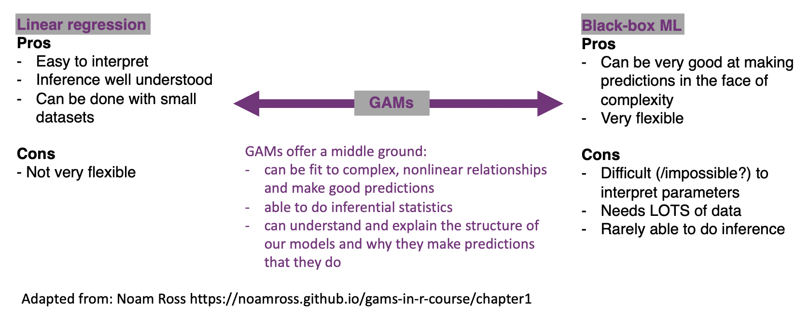
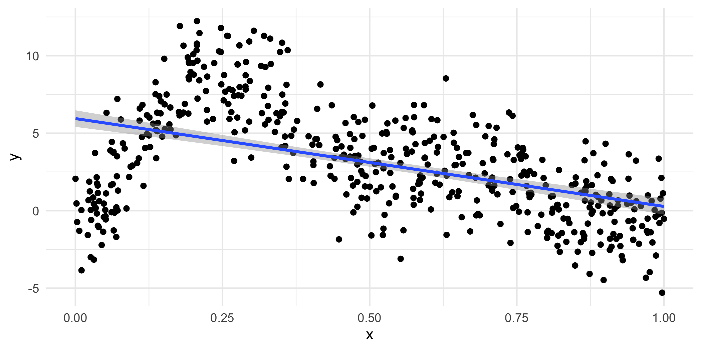
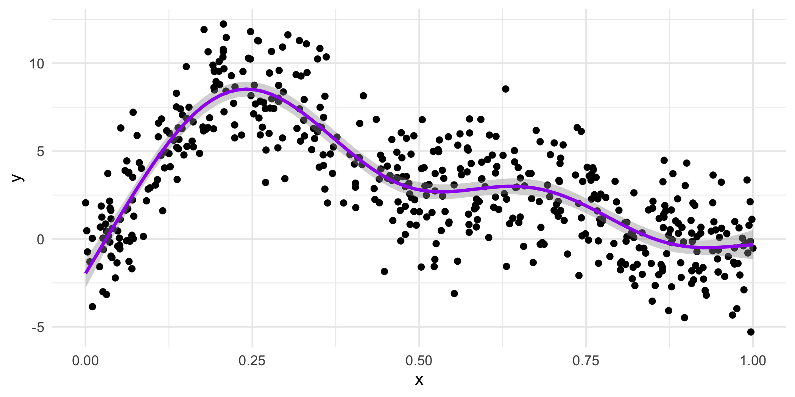
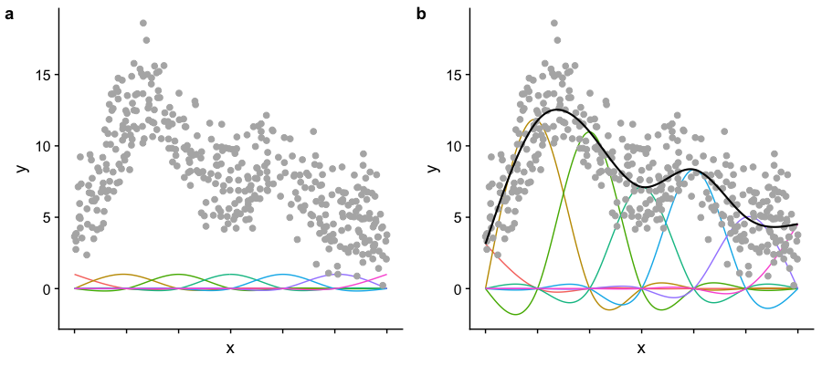
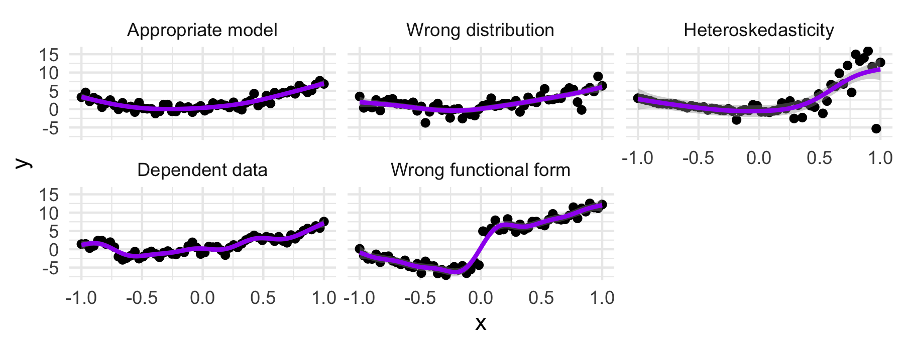

::: {.yellowbox data-latex=""}
Materials for March 21--April 1, 2022.
:::


## Learning checklist

- GLMMs

- GAMs

## Introduction


## GAMs

The models you're probably most familiar with at this point in your statistics education, namely those from courses like STA302 and 303, are on one of an interpretability continuum. We can (with some statistics training) interpret what the coefficients for linear regression mean about our data and make inferences in well understood ways. They aren't the most flexible of models though. On the other side, there are our 'black-box' machine learning methods. These can be incredibly flexible and valuable tools for prediction, but in many cases difficult, if not impossible to interpret.

Generalized additive models (or GAMs) are a form of non-parametric modelling that allow us some of the felxibility of machine learning and some of the interpretability of our classic statistical methods. 

```{r, echo=FALSE, fig.align='center', out.width="95%"}

```

You might also see the following discussed in relation to this class of models:  

- Penalized likelihood  
- Smoothing  
- Fitting wiggly lines through points  
- Semi-parametric models  
- Splines

### A one tweet GAM lesson


[https://twitter.com/ucfagls/status/842444686513991680?ref_src=twsrc%5Etfw](https://twitter.com/ucfagls/status/842444686513991680?ref_src=twsrc%5Etfw)

### Some fake data

It is very wiggly.

```{r echo=FALSE, fig.height=2.8}
library('mgcv')
set.seed(20)

f2 <- function(x) 0.2 * x^11 * (10 * (1 - x))^6 + 10 * (10 * x)^3 * (1 - x)^10
ysim <- function(n = 500, scale = 2) {
  x <- runif(n)
  e <- rnorm(n, 0, scale)
  f <- f2(x)
  y <- f + e
  data.frame(y = y, x = x, f2 = f)
}

my_data <- ysim()

p <- ggplot(my_data, aes(x = x, y = y)) +
  geom_point() +
  theme_minimal()

ggsave("images/m5/fake.png", p, width = 7, height = 3.5)
```

```{r, echo=FALSE, fig.align='center', out.width="95%"}

```


### Linear model?

```{r, fig.height=2.3, fig.show='hide'}
p + geom_smooth(method="lm")
```

```{r, echo=FALSE}
ggsave("images/m5/linear.png", width = 7, height = 3.5)
```
```{r, echo=FALSE, fig.align='center', out.width="80%"}

```

Well, that seems bad...


#### Wouldn't something like this be much nicer?

```{r echo=FALSE, fig.show='hide'}
p + geom_smooth(method="gam", color="purple", formula = y ~ s(x, k = 7))
```

```{r, echo=FALSE}
ggsave("images/m5/nicer.png", width = 7, height = 3.5)
```
```{r, echo=FALSE, fig.align='center', out.width="80%"}

```
That's the goal for this week!


### How do we get the wiggles?


### How do we get the wiggles?

**Answer: Splines!**

If you've looked at interference of waves in physics, you'll love this. If you haven't....you'll also love this!


GAMs are both *smooth* and *flexible* thanks to actually being made up of multiple not as flexible functions. _Imagine the Power Rangers robot teaching you a yoga class._

- Each smooth is the sum of a number of **basis functions**
- Each basis function is multiplied by a coefficient
- Each of those coefficients is a parameter of our model


### Splines

* Splines are *functions* composed of simpler functions
* Our simpler functions are *basis functions* & the set of basis functions is a *basis*
* When we model using splines, each basis function $b_k$ has a coefficient $\beta_k$
* The resulting spline is a the sum of these weighted basis functions, evaluated at the values of $x$

$$s(x) = \sum_{k = 1}^K \beta_k b_k(x)$$


### Picturing basis functions

- **Plot a** shows the basis functions of a GAM where all the coefficients are the same.  
- **Plot b** shows the same basis functions *after* model-fitting, where each has a coefficient fit to the data. 
- Basis functions add up to create the overall smooth shape. 

Describing this one, nonlinear relationship (one response and one explanatory variable) requires several parameters, plus an intercept. 





Image created by [Noam Ross]( https://github.com/noamross/gams-in-r-course/blob/master/images/basis-functions-1.png).


### Wiggle, wiggle, wiggle

```{r, echo=FALSE, fig.align='center', out.width="80%"}
include_graphics("https://github.com/gavinsimpson/intro-gam-webinar-2020/blob/master/resources/basis-fun-anim.gif?raw=true")
```

GIF by [Gavin Simpson](https://github.com/gavinsimpson)


#### Taking a peak at our coefficients

```{r}
library(mgcv) # you will need to install this
gam_mod <- gam(y ~ s(x, k=7), data=my_data, method="REML")
coef(gam_mod)
```

This is just some meaningless fake data, we'll work through a Case Study more fully.


#### How many basis functions do we want?


```{r, echo=FALSE, fig.align='center', out.width="100%"}
knitr::include_graphics("images/m5/diffbasis-nr.png")
```

Image created by [Noam Ross]( https://github.com/noamross/gams-in-r-course/blob/master/images/diffbasis-1.png).


#### Smoothing

```{r, echo=FALSE, fig.align='center', out.width="100%"}
knitr::include_graphics("images/m5/diffsmooth-1.png")
```

Image created by [Noam Ross]( https://github.com/noamross/gams-in-r-course/blob/master/images/diffsmooth-1.png).


#### Smoothing

You can think of our fit as being:

$$\text{penalized log lik} = $$
$$\log(\text{Likelihood}) - \lambda \cdot \text{Wiggliness}$$

where $\lambda$ is a smoothing parameter.

We can set lambda with the `sp` (smoothing parameter) option in `gam()` BUT it is recommended that we let R find the best one for us using restricted maximum likelihood ("REML").


```{r, eval=FALSE}
# Sets parameter for the whole model
gam_mod <- gam(y ~ s(x), data=my_data, sp=0.1) 

# Set the parameter for one specific term
gam_mod <- gam(y ~ s(x1, sp=0.1) + s(x2), data=my_data) 

# Let R do it for you - the recommended way
gam_mod <- gam(y ~ s(x), data=my_data, method = "REML")

```

### Choices to make: Wiggliness

There are LOTS of ways to pick your wiggle: AIC, generalized cross-validation (GCV, part of the name of `mgcv` and the default for that package), ML and REML. 

### Choices to make: Basis complexity 

We can set a maximum wiggliness by setting a 'size', k, that indicates a maximum number of small functions that could be used to build the model. If we set it bigger than the data, we'll get an error, and if we set it much bigger than needed, it is computationally costly. 

Our effective degrees of freedom (edf) will always be less than k. We can check if we've been sensible in our choice of _k_ with `gam.check()`.


### Basis expansions

In the polynomial models we used a polynomial basis expansion of $\boldsymbol{x}$

* $\boldsymbol{x}^0 = \boldsymbol{1}$ &mdash; the model constant term
* $\boldsymbol{x}^1 = \boldsymbol{x}$ &mdash; linear term
* $\boldsymbol{x}^2$
* $\boldsymbol{x}^3$
* &hellip;

So! If the __effective degrees of freedom__ we need for a term is approximately 1, then we're really just smoothing it down to a linear term, the way a covariate would usually enter a model as a fixed effect in our previous models. We may choose to just put it in the model as such, so that we can interpret the coefficient it receives. 


### Generalized additive (mixed) models

We can combine everything we've done in this course so far into generalized additive models (including adding random effects).

\begin{align*}
Y_i \sim & G(\mu_i, \theta)\\
g(\mu_i) = & X_i \beta + Z_iU + f(W_i)
\end{align*}


- $Y_i$ are responses
- $G$ is the response distribution
- $X_i$, $Z_i$ and $W_i$ are covariates
- $U$ are our random effects
- $f(w)$ is some sort of wiggly line 
- If we put no restrictions or assumptions on $f$, the estimate $\hat f(w)$ will interpolate the data perfectly (which isn't very interesting)

__Random effects__

When fitted with REML or ML, _smooths_ can be viewed as just fancy _random effects_. AND, excitingly, random effects can be viewed as smooths!

If your random effects are fairly simple, you can fit those in `mgcv::gam()` without needing the more complex GAMM functions, like `gamm4::gamm4()`

These two models are equivalent:

```{r ranefs, eval=FALSE}
m_nlme <- lme4::lmer(travel ~ 1 + (1 | Rail), data = Rail, REML = TRUE) 
m_gam  <- gam(travel ~ s(Rail, bs = "re"), data = Rail, method = "REML")
```


### Random effects

The random effect basis, `bs = 're'`, is _not_ as computationally efficient as *lme4* if we have complex random effects terms or even if we just have random effects with many levels (which isn't really that unusual with random effects).

Instead we could use `gamm()` or `gamm4::gamm4()`:

* `gamm()` fits using `lme()`
* `gamm4::gamm4()` fits using `lmer()` or `glmer()`

I.e., you're wanting a response with a conditional distribution that isn't _normal_, use `gamm4::gamm4()`


### Case study: Cherry tree

See the .Rmd in this week's project:  
`devtools::install_github("sta303-bolton/sta303w11")`

### Case study: Portuguese larks


See the .Rmd in this week's project:  
`devtools::install_github("sta303-bolton/sta303w11")`

### Further comments on GAMs

#### GAMs are models too

How accurate your predictions are depends on how good the model is, as always. (Credit: Eric Pedersen & Gavin Simpson)

```{r misspecify, echo = FALSE, fig.show=FALSE}
set.seed(15)
model_list = c("Appropriate model", 
               "Wrong distribution",
               "Heteroskedasticity",
               "Dependent data",
               "Wrong functional form")
n <- 60
sigma=1
x <- seq(-1,1, length=n)
model_data <- as.data.frame(expand.grid( x=x,model=model_list))
model_data$y <- 5*model_data$x^2 + 2*model_data$x
for(i in model_list){
  if(i == "Appropriate model"){
    model_data[model_data$model==i, "y"] <- model_data[model_data$model==i, "y"]+ 
      rnorm(n,0, sigma)
  } else if(i == "Wrong distribution"){
    model_data[model_data$model==i, "y"] <- model_data[model_data$model==i, "y"]+ 
      rt(n,df = 3)*sigma
  } else if(i == "Heteroskedasticity"){
    model_data[model_data$model==i, "y"] <- model_data[model_data$model==i, "y"]+  
      rnorm(n,0, sigma*10^(model_data[model_data$model==i, "x"]))
  } else if(i == "Dependent data"){
    model_data[model_data$model==i, "y"] <- model_data[model_data$model==i, "y"]+ 
      arima.sim(model = list(ar=c(.7)), n = n,sd=sigma) 
  } else if(i=="Wrong functional form") {
    model_data[model_data$model==i, "y"] <- model_data[model_data$model==i, "y"]+ 
      rnorm(n,0, sigma) + ifelse(model_data[model_data$model==i, "x"]>0, 5,-5)
  }
}
ggplot(aes(x,y), data= model_data)+
  geom_point()+
  geom_line(color=ifelse(model_data$model=="dependent data", "black",NA))+
  facet_wrap(~model)+
  geom_smooth(method=gam, colour="purple", formula = y~s(x,k=12),method.args = list(method="REML"))+
  theme(strip.text = element_text(size=16)) +
  theme_minimal()
```


```{r, echo=FALSE}
ggsave("images/m5/modelstoo.png", width = 6, height = 2.3)
```
```{r, echo=FALSE, fig.align='center', out.width="100%"}

```


### `select` and `method`

##### Variable selection
Unmodified smoothness selection by GCV, AIC, REML etc. will not usually remove a smooth from a model (i.e., not set the edf to 0). Most smoothing penalties view the null-space of a smooth as 'completely smooth' and so further penalization does not change it.

With `select = TRUE` we add an extra penalty to the null-space part (the part of the spline that is perfectly smooth).

If you don't have this, smoothness selection can usually only penalize a smooth back to a linear function

(because the penalty that's doing smoothness selection only works on the non-smooth (the wiggly) parts of the basis). To perform selection we need to be able to penalize the null space (the smooth parts of the basis) as well.

##### Smoothness selection
The `method` argument to gam selects the smoothness selection criterion. For many practitioners, 'ML' or 'REML' are their default choice, though not the default in `gam()`. Using a likelihood based approach essentially treats the smooth components as random effects.

### More conditional distributions than you can shake a squiggly line at

A GAM is just a fancy GLM! So we can fit any of the models we've learned (Poisson, Logistic, Gamma as we saw today in the cherry example). The creators of the `mgcv` package (Simon Wood & colleagues (2016)) have extended the methods to some non-exponential family distributions that are also very helpful, of which we've seen Negative Binomial and Zero-inflated Poisson.

* `binomial()`
* `poisson()`
* `Gamma()`
* `inverse.gaussian()`
* `nb()`
* `tw()`
* `mvn()`
* `multinom()`

* `betar()`
* `scat()`
* `gaulss()`
* `ziplss()`
* `twlss()`
* `cox.ph()`
* `gamals()`
* `ocat()`


### A symphony of smoothers

The type of smoother is controlled by the `bs` argument (think *b*asi*s*)

The default is a low-rank thin plate spline `bs = 'tp'`

Many others available (thanks Gavin Simpson for making this list):

* Cubic splines `bs = 'cr'`
* P splines `bs = 'ps'`
* Cyclic splines `bs = 'cc'` or `bs = 'cp'`
* Adaptive splines `bs = 'ad'`
* Random effect `bs = 're'`
* Factor smooths `bs = 'fs'`
* Duchon splines `bs = 'ds'`
* Spline on the sphere `bs = 'sos'`
* MRFs `bs = 'mrf'`
* Soap-film smooth `bs = 'so'`
* Gaussian process `bs = 'gp'`

### How do we talk about GAMs?

Presenting results from GAMs is similar to presenting results from other models we've learned except that for smoothed terms we have no single coefficient you can make inference from (i.e. negative, positive, effect size etc.). 

For smoothed variables, we rely a lot on visual methods (e.g. `plot(gam_model)`) for describing our results and we can also make inference from predicted values.

For parametric variables, we can make inferences like we normally would. 

GAMs are especially useful for accounting for a non-linear phenomenon that may not be the main thing you are interested in. This is similar to how we have already used random effects to account for correlation in our data that is not the main thing of interest but shouldn't be ignored.

### Conclusions

- GAMs are GLMMs
- Anything you can do with LMs/LMMs/GLMs/GLMMs you can do with GAMs  
    - All the different ways we learned to deal with response functions for GLM and GLMM apply here too
- use ML to estimate parameters
- use a lot of knots

#### Other GAMs things we won't get to look at in detail in this course

- changing basis functions (see a list of options by running `?smooth.terms`)
