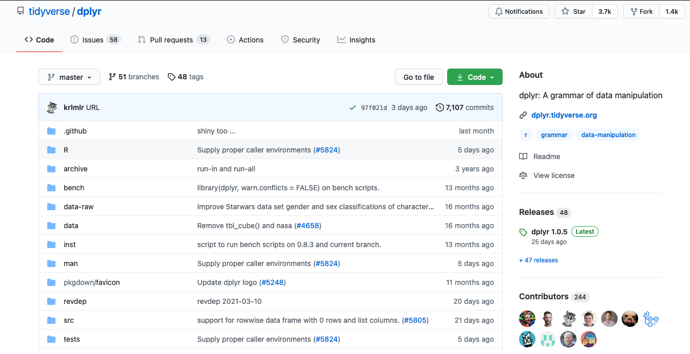

```{r setup, include=FALSE}
knitr::opts_chunk$set(echo = FALSE)
```

## Professional development task: reflection and evidence

**1. Activity, alignment and lessons:** [3 short paragraphs: what you did, alignment with proposal, lessons learned from SMART goals]

**2. Evidence:** [Explain what is shown and how the evidence relates to your goals] \
[Place links in the separate question on Crowdmark, not here!] \
[1-2 screenshots of work done, or other evidence] \
[Different options for including screenshots] \

```{r, out.width='75%', fig.align='left', fig.cap='Screenshot of Github repo'}
# Choose image size and alignment in code chunk header above

```


```{r}
#  Side by side images, but no automatic figure caption numbering
library(cowplot)
library(ggplot2)

p1 <- ggdraw() + draw_image("blog1.png", scale = 0.75)
p2 <- ggdraw() + draw_image("blog1.png", scale = 0.75)

plot_grid(p1, p2)
rm(p1, p2)
```

Figure 1. Screen shots of blog


**3. Timesheet:** [1-3 sentences of what you learned from your timesheet] \
[Time sheet can be on page 3 if you need more room] \
[Use <https://tableconvert.com/> to create tables in markdown or
if you are familiar with visual markdown editor use this: <https://rstudio.github.io/visual-markdown-editing/#/content>] \

+----+----------------+------------+----------------------------------------------------+
| Wk | Week starts on | Time spent | Activity                                           |
|    |                |            |                                                    |
|    | (Monday)       | (Hrs)      |                                                    |
+----+----------------+------------+----------------------------------------------------+
| 4  | Feb 1          |            | *Brief description of what was done, e.g. what*    |
|    |                |            | *you read, what you tried on GitHub*               |
+----+----------------+------------+----------------------------------------------------+
| 5  | Feb 8          |            |                                                    |
+----+----------------+------------+----------------------------------------------------+
|    | Feb 15         |            | *Reading week*                                     |
+----+----------------+------------+----------------------------------------------------+
| 6  | Feb 22         | 0          | Example: No activity                               |
+----+----------------+------------+----------------------------------------------------+
| 7  | Mar 1          | 1          | Example: Wrote one blog entry about ...            |
+----+----------------+------------+----------------------------------------------------+
| 8  | Mar 8          | 1.5        | Example: Fixed coding error that ...[reason for    |
|    |                |            | error] .. by [fix] ...                             |
+----+----------------+------------+----------------------------------------------------+
| 9  | Mar 15         | 2          | Example: Edited the video on [topic] ... using     |
|    |                |            | [software] ...                                     |
+----+----------------+------------+----------------------------------------------------+
| 10 | Mar 22         |            |                                                    |
+----+----------------+------------+----------------------------------------------------+
| 11 | Mar 29         |            |                                                    |
+----+----------------+------------+----------------------------------------------------+


